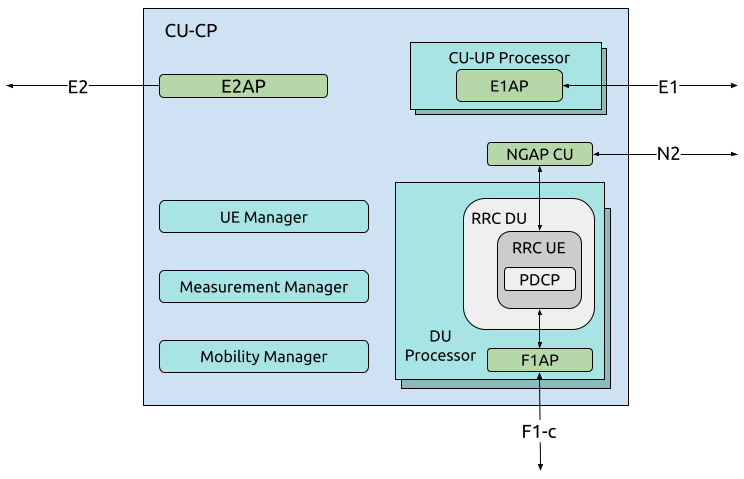

.. _CU_cp:

CU-CP
#####

    srsRAN Project CU-CP implementation. 

The CU-CP, or Central Unit - Control Plane, is responsible for the handling of control plane messaging, specifically, the control plane part of the PDCP protocol. In the CU-CP, there are five main components and 
four main interfaces. The CU-CP communicates directly with the 5G Core (via the N2 interface), the CU-UP (via the E1 interface), the DU-high (via the F1-c interface) and can also be connected to the near-RT RIC (via the E2 interface). This implementation
takes a UE-centric approach. 

:ref:`Return to top level architecture diagram <sw_overview>`.

**Components:**

    - CU-UP Processor: Custom component for handling each CU-UP connected to the CU-CP. Multiple CU-UPs can be connected to one CU-CP, as a result the E1AP is created inside the CU-UP processor for each connected CU-UP.
    - DU Processor: Custom component for handling DUs for connected to the CU-CP. Each connected DU has its own DU processor with bundled F1AP, PDCP, and RRC procedures. Each UE connected to the DU also has its own RRC UE containing the PDCP processes. 
    - UE Manager: Custom component for managing connected UEs in the CU-CP. Responsible for adding and removing UEs and providing relevant UE information to other processes. Communicates information to/from the CU-UP, DU and Core.
    - Measurement Manager: Custom component for managing cell measurement within the gNB. 
    - Mobility Manager: Custom component for managing UE mobility in the CU-CP. 

.. :ref:`CU-UP Processor <cu_up_processor>`: Custom component for handling each CU-UP connected to the CU-CP. Multiple CU-UPs can be connected to one CU-CP, as a result the E1AP is created inside the CU-UP processor for each connected CU-UP.
.. :ref:`DU Processor <du_processor>`: Custom component for handling DUs for connected to the CU-CP. Each connected DU has its own DU processor with bundled F1AP, PDCP, and RRC procedures. Each UE connected to the DU also has its own RRC UE containing the PDCP processes. 
.. :ref:`UE Manager <ue_manager_cu_cp>`: Custom component for managing connected UEs in the CU-CP. Responsible for adding and removing UEs and providing relevant UE information to other processes. Communicates information to/from the CU-UP, DU and Core.
.. :ref:`Measurement Manager <measurement_manager>`: Custom component for managing cell measurement within the gNB. 
.. :ref:`Mobility Manager <mobility_manager>`: Custom component for managing UE mobility in the CU-CP. 

**Interfaces:**

    - E2: Interface with the near-RT RIC.
    - E1: Interface with the CU-UP.
    - F1-c: Control plane interface with the DU.
    - N2: Control plane interface with the 5G Core (AMF).

.. :ref:`E2 <E2_cp>`: Interface with the near-RT RIC.
.. :ref:`E1 <E1AP_cu_cp>`: Interface with the CU-UP.
.. :ref:`F1-c <F1AP_cu>`: Control plane interface with the DU.
.. :ref:`N2 <NGAP_cu>`: Control plane interface with the 5G Core (AMF).     

-----

.. Add the following to TOCTREE once populated: 
    cu_up_processor.rst
    du_processor.rst
    ue_manager.rst
    measurement_manager.rst
    mobility_manager.rst
    E2AP_cu_cp.rst
    NGAP_cu.rst
    
    
