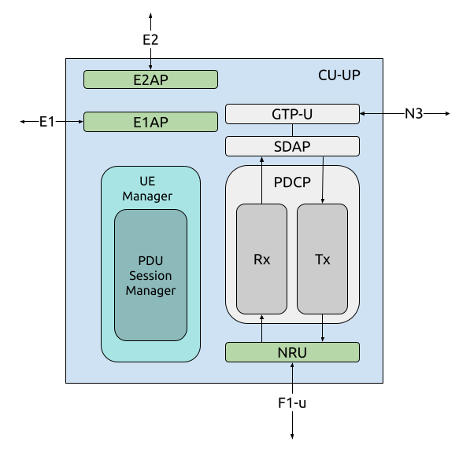

.. _CU:

CU-UP
#####

    srsRAN Project CU-UP implementation.

The CU-UP, or Central Unit - User Plane, is responsible for the handling of user plane messaging. Specifically the user plane aspect of the PDCP and SDAP protocols. In the implementation of the CU-UP, there are four 
main components and four main interfaces. The CU-UP communicates directly with the UPF in the 5G Core (via the N3 interface), the CU-UP (via the E1 interface), the DU-high (via the F1-u interface) and can also be 
connected to the near-RT RIC (via the E2 interface). 

:ref:`Return to top level architecture diagram <sw_overview>`.
   
**Components:**

    - UE Manager: Custom component for managing connected UEs in the CU-UP. Responsible for adding and removing UEs and providing relevant UE information to other processes. Communicates information to/from the CU-CP, DU and Core.
    - GTP-U: The GPRS Tunneling Protocol - User Plane (GTP-U) is responsible for transporting User Plane traffic to and from the UPF of the 5G Core via the N3 interface.
    - SDAP: The Service Data Adaptation Protocol (SDAP) is responsible for adaption and mapping of Quality of Service (QoS) requirements on User Plan traffic. 
    - PDCP: The Packet Data Convergence Protocol (PDCP) is responsible for handling the User Plane data before/ after it enters the DU-high. 

.. :ref:`UE Manager <ue_manager_cu_up>`: Custom component for managing connected UEs in the CU-UP. Responsible for adding and removing UEs and providing relevant UE information to other processes. Communicates information to/from the CU-CP, DU and Core.
.. :ref:`GTP-U <gtpu>`: The GPRS Tunneling Protocol - User Plane (GTP-U) is responsible for transporting User Plane traffic to and from the UPF of the 5G Core via the N3 interface.
.. :ref:`SDAP <sdap>`: The Service Data Adaptation Protocol (SDAP) is responsible for adaption and mapping of Quality of Service (QoS) requirements on User Plan traffic. 
.. :ref:`PDCP <PDCP_cu_up>`: The Packet Data Convergence Protocol (PDCP) is responsible for handling the User Plane data before/ after it enters the DU-high.

**Interfaces:**

    - E2: Interface with the near-RT RIC.
    - E1: Interface with the CU-CP.
    - F1-u: User plane interface with the DU.
    - N3: User plane interface with the 5G Core (UPF).

.. :ref:`E2 <E2AP_cu_up>`: Interface with the near-RT RIC.
.. :ref:`E1 <E1AP_cu_up>`:Interface with the CU-CP.
.. :ref:`F1-u <F1_u>`: User plane interface with the DU.
.. :ref:`N3 <gtpu>`: User plane interface with the 5G Core (UPF).

-----

.. Add the following to TOCTREE once populated: 
   ue_manager.rst
   gtpu.rst
   sdap.rst
   PDCP_cu_up.rst
   E2AP_cu_up.rst
   E1AP_cu_up.rst
   F1_u.rst 
