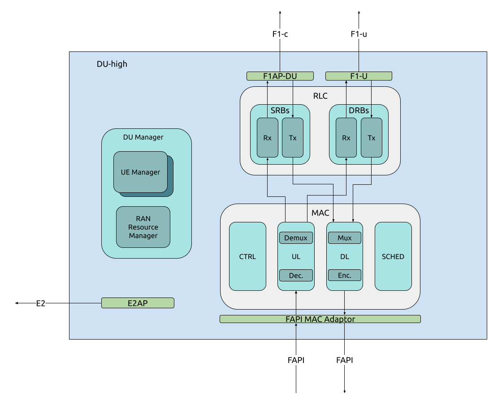

.. _du_high: 

DU-high
#######

   srsRAN Project DU-high implementation

The DU-high, or Distributed Unit - High, is responsible for the handling of both uplink and downlink traffic. Specifically the MAC and RLC processing of these signals. The DU-high, has three main components and 
three main interfaces. The DU-high communicates directly with the CU-CP and CU-UP via the F1-c and F1-u interfaces, the DU-low via the FAPI interface, and can also be connected to the near-RT RIC via the E2 interface.

:ref:`Return to top level architecture diagram <sw_overview>`.

**Components:**

    - :ref:`DU Manager <DU_manager>`: The DU Manager is responsible for managing the DU, specifically the connected UEs and RAN Resources.
    - :ref:`RLC <rlc_overview>`: The Radio Link Control (RLC) layer sits between the MAC in the DU-high and the F1AP/PDCP in the CU, and provides the transport services for SRBs and PRBs between these layers. It operates in three modes: transparent, unacknowledged and acknowledged. 
    - :ref:`MAC <mac>`: The Medium Access Control (MAC) is responsible for the encoding and decoding of MAC PDUs, scheduling uplink and downlink grants and other control services. 

**Interfaces:**

    - E2: Interfaces with the nRT RIC.
    - F1: Interfaces with the CU control and user plane.
    - FAPI: Interface between the DU-high and DU-low.

.. :ref:`E2 <E2AP_du_high>`: Interfaces with the nRT RIC.
.. :ref:`F1 <F1AP_du_high>`: Interfaces with the CU control and user plane.
.. :ref:`FAPI <FAPI_high>`: Interface between the DU-high and DU-low.

-----

**Contents:**

.. toctree::
   :maxdepth: 1
   
   du_manager.rst
   rlc.rst
   mac.rst

.. Add the following back to TOCTREE once populated: 
   E2AP_du_high.rst
   F1AP_du_high.rst
   FAPI_high.rst

