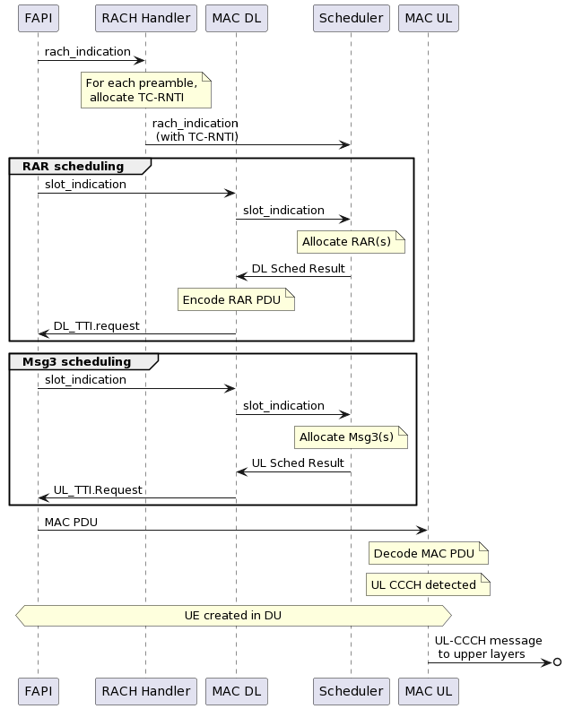

.. _mac: 

MAC
#####

The main responsibilities of the MAC are: 

    - Encoding and decoding of MAC PDUs that are sent/received to the PHY via the FAPI interface
    - Contains the gNB scheduler, which allocates DL/UL grants for System Information, Paging, UE data (RLC PDUs + MAC CEs) and Random Access handling.
    - Demultiplexing and forwarding of decoded MAC Rx SDUs to their respective logical channel.
    - Handle received MAC CEs
    - PRACH handling and RNTI allocation

Implementation
**************

.. figure:: .imgs/MAC_DU.png
   :scale: 100%
   :alt: MAC Architecture
   :align: center

The MAC is divided into the following sub-components:

  - **MAC Controller:** 

    Translates DU configuration requests into configuration commands that can be understood by the remaining MAC sub-components. The MAC controller ensures that the other 
    components are configured with minimal service disruption in terms of traffic latency and avoiding any race conditions. The configuration commands that the DU manager 
    sends to the MAC controller include the addition of new DU cells and addition/reconfiguration/removal of UEs. This is implemented in the ``mac_controller`` class. 

  - **RACH Handler:** 

    Manages the allocation of RNTIs for the received PRACH preambles and association of reach RNTI to a DU UE Index. Which is implemented in the ``rach_handler`` class. 

  - **MAC UL Processor:** 

    Decodes the received MAC PDUs and forwards the resulting MAC SDUs to their respective logical channels using the DEMUX component and forwards the UL Buffer Status 
    Reports to the Scheduler. This is implemented in the ``mac_ul_processor`` class. 

  - **MAC DL processor:** 

    Manages the MAC scheduler. This is implemented in the ``mac_dl_processor`` class. 

RA Procedure
************

The Random Access procedure is handled primarily by the DU MAC in the following steps:

    1. The RACH handler manages the allocation of temporary RNTIs (TC-RNTIs) for each of the detected PRACH preambles in a given slot, and forwarding of these preambles and TC-RNTIs to the scheduler.
    2. The scheduler is then responsible for allocating the RAR and Msg3 grant for each detected PRACH preamble.
    3. The MAC DL processor has the role of encoding the MAC DL PDUs sent to the PHY.

This leads to the following messaging flow graph: 

It is worth noting, that the creation of a new UE in the DU is deferred until Msg3 is received. This design has the following advantages: 

    - UE Resources are not allocated unnecessarily for the cases when a phantom PRACH is detected, the UE fails to detect the RAR, or the Msg3 is not correctly decoded by the gNB.
    - UE Resources are allocated after the RAR window has passed. With this design, any latency in the UE resource allocation thus won’t affect the ability of the scheduler to timely schedule RARs. Notice that the RAR window in NR can be relatively short, depending on the type of service provided.
