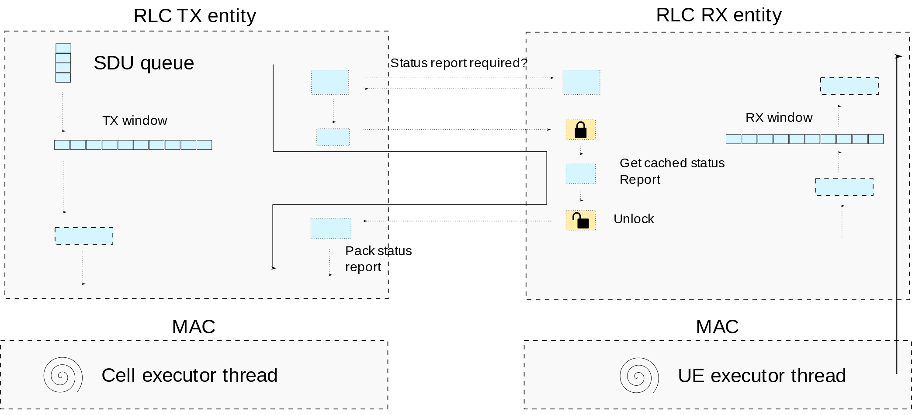

.. _rlc_am: 

RLC Acknowledged Mode (AM)
##########################

The RLC AM provides data transfer services with segmentation/concatenation and ARQ.
It does this by keeping two windows, one for TX and another for RX, which store information regarding the transmitted/received SDUs. Unlike LTE, each window entry will contain information regarding a -- single -- SDU and its associated Sequence Number (SN).

Depending on the provided space in each transmission opportunity that is indicated by lower layer (MAC), the RLC may split SDUs into smaller SDU segments.
The RX entity is responsible to store the received SDU segments in the RX window, and to pass the assembled SDU to the upper layer when it is fully received.

To provide ARQ services, the RX entity will generate *Status Reports* with the information of which SDUs/SDU segments have been received. This will be transmitted to the peer RLC entity, which will use the NACK information to trigger re-transmissions. The Tx entity will keep information regarding the transmitted SDUs on its TX window, so that it can retransmit the SDUs requested by its peer. This information is freed when the SDUs have been sequentially ACKed.

Data transmission
-----------------

In :numref:`rlctxentity`, we can see a simplified illustration of the RLC AM Tx entity.
There, we can see two threads do the work of pushing SDUs into the RLC and pulling PDUs from the RLC.

.. _rlctxentity:
.. figure:: .imgs/rlc_tx_entity.png
   :scale: 25 %
   :align: center

   Tx entity data path

The thread from the *UE executor* will push SDUs from the F1/PDCP into a thread-safe queue. The thread from the *Cell Executor* will call the *pull_pdu()* method
to pull PDUs from the RLC. The MAC will let know the RLC the size of the grant that it can fill, and the TX entity of the RLC will fill the payload with a new PDU, a retransmission or a status report. The *pull_pdu()* can be called multiple times in a single slot.

When a PDU is pulled, the RLC entity will generate either a status report, an RETX, an SDU segment, or a new PDU, in that order of priority. When generating a new PDU, the RLC will keep the information about the RLC SDU in the TX window, most notably copy of the SDU bytes, and the next Segment Offset (SO), i.e the progress in case of segmentation.  

This will be kept until the transmitted PDUs are ACKed in sequence. This is illustrated in :numref:`rlctxwindow`.
There, we can see that the TX window will maintain two state variables: *Tx_Next_Ack* and *Tx_Next*. *Tx_Next_Ack* refers to the bottom of the TX window, i.e., the SN next to the last PDU that has been sequentially ACKed. *Tx_Next* is the SN that will be assigned to the next PDU. 

.. _rlctxwindow:
.. figure:: .imgs/rlc_tx_window.png
   :scale: 80 %
   :align: center

   Tx window

We will detail the RETX and Status Report generation later on, but first it is important to detail the reception of RLC data PDUs.

Data reception
--------------

We can see in figure :numref:`rlcrxentity` a simplified illustration of the RLC AM Rx entity. There we can see that only a single thread will push PDUs into the RLC Rx entity, the *UE executor* thread. When receiving a PDU, first the thing the entity will do is to check whether this is a Data PDU or a Control PDU (i.e. a status report.)

.. _rlcrxentity:
.. figure:: .imgs/rlc_rx_entity.png
   :scale: 50 %
   :align: center

   Rx entity data path

If it is a Data PDU, the SDU or SDU segment will be added/appended to the RX window, using the received SN. If the SDU has been fully received, SDU will be passed to the upper layers. The RX window will release the SDU information, when all SDUs have been received in order.

This is illustrated in :numref:`rlcrxwindow`, where we can see four state variables: *RX_Next*, *RX_Highest_Status*, *RX_Next_Status_Trigger* and *RX_Next_Highest*.
There *RX_Next*, the lower edge of the RX window, will contain the first PDU that has not been fully received. *RX_Next_Higest*, the higher edge of the Rx window, is the highest PDU received. The RX window will also keep *RX_Highest_Status*, which is the SN of the first SDU that is considered lost, as determined by the *t-Reassembly* timer.
Finally, the *RX_Next_Status_trigger*, will keep the SN that triggered the *t-Reassembly*. This is for updating *RX_Highest_Status* to the first known lost PDU, when *t-Reassembly* expires and new losses are detected.

.. _rlcrxwindow:
.. figure:: .imgs/rlc_rx_window.png
   :scale: 40 %
   :align: center

   Rx window

ARQ and status reporting
------------------------

When the RLC receives a PDU with the header's *Polling Bit* set, and *t-Status-Prohibit* is not running, the RLC entity must transmit a status report to its peer in the next transmit opportunity. The TX entity will check whether the status report is required, by checking a boolean in the RX entity, that is set upon receiving the polling bit.

If the status report is required, the TX entity will retrieve a cached status report from the RX entity. This cached status report is updated at the reception of every PDU, to avoid blocking blocking the MAC generating a status report during the *pull_pdu()*.

An illustration of the process of generating the Status Report can be found in :numref:`rlcstatusgeneration`.

.. _rlcstatusgeneration:

   Status Report transmission

When the RLC receives a Status Report, it must be passed to the TX entity for processing. The TX entity will use the received status report to update the TX window and the RETX queue. Because both the *UE executor* thread and *Cell Executor* thread can update both the TX window and RETX queue, both of these variables need to be protected with a lock. An illustration of the process of handling the Status Report can be found in :numref:`rlcstatushandling`.

.. _rlcstatushandling:
.. figure:: .imgs/rlc_status_report_handling.png
   :scale: 50 %
   :align: center

   Status Report handling

MAC buffer status reporting
---------------------------

The MAC needs to know the size of the buffer in the RLC TX entity to give appropriate grants. As polling by the MAC is inefficient when there are many inactive UEs and bearers, the RLC will push the new state of the buffer whenever this value is updated. This can be done when a PDU is pulled, when a PDU is received, or when a timer expires that, for example, requires an update to the status report.

As this can be done from any thread, cached sizes of all queues and any pending status report are kept, so we can update the buffer state with minimal blocking to the MAC.

