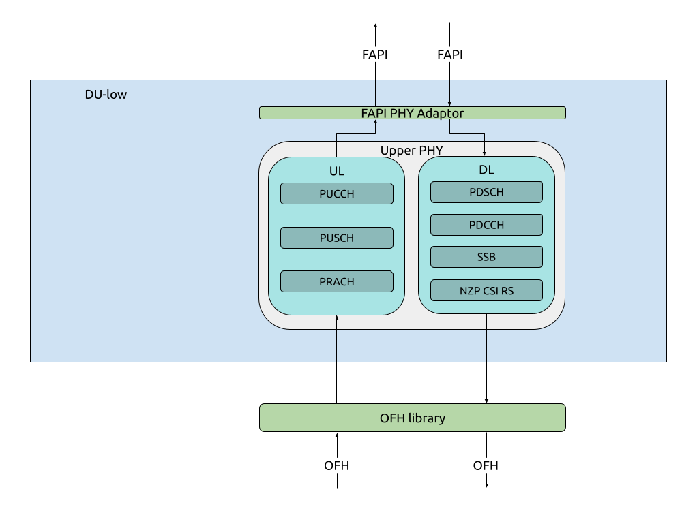

.. _du_low: 

DU-low
######

   srsRAN Project DU-low implementation

The DU-low, or Distributed Unit - Low, is responsible for the handling of both uplink and downlink traffic. Specifically, it handles the Upper PHY processing related to these signals. The DU-low, contains only the Upper PHY and has 
two main interfaces. The DU-low communicates directly with the DU-high via the FAPI interface, and with the RU via the Open FrontHaul (OFH) interface. The lower PHY processing is carried out in the RU. This architecture 
is specific to ORAN Split 7.2. You can read more about split 7.2 :ref:`here <7_2_split>` .

:ref:`Return to top level architecture diagram <sw_overview>`.

**Components:**

    - Upper PHY: The Upper PHY handles the processing of UL and DL signals coming from and to the RU. 

.. :ref:`Upper PHY <upper_phy>`: The Upper PHY handles the processing of UL and DL signals coming from and to the RU.

**Interfaces:**

    - FAPI: Interfaces with the MAC in the DU-high.
    - OFH: Interfaces with the lower PHY in the Radio Unit (RU).

.. :ref:`FAPI <FAPI_low>`: Interfaces with the MAC in the DU-high.
.. :ref:`OFH <ofh>`: Interfaces with the lower PHY in the Radio Unit (RU).

-----

.. Add TOCTREE here once pages or populated

