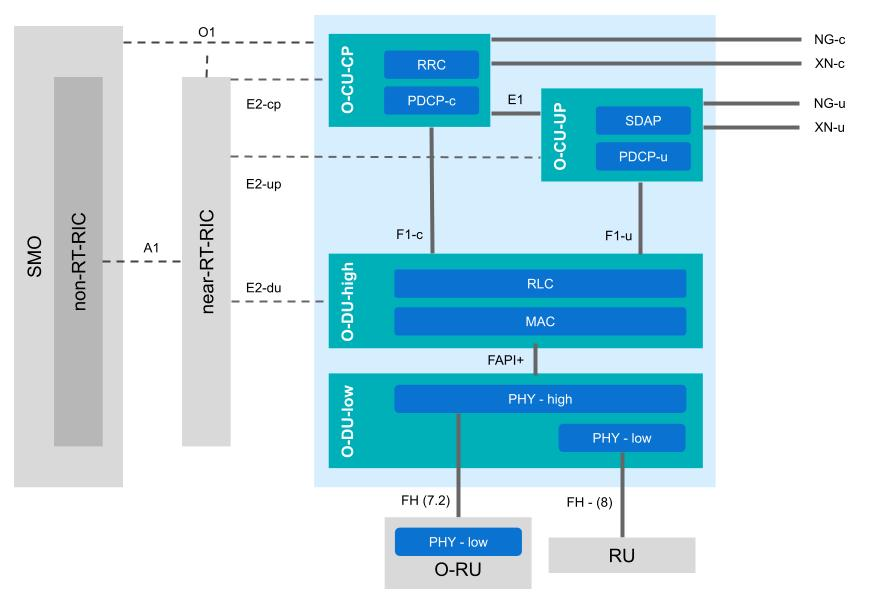

.. _sw_overview: 

srsRAN Project Software Architecture
####################################

A primer on the O-RAN gNB architecture has already been outlined in the Knowledge Base, this can be found :ref:`here <oran_gnb_overview>`. This guide aims to 
outline how this architecture is implemented in software, as well as the function of each component and interface.

High Level Architecture
***********************

    O-RAN compliant gNB  of srsRAN Project, showing all main components and interfaces.

srsRAN Project implements all of the components seen in the blue shaded are above, including all relevant interfaces. All of these elements have been implemented in software, and are fully performant, 
customizable and compliant with the O-RAN standard. 3rd-party RICs, RUs, and even gNB components are interoperable with srsRAN Project. 

-----

.. Threading Model
.. ***************

.. To read more about the Threading Model used for srsRAN Project, you can read :ref:`this section <sw_threading>`.  

.. -----

.. Memory Model
.. ************

.. To read more about the Memory Model used for srsRAN Project, you can read :ref:`this section <sw_memory>`.
