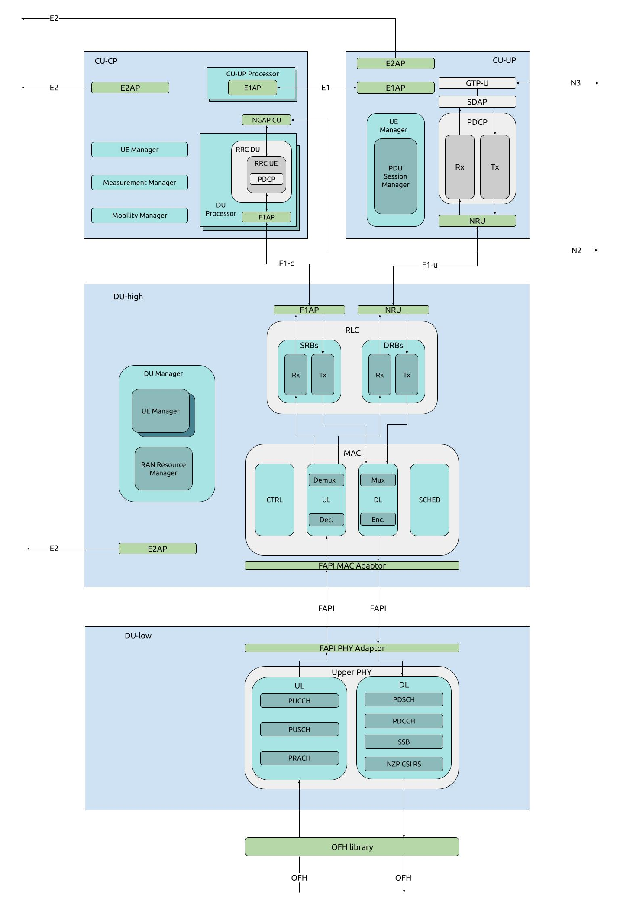

.. _sw_overview: 

Software Architecture
#####################

A primer on the O-RAN gNB architecture has already been outlined in the Knowledge Base, this can be found :ref:`here <oran_gnb_overview>`. 

This documentation aims to outline how this architecture is implemented the srsRAN Project codebase. The function and implementation of each component will be discussed in subsequent sections.

    High level overview of the srsRAN Project codebase architecture showing all main components and interfaces. 

The code implements all of the components and interfaces in the above diagram. All of these elements have been implemented in software and are fully performant, 
customizable and compliant with the O-RAN standard. Users can also integrate 3rd-party RICs, RUs, and gNB components with the srsRAN Project components. 

-----

.. toctree::
   :maxdepth: 1
   :caption: Software Architecture: 

   CU_cp/source/index.rst
   CU_up/source/index.rst
   DU_high/source/index.rst
   DU_low/source/index.rst 

