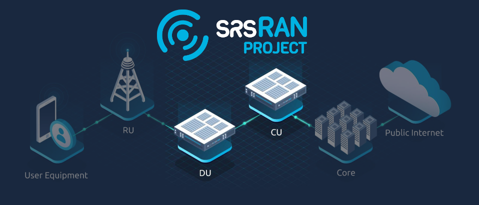

srsRAN Project Documentation
#############################

.. meta::
    :description lang=en:
        Documentation for srsRAN Project.

| The srsRAN Project is an open-source 5G CU/DU from `SRS <https://www.srs.io>`_. 
| It is a complete RAN solution compliant with 3GPP and O-RAN Alliance specifications. The srsRAN Project includes the full L1/2/3 stack with minimal external dependencies. The software is portable across processor architectures and scalable from low-power embedded systems to cloudRAN, providing a powerful platform for mobile wireless research and development. 

Get started with the srsRAN Project: 

   - :ref:`Install<installation>` srsRAN Project on your computer.
   - Read the :ref:`user manual<user_manual>`. 
   - Get up and running with our step-by-step :ref:`tutorials<tutorials>`. 
   - More advanced users should read the :ref:`Developers Guide <dev_guide>`.
   - Get up to speed on 5G and OpenRAN with our :ref:`Knowledge Base <knowledge_base>`. 

Useful resources: 

    * The srsRAN Project `source code <https://github.com/srsran/srsRAN_project>`_.
    * Explore the srsRAN Project `Discussions <https://github.com/srsran/srsran_project/discussions>`_ for news and user support.
    * Discover the `srsRAN Enterprise solution <https://www.srs.io/products>`_ for Private 5G network deployments.
    

---- 

.. toctree::
   :maxdepth: 1
   :caption: General Docs

   general/source/1_feature_list.rst
   general/source/2_installation.rst
   general/source/3_issues.rst

.. toctree::
   :maxdepth: 1
   :caption: User Manual

   user_manuals/source/1_getting_started.rst
   user_manuals/source/2_troubleshooting.rst
   user_manuals/source/3_config_ref.rst
   user_manuals/source/4_console_ref.rst
   
.. toctree::
   :maxdepth: 1
   :caption: Developers Guide

   dev_guide/source/software_arch/source/index.rst
   dev_guide/source/CU/source/index.rst
   dev_guide/source/DU/source/index.rst
   dev_guide/source/interfaces/source/index.rst
   dev_guide/source/asn1/source/index.rst
   dev_guide/source/code_guide/source/index.rst
   
.. toctree::
   :maxdepth: 1
   :caption: Knowledge Base 
   
   knowledge_base/source/oran_gnb/source/index.rst
   knowledge_base/source/gnb_components/source/index.rst
   knowledge_base/source/gnb_interfaces/source/index.rst
   knowledge_base/source/mcs/source/index.rst
   knowledge_base/source/ldpc_polar/source/index.rst
   knowledge_base/source/nr_phy_test/source/index.rst
   
.. toctree::
   :maxdepth: 1
   :caption: Tutorials
   
   tutorials/source/index.rst

