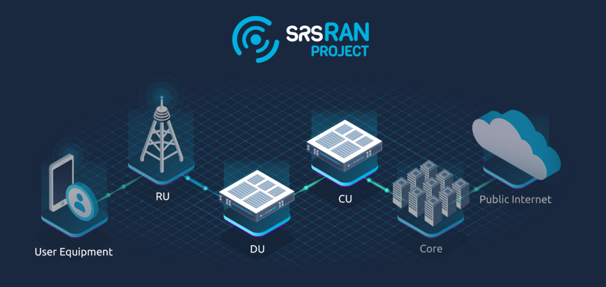

srsRAN Project Documentation
#############################

.. meta::
    :description lang=en:
        Documentation for srsRAN Project.

| The srsRAN Project is an open-source 5G CU/DU from `SRS <https://www.srs.io>`_.
| It is a complete RAN solution compliant with 3GPP and O-RAN Alliance specifications. The srsRAN Project includes the full L1/2/3 stack with minimal external dependencies. The software is portable across processor architectures and scalable from low-power embedded systems to cloudRAN, providing a powerful platform for mobile wireless research and development.

Get started with the srsRAN Project:

   - :ref:`Install<manual_installation>` srsRAN Project on your computer.
   - Get up and :ref:`running<manual_running>`.
   - More advanced users should read the :ref:`Developers Guide <dev_guide>`.
   - Get up to speed on 5G and OpenRAN with our :ref:`Knowledge Base <knowledge_base>`.

Useful resources:

    * The srsRAN Project `source code <https://github.com/srsran/srsRAN_project>`_.
    * Explore the srsRAN Project `Discussions <https://github.com/srsran/srsran_project/discussions>`_ for news and user support.
    * Discover the `srsRAN Enterprise solution <https://srs.io/srsran-enterprise-5g/>`_ for Private 5G network deployments.

----

.. toctree::
   :maxdepth: 1
   :caption: General

   general/source/1_getting_started.rst
   general/source/2_features_and_roadmap.rst
   general/source/3_contributions.rst
   general/source/4_reporting.rst
   general/source/5_release_notes.rst

.. toctree::
   :maxdepth: 1
   :caption: User Manual

   user_manuals/source/installation.rst
   user_manuals/source/running.rst
   user_manuals/source/console_ref.rst
   user_manuals/source/outputs.rst
   user_manuals/source/config_ref.rst
   user_manuals/source/grafana_gui.rst
   user_manuals/source/troubleshooting.rst

.. toctree::
   :maxdepth: 1
   :caption: Developers Guide

   dev_guide/source/software_arch/source/index.rst
   dev_guide/source/code_guide/source/index.rst
   dev_guide/source/testing_policy/source/index.rst

.. toctree::
   :maxdepth: 1
   :caption: Knowledge Base

   knowledge_base/source/oran_gnb/source/index.rst
   knowledge_base/source/gnb_components/source/index.rst
   knowledge_base/source/gnb_interfaces/source/index.rst
   knowledge_base/source/cots_ues/source/index.rst

.. toctree::
   :maxdepth: 1
   :caption: Tutorials

   tutorials/source/srsUE/source/index.rst
   tutorials/source/cotsUE/source/index.rst
   tutorials/source/amariUE/source/index.rst
   tutorials/source/k8s/source/index.rst
   tutorials/source/dpdk/source/index.rst   
   tutorials/source/oranRU/source/index.rst
   tutorials/source/flexric/source/index.rst
   tutorials/source/matlab/source/index.rst

