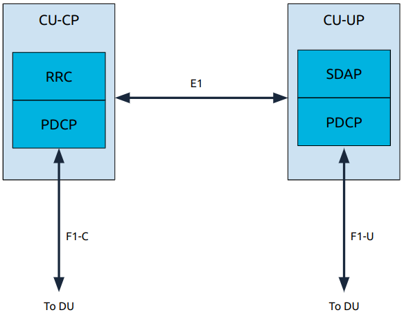

.. _oran_gnb_components: 

O-RAN gNB Components
####################

As outlined in the :ref:`O-RAN gNB Overview <oran_gnb_overview>` the 5G NR gNB introduces a flexible architecture. Splitting the gNB into the CU, DU and RU.

This section of our knowledge base aims to go through these components in further detail. Outlining the main functions of each, their layers and the interfaces between them. 

----

.. _CU_kb: 

Centralized Unit (CU)
*********************

The CU has the following architecture: 

In the CU the user plane and control plane are split into two new submodules: the CU-CP and the CU-UP. 

The key points are:

    * The user plane contains the SDAP and PDCP layers.
    * The control plane contains the RRC and PDCP layers.
    * CU-UP and CU-CP are interconnected through the E1 interface; this interface is used for control signalling.
    * CU-UP is connected to the DU(s) through the F1-U interface.
    * CU-CP is connected to the DU(s) through the F1-C interface.

---- 

.. _DU_kb: 

Distributed Unit (DU)
*********************

The DU has the following architecture: 

.. figure:: .imgs/DU.png
   :scale: 60%
   :align: center

The DU is composed of L1 and L2 functional blocks which communicate using the FAPI+ interface.

There are two approaches to how the low-PHY is implemented, it can either be in the DU-low or the RU. If split 8 is being used 
then the low-PHY will be located in the DU-low, if split 7.2x is being used it will be located in the RU. 

DU-high
=========

The DU-high contains L2 functional blocks, and communicates with the nearRT-RIC and CUs. 

The main interfaces are: 

    * E2 Handler
    
        * Terminates the E2 interface from the near-RT RIC. Handles the following tasks:
        * E2/SCTP interface termination
        * E2AP protocol message send and receive
        * Configure KPI measurements in L2 and L1 modules
        * Metrics reporting over E2
        * Relays actions to other modules based on E2 messages
        * Relaying response over E2

    * F1 Control plane
    
        * Performs tasks related to cell management, UE management and semi-static air interface resource management at the cell level.

    * F1 User plane
    
        * Perform tasks related to tunnel management, DL and UL data transmission and DL flow control (RLC feedback).

The main components are:  

    * RLC 

      * Transfers the control and data messages between MAC layer and CU.
      
    * MAC

      * Uses the services of the PHY to send and receive, and multiplexing and de-multiplexing of data on the various logical channels.
      * Responsible for scheduling UL and DL resources for the cell and UE procedures.   
      * Interfaces with the DU-low and handles L1 messaging.

DU-low
========

The DU-low executes the following tasks within L1 functional blocks:

    * **L2 FAPI processing:** handle L2 interface request/response FAPI messages from the DU-high.
    * **Timing events processing:** Handle timing related operations and triggers scheduled periodic tasks.
    * **FEC acceleration processing:** handle FEC related operations and pass the FEC requests to hardware and invokes callback functions when the hardware finishes.
    * **FrontHaul processing:** handle all of the front haul related TX/RX operations.
    * UL Task scheduling
    * DL Task scheduling
    * PUSCH, PUCCH, PRACH processing (UL)
    * PDSCH, PDCCH, PBCH processing (DL)

The high-PHY in particular is responsible for: 

    * **UL:** PUSCH, PUCCH, PRACH
    * **DL:** PDSCH, PDCCH, PBCH
    * UL/DL reference signals (DMRS, PTRS, SRS, PSS, SSS)
    * Fronthaul handler
    * FAPI handler
    * Hardware accelerator handler
    * Timing synchronization
    * L1 Task control module

