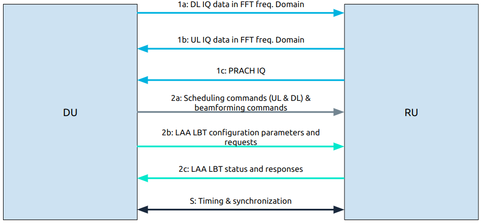

.. _oran_gnb_interfaces:

gNB Interfaces
##############

As outlined in the :ref:`O-RAN gNB Overview<oran_gnb_overview>` the 5G NR gNB introduces a flexible architecture. Splitting the gNB and introducing multiple new interfaces.

This section of our knowledge base aims to go through these interfaces in further detail. Outlining the components they connect, the types of messages they carry and their purpose.

----

E1
**
The E1 interface connects the CU Control Plane (CU-CP) to the CU User Plane (CU-UP). The application protocol (E1AP) is implemented on top of SCTP using ASN1 messages. Its main function is the bearer context management.

----

E2
**
The E2 interface connects the near-RT RIC to an E2 node (E2-du, E2-cp, E2-up). The application protocol (E2AP) is implemented on top of SCTP using ASN1
messages (similar to E1 interface defined by 3GPP). Its main functions are:

    * Provide Near-RT RIC services:

      * Report
      * Insert
      * Control
      * Policy

Support functions include:

    * Interface management
    * RIC service updates

The main functions outlined above include the following procedures:

    * **Report:** Subscription request to the E2 node with information to configure how reports should be sent by the node back to the RIC.
    * **Insert:** Subscription request to the E2 node with information to configure an insert message which will be used to suspend an ongoing procedure in the node. The RIC then decides how to deal with the suspended procedure (override, cancel, ...).
    * **Control:** Control message to the E2 node to instantiate a procedure or resume a previously suspended one.
    * **Policy:** RIC requests a node to execute a specific policy during the normal functioning of the E2 node.

The E2 service model defines the functions in the E2 node which may be controlled by the RIC. For each exposed function in the service model, the RIC
may monitor, suspend, stop, override or control via different policies the behavior of the E2 node.

The current specification (as of March 2021 specs) defines two service models which are specific implementations of the above points:

    #. **Network Interface (NI):** exposure of network interfaces and modification of the messages.
    #. **Key Performance Measurement (KPM):** Performance monitoring of set metrics within the RAN.

The KPM service model requires the following metrics to be exposed:

    * **CU-UP:** PDCP UL/DL bytes, QCI.
    * **DU:** DL/UL PRB usage.
    * **CU-CP:** number of active UEs.

----

F1
**
The F1 interface connects the CU to the DU. Its is split into two interfaces. The F1-C connects the CU-CP to the DU, while the F1-U conntects the the CU-UP to the DU.

F1-C
====
The F1-C interface connects the CU-CP to the DU. The application protocol (F1AP) is implemented on top of SCTP using ASN1 messages. Its main functions are:

    * UE context management
    * RRC message transfer
    * Warning message transmission
    * System information
    * Paging

F1-U
====

FAPI
****

NG
**

The NG interface connects the CU to the Core (AMF). Its is split into two interfaces. The NG-C connects the CU-CP to the AMF, while the NG-U conntects the the CU-UP to the AMF.

NG-C
====
The NG-C interface connects the CU-CP to the AMF. The application protocol (NGAP) is implemented on top of SCTP using ASN1 messages. Its main functions are:

    * PDU session management
    * UE context management
    * UE mobility management
    * Paging
    * Transport of NAS messages
    * Configuration transfer
    * Warning message transmission
    * NRPPa transport
    * Trace
    * Location reporting
    * UE TNLA binding
    * UE radio capability management
    * Data usage reporting

NG-U
====

O1
**
The O1 interface is aligned to the 3GPP specifications for RAN element management. It connects the multiple elements of the gNB to the Service Management and Orchestration (SMO)
platform. The following Fault, Configuration, Accounting, Performance and Security (FCAPS) functions are supported through the O1 interface:

    * Performance management (PM)
    * Configuration management (CM)
    * Fault management (FM)
    * File management
    * Communication surveillance (heartbeat)
    * Tracing
    * Physical network function (PNF) discovery
    * PNF software management

O1 provisioning operations use NETCONF for communication using YANG files for data exchange, while for CM notifications a RESTFUL HTTP-based solution is
used. O1 is the communication protocol to support OAM.

----

Open FrontHaul
**************

The architecture of a gNB with CU, DU and RUs is shown in the following figure, using split 7.2x. Here, the term Lower Layer Split (LSS) replaces FrontHaul.
LLS-C and LLS-U provide the control and user planes over the LLS interface respectively.

.. figure:: .imgs/FrontHaul.png
   :scale: 60%
   :align: center

The FrontHaul interface is divided into two main planes:

    * **CUS plane:** control, user and synchronization
    * **M plane:** management

The CUS plane of the FrontHaul interface uses different data flows to exchange data between the DU and the RU. They are:

    #. User plane:

        * **1a:** flow of IQ data in FFT frequency domain on DL
        * **1b:** flow of IQ data in FFT frequency domain on UL
        * **1c:** flow of PRACH IQ data in FFT frequency domain

    #. Control plane:

        * **2a:** Scheduling commands (DL and UL) & beamforming commands
        * **2b:** LAA listen-before-talk (LBT) configuration commands and requests
        * **2c:** LAA LBT status and response messages

    #. Synchronization plane:

        * **S:** timing and synchronization data

The Management plane, not included in the previous figure, uses a similar interface to O1 to set up, configure and perform maintenance tasks on the FrontHaul interface.

The following tables show the protocol architecture for each plane:

+----------------+----------------+-------------+
|  Control Plane |   User Plane   |  Sync Plane |
+================+================+=============+
|   eCPRI / ROE  |   eCPRI / ROE  |             |
+----------------+----------------+             |
| UDP (optional) | UDP (optional) |             |
+----------------+----------------+-----+-------+
|  IP (optional) |  IP (optional) | PTP | SyncE |
+----------------+----------------+-----+-------+
|  Eth L2 + VLAN |  Eth L2 + VLAN |    ETH L2   |
+----------------+----------------+-------------+
|     ETH L1     |     ETH L1     |    ETH L1   |
+----------------+----------------+-------------+

We can see that for user and control planes we can choose, for transport purposes, between eCPRI or IEEE 1914.3 (Radio over Ethernet).

