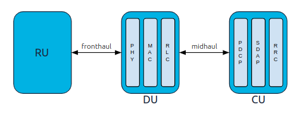

.. _oran_gnb_overview: 

O-RAN gNB Overview
##################

This document aims to provide a basic understanding of O-RAN compliant gNBs, and how we have implemented this with srsGNB. A further deep dive can be 
found in our Developer Guide. 

Introduction
************

5G Radio Access Networks (RANs) introduce the gNodeB (gNB), the next evolution of the eNodeB found in LTE networks. With Release 15, 
3GPP introduced a flexible architecture to the 5G RAN. This splits the gNB into the Centralized Unit (CU), the Distributed Unit (DU) 
and the Radio Unit (RU). 

This new architecture brings multiple new interfaces: the CU and DU communicate over the F1 interface, gNBs communicate with each other 
over the Xn interface and the RAN and the Core communicate over NG interface. Within this new release there are 8 functional splits, 
which dictate how and where the RAN is split in the CU, DU and RU. 

The Open-RAN (O-RAN) Alliance defined option 7.2x, which is a low-level split for Ultra Reliable Low Latency Communication (URLLC) and near-edge deployments. 
O-RAN standards also introduce the non-Real Time and near-Real Time RAN Intelligence Controller, or nonRT-RIC and nearRT-RIC, to the 5G RAN. This splits the 
gNB further, into the DU-low, DU-high, CU-CP and CU-UP 

The aim of O-RAN is to promote virtualized and disaggregated RANs, with a highly interoperable, multi-vendor approach.

.. _7_2_split: 

Split 7.2x Architecture
***********************

As outlined in the introduction, Release 15 introduces the "Functional Split" to the 5G gNB. This separates the gNB into the CU and DU. A 
simplified outline of this change is illustrated in the following figure. 

.. figure:: .imgs/4g_5g_changes.png
    :align: center 
    :scale: 70%

    Simplified overview of move from 4G architecture to 5G architecture with functional split.

O-RAN standards further define split 7.2x. This informs how the CU and DU are separated, and which layers of the stack are contained in each. Before 
looking into Split 7.2x further, it is worth examining the CU/ DU split at a higher level. 

At a basic level the CU and DU layer functions are split as follows: 

.. list-table:: CU/ DU Split
   :widths: 50 50 
   :align: center
   :header-rows: 1

   * - CU 
     - DU
   * - RRC
     - RLC
   * - SDAP
     - MAC
   * - PDCP
     - PHY

The above shows which layers are located in the CU and DU. This is shown graphically below. 

    Simplified overview of O-RAN gNB architecture. 

This is an overly simplified view of how the CU and DU might look. In practice, the CU and DU are split further, 
with multiple interfaces between them. 

We will now look specifically at Split 7.2x. In this, the CU is split into the control plane and the user 
plane, resulting in two elements - the CU-CP and CU-UP. The ORAN-DU is split into the DU-high and 
DU-low. Not only are the CU and DU split, but the layers they contain are also separated to allow for further control and
acceleration of certain procedures - e.g. PDCP and PHY.  

The further separation of the RAN components means more interfaces must be introduced to facilitate communication between them.
These interfaces are as follows:  

    - The CU-CP, CU-UP and DU-high will be connected to the nearRT-RIC via the **E2** interface.
    - Backhaul from the CU-UP/CP will be done via the **NG** and **XN** and interfaces. 
    - The CU elements will communicate via the **E1** interface 
    - The CU-UP and CU-CP will communicate with the DU-high via the **F1-u** and **F1-c** interfaces respectively.  
    - The DU-high and DU-low communicate via a **FAPI+** interface.

The following figure shows the complete architecture of an O-RAN compliant gNB, implementing Split 7.2x. 

.. figure:: .imgs/oran_gnb_arch.jpg
    :align: center 
    :scale: 80%

    O-RAN compliant gNB architecture, showing all main components and interfaces. The gNB-specific components are contained in the 
    blue area. 

The gNB is shown here in the blue shaded area. The CU-UP and CU-CP are clearly illustrated, as is the split between the high and low DU, and the interfaces between them. 
This diagram also shows how the nearRT-RIC is connected to the gNB and the nonRT-RIC. The RU is shown here in two versions, the RU (Split 7.2x) and a non-ORAN RU (Split 8).  
Split 7.2 moves to low PHY out to the RU , while Split 8 keeps it within the DU-low. The frontHaul interface used here is typically eCPRI. 

To be O-RAN compliant a gNB must implement the CU and DU as shown above, while also having support for the interfaces needed for the nearRT-RIC, nonRT-RIC, 
and the RU and RU. 

srsRAN Project gNB
******************

The srsRAN Project gNB is fully O-RAN compliant. While users will still be able to stand up a monolithic gNodeB on a single machine in minutes, our new gNB will also eventually 
enable users to distribute the RAN functionality across the machines and geography of their choice. All of the elements in the blue shaded area 
above are implemented in the srsRAN Project gNB, along with all of the interfaces. This allows users to easily use third party RICs, PHY solutions and other O-RAN compliant 
hardware and applications with the gNB.

Further Reading
***************

For further information and reading, you can take a look at the following resources: 

  - `ShareTechnote: Open RAN <https://www.sharetechnote.com/html/OpenRAN/OR_WhatIsIt.html>`_ 
  - `O-RAN SC Docs <https://docs.o-ran-sc.org/en/latest/index.html>`_
  - `O-RAN Alliance website <https://www.o-ran.org/>`_ 
