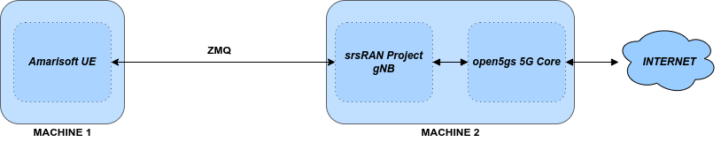
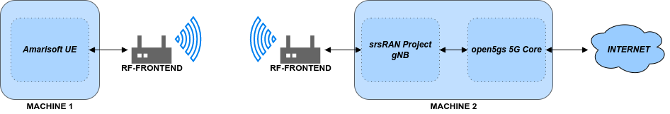

.. srsRAN gNB with Amarisoft UE tutorial

.. _amariue_tutorial:

srsRAN gNB with Amarisoft UE
############################

Overview
********

The Amarisoft UE simulator (AmariUE) is a commercial software radio solution that supports the simluation of up to 1000s of UE devices.
This tutorial outlines how the AmariUE can be used to test and exercise srsRAN gNB. In this example, we will use the open5GS core network to complete the end-to-end 5G network. 
Usually the gNB and UE connect with each other using physical radios for over-the-air transmissions. However, srsRAN gNB also includes support for virtual radios, which 
use the ZeroMQ networking library to transfer radio samples between applications. This approach is very useful for development, testing, debugging, CI/CD or for teaching and demonstrating.

This tutorial details two example setups: connecting the srsRAN gNB to AmariUE using virtual radios (ZMQ), and using physical radios (USRP B210).     

-----

Hardware and Software Overview
******************************

For this application note, the following hardware and software are used:

    - PC with Ubuntu 22.04.2
    - `srsRAN Project <https://github.com/srsran/srsRAN_project>`_
    - `Amarisoft UE <https://www.amarisoft.com/technology/ue-simulator/>`_  (2021-09-18 or later)
    - `Two Ettus Research USRP B210s <https://www.ettus.com/all-products/ub210-kit/>`_ (connected over USB3)
    - `Open5GS 5G Core <https://open5gs.org/>`_
    - `ZeroMQ <https://zeromq.org/>`_

.. note::
  Ideally the USRPs would be connected to a 10 MHz external reference clock or GPSDO, although this is not a strict requirement. We recommend the `Leo Bodnar GPSDO <http://www.leobodnar.com/shop/index.php?main_page=product_info&cPath=107&products_id=234&zenid=5194baec39dbc91212ec4ac755a142b6>`_.

Amarisoft UE
============

Amarisoft UE simulator (AmariUE) is a commercial solution that supports functional and performance testing of 5G networks.
Acting as a 3GPP compliant LTE, NB-IOT and NR UE, it can simulate hundreds of UEs sharing the same spectrum. For more information visit the `Amarisoft website <https://www.amarisoft.com/>`_.

Open5GS
=======

For this example we are using Open5GS as the 5G Core.

Open5GS is a C-language Open Source implementation for 5G Core and EPC. The following links will provide you
with the information needed to download and setup Open5GS so that it is ready to use with srsRAN 4G:

    - `GitHub <https://github.com/open5gs/open5gs>`_
    - `Quickstart Guide <https://open5gs.org/open5gs/docs/guide/01-quickstart/>`_

.. note::
  This tutorial assumes that the 5G Core Network is running on a different machine than the machine running Amarisoft UE.

-----

Installation
************

ZeroMQ
======

First thing is to install ZeroMQ and build srsRAN. On Ubuntu, ZeroMQ development libraries can be installed
with:

.. code-block:: bash

  sudo apt-get install libzmq3-dev

Alternatively, installing from sources can also be done.

First, one needs to install libzmq:

.. code-block:: bash

  git clone https://github.com/zeromq/libzmq.git
  cd libzmq
  ./autogen.sh
  ./configure
  make
  sudo make install
  sudo ldconfig

Second, install czmq:

.. code-block:: bash

  git clone https://github.com/zeromq/czmq.git
  cd czmq
  ./autogen.sh
  ./configure
  make
  sudo make install
  sudo ldconfig

srsRAN Project gNB
==================

Once ZeroMQ is installed, you need to compile srsRAN (assuming you have already installed all the required dependencies).
Note, if you have already built and installed srsRAN prior to installing ZMQ and other dependencies you
will have to re-run the make command to ensure srsRAN recognizes the addition of ZMQ:

.. code-block:: bash

  git clone https://github.com/srsran/srsRAN_Project.git
  cd srsRAN_Project
  mkdir build
  cd build
  cmake ../ -DENABLE_EXPORT=ON -DENABLE_ZEROMQ=ON
  make -j`nproc`

ZeroMQ is disabled by default, this is enabled when running ``cmake`` by including ``-DENABLE_EXPORT=ON -DENABLE_ZEROMQ=ON``.

Pay extra attention to the cmake console output. Make sure you read the following line:

.. code-block:: bash

  ...
  -- FINDING ZEROMQ.
  -- Checking for module 'ZeroMQ'
  --   No package 'ZeroMQ' found
  -- Found libZEROMQ: /usr/local/include, /usr/local/lib/libzmq.so
  ...

Amarisoft UE
============

Download the appropriate version of Amarisoft UE and install as per steps provided in its install guide.

This tutorial uses version 2023-02-06 of Amarisoft UE, but it can be any version above 2021-09-18.

ZeroMQ driver for Amarisoft UE
==============================

.. note::
  These steps should only be completed **after** compiling srsRAN Project gNB as mentioned above, as they require the build files of srsRAN Project gNB and Amarisoft UHD RF frontend driver.

Interfacing the Amarisoft UE with srsRAN Project requires a custom TRX driver implemented by SRS, which can be found in the srsRAN Project source files in ``srsRAN_Project/utils/trx_srsran``. 

The Amarisoft UE release folder, ``amarisoft.2023-02-06.tar.gz``, should contain a file called ``trx_uhd-linux-2023-02-06.tar.gz``. The release folder and the sub-file in question should be uncompressed before proceeding.

First, the driver needs to be compiled, do this by running the following commands from ``srsRAN_Project/build`` : 

.. code-block:: bash

  cmake ../ -DENABLE_EXPORT=TRUE -DENABLE_ZEROMQ=TRUE -DENABLE_TRX_DRIVER=TRUE -DTRX_DRIVER_DIR=<PATH TO trx_uhd-linux-2023-02-06> 
  make trx_srsran_test
  ctest -R trx_srsran_test

Make sure CMake finds the file ``trx_driver.h`` in the specified folder. CMake should print the following:

.. code-block:: bash

  -- Found trx_driver.h in TRX_DRIVER_DIR=/home/user/amarisoft/2021-03-15/trx_uhd-linux-2021-03-15/trx_driver.h

A symbolic link must be done for the UE application to load the driver. From the Amarisoft UE build folder run the following command:

.. code-block:: bash

  ln -s srsRAN_Project/build/utils/trx_srsran/libtrx_srsran.so trx_srsran.so

-----

ZeroMQ-based Setup
******************

In this section, we describe the steps required to configure the ZMQ-based RF driver in both gNB and AmariUE.
The following diagram presents the setup architecture:

Configuration
=============

The following config files were modified to use ZMQ-based RF driver:

  * :download:`gNB FDD band 7 config <.config/gnb_zmq_fdd_n7_10mhz.yml>`
  * :download:`gNB TDD band 78 config <.config/gnb_zmq_tdd_n78_10mhz.yml>`
  * :download:`Single UE config FDD band 7 <.config/ue-nr-sa-fdd-n7-zmq-single-ue.cfg>`
  * :download:`Single UE config TDD band 78 <.config/ue-nr-sa-tdd-n78-zmq-single-ue.cfg>`
  * :download:`Multiple UEs config FDD band 7 <.config/ue-nr-sa-fdd-n7-zmq-multiple-ues.cfg>`
  * :download:`Multiple UEs config TDD band 78 <.config/ue-nr-sa-tdd-n78-zmq-multiple-ues.cfg>`

Details of the modifications made are outlined in following sections.

srsRAN Project gNB
------------------

Modify the ``amf`` section with IP of AMF and IP to which gNB need to bind in order to connect to AMF:

.. code-block:: yaml

  amf:
    addr:      172.22.0.10
    bind_addr: 172.22.0.1

Modify the ``ru_sdr`` section with IPs from which gNB sends and receives radio samples via ZMQ driver:

.. code-block:: yaml

  ru_sdr:
    device_driver: zmq
    device_args:   tx_port=tcp://10.53.1.1:5000,rx_port=tcp://10.53.1.2:6000

Amarisoft UE
------------

Modify the ``ru_sdr`` section of Amarisoft UE configuration with IPs from which UE sends and receives radio samples via ZMQ driver:

.. code-block:: cfg

  ru_sdr: {
    name:      "srsran",
    args:      "",
    tx_port0:  "tcp://10.53.1.2:6000",
    rx_port0:  "tcp://10.53.1.1:5000",
    log_level: "info"
  },

Then, set the gain parameters as follows:   

.. code-block:: cfg

  tx_gain: 0,
  rx_gain: 0,

Make sure the CELL_BANDWIDTH matches that on gNB configuration file:

.. code-block:: cfg

  #define CELL_BANDWIDTH 10

Add ``sample_rate: 61.44,`` in the cell entry under ``cells`` section:

.. code-block:: cfg
 
  sample_rate: 61.44,

Then, set ``N_ANTENNA_DL`` to 1:

.. code-block:: cfg

  #define N_ANTENNA_DL 1

Note that the following (default) SIM Credentials and APN are used:

.. code-block:: cfg

  sim_algo: "milenage",
  imsi: "001019123456799",
  K: "00112233445566778899aabbccddeeff",
  opc: "63bfa50ee6523365ff14c1f45f88737d",
  apn: "internet",

Open5GS 5G Core
---------------

As highlighted above, the Open5GS `Quickstart Guide <https://open5gs.org/open5gs/docs/guide/01-quickstart/>`_ provides a comprehensive overview of how to configure Open5GS to run as a 5G Core.

The main modifications needed are:

    - Change the TAC in the AMF config to 7
    - Check that the NGAP, and GTPU addresses are all correct. This is done in the AMF and UPF config files.
    - It is also a good idea to make sure the PLMN values are consistent across all of the above files and the UE config file.

The final step is to register the UE to the list of subscribers through the Open5GS WebUI. The values for each field should match what is in the Amarisoft UE config file, under the ``ue_list`` section.

.. note::
   Make sure to correctly configure the APN, if this is not done correctly the UE will not connect to the internet.

It is important to run Amarisoft UE and 5G Core in different machine or at least in different network namespaces. This is because both the 5GC and UE will be sharing the same network configuration,
i.e. routing tables etc. Because the UE receives an IP address from the 5GC's subnet, the Linux kernel would bypass the TUN interfaces when routing traffic between both ends.

Running the 5G Network
======================

The following order should be used when running the network:

  1. 5GC
  2. gNB
  3. UE

Open5gs 5G Core
---------------

Once the steps from the Open5GS Quickstart Guide are followed you do not need to do any more to bring the core online. It will run in the background. Make sure to restart the relevant daemons after
making any changes to the config files.

srsRAN Project gNB
------------------
  
Run the gNB from its build directory, using the configuration file provided: 

.. code-block:: bash

  sudo ./apps/gnb/gnb -c gnb_rf_zmq_fdd_n7_10mhz.yml

The console output should be similar to the following: 

.. code-block:: bash

  Available radio types: uhd and zmq.

  --== srsRAN gNB (commit 05beac11e) ==--

  Connecting to AMF on 172.22.0.10:38412
  Cell pci=1, bw=10 MHz, dl_arfcn=536020 (n7), dl_freq=2680.1 MHz, dl_ssb_arfcn=535930, ul_freq=2560.1 MHz

  ==== gNodeB started ===
  Type <t> to view trace

The ``Connecting to AMF on 172.22.0.10:38412`` message indicates that gNB initiated a connection to the core.

If the connection attempt is successful, the following (or similar) will be displayed on the Open5GS console:

.. code-block:: bash

  amf      | 04/23 14:38:26.459: [amf] INFO: gNB-N2 accepted[172.22.0.1]:49428 in ng-path module (../src/amf/ngap-sctp.c:113)
  amf      | 04/23 14:38:26.459: [amf] INFO: gNB-N2 accepted[172.22.0.1] in master_sm module (../src/amf/amf-sm.c:741)
  amf      | 04/23 14:38:26.459: [amf] INFO: [Added] Number of gNBs is now 1 (../src/amf/context.c:1178)
  amf      | 04/23 14:38:26.459: [amf] INFO: gNB-N2[172.22.0.1] max_num_of_ostreams : 30 (../src/amf/amf-sm.c:780)

Amarisoft UE
------------

Lastly we can launch the UE, with root permissions to create the TUN device.

.. code-block:: bash

  /root/ue/lteue /root/ue/config/ue-nr-sa-fdd-n7-zmq-single-ue.cfg

The above command should start the UE and attach it to the core network.

If UE connects successfully to the network, the following (or similar) should be displayed on the console: 

.. code-block:: bash

  amariue  | RF0: sample_rate=61.440 MHz dl_freq=2680.100 MHz ul_freq=2560.100 MHz (band n7) dl_ant=1 ul_ant=1
  amariue  | (ue) Cell 0: SIB found
  amariue  | UE PDN TUN iface requested: ue_id: ue1, pdn_id: 0, ifname: ue1-pdn0, ipv4_addr: 192.168.100.2, ipv4_dns: 8.8.4.4, ipv6_local_addr: , ipv6_dns:
  amariue  | Created iface ue1-pdn0 with 192.168.100.2

It is clear that the connection has been made successfully once the UE has been assigned an IP, this is seen in ``PDU Session Establishment successful. IP: 192.168.100.2``.
The NR connection is then confirmed with the ``RRC NR reconfiguration successful.`` message.

Testing the Network
===================

Here, we demonstrate how to use ping and iPerf3 tools to test the connectivity and throughput in the network.

Ping
----

To exchange traffic in the ``downlink`` direction, i.e. from the the 5GC (UPF), just run ping as usual on the command line, e.g.:

.. code-block:: bash

  ping 192.168.100.2
  
  
In order to generate traffic in the ``uplink`` direction it is important to run the ping command
using the TUN interface of UE (e.g. tun0 created once Amarisoft UE attaches to 5G network).

.. code-block:: bash

  ip netns exec ue0 ping 192.168.100.1 -I tun0

iPerf
-----

Downlink
^^^^^^^^

For generating downlink traffic, we run iPerf client on the 5GC (UPF) and server on the UE as follows:

In the UE,

.. code-block:: bash

 ip netns exec ue0 iperf -u -s -i 1

In the UPF,

.. code-block:: bash

 iperf -u -c 192.168.100.2 -b 5M -i 1 -t 30

Uplink
^^^^^^

And, for uplink traffic, we run iPerf server on the 5GC (UPF) and client on the UE as follows.

In the UPF,

.. code-block:: bash

 iperf -u -s -i 1

In the UE,

.. code-block:: bash

 ip netns exec ue0 iperf -u -c 192.168.100.1 -b 5M -i 1 -t 30

iPerf Output
------------

Example ``server`` iPerf3 output::

  ------------------------------------------------------------
  Server listening on UDP port 5001
  Receiving 1470 byte datagrams
  UDP buffer size:  208 KByte (default)
  ------------------------------------------------------------
  [  3] local 192.168.100.1 port 5001 connected with 192.168.100.3 port 36039
  [ ID] Interval       Transfer     Bandwidth        Jitter   Lost/Total Datagrams
  [  3]  0.0- 1.0 sec   629 KBytes  5.15 Mbits/sec   6.188 ms    0/  438 (0%)
  [  3]  1.0- 2.0 sec   431 KBytes  3.53 Mbits/sec   2.656 ms    0/  300 (0%)
  [  3]  2.0- 3.0 sec   866 KBytes  7.09 Mbits/sec   2.690 ms    0/  603 (0%)
  [  3]  3.0- 4.0 sec   589 KBytes  4.82 Mbits/sec   8.544 ms    0/  410 (0%)
  [  3]  4.0- 5.0 sec   693 KBytes  5.68 Mbits/sec   2.879 ms    0/  483 (0%)
  [  3]  5.0- 6.0 sec   637 KBytes  5.22 Mbits/sec   2.583 ms    0/  444 (0%)
  [  3]  6.0- 7.0 sec   500 KBytes  4.09 Mbits/sec  15.044 ms    0/  348 (0%)
  [  3]  7.0- 8.0 sec   784 KBytes  6.42 Mbits/sec   2.792 ms    0/  546 (0%)
  [  3]  8.0- 9.0 sec   637 KBytes  5.22 Mbits/sec   9.773 ms    0/  444 (0%)
  [  3]  9.0-10.0 sec   600 KBytes  4.92 Mbits/sec  10.407 ms    0/  418 (0%)
  [  3] 10.0-11.0 sec   683 KBytes  5.60 Mbits/sec   2.029 ms    0/  476 (0%)
  [  3] 11.0-12.0 sec   637 KBytes  5.22 Mbits/sec  11.048 ms    0/  444 (0%)
  [  3] 12.0-13.0 sec   643 KBytes  5.27 Mbits/sec   2.563 ms    0/  448 (0%)
  [  3] 13.0-14.0 sec   626 KBytes  5.13 Mbits/sec   3.593 ms    0/  436 (0%)
  [  3] 14.0-15.0 sec   593 KBytes  4.86 Mbits/sec   8.771 ms    0/  413 (0%)
  [  3] 15.0-16.0 sec   669 KBytes  5.48 Mbits/sec   1.940 ms    0/  466 (0%)
  [  3] 16.0-17.0 sec   501 KBytes  4.10 Mbits/sec   9.604 ms    0/  349 (0%)
  [  3] 17.0-18.0 sec   813 KBytes  6.66 Mbits/sec   2.372 ms    0/  566 (0%)
  [  3] 18.0-19.0 sec   637 KBytes  5.22 Mbits/sec   2.671 ms    0/  444 (0%)
  [  3] 19.0-20.0 sec   632 KBytes  5.17 Mbits/sec   3.903 ms    0/  440 (0%)
  [  3] 20.0-21.0 sec   606 KBytes  4.96 Mbits/sec   2.835 ms    0/  422 (0%)
  [  3] 21.0-22.0 sec   678 KBytes  5.55 Mbits/sec   2.643 ms    0/  472 (0%)
  [  3] 22.0-23.0 sec   649 KBytes  5.32 Mbits/sec   2.577 ms    0/  452 (0%)
  [  3]  0.0-23.6 sec  14.7 MBytes  5.25 Mbits/sec   2.420 ms    0/10510 (0%)

Example ``client`` iPerf3 output::

  ------------------------------------------------------------
  Client connecting to 192.168.100.1, UDP port 5001
  Sending 1470 byte datagrams, IPG target: 2243.04 us (kalman adjust)
  UDP buffer size:  208 KByte (default)
  ------------------------------------------------------------
  [  3] local 192.168.100.3 port 36039 connected with 192.168.100.1 port 5001
  [ ID] Interval       Transfer     Bandwidth
  [  3]  0.0- 1.0 sec   642 KBytes  5.26 Mbits/sec
  [  3]  1.0- 2.0 sec   640 KBytes  5.24 Mbits/sec
  [  3]  2.0- 3.0 sec   640 KBytes  5.24 Mbits/sec
  [  3]  3.0- 4.0 sec   640 KBytes  5.24 Mbits/sec
  [  3]  4.0- 5.0 sec   640 KBytes  5.24 Mbits/sec
  [  3]  5.0- 6.0 sec   639 KBytes  5.23 Mbits/sec
  [  3]  6.0- 7.0 sec   640 KBytes  5.24 Mbits/sec
  [  3]  7.0- 8.0 sec   640 KBytes  5.24 Mbits/sec
  [  3]  8.0- 9.0 sec   640 KBytes  5.24 Mbits/sec
  [  3]  9.0-10.0 sec   640 KBytes  5.24 Mbits/sec
  [  3] 10.0-11.0 sec   640 KBytes  5.24 Mbits/sec
  [  3] 11.0-12.0 sec   639 KBytes  5.23 Mbits/sec
  [  3] 12.0-13.0 sec   640 KBytes  5.24 Mbits/sec
  [  3] 13.0-14.0 sec   640 KBytes  5.24 Mbits/sec
  [  3] 14.0-15.0 sec   640 KBytes  5.24 Mbits/sec
  [  3] 15.0-16.0 sec   640 KBytes  5.24 Mbits/sec
  [  3] 16.0-17.0 sec   639 KBytes  5.23 Mbits/sec
  [  3] 17.0-18.0 sec   640 KBytes  5.24 Mbits/sec
  [  3] 18.0-19.0 sec   640 KBytes  5.24 Mbits/sec
  [  3] 19.0-20.0 sec   640 KBytes  5.24 Mbits/sec
  [  3] 20.0-21.0 sec   640 KBytes  5.24 Mbits/sec

gNB Console Output
------------------

Following console output was taken while performing UL iperf test::

   -----------------------DL----------------|------------------UL--------------------
   pci rnti  cqi  mcs  brate   ok  nok  (%) | pusch  mcs  brate   ok  nok  (%)    bsr
     1 4601   15   27   5.8k   10    0   0% |  65.5   28    11M  396    0   0%  5.45k
     1 4601   15   27   5.8k    9    0   0% |  65.5   28   5.7M  253    0   0%  10.6k
     1 4601   15   27   5.2k   10    0   0% |  65.5   28   5.8M  247    0   0%  1.04k
     1 4601   15   27   5.8k   10    0   0% |  65.5   28   8.2M  351    0   0%    0.0
     1 4601   15   27   5.8k   10    0   0% |  65.5   28   6.4M  265    0   0%  5.45k
     1 4601   15   27   5.8k   10    0   0% |  65.5   28   5.8M  255    0   0%  5.45k
     1 4601   15   27   5.8k   10    0   0% |  65.5   28   5.0M  246    0   0%   108k
     1 4601   15   27   5.8k   10    0   0% |  65.5   28    11M  412    0   0%    0.0
     1 4601   15   27   5.8k   10    0   0% |  65.5   28   4.9M  234    0   0%  7.59k
     1 4601   15   27   5.8k   10    0   0% |  65.5   28   9.3M  347    0   0%  10.6k
     1 4601   15   27   5.8k   10    0   0% |  65.5   28   6.7M  278    0   0%  5.45k

Packet Capture
--------------

  * :download:`NGAP packet capture of UE attach scenario <.pcaps/gnb_zmq_ngap.pcap>`

Configuring Amarisoft for multiple UEs
======================================

The following config files were modified for simulating multiple UEs:

  * :download:`Multiple UEs config FDD band 7 <.config/ue-nr-sa-fdd-n7-zmq-multiple-ues.cfg>`
  * :download:`Multiple UEs config TDD band 78 <.config/ue-nr-sa-tdd-n78-zmq-multiple-ues.cfg>`

The main modifications needed are:

    - Set ``multi_ue`` to true.
    - Add multiple entries with UE details (IMSI, K, OPc etc.) under ``ue_list``.
    - Add ``global_timing_advance: 0`` in the cell entry under ``cells`` section.

    - Add the following configuration under each entry in ``ue_list`` and increase the value of ``start_time`` for each UE to have a staggered UE bring up.

      .. code-block:: cfg

        sim_events: [
          {
            event: "power_on",
            start_time: 0,
          },
        ]

.. note::
   When ``multi_ue`` to false, make sure to have only one entry in ``ue_list``.

.. note::
   Make sure to configure all the subscribers through the Open5GS WebUI, before attempting to attach UEs.

-----

.. _amariUE_radios: 

Over-the-air Setup
******************

In this section, we describe the steps required to configure the SDR RF driver in both gNB and Amarisoft UE.
The following diagram presents the setup architecture:

Configuration
=============

You can find the srsRAN Project gNB configuration file for this example in the ``configs`` folder of the srsRAN Project source files. You can also find it `here <https://github.com/srsran/srsRAN_Project/tree/main/configs>`_. 

 
  * `gNB TDD band 78 config <https://github.com/srsran/srsRAN_Project/blob/main/configs/gnb_rf_b200_tdd_n78_20mhz.yml>`_

You can download the AmariUE configs here: 

  * :download:`Single UE config FDD band 7 <.config/ue-nr-sa-fdd-n7-b210-single-ue.cfg>`
  * :download:`Single UE config TDD band 78 <.config/ue-nr-sa-tdd-n78-b210-single-ue.cfg>`

Details of the modifications made compared to ZMQ setup are outlined in following sections.

srsRAN Project gNB
------------------

Modify the ``ru_sdr`` section to send and receive radio samples via UHD driver:

.. code-block:: yaml

  ru_sdr:
    device_driver: uhd
    device_args: type=b200,num_recv_frames=64,num_send_frames=64
    srate: 11.52
    otw_format: sc12
    tx_gain: 80
    rx_gain: 40

Amarisoft UE
------------

Modify the ``ru_sdr`` section of Amarisoft UE configuration to send and receive radio samples via UHD driver:

.. code-block:: cfg

    ru_sdr: {
        name: "uhd",
        sync: "none",
    #if CELL_BANDWIDTH < 5
        args: "send_frame_size=512,recv_frame_size=512",
    #elif CELL_BANDWIDTH == 5
        args: "send_frame_size=1024,recv_frame_size=1024",
    #elif CELL_BANDWIDTH == 10
        args: "",
    #elif CELL_BANDWIDTH > 10
        args: "num_recv_frames=64,num_send_frames=64",
        dl_sample_bits: 12,
        ul_sample_bits: 12,
    #endif
        rx_antenna: "rx",
    },

Then, set the gain parameters and timing offset as follows:

.. code-block:: cfg

  tx_gain: 75.0, /* TX gain (in dB) B2x0: 0 to 89.8 dB */
  rx_gain: 40.0, /* RX gain (in dB) B2x0: 0 to 73 dB */
  tx_time_offset: -150, /* in samples */

Make sure the CELL_BANDWIDTH matches that on gNB configuration file:

.. code-block:: cfg

  #define CELL_BANDWIDTH 10

Then, set ``N_ANTENNA_DL`` to 1:

.. code-block:: cfg

  #define N_ANTENNA_DL 1

Running the 5G Network
======================

The following order should be used when running the network:

  1. 5GC
  2. gNB
  3. UE

Open5gs 5G Core
---------------

Running the 5GC is same as in the ZMQ based setup.

srsRAN Project gNB
------------------

Let's now launch the gNB from its build directory.

.. code-block:: bash

  sudo ./apps/gnb/gnb -c gnb_rf_b210_tdd_n78_10mhz.yml

The console output should be similar as follows:

.. code-block:: bash

  Available radio types: uhd and zmq.

  --== srsRAN gNB (commit 87c3fe355) ==--

  Connecting to AMF on 172.22.0.10:38412
  [INFO] [UHD] linux; GNU C++ version 11.3.0; Boost_107400; UHD_4.4.0.0-0ubuntu1~jammy1
  [INFO] [LOGGING] Fastpath logging disabled at runtime.
  Making USRP object with args 'type=b200'
  [INFO] [B200] Detected Device: B210
  [INFO] [B200] Operating over USB 3.
  [INFO] [B200] Initialize CODEC control...
  [INFO] [B200] Initialize Radio control...
  [INFO] [B200] Performing register loopback test...
  [INFO] [B200] Register loopback test passed
  [INFO] [B200] Performing register loopback test...
  [INFO] [B200] Register loopback test passed
  [INFO] [B200] Setting master clock rate selection to 'automatic'.
  [INFO] [B200] Asking for clock rate 16.000000 MHz...
  [INFO] [B200] Actually got clock rate 16.000000 MHz.
  [INFO] [MULTI_USRP] Setting master clock rate selection to 'manual'.
  [INFO] [B200] Asking for clock rate 11.520000 MHz...
  [INFO] [B200] Actually got clock rate 11.520000 MHz.
  Cell pci=1, bw=10 MHz, dl_arfcn=632628 (n78), dl_freq=3489.42 MHz, dl_ssb_arfcn=632640, ul_freq=3489.42 MHz

  ==== gNodeB started ===
  Type <t> to view trace

Amarisoft UE
------------

Lastly we can launch the UE, with root permissions to create the TUN device.

.. code-block:: bash

  /root/ue/lteue /root/ue/config/ue-nr-sa-tdd-n78-b210-single-ue.cfg

The above command should start the UE and attach it to the core network.
If UE connects successfully to the network, the following (or similar) should be displayed on the console:

.. code-block:: bash

  [INFO] [UHD] linux; GNU C++ version 9.2.1 20200304; Boost_107100; UHD_3.15.0.0-2build5
  [INFO] [MPMD FIND] Found MPM devices, but none are reachable for a UHD session. Specify find_all to find all devices.
  [INFO] [B200] Detected Device: B210
  [INFO] [B200] Operating over USB 3.
  [INFO] [B200] Initialize CODEC control...
  [INFO] [B200] Initialize Radio control...
  [INFO] [B200] Performing register loopback test...
  [INFO] [B200] Register loopback test passed
  [INFO] [B200] Performing register loopback test...
  [INFO] [B200] Register loopback test passed
  [INFO] [B200] Setting master clock rate selection to 'automatic'.
  [INFO] [B200] Asking for clock rate 16.000000 MHz...
  [INFO] [B200] Actually got clock rate 16.000000 MHz.
  [INFO] [MULTI_USRP] Setting master clock rate selection to 'manual'.
  [INFO] [B200] Asking for clock rate 11.520000 MHz...
  [INFO] [B200] Actually got clock rate 11.520000 MHz.
  RF0: sample_rate=11.520 MHz dl_freq=3489.420 MHz ul_freq=3489.420 MHz (band n78) dl_ant=1 ul_ant=1
  (ue) Warning: config/ru_sdr/config_tdd.cfg:25: unused property 'tx_time_offset'
  [INFO] [MULTI_USRP]     1) catch time transition at pps edge
  [INFO] [MULTI_USRP]     2) set times next pps (synchronously)
  Chan Gain(dB)   Freq(MHz)
   TX1     70.0 3489.420000
   RX1     40.0 3489.420000
  Cell 0: SIB found

And, once connected you can use the Amarisoft UE command line tool to verify whether its attached to cell as follows:

.. code-block:: bash

  (ue) cells
  Cell #0 / NR:
    PCI:    1
    TDD:    config=0, ssf=0
    EARFCN: DL=632628 UL=632628
    RB:     DL=24 UL=24

It is clear that the connection has been made successfully once the UE has been assigned an IP, this is seen in ``PDU Session Establishment successful. IP: 192.168.100.2``.
The NR connection is then confirmed with the ``RRC NR reconfiguration successful.`` message.

.. _amariUE_radios_test: 

Testing the Network
===================

Here, we demonstrate how to use ping and iPerf3 tools to test the connectivity and throughput in the network.

Ping
----

To exchange traffic in the ``downlink`` direction, i.e. from the the 5GC (UPF), just run ping as usual on the command line, e.g.:

.. code::

  ping 192.168.100.2

In order to generate traffic in the ``uplink`` direction it is important to run the ping command
using the TUN interface of UE (e.g. tun0 created once Amarisoft UE attaches to 5G network).

.. code::

  ip netns exec ue0 ping 192.168.100.1 -I tun0

iPerf
-----

For generating ``downlink`` traffic, we run iperf client on the 5GC (UPF) and server on the UE as follows:

In the UE,

.. code::

 ip netns exec ue0 iperf -u -s -i 1

In the UPF,

.. code::

 iperf -u -c 192.168.100.2 -b 10M -i 1 -t 60

And, for ``uplink`` traffic, we run iperf server on the 5GC (UPF) and client on the UE as follows.

In the UPF,

.. code::

 iperf -u -s -i 1

In the UE,

.. code::

 ip netns exec ue0 iperf -u -c 192.168.100.1 -b 3M -i 1 -t 60

iPerf Output
------------

Example ``server`` iPerf3 output::

  ------------------------------------------------------------
  Server listening on UDP port 5001
  Receiving 1470 byte datagrams
  UDP buffer size: 32.0 MByte (default)
  ------------------------------------------------------------
  [  3] local 10.45.0.52 port 5001 connected with 10.45.0.1 port 33894
  [ ID] Interval       Transfer     Bandwidth        Jitter   Lost/Total Datagrams
  [  3]  0.0- 1.0 sec  1.25 MBytes  10.5 Mbits/sec   0.838 ms    0/  893 (0%)
  [  3]  1.0- 2.0 sec  1.25 MBytes  10.5 Mbits/sec   0.909 ms    0/  892 (0%)
  [  3]  2.0- 3.0 sec  1.25 MBytes  10.5 Mbits/sec   0.839 ms    0/  891 (0%)
  [  3]  3.0- 4.0 sec  1.25 MBytes  10.5 Mbits/sec   0.905 ms    0/  892 (0%)
  [  3]  4.0- 5.0 sec  1.25 MBytes  10.5 Mbits/sec   0.871 ms    3/  892 (0.34%)
  [  3]  5.0- 6.0 sec  1.25 MBytes  10.5 Mbits/sec   0.878 ms    0/  891 (0%)
  [  3]  6.0- 7.0 sec  1.25 MBytes  10.5 Mbits/sec   0.922 ms    0/  892 (0%)
  [  3]  7.0- 8.0 sec  1.25 MBytes  10.5 Mbits/sec   0.921 ms    0/  892 (0%)
  [  3]  8.0- 9.0 sec  1.25 MBytes  10.5 Mbits/sec   0.842 ms    0/  891 (0%)
  [  3]  0.0-10.0 sec  12.5 MBytes  10.5 Mbits/sec   0.932 ms    3/ 8917 (0.034%)

Example ``client`` iPerf3 output::

  ------------------------------------------------------------
  Client connecting to 10.45.0.52, UDP port 5001
  Sending 1470 byte datagrams, IPG target: 1121.52 us (kalman adjust)
  UDP buffer size: 32.0 MByte (default)
  ------------------------------------------------------------
  [  3] local 10.45.0.1 port 33894 connected with 10.45.0.52 port 5001
  [ ID] Interval       Transfer     Bandwidth
  [  3]  0.0- 1.0 sec  1.25 MBytes  10.5 Mbits/sec
  [  3]  1.0- 2.0 sec  1.25 MBytes  10.5 Mbits/sec
  [  3]  2.0- 3.0 sec  1.25 MBytes  10.5 Mbits/sec
  [  3]  3.0- 4.0 sec  1.25 MBytes  10.5 Mbits/sec
  [  3]  4.0- 5.0 sec  1.25 MBytes  10.5 Mbits/sec
  [  3]  5.0- 6.0 sec  1.25 MBytes  10.5 Mbits/sec
  [  3]  6.0- 7.0 sec  1.25 MBytes  10.5 Mbits/sec
  [  3]  7.0- 8.0 sec  1.25 MBytes  10.5 Mbits/sec
  [  3]  8.0- 9.0 sec  1.25 MBytes  10.5 Mbits/sec
  [  3]  0.0-10.0 sec  12.5 MBytes  10.5 Mbits/sec
  [  3] Sent 8917 datagrams
  [  3] Server Report:
  [  3]  0.0-10.0 sec  12.5 MBytes  10.5 Mbits/sec   0.931 ms    3/ 8917 (0.034%)

gNB Console Output
------------------

Following console output was taken while performing DL iperf test::

   -----------------------DL----------------|------------------UL--------------------
   pci rnti  cqi  mcs  brate   ok  nok  (%) | pusch  mcs  brate   ok  nok  (%)    bsr
     1 4601    4    0      0    0    0   0% | -21.3    0   3.0k    0    5   0%    0.0
     1 4602   15   28    11M  973    0   0% |   n/a    0      0    0    0   0%    0.0
     1 4601    4    0      0    0    0   0% |   n/a    0      0    0    0   0%    0.0
     1 4602   15   28    11M  976    0   0% |   n/a    0      0    0    0   0%    0.0
     1 4601    4    0      0    0    0   0% |   n/a    0      0    0    0   0%    0.0
     1 4602   15   28    11M  976    0   0% |   n/a    0      0    0    0   0%    0.0
     1 4601    4    0      0    0    0   0% |   n/a    0      0    0    0   0%    0.0
     1 4602   15   28    11M  973    9   0% |  27.4   28   4.4k    1    0   0%    0.0
     1 4601    4    0      0    0    0   0% |   n/a    0      0    0    0   0%    0.0
     1 4602   15   28    11M  973    1   0% |  28.5   28   4.4k    1    0   0%    0.0
     1 4601    4    0      0    0    0   0% | -21.0    0   3.0k    0    5   0%    0.0
     1 4602   15   28    11M  980    0   0% |  30.3   28   4.4k    1    0   0%    0.0
     1 4601    4    0      0    0    0   0% |   n/a    0      0    0    0   0%    0.0
     1 4602   15   28    11M  972    0   0% |   n/a    0      0    0    0   0%    0.0
     1 4601    4    0      0    0    0   0% |   n/a    0      0    0    0   0%    0.0
     1 4602   15   28    11M  976    0   0% |   n/a    0      0    0    0   0%    0.0
     1 4601    4    0      0    0    0   0% |   n/a    0      0    0    0   0%    0.0
     1 4602   15   28   8.1M  732    0   0% |  25.9   28   414k   43    4   8%    0.0

Packet Capture
--------------

  * :download:`NGAP packet capture of UE attach scenario <.pcaps/gnb_ngap_rf_b210.pcap>`

-----

Troubleshooting
***************

ZMQ setup
=========

Amarisoft UE in ZMQ based setup may not connect to srsRAN Project gNB if the time between gNB bring up and UE bring up too large. So its advised to run immediately after running gNB for better results.

Reference clock for over-the-air
================================

If you encounter issues with the srsUE not finding the cell and/or not being able to stay connected it might be due to inaccurate clocks at the RF frontends. Try to use an external 10 MHz reference or use a GPSDO oscillator.

5G QoS Identifier
=================

By default, Open5GS uses 5QI = 9. If the **qos** section is not provided in the gNB config file, the default one with 5QI = 9 will be generated and the UE should connect to the network. If one needs to change the 5QI, please harmonize these settings between gNB and Open5GS config files, as otherwise, a UE will not be able to connect.
