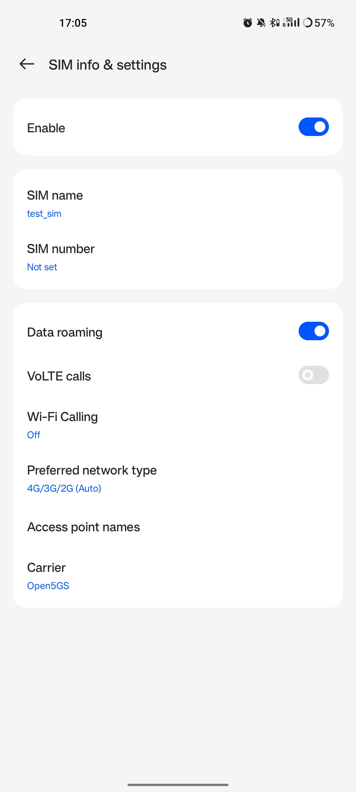
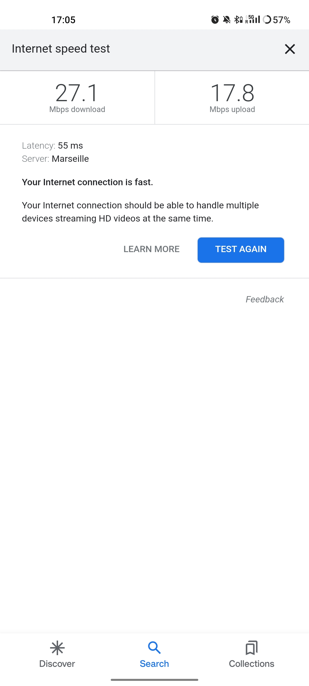

.. _COTS_UE_tutorial: 

srsRAN gNB with COTS UEs
########################

.. warning::
   Operating a private 5G SA network on cellular frequency bands may be tightly regulated in your jurisdiction. Seek the approval of your telecommunications regulator before doing so. 

Overview
********

This tutorial demonstrates how to configure and connect a 5G capable COTS UE to a 5G SA network using the srsRAN Project gNB and a 3rd-party 5G core (Open5GS in this example). 

To connect a COTS UE to a 5G network using the srsRAN Project gNB users will need the following requirements: 
 
    - A PC with a linux based OS 
    - srsRAN Project CU/DU
    - RF-frontend compatible with srsRAN Project
    - A third-party 5G Core 
    - A 5G SA capable COTS UE 
    - A test USIM/ISIM/SIM card (must be a test sim or programmable card with known keys)
    - We also recommend the use of an external clock source such as an octoclock or GPSDO

This specific implementation uses the following: 

    - Dell XPS-13 (Intel i7-10510U CPU) with Ubuntu 20.04
    - srsRAN Project CU/DU
    - B210 USRP
    - Open5GS 5G Core 
    - OnePlus 8T
    - SysmoISIM-SJA2 with reprogrammed credentials
    - Leo Bodnar GPS Reference Clock

-----

Setup Considerations
*********************

Open5GS
=======

For this example we are using Open5GS as the 5G Core. 

Open5GS is a C-language Open Source implementation for 5G Core and EPC. The following links will provide you 
with the information needed to download and set-up Open5GS so that it is ready to use with the srsRAN Project gNB: 

    - `GitHub <https://github.com/open5gs/open5gs>`_ 
    - `Quickstart Guide <https://open5gs.org/open5gs/docs/guide/01-quickstart/>`_

COTS UE
=======

You should make sure your device is capable of operating in 5G SA mode and that it operates in the bands supported by the srsRAN Project gNB. 

The following bands are not currently supported by srsRAN: 

    - Band 79 (both 15 and 30 kHz sub-carrier-spacing)
    - Band 34, 38, 39 (15 kHz sub-carrier-spacing) 

External Clock
==============

A `Leo Bodnar GPS reference clock <http://www.leobodnar.com/shop/index.php?main_page=product_info&cPath=107&products_id=234>`_ was used as the USRP clock source for this set-up.

The use of an external clock is not essential, but it mitigates possible errors occurring as result of inaccuracies in the internal clock of the RF front-end being used. The issue comes 
from the CFOs and timings tolerated by 5G handsets - the onboard clocks within SDRs are not always accurate enough to operate within the limits allowed by the handsets. Using an 
external clock, which is much more accurate than an SDR onboard clock, reduces the likelihood that a COTS UE will be unable to see/ connect to the network due to synchronization issues. 

-----

Configuration
*************

The following srsRAN configuration files were modified for this set-up: 

    - :download:`gnb_b210_20MHz_oneplus_8t.yml <.config/gnb_b210_20MHz_oneplus_8t.yml>` 
    
The following Open5GS configuration files were modified for this set-up: 
    
    - :download:`amf.yaml <.config/amf.yaml>` 
    - :download:`upf.yaml <.config/upf.yaml>` 

The aspects of the network should be configured in the following order: 

    1. gNB
    2. ISIM
    3. Core
    4. COTS UE

gNB
=====

The gNB is configured using the base configuration example found `here <https://github.com/srsran/srsRAN_Project/blob/main/configs/gnb_rf_b200_tdd_n78_20mhz.yml>`_, with some slight modifications. 

The configuration has the following modifications from the original example: 

    - Set the clock source of the USRP to ``external``. 
    - Set the ARFCN of the cell to ``627340``. This ensured the gNB was broadcasting in a free area of spectrum with a BW of 20 MHz in our location.
    - The PLMN is changed to ``90170``. Using the OnePlus 8t, we have found that by forcing a roaming scenario, the phone sees the network and attaches more reliably. A roaming scenario is forced by setting different PLMNs in the cell and the ISIM in the phone.

The above modifications are specific to the set-up being used here. It is recommended to adjust the ARFCN to your local set-up so that you are transmitting in a free area of spectrum. 

To configure the connection between the core and the gNB, you need to set the AMF ``addr`` to the address of the AMF. In this example, the default value is used in the gNB configuration file, and the relevant changes are made in the Open5GS configuration files. 

.. code-block:: diff

        amf:
          addr: 127.0.1.100                                             # The address or hostname of the AMF.
          bind_addr: 127.0.0.1                                          # A local IP that the gNB binds to for traffic from the AMF.

        ru_sdr:
          device_driver: uhd                                            # The RF driver name.
          device_args: type=b200,num_recv_frames=64,num_send_frames=64  # Optionally pass arguments to the selected RF driver.
    -     clock:                                                        # Specify the clock source used by the RF.
    +     clock: external
          sync:                                                         # Specify the sync source used by the RF.
          srate: 23.04                                                  # RF sample rate might need to be adjusted according to selected bandwidth.
          otw_format: sc12
          tx_gain: 50                                                   # Transmit gain of the RF might need to adjusted to the given situation.
          rx_gain: 60                                                   # Receive gain of the RF might need to adjusted to the given situation.

        cell_cfg:
    -     dl_arfcn: 632628                                              # ARFCN of the downlink carrier (center frequency).
    +     dl_arfcn: 627340
          band: 78                                                      # The NR band.
          channel_bandwidth_MHz: 20                                     # Bandwith in MHz. Number of PRBs will be automatically derived.
          common_scs: 30                                                # Subcarrier spacing in kHz used for data.
    -     plmn: "00101"                                                 # PLMN broadcasted by the gNB.
    +     plmn: "90170"
          tac: 7                                                        # Tracking area code (needs to match the core configuration).
          pci: 1                                                        # Physical cell ID.

ISIM
=====

SIM Programming
---------------

As outlined previously, this set-up uses the OnePlus 8t, during internal tests it was found that this phone (and other OnePlus devices) sometimes connect to the network more easily in a roaming scenario. This is achieved by setting different PLMNs for the cell and the ISIM in the phone. 

The MMC, MNC, IMSI and other credentials in the ISIM can be set by reprogramming. We reprogrammed our SysmoISIM-SJA2 using the following steps. 

Download `pySim <https://github.com/osmocom/pysim>`_ : 

.. code-block:: bash

    git clone https://github.com/osmocom/pysim
    cd pysim
    sudo apt-get install --no-install-recommends \
    	pcscd libpcsclite-dev \
    	python3 \
    	python3-setuptools \
    	python3-pyscard \
    	python3-pip
    pip3 install -r requirements.txt

You can then run the following commands from within the ``pysim`` directory. 

Check the current ISIM configuration: 

.. code-block:: bash

    ./pySim-read.py -p0

Reconfigure the ISIM: 

.. code-block:: bash

   ./pySim-prog.py -p0 -s <ICCID> --mcc=<MCC> --mnc=<MNC> -a <ADM-KEY> --imsi=<IMSI> -k <KI> --opc=<OPC> 

You need to at least set the PLMN to 00101, optionally you can also reconfigure other aspects of the ISIM. For this set-up the following command was used: 

.. code-block:: bash

   ./pySim-prog.py -p0 -s 8988211000000689615 --mcc=001 --mnc=01 -a 77190612 --imsi=001010123456789  -k 41B7157E3337F0ADD8DA89210D89E17F --opc=1CD638FC96E02EBD35AA0D41EB6F812F 

.. note::
   You will need to get the ICCID, ADM-KEY and other security information from the SIM provider.

SUCI Configuration
------------------

If you are using a sysmoISIM-SJA2 ISIM (5G-enabled) as in this example, then you will need to modify the 5G-related fields of the sim card. In particular you need to configure or disable SUPI concealment (SUCI).

SUPI concealment can be disabled using the following commands. You should replace ``<ADM-KEY>`` with the ADM key of the respective SIM card. 

.. note::
   ``verify_adm`` does not print any output on success. If you see something like `"SW Mismatch: Expected 9000 and got 6982"` the ADM key is not correct. Keep in mind that after 
   3 failed write attempts due to a wrong ADM key the SIM is blocked and cannot be rewritten again.

.. code-block:: bash

    pySIM-shell (MF)> select MF
    pySIM-shell (MF)> select ADF.USIM
    pySIM-shell (MF/ADF.USIM)> select EF.UST
    pySIM-shell (MF)> verify_adm <ADM-KEY>
    pySIM-shell (MF/ADF.USIM/EF.UST)> ust_service_deactivate 124
    pySIM-shell (MF/ADF.USIM/EF.UST)> ust_service_deactivate 125

After these steps **UST service 124** and **125** should be disabled. You can verify the ISIM configuration using the following command:

.. code-block:: bash

    ./pySim-read.py -p0

More information on pySim and SUCI configuration can be found in `this guide <https://downloads.osmocom.org/docs/pysim/master/html/suci-tutorial.html>`_ in the pySim documentation. 

.. _open5gs: 

Open5GS
=======

For this set-up Open5GS is running as a service on the machine, this is the "default" way of running Open5GS as described in their documentation. If you are running open5GS in a docker container, or other environment, your configuration will vary slightly. 

The Open5GS `5G Core Quickstart Guide <https://open5gs.org/open5gs/docs/guide/01-quickstart/#:~:text=restart%20open5gs%2Dsgwud-,Setup%20a%205G%20Core,-You%20will%20need>`_ provides a comprehensive overview of how to configure Open5GS to run as a 5G Core. 

To configure the core correctly the following steps need to be taken: 

    - Configure the core to connect to the gNB.
    - Configure the PLMN and TAC values so that they are the same as those present in the gNB configuration.
    - Register the ISIM credentials to the list of subscribers through the Open5GS WebUI.

amf.yml
-------

In the AMF configuration file the following modifications need to be made: 

    - Set the NGAP addr, this should be the same as the AMF addr as seen in the gNB configuration file
    - Set the MCC, MNC and TAC values such that they are the same as the PLMN and TAC used in the gNB configuration file, and different to that of the ISIM

.. code-block:: diff

        ngap:
    -      - addr: 127.0.0.5
    +      - addr: 127.0.1.100
         metrics:
             addr: 127.0.0.5
             port: 9090
         guami:
           - plmn_id:
    -          mcc: 999
    -          mnc: 70
    +          mcc: 901
    +          mnc: 70
             amf_id:
               region: 2
               set: 1
         tai:
           - plmn_id:
    -          mcc: 999
    -          mnc: 70
    +          mcc: 901
    +          mnc: 70
    -        tac: 1
    +        tac: 7
         plmn_support:
           - plmn_id:
    -          mcc: 999
    -          mnc: 70
    +          mcc: 901
    +          mnc: 70

    
upf.yml
-------

In the UPF configuration file the following modifications need to be made: 

    - Set the GTPU addr, this should be the same as the AMF addr as seen in the gNB configuration file

.. code-block:: diff

        upf:
         pfcp:
           - addr: 127.0.0.7
         gtpu:
    -      - addr: 127.0.0.7     
    +      - addr: 127.0.1.100
         subnet:
           - addr: 10.45.0.1/16
           - addr: 2001:db8:cafe::1/48
         metrics:
           - addr: 127.0.0.7
             port: 9090

User Database
-------------

You can see how to register subscriber information with the core `here <https://open5gs.org/open5gs/docs/guide/01-quickstart/#:~:text=Register%20Subscriber%20Information>`_. 

You will need to at least fill the IMSI, AMF, K and OPc related to the subscriber, as well as the APN.

.. note::
   Set the APN to IPv4, not IPv4/6 or IPv6. 

COTS UE
=======

To configure the OnePlus 8t to connect to the network the following steps must be taken: 

    1. Enable the ISIM
    2. Enable 5G SA Mode
    3. Enable data roaming 
    4. Disable VoLTE and/or VoNR 
    5. Configure the APN
    6. Force NR only

Enable ISIM, 5G and data roaming
--------------------------------

The first step in configuring the UE is to make sure the SIM and the use of a 5G NR carrier is enabled. In this example the ISIM is placed in SIM tray 1, and there is no other SIM present. 

In the first image, you can see that the ISIM is correctly found, and that mobile data is enabled. In the second image you can see that the ISIM is enabled, data roaming is enabled and that 5G is set as the preferred network type. 

|sim1| |sim2|

   .. |sim1| image:: .imgs/sim_1.jpg
      :width: 20% 

   .. |sim2| image:: .imgs/sim_2.jpg
      :width: 20% 

If you cannot see the ``5G`` option in ``Preferred network type``, then you may need to activate it. This can be enabled under the Developer Options, if you do not have access to Developer Options see `this guide <https://developer.android.com/studio/debug/dev-options>`_. 
In ``Developer Options`` go to ``Networking`` and enable ``5G``, you may also need to set ``5G network mode`` to ``NSA + SA Mode``

The final option that needs to be enabled here is ``data roaming``, this is shown in the second image. 

In some phones there may also be an option to configure ``VoNR`` and/or ``VoLTE``, it is important to make sure that this is **disabled**.  

Configure APN
-------------

|apn1| |apn2|

   .. |apn1| image:: .imgs/apn_1.jpg
      :width: 20% 

   .. |apn2| image:: .imgs/apn_2.jpg
      :width: 20% 

The above images show the APN configuration used in this example. The key points to note are the following: 

    - The APN ``Name`` is arbitrary, and can have any string value.
    - The ``APN`` option needs to be set to the same as the ``DNN/APN`` option as set in the Open5GS subscriber registration.
    - The ``APN protocol`` and ``APN roaming protocol`` are both set to **IPv4** as in the Open5GS subscriber registration. Setting to IPv6 or IPv4/6 can lead to issues connecting the internet. 
    - All other options are left to the default values.

Force NR
--------

The application ``5G Switch - Force 5G Only`` can be used to force your device to only see 5G NR networks. This works with devices that are not rooted, and was used as part of this setup to ensure 
the device could see and attach to the network. Although it was not a requirement to get the phone to connect it made it easier to consistently connect to the network.

The apps Play Store page looks like the following: 

   .. image:: .imgs/app.jpg
      :width: 20%

When you run the app you can select ``NR Only`` from the ``Set Preferred Network Type`` menu. This looks like the following:  

   .. image:: .imgs/force_nr.jpg
      :width: 20%

When you select this option, you may see the ``Preferred Network Type`` field in the SIM configuration menu change to ``4G/3G/2G (Auto)`` as seen in the screenshot in the :ref:`Connecting to the Network section <connect>`. 
This is fine, and can be ignored. Once NR is selected in the app, you do not have to select 5G from the SIM configuration menu. 

Connecting the COTS UE
**********************

To connect the COTS UE to the network the following steps must be taken once the phone and network have been correctly configured: 

    1. Run the gNB and ensure it is correctly connected to the core 
    2. Search for the network from the UE
    3. Select and connect to the network 
    4. Verify the attach
    5. Stream data 

Setting-up the Network
======================

Check that the Core is running correctly 
-----------------------------------------

First it is good to check that Open5GS is running correctly, this can be done with the following command: 

.. code-block:: bash

    ps aux | grep open5gs

If the core is running correctly the following should be given as the output: 

.. code-block:: bash

    open5gs     1601  0.0  0.0 141680 15872 ?        Ssl  10:36   0:00 /usr/bin/open5gs-bsfd -c /etc/open5gs/bsf.yaml
    open5gs     1606  0.0  0.1 134452 24840 ?        Ssl  10:36   0:01 /usr/bin/open5gs-nrfd -c /etc/open5gs/nrf.yaml
    open5gs     1613  0.0  0.2 147068 41720 ?        Ssl  10:36   0:02 /usr/bin/open5gs-scpd -c /etc/open5gs/scp.yaml
    open5gs     2663  0.0  0.1 2801740 16788 ?       Ssl  10:36   0:02 /usr/bin/open5gs-hssd -c /etc/open5gs/hss.yaml
    open5gs     2675  0.0  0.1 2800268 16568 ?       Ssl  10:36   0:02 /usr/bin/open5gs-pcrfd -c /etc/open5gs/pcrf.yaml
    open5gs     2676  0.0  0.1 185572 21584 ?        Ssl  10:36   0:00 /usr/bin/open5gs-pcfd -c /etc/open5gs/pcf.yaml
    open5gs     2690  0.0  0.1 169668 20768 ?        Ssl  10:36   0:00 /usr/bin/open5gs-udrd -c /etc/open5gs/udr.yaml
    open5gs     3065  0.0  0.1 155984 20136 ?        Ssl  10:36   0:00 /usr/bin/open5gs-amfd -c /etc/open5gs/amf.yaml
    open5gs     3067  0.0  0.0 136052 15960 ?        Ssl  10:36   0:00 /usr/bin/open5gs-ausfd -c /etc/open5gs/ausf.yaml
    open5gs     3071  0.0  0.0 2778684 14404 ?       Ssl  10:36   0:02 /usr/bin/open5gs-mmed -c /etc/open5gs/mme.yaml
    open5gs     3074  0.0  0.0 134300 15416 ?        Ssl  10:36   0:00 /usr/bin/open5gs-nssfd -c /etc/open5gs/nssf.yaml
    open5gs     3079  0.0  0.1 260852 19656 ?        Ssl  10:36   0:00 /usr/bin/open5gs-sgwcd -c /etc/open5gs/sgwc.yaml
    open5gs     3081  0.0  0.1 249660 17840 ?        Ssl  10:36   0:00 /usr/bin/open5gs-sgwud -c /etc/open5gs/sgwu.yaml
    open5gs     3084  0.0  0.2 3127048 44456 ?       Ssl  10:36   0:02 /usr/bin/open5gs-smfd -c /etc/open5gs/smf.yaml
    open5gs     3091  0.0  0.1 136072 17136 ?        Ssl  10:36   0:00 /usr/bin/open5gs-udmd -c /etc/open5gs/udm.yaml
    open5gs     3099  0.0  0.1 274176 24588 ?        Ssl  10:36   0:00 /usr/bin/open5gs-upfd -c /etc/open5gs/upf.yaml

In total there should be 16 processes running.  

Once the core is running it is helpful to view the AMF logs for the duration of testing. This makes is clear when the gNB attaches, and when the COTS UE successfully attaches to the network. 

To view this you can run this command: 

.. code-block:: bash

    tail -f /var/log/open5gs/amf.log

You should see an output similar to the following: 

.. code-block:: bash 

    04/03 10:36:52.012: [sctp] INFO: AMF initialize...done (../src/amf/app.c:33)
    04/03 10:36:52.049: [sbi] INFO: [aea4db10-d1fa-41ed-916b-e56218b693e5] (NRF-notify) NF registered (../lib/sbi/nnrf-handler.c:632)
    04/03 10:36:52.049: [sbi] INFO: [aea4db10-d1fa-41ed-916b-e56218b693e5] (NRF-notify) NF Profile updated (../lib/sbi/nnrf-handler.c:642)
    04/03 10:36:52.049: [sbi] WARNING: [aea4db10-d1fa-41ed-916b-e56218b693e5] (NRF-notify) NF has already been added (../lib/sbi/nnrf-handler.c:636)
    04/03 10:36:52.049: [sbi] INFO: [aea4db10-d1fa-41ed-916b-e56218b693e5] (NRF-notify) NF Profile updated (../lib/sbi/nnrf-handler.c:642)
    04/03 10:36:52.049: [sbi] WARNING: NF EndPoint updated [127.0.0.12:80] (../lib/sbi/context.c:1618)
    04/03 10:36:52.049: [sbi] WARNING: NF EndPoint updated [127.0.0.12:7777] (../lib/sbi/context.c:1527)
    04/03 10:36:52.238: [app] INFO: SIGHUP received (../src/main.c:58)
    04/03 10:36:52.350: [sbi] INFO: [aea6bae8-d1fa-41ed-904f-f78f7a58f5f3] (NRF-notify) NF registered (../lib/sbi/nnrf-handler.c:632)
    04/03 10:36:52.350: [sbi] INFO: [aea6bae8-d1fa-41ed-904f-f78f7a58f5f3] (NRF-notify) NF Profile updated (../lib/sbi/nnrf-handler.c:642)

Run the gNB
-----------

To run the gNB using the configuration file above, navigate to ``srsRAN_Project/build/apps/gnb`` and use the following command: 

.. code-block:: bash

    sudo ./gnb -c gnb_b210_20MHz_oneplus_8t.yml

This above command assumes the configuration file is located in the same folder. 

Once the gNB is running you should see the following output: 

.. code-block:: bash

    --== srsRAN gNB (commit fbe73a49c) ==--
    
    Connecting to AMF on 127.0.1.100:38412
    [INFO] [UHD] linux; GNU C++ version 9.3.0; Boost_107100; UHD_4.0.0.0-666-g676c3a37
    [INFO] [LOGGING] Fastpath logging disabled at runtime.
    Making USRP object with args 'type=b200,num_recv_frames=64,num_send_frames=64'
    [INFO] [B200] Detected Device: B210
    [INFO] [B200] Operating over USB 3.
    [INFO] [B200] Initialize CODEC control...
    [INFO] [B200] Initialize Radio control...
    [INFO] [B200] Performing register loopback test...
    [INFO] [B200] Register loopback test passed
    [INFO] [B200] Setting master clock rate selection to 'automatic'.
    [INFO] [B200] Asking for clock rate 16.000000 MHz...
    [INFO] [B200] Actually got clock rate 16.000000 MHz.
    [INFO] [MULTI_USRP] Setting master clock rate selection to 'manual'.
    [INFO] [B200] Asking for clock rate 23.040000 MHz...
    [INFO] [B200] Actually got clock rate 23.040000 MHz.
    Cell pci=1, bw=20 MHz, dl_arfcn=627340 (n78), dl_freq=3410.1 MHz, dl_ssb_arfcn=627264, ul_freq=3410.1 MHz
    
    ==== gNodeB started ===
    Type <t> to view trace

If the connection to the core is successful you should see the following from the AMF log: 

.. code-block:: bash

    04/03 13:25:13.469: [amf] INFO: gNB-N2 accepted[127.0.0.1]:47633 in ng-path module (../src/amf/ngap-sctp.c:113)
    04/03 13:25:13.469: [amf] INFO: gNB-N2 accepted[127.0.0.1] in master_sm module (../src/amf/amf-sm.c:706)
    04/03 13:25:13.469: [amf] INFO: [Added] Number of gNBs is now 1 (../src/amf/context.c:1034)

.. _connect: 

Connecting to the Network
========================= 

The COTS UE can now search for the network. To do this, navigate to *Mobile Network > SIM 1 > Carrier* and search for the network. 

When you enter the *Carrier* menu your device may automatically search for available carriers, if not you can manually select the search option from the top right of the screen. 

If the device can successfully receive SIBs (specifically SIB1) and "see" the network it will appear of the list of available carriers. It will be displayed as ``Open5GS 5G`` or ``90170 5G``. If your PLMN is something else it may be displayed as ``[PLMN] 5G``.

The following image shows what this may look like: 

   
Select the carrier for the network, in this instance ``Open5GS 5G``, the UE should then attach to the network. 

To confirm the attach is successful you can monitor both the AMF log and gNB console output. 

The AMF log should look similar to the following: 

.. code-block:: bash

    04/27 13:16:31.746: [amf] INFO: InitialUEMessage (../src/amf/ngap-handler.c:361)
    04/27 13:16:31.746: [amf] INFO: [Added] Number of gNB-UEs is now 1 (../src/amf/context.c:2036)
    04/27 13:16:31.746: [amf] INFO:     RAN_UE_NGAP_ID[0] AMF_UE_NGAP_ID[78] TAC[7] CellID[0x0] (../src/amf/ngap-handler.c:497)
    04/27 13:16:31.746: [amf] INFO: [suci-0-001-01-0-0-0-0000068960] Known UE by 5G-S_TMSI[AMF_ID:0x20040,M_TMSI:0xdd00ff1a] (../src/amf/context.c:1402)
    04/27 13:16:31.746: [gmm] INFO: Registration request (../src/amf/gmm-sm.c:134)
    04/27 13:16:31.746: [gmm] INFO: [suci-0-001-01-0-0-0-0000068960]    5G-S_GUTI[AMF_ID:0x20040,M_TMSI:0xdd00ff1a] (../src/amf/gmm-handler.c:169)
    04/27 13:16:31.913: [gmm] INFO: [imsi-001010000068960] Registration complete (../src/amf/gmm-sm.c:1063)
    04/27 13:16:31.913: [amf] INFO: [imsi-001010000068960] Configuration update command (../src/amf/nas-path.c:389)
    04/27 13:16:31.913: [gmm] INFO:     UTC [2023-04-27T13:16:31] Timezone[0]/DST[0] (../src/amf/gmm-build.c:502)
    04/27 13:16:31.913: [gmm] INFO:     LOCAL [2023-04-27T13:16:31] Timezone[0]/DST[0] (../src/amf/gmm-build.c:507)
    04/27 13:16:32.105: [gmm] INFO: UE SUPI[imsi-001010000068960] DNN[srsapn] S_NSSAI[SST:1 SD:0xffffff] (../src/amf/gmm-handler.c:1042)

The gNB trace should show the following: 

.. code-block:: bash

               -------------DL----------------|------------------UL--------------------
     pci rnti  cqi  mcs  brate   ok  nok  (%) | pusch  mcs  brate   ok  nok  (%)    bsr
       1 4601   15   15   4.3k    7    0   0% |  21.3   23    17k    4    0   0%    0.0
       1 4601   15   27   287k   84    0   0% |  23.1   27   233k   39    0   0%    0.0
       1 4601   15   28   1.2k    1    0   0% |  21.8   28   8.7k    2    0   0%    0.0
       1 4601   15    0      0    0    0   0% |   n/a    0      0    0    0   0%    0.0
       1 4601   15    0      0    0    0   0% |   n/a    0      0    0    0   0%    0.0
       1 4601   15    0      0    0    0   0% |   n/a    0      0    0    0   0%    0.0
       1 4601   12    0      0    0    0   0% |   n/a    0      0    0    0   0%    0.0
       1 4601   15    0      0    0    0   0% |   n/a    0      0    0    0   0%    0.0
       1 4601   15   28    53k   10    0   0% |  24.6   26    55k   32    0   0%    0.0
       1 4601   15   28   7.7k    4    0   0% |  22.7   28    17k    4    0   0%    0.0
       1 4601   15    0      0    0    0   0% |   n/a    0      0    0    0   0%    0.0

-----

Traffic and Testing
*******************

Speed Test
==========

Running a speedtest directly from google gives the following results: 

While running this test, the following was observed on the gNB console: 

**Uplink Test**

.. code-block:: bash

               -------------DL----------------|------------------UL--------------------
     pci rnti  cqi  mcs  brate   ok  nok  (%) | pusch  mcs  brate   ok  nok  (%)    bsr
       1 4601   15   28    23M  820    8   0% |  24.3   27   376k   90    0   0%    0.0
       1 4601   15   28    31M 1070    6   0% |  22.4   28   141k   33    0   0%    0.0
       1 4601   15   28    31M 1068    8   0% |  23.7   27   155k   39    0   0%    0.0
       1 4601   15   28    31M 1064    6   0% |  23.3   28   134k   29    0   0%    0.0
       1 4601   15   28    31M 1060    9   0% |  22.5   28   150k   32    0   0%    0.0
       1 4601   15   28    31M 1071    6   0% |  23.1   27   323k   68    0   0%    0.0

**Downlink Test**

.. code-block:: bash

               -------------DL----------------|------------------UL--------------------
     pci rnti  cqi  mcs  brate   ok  nok  (%) | pusch  mcs  brate   ok  nok  (%)    bsr
       1 4601   15   27   548k  447    3   0% |  17.1   25    17M  596    4   0%   150k
       1 4601   15   27   598k  456    6   1% |  17.4   25    17M  596    4   0%   150k
       1 4601   15   27   502k  468    2   0% |  17.5   25    17M  600    0   0%   150k
       1 4601   15   27   544k  449    2   0% |  18.2   26    18M  598    2   0%   150k
       1 4601   15   27   470k  448    2   0% |  18.7   27    19M  595    5   0%   150k
       1 4601   15   27   485k  455    6   1% |  18.6   27    19M  594    6   1%   150k

Video Test
==========

The following shows an example trace output seen while streaming video from the internet:

.. code-block:: bash

               -------------DL----------------|------------------UL--------------------
     pci rnti  cqi  mcs  brate   ok  nok  (%) | pusch  mcs  brate   ok  nok  (%)    bsr
       1 4601   14   27   1.3M  111   15  11% |  22.6   28   109k   25    0   0%    0.0
       1 4601   15   27   1.9M  180    4   2% |  22.4   28   109k   25    0   0%    0.0
       1 4601   15   28   3.3M  302    0   0% |  22.7   28   109k   25    0   0%    0.0
       1 4601   15   28   5.5M  489    0   0% |  22.5   28   109k   25    0   0%    0.0
       1 4601   15   28   7.6M  553    0   0% |  22.5   28   109k   25    0   0%    0.0
       1 4601   15   28   9.7M  630    0   0% |  22.8   28   109k   25    0   0%    0.0
       1 4601   15   28    12M  651    0   0% |  22.7   28   109k   25    0   0%    0.0
       1 4601   15   28    12M  656    1   0% |  22.8   28   112k   27    0   0%    0.0
       1 4601   15   28    12M  679    0   0% |  22.8   28   109k   25    0   0%    0.0
       1 4601   15   28    12M  634    1   0% |  22.6   28   109k   25    0   0%    0.0
       1 4601   15   28   7.8M  464    0   0% |  22.3   28    83k   19    0   0%    0.0

-----

Troubleshooting
***************

Network Not Visible
===================

- If you are not using a GPSDO or other external clock, you may need to use one. As explained previously, the onboard clocks within SDRs are not always accurate enough to operate within the limits allowed by the handsets. 

- For this device, the ISIM needed to be in SIM tray 2. If your device is dual SIM capable and you cannot see the network, try placing the ISIM in the other slot.

- If you were previously able to see the network, but now cannot, you should eject the ISIM and insert it again. The device may be blacklisting the gNB if the device has previously tried to connect and failed. 

- You should check that the gNB is transmitting correctly. This can be done with a spectrum analyzer or tools like `gr-fosphor <https://kb.ettus.com/Fosphor>`_ and `Maia SDR <https://maia-sdr.org/>`_. An example of a "healthy" gNB broadcast from Maia SDR can be seen here:

   .. image:: .imgs/maia_sdr.png
      :scale: 50% 

Unable to Attach
================

If you can see the network, but cannot attach, here are some things to test: 

  - Check that the subscriber has been added correctly to the Open5GS list of users. If you did not restart the Open5Gs services after making modifications, then do so and retry connecting the UE. Open5GS does not support on-the-fly modifications to subscribers or config files. 

  - The device may not be able to PRACH. If you are using NSG, then you will be able to see the control messages being exchanged between the UE and the gNB, check this to see whether or not the PRACH was successful. If not, here are a list of things to check:  
  
    - The signal quality (use Maia SDR, Fosphor or some other tool); you can adjust the Tx and Rx gains to compensate for this. If there are any commercial cells broadcasting in the same area of spectrum this could also be causing RF issues. 
    - Timing issues; if there are discrepencies in timing then the UE will not be able to connect. Use an external clock to overcome this. 

No Internet Access
==================

If your device is connected to the network but cannot access the internet it is most likely an issue with the APN configuration. Make sure that the credentials and info are the same across both the UE and the APN configuration in the Core. The main things to check are: 

    - The APN should have the same ID in both the phone and core
    - Set the protocol to IPv4
    - Make sure VoNR/ VoLTE is disabled on the UE 
    - Restart all Open5GS services and try again

UE Disconnects after a few Minutes
==================================

Some Android smartphones silently drop the network connection if IMS is not configured within a couple of minutes after attach. We confirmed this behavior with Google Pixel 6 having a timeout of 180s (3 minutes), but it may apply to other devices and vendors as well.

A possible solution without the need to configure IMS is to either set an infinite timeout or disable the feature in smartphone. For this purpose, open a hidden IMS settings menu by dialing ``*#*#0702#*#*``, then change one of the two following settings:

    - Infinite timeout: Set ``NR_TIMER_WAIT_IMS_REGISTRATION`` from default ``180`` to ``-1``
    - Disable timeout: Set ``SUPPORT_IMS_NR_REGISTRATION_TIMER`` from default ``1`` to ``0``

Examples:

   .. image:: .imgs/nr_timer_wait_ims_registration.png
      :scale: 50% 

   .. image:: .imgs/support_ims_nr_registration_timer.png
      :scale: 50% 

The smartphone stores these setting persistently across reboots on a per-IMSI basis, i.e. if you change the SIM the UE remembers the settings for each SIM separately.

-----

Tested Devices
**************

You can find a list of all of the devices that have been tested by the SRS team and reported by the community :ref:`here <cots_ues>`. This list contains information about the devices being used, and the configuration of the network. 
