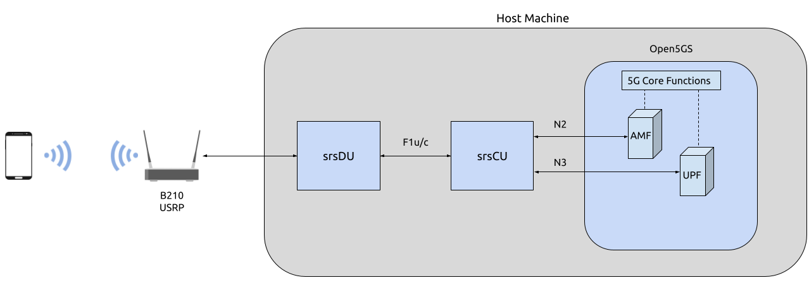

.. srsRAN Project CU-DU Split

.. _cudu_appnote:

O-RAN CU-DU Split
#################

.. note:: 

  The latest version of srsRAN Project is required to implement the CU-DU split with srsRAN Project.  

Overview
********

This tutorial outlines the steps required to configure and run the srsCU and srsDU applications, to create an E2E O-RAN compliant network with a CU-DU split. In this tutorial a USRP is used as the RF-frontend, resulting in this 
being a `Split 8 <https://www.rcrwireless.com/20210317/5g/exploring-functional-splits-in-5g-ran-tradeoffs-and-use-cases-reader-forum#:~:text=Split%208%3A%20PHY%2DRF%20split.%C2%A0>`_ configuration. 
To implement a Split 7.2x configuration, use this guide in conjunction with the :ref:`RU Guide <oran_ru_tutorial>`. 

----- 

Hardware and Software Overview
******************************

For this application note, the following hardware and software are used:

    - PC with Ubuntu 22.04.1 LTS
    - `srsRAN Project <https://github.com/srsran/srsRAN_project>`_ (latest version)
    - `Ettus Research B210 USRP <https://www.ettus.com/all-products/ub210-kit/>`_ (connected over USB 3.0)
    - `Open5GS 5G Core <https://open5gs.org/>`_ (running bare metal)
    - COTS UE (Xiaomi 12 5G)

srsRAN Project
==============

If you have not already done so, install the latest version of srsRAN Project and all of its dependencies. This is outlined in the :ref:`Installation Guide <manual_installation>`. 

B210
====

This example uses a USRP B210, it must be connected to the PC via USB 3.0. The use of an external clock is not compulsory, but for setups where the connection is unstable or the UE struggles to connect it is recommended. 

Open5GS
=======

For this example, Open5GS is running bare metal on the host machine. 

Open5GS is a C-language Open Source implementation for 5G Core and EPC. The following links will provide you 
with the information needed to download and set-up Open5GS so that it is ready to use with srsRAN: 

    - `GitHub <https://github.com/open5gs/open5gs>`_ 
    - `Quickstart Guide <https://open5gs.org/open5gs/docs/guide/01-quickstart/>`_

COTS UE
=======

A 5G SA capable COTS UE is used for this tutorial, specifically the `Xiaomi 12 5G <https://www.mi.com/es/product/xiaomi-12/specs/>`_. A detailed list of COTS UEs that have been tested with srsRAN Project can be found :ref:`here <cots_ues>`.

For more information on connecting a COTS UEs to srsRAN Project, see the :ref:`full tutorial <COTS_UE_tutorial>`. 

------

Configuration
*************

For the CU-DU split two configuration files are needed, one for srsCU and one for srsDU. These configuration files are explained in detail :ref:`here <manual_config_ref>`. 

Core
====

As previously stated, Open5GS is running bare metal for this example. No configuration changes are needed, simply register the credentials of the UE being used if you haven't done so already. The Quickstart Guide linked above outlines how to configure the core. 

srsCU
=====

To configure srsCU, the ``amf`` and ``f1ap`` (f1-c) bind addresses must be configured in the ``cu_up``. Unless otherwise specified, setting the f1-c address will also set the f1-u address. The following configuration file shows the minimum requirements to configure srsCU: 

.. code-block:: yaml

  cu_cp:
    amf:
      addr: 127.0.0.10                                            # The address or hostname of the AMF.
      bind_addr: 127.0.0.1                                        # A local IP that the gNB binds to for traffic from the AMF.
      supported_tracking_areas:                                   # Configure the TA associated with the CU-CP
        - tac: 7                        
          plmn_list:
            - plmn: "90170"
              tai_slice_support_list:
                - sst: 1
    f1ap:
      bind_addr: 127.0.10.1                                       # Configure the F1AP bind address, this will enable the CU-cp to connect to the DU

The ``amf`` parameters are specific to the local configuration of the core. If you are running Open5GS via the docker scripts provided with srsRAN Project, your configuration will be different. The same is true if you have 
made any other local changes to how Open5GS has been configured.  

srsDU
=====

To configure srsDU, the ``f1ap`` parameters must be configured, as well as the ``ru_sdr`` and ``cell_cfg`` parameters. As with srsCU, the following are the minimum requirements to configure srsDU: 

.. code-block:: yaml

  f1ap:
    cu_cp_addr: 127.0.10.1
    bind_addr: 127.0.10.2

  nru: 
    bind_addr: 127.0.10.2

  ru_sdr:
    device_driver: uhd
    device_args: type=b200,num_recv_frames=64,num_send_frames=64
    srate: 23.04
    otw_format: sc12  
    tx_gain: 80
    rx_gain: 40

  cell_cfg:
    dl_arfcn: 650000
    band: 78
    channel_bandwidth_MHz: 20
    common_scs: 30
    plmn: "00101"
    tac: 7
    pci: 1

In this example, the DU is configured to work with a USRP B210, and to create a 20 MHz cell. The specifics of the RU being used and the desired cell can be changed as needed. The ``f1ap`` configuration must remain constant with the associated configuration in the CU. 

------

Running the Network
*******************

The following running order must be followed to correctly initialize the network:

  #. Open5GS
  #. srsCU
  #. srsDU 

Core
====

If the Open5GS documentation has been followed correctly, then the core should already be running as a service in the background. If not, then start the core according to the steps in the Open5GS docs. 

srsCU
=====

First, navigate to the srsCU application folder. This can be done with the following command: 

.. code-block:: bash 

  cd ~/srsRAN_Project/build/apps/cu 

To run srsCU the following command can be used (assuming the srsCU configuration file is also located in the same folder): 

.. code-block:: bash 

  sudo ./srscu -c cu.yml 

If srsCU is running correctly, you should see the following in the console: 

.. code-block:: bash 

  N2: Connection to AMF on 127.0.1.100:38412 completed
  F1-C: Listening for new connections on 127.0.10.1:38471...
  ==== CU started ===
  Type <h> to view help

srsDU
=====

srsDU is run in the same way as srsCU. 

First, navigate to the correct folder: 

.. code-block:: bash 

  cd ~/srsRAN_Project/build/apps/du 

srsDU can be run with the following command (assuming the srsDU configuration file is also located in the same folder): 

.. code-block:: bash 

  sudo ./srsdu -c du.yml 

If srsDU is running correctly, you will see the following in the console:

.. code-block:: bash

  Cell pci=1, bw=20 MHz, 1T1R, dl_arfcn=650000 (n78), dl_freq=3750.0 MHz, dl_ssb_arfcn=649632, ul_freq=3750.0 MHz

  Available radio types: uhd and zmq.
  [INFO] [UHD] linux; GNU C++ version 9.3.0; Boost_107100; UHD_4.0.0.0-666-g676c3a37
  [INFO] [LOGGING] Fastpath logging disabled at runtime.
  Making USRP object with args 'type=b200,num_recv_frames=64,num_send_frames=64'
  [INFO] [B200] Detected Device: B210
  [INFO] [B200] Operating over USB 3.
  [INFO] [B200] Initialize CODEC control...
  [INFO] [B200] Initialize Radio control...
  [INFO] [B200] Performing register loopback test... 
  [INFO] [B200] Register loopback test passed
  [INFO] [B200] Performing register loopback test... 
  [INFO] [B200] Register loopback test passed
  [INFO] [B200] Setting master clock rate selection to 'automatic'.
  [INFO] [B200] Asking for clock rate 16.000000 MHz... 
  [INFO] [B200] Actually got clock rate 16.000000 MHz.
  [INFO] [MULTI_USRP] Setting master clock rate selection to 'manual'.
  [INFO] [B200] Asking for clock rate 23.040000 MHz... 
  [INFO] [B200] Actually got clock rate 23.040000 MHz.
  F1-C: Connection to CU-CP on 127.0.10.1:38471 completed
  ==== DU started ===
  Type <h> to view help

------

Connecting to the Network
*************************

Connecting the COTS UE to the network follows the same steps outlined in :ref:`this tutorial <COTS_UE_tutorial>`. For debugging tips related to this, see both the tutorial the `GitHub Discussions <https://github.com/srsran/srsRAN_Project/discussions>`_. 

Console Outputs
===============

The srsCU console will not display any further automatic outputs once the UE is connected; however, the usual trace and outputs associated with the "vanilla" gNB output can we seen in the srsDU console. 

Typing ``t`` on the srsDU console will result in something similar to the following output once the UE has connected:

.. code-block:: bash 

            |--------------------DL---------------------|-------------------------UL------------------------------
   pci rnti | cqi  ri  mcs  brate   ok  nok  (%)  dl_bs | pusch  rsrp  mcs  brate   ok  nok  (%)    bsr     ta  phr
     1 4601 |  15 1.0   21   9.2k   11    1   8%      0 |  24.2   ovl   26    33k    8    0   0%      0   -81n    0
     1 4601 |  15 1.0   27   429k   84    0   0%      0 |  31.6 -11.5   28   221k   25    0   0%      0      0    7
     1 4601 |  15 1.0   27   686k  119    0   0%      0 |  32.7 -12.4   28   236k   44    0   0%      0   -56n   17
     1 4601 |  15 1.0   27   664k  110    0   0%      0 |  32.1 -12.8   28   353k   46    0   0%     10   -32n   16
     1 4601 |  15 1.0   27   517k   64    0   0%      0 |  33.6 -12.3   28   124k   29    0   0%    198   -40n   17
     1 4601 |  15 1.0   27    60k   36    0   0%      0 |  33.0 -11.8   28   127k   21    0   0%      0   -24n   17