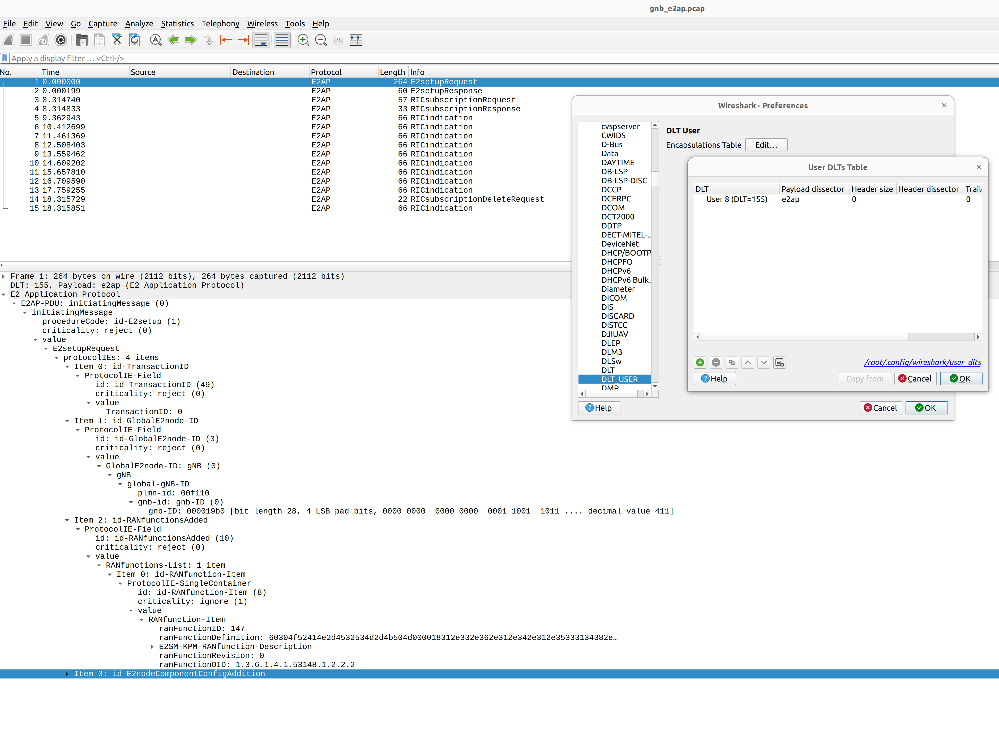

.. srsRAN gNB with FlexRIC

.. _flexric_appnote:

O-RAN NearRT-RIC and xApp
#########################

Introduction
************

This application note shows how to use the E2 interface exposed by the srsRAN Project gNodeB.
For this purpose, we use third-party `O-RAN Alliance <https://www.o-ran.org/>`_ compliant NearRT-RIC and xApp provided in `FlexRIC <https://gitlab.eurecom.fr/mosaic5g/flexric>`_ framework. 

Our E2 interface implementation is based on the following ORAN technical specifications:

    - O-RAN.WG3.E2AP-R003-v03.00
    - O-RAN.WG3.E2SM-R003-v03.00
    - O-RAN.WG3.E2SM-KPM-R003-v03.00

----- 

Setup Overview
**************

The following diagram presents the setup architecture used in this application note:

.. figure:: .imgs/gNB_srsUE_zmq_flexRIC.png
  :align: center

Note that no core network is present, as it is not needed to show the operation of the E2 interface. 

Hardware and Software Overview
******************************

For this application note, the following hardware and software are used:

    - PC with Ubuntu 22.04.1 LTS
    - `srsRAN Project <https://github.com/srsran/srsRAN_project>`_
    - `srsRAN 4G <https://github.com/srsran/srsRAN_4G>`_ (23.04 or later)
    - `ZeroMQ <https://zeromq.org/>`_
    - `FlexRIC <https://gitlab.eurecom.fr/mosaic5g/flexric>`_
    - Wireshark (Version 4.0.7 or later)

Limitations
===========

While our ultimate goal is to fully support the E2 interface, it is still under development and its current version is limited in features and operation.
Specifically, the current E2 interface implementation supports only E2SM_KPM service model with the following limitations:

   - Only Report Service Style 1 is supported
   - Only three metrics are exposed (i.e., "CQI", "RSRP", "RSRQ")

-----

FlexRIC
=======
`FlexRIC <https://gitlab.eurecom.fr/mosaic5g/flexric>`_ framework that provides `O-RAN Alliance <https://www.o-ran.org/>`_ compliant E2 node Agent emulators, a NearRT-RIC and xApps written in C/C++ and Python.
For the purpose of presenting the usage of E2 interface exposed by srsRAN Project gNodeB, we use the NearRT-RIC and an example monitoring xApp from the FlexRIC framework.

Note that ORAN specifications are evolving and FlexRIC is under development with multiple tracks (i.e., git branches). Therefore, different versions of E2 protocols (i.e., E2AP, E2SM, E2SM_KPM) as well as xApp examples are present on different git branches. In fact, we found out that we can provide an end-to-end example only with `e2ap-v2` branch (commit: `0eac86b9ab16ba849470c748722978e8d7b94e73`). This code version, however, still requires a small patch (:download:`Flexric.patch <.patch/flexric.patch>`) that fixes issues with ASN1 criticality, allows for larger E2 Setup Request messages, changes the name of the requested metric in the RIC Subscription Request message and prints the content of the RIC Indication message. Note that in this version of FlexRIC the name of the requested metric in the RIC Subscription Request is hard-coded and cannot be easily changed in the xApp.

The FlexRIC installation is performed as follows:

.. code::

  git clone https://gitlab.eurecom.fr/mosaic5g/flexric.git
  cd ./flexric
  git checkout e2ap-v2
  git apply -v ./flexric.patch
  cd build/
  cmake ..
  make
  make install

Note that while by default Ubuntu 22.04.1 uses `gcc-11`, the used FlexRIC version can be built only with `gcc-10`. One possible way to switch `gcc` version is to use `update-alternatives` tool, for example::

  >sudo update-alternatives --config gcc
  There are 3 choices for the alternative gcc (providing /usr/bin/gcc).

    Selection    Path             Priority   Status
  ------------------------------------------------------------
    0            /usr/bin/gcc-11   11        auto mode
  * 1            /usr/bin/gcc-10   10        manual mode
    2            /usr/bin/gcc-11   11        manual mode
    3            /usr/bin/gcc-9    9         manual mode

  Press <enter> to keep the current choice[*], or type selection number:

--------

srsRAN 4G
=========

If you have not already done so, install the latest version of srsRAN 4G and all of its dependencies. This is outlined in the `installation guide <https://docs.srsran.com/projects/4g/en/latest/general/source/1_installation.html>`_. 

Please check our srsRAN 4G `ZeroMQ Application Note <https://docs.srsran.com/projects/4g/en/latest/app_notes/source/zeromq/source/index.html>`_ for information on installing ZMQ and using it with srsRAN 4G.

ZeroMQ
======

On Ubuntu, ZeroMQ development libraries can be installed with:

.. code::

  sudo apt-get install libzmq3-dev
  
Alternatively, ZeroMQ can also be built from source. 

First, one needs to install libzmq:

.. code::

  git clone https://github.com/zeromq/libzmq.git
  cd libzmq
  ./autogen.sh
  ./configure
  make
  sudo make install
  sudo ldconfig

Second, install czmq:

.. code::

  git clone https://github.com/zeromq/czmq.git
  cd czmq
  ./autogen.sh
  ./configure
  make
  sudo make install
  sudo ldconfig

Finally, you need to compile srsRAN Project and srsRAN 4G (assuming you have already installed all the required dependencies). 
Note, if you have already built and installed srsRAN 4G and srsRAN Project prior to installing ZMQ and other dependencies you 
will have to re-build both to ensure the ZMQ drivers have been recognized correctly. 

For srsRAN Project, the following commands can be used to download and build from source: 

.. code::

  git clone https://github.com/srsran/srsRAN_Project.git
  cd srsRAN_Project
  mkdir build
  cd build
  cmake ../ -DENABLE_EXPORT=ON -DENABLE_ZEROMQ=ON
  make -j`nproc`

ZeroMQ is disbaled by default, this is enabled when running ``cmake`` by including ``-DENABLE_EXPORT=ON -DENABLE_ZEROMQ=ON``. 

Pay extra attention to the cmake console output. Make sure you read the following line:

.. code::

  ...
  -- FINDING ZEROMQ.
  -- Checking for module 'ZeroMQ'
  --   No package 'ZeroMQ' found
  -- Found libZEROMQ: /usr/local/include, /usr/local/lib/libzmq.so
  ...

-----

Configuration
*************

Here, we use ZMQ-based setup, and hence the configuration files are based on those introduced in :ref:`srsRAN gNB with srsUE<srsue_appnote>` application note.

The following config files were modified to use ZMQ-based RF driver and enable E2 interface in the srsRAN Project gNodeB:

  * :download:`gNB config <.config/gnb_zmq.yaml>`
  * :download:`UE config <.config/ue_zmq.conf>`

Details of the modifications made are outlined in the following sections. The description of the remaining config parameters is available in :ref:`srsRAN gNB with srsUE<srsue_appnote>` application note.

It is recommended you use these files to avoid errors while changing configs manually. Any configuration files not included here do not require modification from the default settings.

gNB
===

The following changes need to be made to the gNB configuration file.

5G core network is not needed to present the E2 functionality, therefore we disable it::

  amf:
    no_core: true                     # Core is not needed for the purpose of presenting E2 operation

Enable E2 agents in all DUs and enable E2SM_KPM service module::

  e2:
    enable_du_e2: true                # Enable DU E2 agent (one for each DU instance)
    e2sm_kpm_enabled: true            # Enable KPM service module

Enable E2AP packet captures and set the name of the output pcap file::

  pcap:
    e2ap_enable: true                 # Set to true to enable E2AP PCAPs.
    e2ap_filename: /tmp/gnb_e2ap.pcap # Path where the E2AP PCAP is stored.

--------

Running the Network
*******************

The following order should be used when running the network:

  1. NearRT-RIC
  2. gNB
  3. UE
  4. xApp

NearRT-RIC
==========

Start example NearRT-RIC provided in FlexRIC framework::

  ./flexric/build/examples/ric/nearRT-RIC

The console output should be similar to:: 

  Setting the config -c file to /usr/local/etc/flexric/flexric.conf
  Setting path -p for the shared libraries to /usr/local/lib/flexric/
  [NEAR-RIC]: nearRT-RIC IP Address = 127.0.0.1, PORT = 36421
  [NEAR-RIC]: Initializing 
  [NEAR-RIC]: Loading SM ID = 142 with def = MAC_STATS_V0 
  [NEAR-RIC]: Loading SM ID = 148 with def = GTP_STATS_V0 
  [NEAR-RIC]: Loading SM ID = 146 with def = TC_STATS_V0 
  [NEAR-RIC]: Loading SM ID = 145 with def = SLICE_STATS_V0 
  [NEAR-RIC]: Loading SM ID = 143 with def = RLC_STATS_V0 
  [NEAR-RIC]: Loading SM ID = 147 with def = ORAN-E2SM-KPM 
  [NEAR-RIC]: Loading SM ID = 144 with def = PDCP_STATS_V0 
  [iApp]: Initializing ... 
  [iApp]: nearRT-RIC IP Address = 127.0.0.1, PORT = 36422
  fd created with 6 

gNB
===

We run gNB directly from the build folder (the config file is also located there) with the following command::

	sudo ./gnb -c gnb_conf.yaml

The console output should be similar to:: 

  --== srsRAN gNB (commit 491d7aa9d) ==--

  Available radio types: zmq.
  Connecting to NearRT-RIC on 127.0.0.1:36421
  Cell pci=1, bw=10 MHz, dl_arfcn=368500 (n3), dl_freq=1842.5 MHz, dl_ssb_arfcn=368410, ul_freq=1747.5 MHz

  ==== gNodeB started ===
  Type <t> to view trace

The ``Connecting to NearRT-RIC on 127.0.0.1:36421`` message indicates that gNB initiated a connection to the NearRT-RIC.
If the connection attempt is successful, the following (or similar) will be displayed on the NearRT-RIC console::

  Received message with id = 411, port = 45499 
  [E2AP] Received SETUP-REQUEST from PLMN   1. 1 Node ID 411 RAN type ngran_gNB
  [NEAR-RIC]: Accepting RAN function ID 147 with def = `0ORAN-E2SM-KPM 
  [NEAR-RIC]: Accepting interfaceType 0

srsUE
=====

Next, we start srsUE. This is also done directly from within the build folder, with the config file in the same location::

	sudo ./srsue ./ue_zmq.conf

If srsUE connects successfully to the network, the following (or similar) should be displayed on the console:: 
  
  Active RF plugins: libsrsran_rf_uhd.so libsrsran_rf_zmq.so
  Inactive RF plugins: 
  Reading configuration file ./ue_zmq.conf...

  Built in Release mode using commit fa56836b1 on branch master.

  Opening 1 channels in RF device=zmq with args=tx_port=tcp://127.0.0.1:2001,rx_port=tcp://127.0.0.1:2000,base_srate=11.52e6
  Supported RF device list: UHD zmq file
  CHx base_srate=11.52e6
  Current sample rate is 1.92 MHz with a base rate of 11.52 MHz (x6 decimation)
  CH0 rx_port=tcp://127.0.0.1:2000
  CH0 tx_port=tcp://127.0.0.1:2001
  Current sample rate is 11.52 MHz with a base rate of 11.52 MHz (x1 decimation)
  Current sample rate is 11.52 MHz with a base rate of 11.52 MHz (x1 decimation)
  Waiting PHY to initialize ... done!
  Attaching UE...
  Random Access Transmission: prach_occasion=0, preamble_index=0, ra-rnti=0x39, tti=334
  Received RRC Reject
  Random Access Complete.     c-rnti=0x4601, ta=0

Note that there is no core network present, therefore UE will not be assigned any IP address.

xApp
====

We use an example `xapp_kpm_moni` xApp from the FlexRIC framework. The application connects to NearRT-RIC and uses E2SM_KPM service module to subscribe for measurements of a single metric (i.e., RSRP).
We start the xApp with the following command::

  ./examples/xApp/c/monitor/xapp_kpm_moni

If xApp connects successfully to the NearRT-RIC, the following (or similar) should be displayed on the console:: 
  
  Setting the config -c file to /usr/local/etc/flexric/flexric.conf
  Setting path -p for the shared libraries to /usr/local/lib/flexric/
  [xAapp]: Initializing ... 
  [xApp]: nearRT-RIC IP Address = 127.0.0.1, PORT = 36422
  [E2 AGENT]: Opening plugin from path = /usr/local/lib/flexric/libmac_sm.so 
  [E2 AGENT]: Opening plugin from path = /usr/local/lib/flexric/libgtp_sm.so 
  [E2 AGENT]: Opening plugin from path = /usr/local/lib/flexric/libtc_sm.so 
  [E2 AGENT]: Opening plugin from path = /usr/local/lib/flexric/libslice_sm.so 
  [E2 AGENT]: Opening plugin from path = /usr/local/lib/flexric/librlc_sm.so 
  [E2 AGENT]: Opening plugin from path = /usr/local/lib/flexric/libkpm_sm.so 
  [E2 AGENT]: Opening plugin from path = /usr/local/lib/flexric/libpdcp_sm.so 
  [NEAR-RIC]: Loading SM ID = 142 with def = MAC_STATS_V0 
  [NEAR-RIC]: Loading SM ID = 148 with def = GTP_STATS_V0 
  [NEAR-RIC]: Loading SM ID = 146 with def = TC_STATS_V0 
  [NEAR-RIC]: Loading SM ID = 145 with def = SLICE_STATS_V0 
  [NEAR-RIC]: Loading SM ID = 143 with def = RLC_STATS_V0 
  [NEAR-RIC]: Loading SM ID = 147 with def = ORAN-E2SM-KPM 
  [NEAR-RIC]: Loading SM ID = 144 with def = PDCP_STATS_V0 
  Filename = /tmp/xapp_db_1691051154281476 
   [xApp]: E42 SETUP-REQUEST sent
  adding event fd = 8 ev-> 4 
  [xApp]: E42 SETUP-RESPONSE received
  [xApp]: xApp ID = 7 
  Registered E2 Nodes = 1 
  Pending event size before remove = 1 
  Connected E2 nodes = 1
  Registered node 0 ran func id = 147 
   Generated of req_id = 1 

The following (or similar) will be displayed on the NearRT-RIC console::

  [iApp]: E42 SETUP-REQUEST received
  [iApp]: E42 SETUP-RESPONSE sent
  [iApp]: SUBSCRIPTION-REQUEST xapp_ric_id->ric_id.ran_func_id 147  
  [E2AP] SUBSCRIPTION REQUEST generated
  [NEAR-RIC]: nb_id 411 port = 45499

Finally, the xApp sends the RIC Subscription Request message and periodically receives RIC Indication messages with the recent measurements of a specific metric. The following (or similar) should be displayed on the console:: 

  [xApp]: RIC SUBSCRIPTION REQUEST sent
  adding event fd = 8 ev-> 5 
  [xApp]: SUBSCRIPTION RESPONSE received
  Pending event size before remove = 1 
  [xApp]: Successfully SUBSCRIBED to ran function = 147 
  Received RIC Indication:
  ---Metric: RSRP: 123
  Received RIC Indication:
  ---Metric: RSRP: 123
  Received RIC Indication:
  ---Metric: RSRP: 123
  Received RIC Indication:
  ---Metric: RSRP: 123
  Received RIC Indication:
  ---Metric: RSRP: 123
  Received RIC Indication:
  ---Metric: RSRP: 123
  Received RIC Indication:
  ---Metric: RSRP: 123
  Received RIC Indication:
  ---Metric: RSRP: 123
  Received RIC Indication:
  ---Metric: RSRP: 123
  Remove handle number = 1 
  E42 RIC_SUBSCRIPTION_DELETE_REQUEST  sdr->ric_id.ran_func_id 147  sdr->ric_id.ric_req_id 1 
  [xApp]: E42 SUBSCRIPTION-DELETE sent 
  adding event fd = 8 ev-> 7 
  Received RIC Indication:
  ---Metric: RSRP: 123

Note that in the current version, E2 agent in srsRAN gnb fills the RIC Indication message with a hard-coded value.

-----

E2AP packet analyzer
********************

PCAP file
=========

E2AP packets are captured to a file in the compact format which can be decoded by Wireshark. 
In order to correctly decode and display the E2AP packets, the following steps have to be applied:

  1. Edit the preferences (Edit -> Preferences -> Protocols -> DLT_USER) for DLT_USER to add an entry for DLT=155 with Payload Protocol=e2ap.
  2. Open pcap file: `/tmp/gnb_e2ap.pcap`

The figure below shows an example trace of E2AP packets.

Live capture
============

Wireshark can be used to collect E2AP packets exchanged between E2 agent (located in srsRAN gNB) and NearRT-RIC at runtime. This requires the following steps to be executed:

  1. Start sniffing on the loopback interface.
  2. Set filter to `sctp.port == 36421`.
  3. Right-click on any packet -> Decode As.. -> set Current to E2AP
  4. Now filter can be set to `e2ap` to show only E2AP messages.

Note that at least Wireshark version 4.0.7 is needed to correctly decode and display E2AP packets (i.e., earlier Wireshark versions do not support E2APv3 protocol and as a result will display information about the Malformed Packets).

The figure below shows an example trace of E2AP packets.

.. figure:: .imgs/e2ap_live_capture.png
  :scale: 40%
  :align: center

