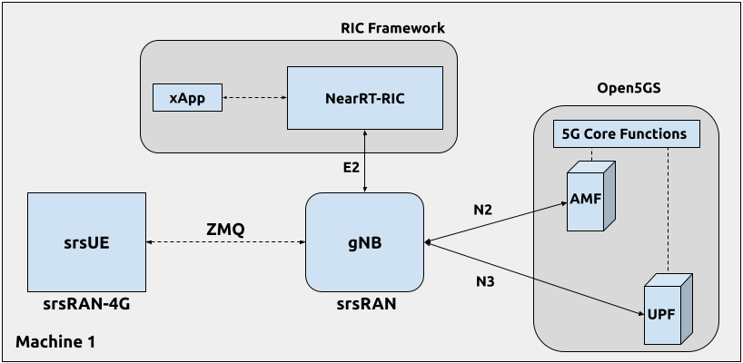

.. srsRAN gNB with FlexRIC

.. _flexric_appnote:

O-RAN NearRT-RIC and xApp
#########################

Overview
********

This application note shows how to use the E2 interface exposed by the srsRAN Project gNodeB.
For this purpose, we use third-party `O-RAN Alliance <https://www.o-ran.org/>`_ compliant NearRT-RIC and xApp provided in `FlexRIC <https://gitlab.eurecom.fr/mosaic5g/flexric>`_ framework. 

Our E2 interface implementation is based on the following O-RAN technical specifications:

    - O-RAN.WG3.E2AP-R003-v03.00
    - O-RAN.WG3.E2SM-R003-v03.00
    - O-RAN.WG3.E2SM-KPM-R003-v03.00
    - O-RAN.WG3.E2SM-RC-R003-v03.00

----- 

Setup Overview
**************

The following diagram presents the setup architecture used in this application note:

Hardware and Software Overview
******************************

For this application note, the following hardware and software are used:

    - PC with Ubuntu 22.04.1 LTS
    - `srsRAN Project <https://github.com/srsran/srsRAN_project>`_
    - `srsRAN UE <https://github.com/srsran/srsRAN_4G>`_ (srsRAN 4G 23.04 or later)
    - `ZeroMQ <https://zeromq.org/>`_
    - `FlexRIC <https://gitlab.eurecom.fr/mosaic5g/flexric>`_
    - `Open5GS 5G Core <https://open5gs.org/>`_
    - Wireshark (Version 4.0.7 or later)

Limitations
===========

While our ultimate goal is to fully support the E2 interface, it is still under development and its current version is limited in features and operation.
Specifically, the current E2 interface implementation supports only E2SM_KPM and E2SM_RC service models with the following limitations:
  
  - E2SM_RC service model:

    - Only Control Service Style 2 is supported
  
  - E2SM_KPM service model:

    - All Report Service Styles (1 - 5) are supported
    - Monitoring period limited to 1s
    - The following 3 'dummy' DU metrics are exposed (they will be removed in future releases):

      - CQI
      - RSRP
      - RSRQ

    - The following 6 ORAN defined metrics are expose:

      - ``DRB.UEThpDl`` - DL throughput
      - ``DRB.UEThpUl`` - UL throughput
      - ``DRB.RlcPacketDropRateDl`` - UL packet success rate 
      - ``DRB.PacketSuccessRateUlgNBUu`` - RLC DL packet drop rate
      - ``DRB.RlcSduTransmittedVolumeDL`` - RLC DL transmitted SDU volume
      - ``DRB.RlcSduTransmittedVolumeUL`` - RLC UL transmitted SDU volume

-----

Installation
************

FlexRIC
=======
The `FlexRIC <https://gitlab.eurecom.fr/mosaic5g/flexric>`_ framework provides `O-RAN Alliance <https://www.o-ran.org/>`_ compliant E2 node Agent emulators, a NearRT-RIC and xApps written in C/C++ and Python.
For the purpose of presenting the usage of E2 interface exposed by srsRAN Project gNodeB, we use the NearRT-RIC and an example KPM monitoring xApp from the FlexRIC framework.

The O-RAN specifications are evolving and FlexRIC is under development with multiple tracks (i.e. git branches).
In this tutorial, we use ``br-flexric`` branch (commit: ``1a3903a7``).

FlexRIC requires the following dependencies to be installed (see `FlexRIC Installation Guide <https://gitlab.eurecom.fr/mosaic5g/flexric/-/tree/br-flexric>`_ for details):

.. code-block:: bash

  sudo apt-get update
  sudo apt-get install swig libsctp-dev python3 cmake-curses-gui python3-dev pkg-config libconfig-dev libconfig++-dev

The FlexRIC installation is performed as follows:

.. code-block:: bash

  git clone https://gitlab.eurecom.fr/mosaic5g/flexric.git
  cd flexric
  git checkout br-flexric
  mkdir build
  cd build
  cmake -DKPM_VERSION=KPM_V2 -DXAPP_DB=NONE_XAPP ../
  make
  sudo make install

Note that while by default Ubuntu 22.04.1 uses `gcc-11`, the used FlexRIC version can be built only with `gcc-10`. One possible way to switch `gcc` version is to use `update-alternatives` tool, for example:

.. code-block:: bash

  sudo update-alternatives --config gcc

  There are 3 choices for the alternative gcc (providing /usr/bin/gcc).

    Selection    Path             Priority   Status
  ------------------------------------------------------------
    0            /usr/bin/gcc-11   11        auto mode
  * 1            /usr/bin/gcc-10   10        manual mode
    2            /usr/bin/gcc-11   11        manual mode
    3            /usr/bin/gcc-9    9         manual mode

  Press <enter> to keep the current choice[*], or type selection number:

Open5GS
=======

For this example we are using Open5GS as the 5G Core. 

Open5GS is a C-language Open Source implementation for 5G Core and EPC. The following links will provide you 
with the information needed to download and set-up Open5GS so that it is ready to use with srsRAN: 

    - `GitHub <https://github.com/open5gs/open5gs>`_ 
    - `Quickstart Guide <https://open5gs.org/open5gs/docs/guide/01-quickstart/>`_

For the purpose of this application note, we will use a dockerized Open5GS version provided in srsRAN Project at ``srsgnb/docker``.

ZeroMQ
======

On Ubuntu, ZeroMQ development libraries can be installed with:

.. code-block:: bash

  sudo apt-get install libzmq3-dev
  
Alternatively, ZeroMQ can also be built from source. 

First, one needs to install libzmq:

.. code-block:: bash

  git clone https://github.com/zeromq/libzmq.git
  cd libzmq
  ./autogen.sh
  ./configure
  make
  sudo make install
  sudo ldconfig

Second, install czmq:

.. code-block:: bash

  git clone https://github.com/zeromq/czmq.git
  cd czmq
  ./autogen.sh
  ./configure
  make
  sudo make install
  sudo ldconfig

Finally, you need to compile srsRAN Project and srsRAN 4G (assuming you have already installed all the required dependencies). 

.. note::
  If you have already built and installed srsRAN 4G and srsRAN Project prior to installing ZMQ and other dependencies you will have to re-build both to ensure the ZMQ drivers have been recognized correctly. 

srsRAN Project
==============

For srsRAN Project, the following commands can be used to download and build from source: 

.. code-block:: bash

  git clone https://github.com/srsran/srsRAN_Project.git
  cd srsRAN_Project
  mkdir build
  cd build
  cmake ../ -DENABLE_EXPORT=ON -DENABLE_ZEROMQ=ON
  make -j`nproc`

ZeroMQ is disabled by default, this is enabled when running ``cmake`` by including ``-DENABLE_EXPORT=ON -DENABLE_ZEROMQ=ON``. 

Pay extra attention to the cmake console output. Make sure you read the following line:

.. code-block:: bash

  ...
  -- FINDING ZEROMQ.
  -- Checking for module 'ZeroMQ'
  --   No package 'ZeroMQ' found
  -- Found libZEROMQ: /usr/local/include, /usr/local/lib/libzmq.so
  ...

srsUE
=====

If you have not already done so, install the latest version of srsRAN 4G and all of its dependencies. This is outlined in the `installation guide <https://docs.srsran.com/projects/4g/en/latest/general/source/1_installation.html>`_. 

Please check our srsRAN 4G `ZeroMQ Application Note <https://docs.srsran.com/projects/4g/en/latest/app_notes/source/zeromq/source/index.html>`_ for information on installing ZMQ and using it with srsRAN 4G/ srsUE.

-----

Configuration
*************

Here, we use ZMQ-based setup, and hence the configuration files are based on those introduced in :ref:`srsRAN gNB with srsUE<srsue_appnote>` application note.

The following config files were modified to use ZMQ-based RF driver and enable E2 interface in the srsRAN Project gNodeB:

  * :download:`gNB config <.config/gnb_zmq.yaml>`
  * :download:`UE config <.config/ue_zmq.conf>`

Details of the modifications made are outlined in the following sections. The description of the remaining config parameters is available in :ref:`srsRAN gNB with srsUE<srsue_appnote>` application note.

It is recommended you use these files to avoid errors while changing configs manually. Any configuration files not included here do not require modification from the default settings.

gNB
===

Here, we describe the gNB configuration parameters related to the E2 agent.

Enable E2 agents in all DUs and enable E2SM_KPM service module:

.. code-block:: yaml

  e2:
    enable_du_e2: true                # Enable DU E2 agent (one for each DU instance)
    e2sm_kpm_enabled: true            # Enable KPM service module
    addr: 127.0.0.1                   # RIC IP address
    port: 36421                       # RIC port

Enable E2AP packet captures and set the name of the output pcap file:

.. code-block:: yaml

  pcap:
    e2ap_enable: true                 # Set to true to enable E2AP PCAPs.
    e2ap_filename: /tmp/gnb_e2ap.pcap # Path where the E2AP PCAP is stored.

Enable Enable RLC metrics reporting that will feed E2SM_KPM service model with measurements data:

.. code-block:: yaml

  metrics:
    rlc_json_enable: 1                # Enable RLC metrics reporting
    rlc_report_period: 1000           # Set reporting period to 1s

--------

Running the Network
*******************

The following order should be used when running the network:

  1. Open5GS
  2. NearRT-RIC
  3. gNB
  4. UE
  5. Start IP traffic (e.g., ping)
  6. xApp

Open5GS Core
============

srsRAN Project provides a dockerized version of the Open5GS. It is a convenient and quick way to start the core network. You can run it as follows:

.. code-block:: bash

  cd ./srsRAN_Project/docker
  docker compose up --build 5gc

Note that we have already configured Open5GS to operate correctly with srsRAN Project gNB. Moreover, the UE database is populated with the credentials used by our srsUE. 

NearRT-RIC
==========

Start example NearRT-RIC provided in FlexRIC framework:

.. code-block:: bash

  ./flexric/build/examples/ric/nearRT-RIC

The NearRT-RIC console output should be similar to:

.. code-block:: bash

  Setting the config -c file to /usr/local/etc/flexric/ric.conf
  [LibConf]: loading service models from SM_DIR: /usr/local/lib/flexric/
  [LibConf]: reading configuration for NearRT_RIC
  [LibConf]: NearRT_RIC IP: 127.0.0.1
  [LibConf]: E2_Port Port: 36421
  [LibConf]: E42_Port Port: 36422
  [NEAR-RIC]: nearRT-RIC IP Address = 127.0.0.1, PORT = 36421
  [NEAR-RIC]: Initializing 
  [NEAR-RIC]: Loading SM ID = 3 with def = ORAN-E2SM-RC 
  [NEAR-RIC]: Loading SM ID = 142 with def = MAC_STATS_V0 
  [NEAR-RIC]: Loading SM ID = 148 with def = GTP_STATS_V0 
  [NEAR-RIC]: Loading SM ID = 146 with def = TC_STATS_V0 
  [NEAR-RIC]: Loading SM ID = 145 with def = SLICE_STATS_V0 
  [NEAR-RIC]: Loading SM ID = 143 with def = RLC_STATS_V0 
  [NEAR-RIC]: Loading SM ID = 2 with def = ORAN-E2SM-KPM 
  [NEAR-RIC]: Loading SM ID = 144 with def = PDCP_STATS_V0 
  [iApp]: Initializing ... 
  [iApp]: nearRT-RIC IP Address = 127.0.0.1, PORT = 36422
  fd created with 6 
  [NEAR-RIC]: Initializing Task Manager with 2 threads
  
gNB
===

We run gNB directly from the build folder (the config file is also located there) with the following command:

.. code-block:: bash

	sudo ./gnb -c gnb_zmq.yaml

The gNB console output should be similar to:

.. code-block:: bash

  --== srsRAN gNB (commit 0b2702cca) ==--

  Connecting to AMF on 10.53.1.2:38412
  Available radio types: zmq.
  Connecting to NearRT-RIC on 127.0.0.1:36421
  Cell pci=1, bw=10 MHz, dl_arfcn=368500 (n3), dl_freq=1842.5 MHz, dl_ssb_arfcn=368410, ul_freq=1747.5 MHz

  ==== gNodeB started ===
  Type <t> to view trace

The ``Connecting to AMF on 10.53.1.2:38412`` message indicates that gNB initiated a connection to the core. While, the ``Connecting to NearRT-RIC on 127.0.0.1:36421`` message indicates that gNB initiated a connection to the NearRT-RIC.

If the connection attempt is successful, the following (or similar) will be displayed on the NearRT-RIC console:

.. code-block:: bash

  Received message with id = 411, port = 1715 
  [E2AP] Received SETUP-REQUEST from PLMN   1. 1 Node ID 411 RAN type ngran_gNB
  [NEAR-RIC]: Accepting RAN function ID 2 with def = ORAN-E2SM-KPM 
  [iApp]: no xApp connected, no need to generate E42 UPDATE-E2-NODE

srsUE
=====

First, the correct network namespace must be created for the UE:

.. code-block:: bash

   sudo ip netns add ue1

Next, we start srsUE. This is also done directly from within the build folder, with the config file in the same location:

.. code-block:: bash

	sudo ./srsue ue_zmq.conf

If srsUE connects successfully to the network, the following (or similar) should be displayed on the console:

.. code-block:: bash

  Built in Release mode using commit fa56836b1 on branch master.

  Opening 1 channels in RF device=zmq with args=tx_port=tcp://127.0.0.1:2001,rx_port=tcp://127.0.0.1:2000,base_srate=11.52e6
  Supported RF device list: UHD zmq file
  CHx base_srate=11.52e6
  Current sample rate is 1.92 MHz with a base rate of 11.52 MHz (x6 decimation)
  CH0 rx_port=tcp://127.0.0.1:2000
  CH0 tx_port=tcp://127.0.0.1:2001
  Current sample rate is 11.52 MHz with a base rate of 11.52 MHz (x1 decimation)
  Current sample rate is 11.52 MHz with a base rate of 11.52 MHz (x1 decimation)
  Waiting PHY to initialize ... done!
  Attaching UE...
  Random Access Transmission: prach_occasion=0, preamble_index=0, ra-rnti=0x39, tti=334
  Random Access Complete.     c-rnti=0x4601, ta=0
  RRC Connected
  PDU Session Establishment successful. IP: 10.45.1.2
  RRC NR reconfiguration successful.

It is clear that the connection has been made successfully once the UE has been assigned an IP, this is seen in ``PDU Session Establishment successful. IP: 10.45.1.2``. 
The NR connection is then confirmed with the ``RRC NR reconfiguration successful.`` message. 

IP Traffic with ping
====================

Ping is the simplest tool to test the end-to-end connectivity in the network, i.e., it tests whether the UE and core can communicate. Here, we use it to generate traffic from UE, hence the gNB can measure data transmission-related metrics (e.g., throughput).

To run ping from UE to the core, use:

.. code-block:: bash

  sudo ip netns exec ue1 ping -i 0.1 10.45.1.1

Note that we set the ping interval to 0.1s to increase the traffic volume.

Example **ping** output:

.. code-block:: bash

  PING 10.45.1.1 (10.45.1.1) 56(84) bytes of data.
  64 bytes from 10.45.1.1: icmp_seq=1 ttl=64 time=32.2 ms
  64 bytes from 10.45.1.1: icmp_seq=2 ttl=64 time=35.3 ms
  64 bytes from 10.45.1.1: icmp_seq=3 ttl=64 time=38.2 ms
  64 bytes from 10.45.1.1: icmp_seq=4 ttl=64 time=71.5 ms
  64 bytes from 10.45.1.1: icmp_seq=5 ttl=64 time=32.9 ms

You can also ping the from core to the UE. First add a route to the UE on the **host machine** (i.e. the one running the Open5GS docker container): 

.. code-block:: bash

    sudo ip ro add 10.45.0.0/16 via 10.53.1.2

Check the host routing table:

.. code-block:: bash

    route -n

It should contain the following entries (note that Iface names might be different):

.. code-block:: bash

    Kernel IP routing table
    Destination     Gateway         Genmask         Flags Metric Ref    Use Iface
    0.0.0.0         192.168.0.1     0.0.0.0         UG    100    0        0 eno1
    10.45.0.0       10.53.1.2       255.255.0.0     UG    0      0        0 br-dfa5521eb807
    10.53.1.0       0.0.0.0         255.255.255.0   U     0      0        0 br-dfa5521eb807
    ...

Next, add a default route for the UE as follows:

.. code-block:: bash

   sudo ip netns exec ue1 ip route add default via 10.45.1.1 dev tun_srsue

Check the routing table of ue1:

.. code-block:: bash

   sudo ip netns exec ue1 route -n

The output should be as follows:

.. code-block:: bash

    Kernel IP routing table
    Destination     Gateway         Genmask         Flags Metric Ref    Use Iface
    0.0.0.0         10.45.1.1       0.0.0.0         UG    0      0        0 tun_srsue
    10.45.1.0       0.0.0.0         255.255.255.0   U     0      0        0 tun_srsue

Now ping the UE: 

.. code-block:: bash

   ping -i 0.1 10.45.1.2

In addition, `iperf` tool can be used to generate traffic at higher data rates than ping. For example, to send UL traffic from UE, one needs to run the following command:

.. code-block:: bash

    sudo ip netns exec ue1 iperf -c 10.45.1.1 -u -b 10M -i 1 -t 60

xApp
====

We use an example ``xapp_oran_moni`` xApp from the FlexRIC framework. The application connects to NearRT-RIC and uses E2SM_KPM service module to subscribe for measurement data using Report Service Style 1. The metric names are listed in the config file that has to be passed to the xApp:

  * :download:`xapp_mon_e2sm_kpm.conf <.config/xapp_mon_e2sm_kpm.conf>`

Specifically, with the provided config file, the xApp subscribes for two metrics, namely ``DRB.UEThpDl`` and ``DRB.UEThpUl``.

Start the xApp with the following command:

.. code-block:: bash

  ./flexric/build/examples/xApp/c/monitor/xapp_oran_moni -c ./xapp_mon_e2sm_kpm.conf

If xApp connects successfully to the NearRT-RIC, the following (or similar) should be displayed on the xApp console:

.. code-block:: bash

  Setting the config -c file to /home/pgawlowicz/workspace/srsran_project_docs/./docs/source/tutorials/source/flexric/source/.config/xapp_mon_e2sm_kpm.conf
  [LibConf]: loading service models from SM_DIR: /usr/local/lib/flexric/
  [LibConf]: reading configuration for xApp
  [LibConf]: NearRT_RIC IP: 127.0.0.1
  [LibConf]: E42_Port Port: 36422
  [LibConf]: Sub_ORAN_SM Name: KPM, Time: 1000
  [LibConf]: format 1, RAN type ngran_gNB, actions = DRB.UEThpDl DRB.UEThpUl 
  [LibConf]: xApp_DB enable: 0
  [LibConf]: xApp_DB user: (null), pass: (null)
  [xAap]: Initializing ... 
  [xApp]: nearRT-RIC IP Address = 127.0.0.1, PORT = 36422
  [E2-AGENT]: Opening plugin from path = /usr/local/lib/flexric/librc_sm.so 
  [E2-AGENT]: Opening plugin from path = /usr/local/lib/flexric/libmac_sm.so 
  [E2-AGENT]: Opening plugin from path = /usr/local/lib/flexric/libgtp_sm.so 
  [E2-AGENT]: Opening plugin from path = /usr/local/lib/flexric/libtc_sm.so 
  [E2-AGENT]: Opening plugin from path = /usr/local/lib/flexric/libslice_sm.so 
  [E2-AGENT]: Opening plugin from path = /usr/local/lib/flexric/librlc_sm.so 
  [E2-AGENT]: Opening plugin from path = /usr/local/lib/flexric/libkpm_sm.so 
  [E2-AGENT]: Opening plugin from path = /usr/local/lib/flexric/libpdcp_sm.so 
  [NEAR-RIC]: Loading SM ID = 3 with def = ORAN-E2SM-RC 
  [NEAR-RIC]: Loading SM ID = 142 with def = MAC_STATS_V0 
  [NEAR-RIC]: Loading SM ID = 148 with def = GTP_STATS_V0 
  [NEAR-RIC]: Loading SM ID = 146 with def = TC_STATS_V0 
  [NEAR-RIC]: Loading SM ID = 145 with def = SLICE_STATS_V0 
  [NEAR-RIC]: Loading SM ID = 143 with def = RLC_STATS_V0 
  [NEAR-RIC]: Loading SM ID = 2 with def = ORAN-E2SM-KPM 
  [NEAR-RIC]: Loading SM ID = 144 with def = PDCP_STATS_V0 
  [xApp]: DB_ENABLE = FALSE
  [xApp]: do not initial database
  [xApp]: E42 SETUP-REQUEST sent
  adding event fd = 5 ev-> 5 
  [xApp]: E42 SETUP-RESPONSE received
  [xApp]: xApp ID = 7 
  Registered E2 Nodes = 1 
  Pending event size before remove = 1 
  Registered node 0 ran func id = 2 
   [xApp]: reporting period = 1000 [ms]

The following (or similar) will be displayed on the NearRT-RIC console:

.. code-block:: bash

  [iApp]: E42 SETUP-REQUEST received
  [iApp]: E42 SETUP-RESPONSE sent

Next, the xApp sends the ``RIC Subscription Request`` message and upon successful subscription, it will periodically receive ``RIC Indication messages`` with the recent measurements of the requested metrics. The following (or similar) should be displayed on the xApp console:

.. code-block:: bash

  Generated of req_id = 1 
  E42_RIC_SUBSCRIPTION_REQUEST 31 
  adding event fd = 5 ev-> 6 
  [xApp]: RIC SUBSCRIPTION REQUEST sent
  [xApp]: SUBSCRIPTION RESPONSE received
  Pending event size before remove = 1 
  [xApp]: Successfully SUBSCRIBED to ran function = 2 
        1, KPM v2 ind_msg latency > 943897800 s (minimum time unit is in second) from E2-node type 2 ID 411
  meas record INTEGER_MEAS_VALUE value 28
  meas record INTEGER_MEAS_VALUE value 8312
        2, KPM v2 ind_msg latency > 927120585 s (minimum time unit is in second) from E2-node type 2 ID 411
  meas record INTEGER_MEAS_VALUE value 4
  meas record INTEGER_MEAS_VALUE value 11544
        3, KPM v2 ind_msg latency > 910343370 s (minimum time unit is in second) from E2-node type 2 ID 411
  meas record INTEGER_MEAS_VALUE value 4
  meas record INTEGER_MEAS_VALUE value 11411
        4, KPM v2 ind_msg latency > 893566155 s (minimum time unit is in second) from E2-node type 2 ID 411
  meas record INTEGER_MEAS_VALUE value 4
  meas record INTEGER_MEAS_VALUE value 11746
  ...

Note that the metrics' names are not shown in this xApp, but their order should be the same as the order of metric listed in the `xapp_mon_e2sm_kpm.conf` config file (i.e., "DRB.UEThpDl" and "DRB.UEThpUl").

The xApp can be stopped with `CTRL+C` signal. In such case, the following (or similar) should be displayed on the xApp console:

.. code-block:: bash

  ^Csignal 2 received !
  CTRL+C detect
  Remove handle number = 1 
  E42 RIC_SUBSCRIPTION_DELETE_REQUEST  sdr->ric_id.ran_func_id 2  sdr->ric_id.ric_req_id 1 
  [xApp]: E42 SUBSCRIPTION-DELETE sent 
  adding event fd = 5 ev-> 8 
        9, KPM v2 ind_msg latency > 809680080 s (minimum time unit is in second) from E2-node type 2 ID 411
  meas record INTEGER_MEAS_VALUE value 0
  meas record INTEGER_MEAS_VALUE value 0
  [xApp]: E42 SUBSCRIPTION DELETE RESPONSE received
  Pending event size before remove = 1 
  [xApp]: Successfully received SUBSCRIPTION-DELETE-RESPONSE 
  Closing the agent socket: Socket operation on non-socket 
  [xApp]: Sucessfully stopped 
  Test xApp run SUCCESSFULLY

The following (or similar) will be displayed on the NearRT-RIC console:

.. code-block:: bash

  [iApp]: SUBSCRIPTION-REQUEST xapp_ric_id->ric_id.ran_func_id 2  
  [E2AP] SUBSCRIPTION REQUEST generated
  [NEAR-RIC]: nb_id 411 port = 1715  
  [NEAR-RIC]: nb_id 411 port = 1715  
  [NEAR-RIC]: SUBSCRIPTION DELETE REQUEST tx

  [iApp]: RIC_SUBSCRIPTION_DELETE_REQUEST sent 
  [iApp]: RIC_SUBSCRIPTION_DELETE_RESPONSE sent

-----

E2AP packet analyzer
********************

Enable E2AP PCAP
================

You can enable E2AP PCAPs by following :ref:`this guide <e2ap_pcap>`. 

Live capture
============

Wireshark can be used to collect E2AP packets exchanged between E2 agent (located in srsRAN gNB) and NearRT-RIC at runtime. This requires the following steps to be executed:

  1. Start sniffing on the loopback interface.
  2. Set filter to `sctp.port == 36421`.
  3. Right-click on any packet -> Decode As.\. -> set Current to E2AP
  4. Now filter can be set to `e2ap` to show only E2AP messages.

Note that at least Wireshark version 4.0.7 is needed to correctly decode and display E2AP packets (i.e., earlier Wireshark versions do not support E2APv3 protocol and as a result will display information about the Malformed Packets).

The figure below shows an example trace of E2AP packets.

.. figure:: .imgs/e2ap_live_capture.png
  :scale: 40%
  :align: center

-----

Troubleshooting
***************

PCAP
=====

E2AP dissector is still under development in Wireshark. Therefore, some fields are not decoded correctly in Wireshark version 4.0.7. Currently, the best option is to compile Wireshark from the source code. The screenshots presented in this tutorial were obtained with Wireshark version 4.1.0 (v4.1.0rc0-3390-g4f4a54e6d3f9).

Core Network not running
========================

If the dockerized version of Open5Gs fails to run it may be due to the ports set in *docker-compose.yml* are already in use on your PC. For example, you may see an error like the following: 

.. code-block:: bash

  ERROR: for bdfcb7644f79_open5gs_5gc  Cannot start service 5gc: driver failed programming external connectivity on endpoint open5gs_5gc (2919e37332feb0a3001c44985b7e3d310ae82b7adb0e2cb1d9c214ed29ff39fa): Error starting userland proxy: listen tcp4 0.0.0.0:3000: bind: address already in use

  ERROR: for 5gc  Cannot start service 5gc: driver failed programming external connectivity on endpoint open5gs_5gc (2919e37332feb0a3001c44985b7e3d310ae82b7adb0e2cb1d9c214ed29ff39fa): Error starting userland proxy: listen tcp4 0.0.0.0:3000: bind: address already in use
  ERROR: Encountered errors while bringing up the project

In this case, the docker-compose file can be modified so that a different host port is used as ``3000`` is already in use. To do this, line 40 of the *docker-compose.yml* file can be update to use ``3001`` as the host port: 

.. code-block:: diff

    services:
      5gc:
        container_name: open5gs_5gc
        build:
          context: open5gs
          target: open5gs
          args:
            OS_VERSION: "22.04"
            OPEN5GS_VERSION: "v2.6.1"
        environment:
          MONGODB_IP: ${MONGODB_IP:-127.0.0.1}
          SUBSCRIBER_DB: ${SUBSCRIBER_DB:-001010123456780,00112233445566778899aabbccddeeff,opc,63bfa50ee6523365ff14c1f45f88737d,8000,9,10.45.1.2}
          OPEN5GS_IP: ${OPEN5GS_IP:-10.53.1.2}
          UE_IP_BASE: ${UE_IP_BASE:-10.45.0}
          DEBUG: ${DEBUG:-false}
        privileged: true
        ports:
  -       - "3000:3000/tcp"
  +       - "3001:3000/tcp"
        # Uncomment port to use the 5gc from outside the docker network
          #- "38412:38412/sctp"
        command: 5gc -c open5gs-5gc.yml
        healthcheck:
          test: [ "CMD-SHELL", "nc -z 127.0.0.20 7777" ]
          interval: 3s
          timeout: 1s
          retries: 60
        networks:
          ran:
            ipv4_address: ${OPEN5GS_IP:-10.53.1.2}

UE issues
=========

If the UE cannot connect to the network, ensure that the correct ``cell_cfg`` parameters are set in the gNB. 

If the UE is connecting, but there is no PDU session being established you should check the following: 

  - The APN configuration is the same across both the UE and Core
  - You are using the latest version of srsUE 
  - IP Forwarding for the core has been enabled, you can do this by following `this guide <https://open5gs.org/open5gs/docs/guide/01-quickstart/#:~:text=Adding%20a%20route%20for%20the%20UE%20to%20have%20WAN%20connectivity>`_.
  - IP Forwarding for the UE has been enabled, see the following section

UE IP Forwarding
================

To ensure that the UE traffic is sent correctly to the internet the correct IP forwarding must be enabled. IP Forwarding should be enabled on the **host machine**, i.e. the one running the Open5GS docker container. 
This can be done with the following command: 

.. code-block:: bash

   sudo sysctl -w net.ipv4.ip_forward=1
   sudo iptables -t nat -A POSTROUTING -o <IFNAME> -j MASQUERADE

Where ``<IFNAME>`` is the name of the interface connected to the internet. 

To check that this has been configured correctly run the following command:

.. code-block:: bash

   sudo ip netns exec ue1 ping -i 1 8.8.8.8

If the UE can ping the Google DNS, then the internet can be successfully accessed.  

2nd Open5GS instance (installed manually)
=========================================
The routing entries on the host PC for IPs: `10.45.0.0` and `10.53.1.0` should use the same interface, e.g.:

.. code-block:: bash

    route -n

    Kernel IP routing table
    Destination     Gateway         Genmask         Flags Metric Ref    Use Iface
    0.0.0.0         192.168.0.1     0.0.0.0         UG    100    0        0 eno1
    10.45.0.0       10.53.1.2       255.255.0.0     UG    0      0        0 br-dfa5521eb807
    10.53.1.0       0.0.0.0         255.255.255.0   U     0      0        0 br-dfa5521eb807
    ...

However, if a second instance of Open5GS (that was installed manually) is running on the host PC, the route to `10.45.0.0` goes to `ogstun` interface. For this reason, a UE cannot access the Internet, as the host will send packets to the manually installed Open5GS version. 
To solve this routing issue, you can disable (or even remove) the manually installed Open5GS -- please check sections 6 and/or 7 of the `Open5GS tutorial  <https://open5gs.org/open5gs/docs/guide/01-quickstart/>`_.
In addition, you might need to disable the `ogstun` interface with the following command:

.. code-block:: bash

    sudo ifconfig ogstun 0.0.0.0 down

RIC running on a different machine
==================================

If you are running your RIC on a different machine, you will need to correctly configure the E2 ``bind_addr`` parameter in the gNB config file. This is shown in the example config, with the line commented out. If you are running the RIC on a separate machine simply uncomment this option.
