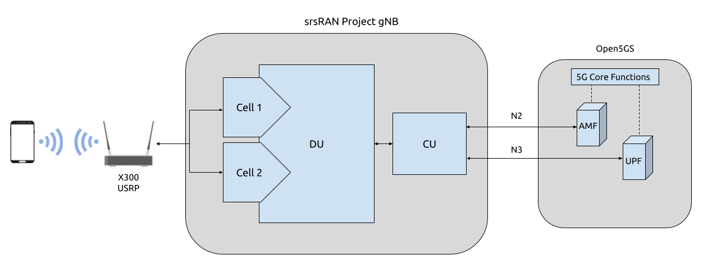

.. srsRAN gNB handover

.. _handover_appnote:

srsRAN gNB Handover
###################

.. note:: 

  srsRAN Project 24.04 or later is required for this use case.  

Overview
********

srsRAN Project 24.04 brings handover capabilities to the code base. Initial handover features allow for Intra-gNB handover, i.e. handover between DU cells connected to the same CU-CP. This allows the UE to move between 
two cells, handover can be triggered manually via the command line or automatically by physically moving the UE. 

In practice this is enabled by creating two DUs within the srsRAN gNB binary, with a cell associated to each DU. This requires a USRP to be used that has two independent RF chains. Each DU will be given an associated 
RF chain to create a 'cell', which the UE then being able move between these.

The following diagram presents the setup architecture:

----- 

Hardware and Software Overview
******************************

For this application note, the following hardware and software are used:

    - PC with Ubuntu 22.04.1 LTS
    - `srsRAN Project <https://github.com/srsran/srsRAN_project>`_ (24.04 or later)
    - `Ettus Research X310 USRP <https://www.ettus.com/all-products/x310-kit/>`_ (connected over 10 GigE)
    - `Open5GS 5G Core <https://open5gs.org/>`_ (running in docker)
    - COTS UE (Fairphone 5)

srsRAN Project
==============

If you have not already done so, install the latest version of srsRAN Project and all of its dependencies. This is outlined in the :ref:`Installation Guide <manual_installation>`. 

X310 USRP
=========

Handover requires the USRP being used to have a dual channel RF-frontend with independent RF chains. As a result, this tutorial uses an X310 as the RF-frontend. 

Not all dual channel USRPs have independent RF chains, this means that, for example, a B200-series USRP is not suitable for this use case. 

Open5GS
=======

For the purpose of this application note, we will use a dockerized Open5GS version provided in srsRAN Project at ``srsgnb/docker`` as the 5G Core.

Open5GS is a C-language Open Source implementation for 5G Core and EPC. The following links will provide you 
with the information needed to download and set-up Open5GS so that it is ready to use with srsRAN: 

    - `GitHub <https://github.com/open5gs/open5gs>`_ 
    - `Quickstart Guide <https://open5gs.org/open5gs/docs/guide/01-quickstart/>`_

COTS UE
=======

A 5G SA capable COTS UE is used for this tutorial, specifically the `Fairphone 5 <https://shop.fairphone.com/fairphone-5#section5>`_. A detailed list of COTS UEs that have been tested with srsRAN Project can be found :ref:`here <cots_ues>`.

For more information on connecting a COTS UEs to srsRAN Project, see the :ref:`full tutorial <COTS_UE_tutorial>`. 

------

Configuration
*************

To configure srsRAN Project to enable handover between cells, the following steps must be taken: 

  - Add the two cells to the ``cells`` list 
  - Update the ``cu_cp`` ``mobility`` options 

A sample configuration file can be downloaded here: :download:`handover_x310.yml <.config/handover_x310.yml>`

A detailed breakdown of the changes to the configuration is as follows. 

A ``cells`` list is created containing two cells. Each is given a different Physical Cell ID, and PRACH root sequence index.

.. code-block:: yaml

  cells:
  -
    # Cell 1
    pci: 1                              # Set the Physcial Cell ID
    prach:
      prach_root_sequence_index: 0        # Set the PRACH root sequence index
  -
    # Cell 2
    pci: 2                              # Set the Physcial Cell ID
    prach:
      prach_root_sequence_index: 64       # Set the PRACH root sequence index

The cells and mobility information must also be added to the ``cu_cp``, under the ``mobility`` options. Firstly the ``cells`` list needs to be updated with each of the cells, the ``report_configs`` must also be updated 
with the necessary information for each of the cells and the conditions for triggering handover. As usual, the ``amf`` is also configured within the ``cu_cp``. 

.. code-block:: yaml

  cu_cp:
    amf:
      addr: 127.0.0.10                                            # The address or hostname of the AMF.
      bind_addr: 127.0.0.1                                        # A local IP that the gNB binds to for traffic from the AMF.
      supported_tracking_areas:                                   # Configure the TA associated with the CU-CP
        - tac: 7                        
          plmn_list:
            - plmn: "90170"
              tai_slice_support_list:
                - sst: 1      
    mobility:
      trigger_handover_from_measurements: true  # Set the CU-CP to trigger handover when neighbor cell measurements arrive
      cells:                                    # List of cells available for handover known to the cu-cp
        - nr_cell_id: 0x19B0                      # Cell ID for cell 1 
          periodic_report_cfg_id: 1               # 
          ncells:                                 # Neighbor cell(s) available for handover
            - nr_cell_id: 0x19B1                    # Cell ID of neighbor cell available for handover
              report_configs: [ 1 ]                 # Report configurations to configure for this neighbor cell
        - nr_cell_id: 0x19B1                      # Cell ID for cell 2
          periodic_report_cfg_id: 1               #
          ncells:                                 # Neighbor cell(s) available for handover 
            - nr_cell_id: 0x19B0                    # Cell ID of neighbor cell available for handover
              report_configs: [ 1 ]                 # Report configurations to configure for this neighbor cell
      report_configs:                           # Sets the report configuration for triggering handover
        - report_cfg_id: 1                        # Report config ID 1 
          report_type: periodical                 # Sets the report type as periodical
          report_interval_ms: 480                 # Sets to report every 480ms 
        - report_cfg_id: 2                        # Report config ID 2
          report_type: event_triggered            # Sets the report type as event triggered 
          a3_report_type: rsrp                    # Sets the A3 report type to RSRP
          a3_offset_db: 3                         # A3 offset in dB used for measurement report trigger. Note the actual value is field value * 0.5 dB
          a3_hysteresis_db: 0                     # A3 hysteresis in dB used for measurement report trigger. Note the actual value is field value * 0.5 dB
          a3_time_to_trigger_ms: 100              # Time in ms during which A3 condition must be met before measurement report trigger
  
A3 events defined as events when intra-frequency handover should be triggered. In the above configuration the conditions under which such an event 
should be triggered are set as when the neighbor cell's RSRP measurement is 1.5 dB better than serving cell. The hysteresis is set to 0, which means that handover 
is triggered when an offset exactly 1.5 dB is met. Once these conditions are met, the UE will handover between the cells. This is true for handover in each direction. 

------

Connecting the COTS UE
**********************

Connecting the COTS UE to the network follows the same steps outline in :ref:`this tutorial <COTS_UE_tutorial>`. For debugging tips related to this, see both the tutorial the `GitHub Discussions <https://github.com/srsran/srsRAN_Project/discussions>`_. 

------

Triggering Handover
*******************

Handover can be triggered in two ways: 

  - Adjusting the Tx gain from the console while the gNB is running
  - Physically moving the UE from left to right away from the primary cell and towards the secondary cell. 

From Console 
============

The Tx gain of each cell can be manually controlled during run time from the console. 

While the gNB is running, you can dynamically adjust the Tx gain using the following command: 

.. code-block:: bash 

  tx_gain <port_id> <gain_dB>

.. note:: 

  The Rx gain can also be set the same way, using ``rx_gain <port_id> <gain_dB>``. To trigger handover it is only necessary to modify the Tx gain.

In this example, the gain of the cell with PCI 1 will be changed (this corresponds to the output of RF0 on the USRP), while the gain of the cell with PCI 2 will be fixed (this corresponds to the output of RF1 on the USRP). Decreasing the gain to 10 dB, will cause 
the UE to move to the PCI 2, increasing the gain back to 30 dB will cause the UE to move back to the cell with PCI 1. 

The gain can be adjusted using the following command: 

.. code-block:: bash 

  tx_gain 0 10

Handover will then be triggered, this can be seen in the console as the PCI of the serving cell changes: 

.. code-block:: bash 

            |--------------------DL---------------------|-------------------------UL------------------------------
   pci rnti | cqi  ri  mcs  brate   ok  nok  (%)  dl_bs | pusch  rsrp  mcs  brate   ok  nok  (%)    bsr    ta  phr
     1 4601 |  15   1   28   2.4M  178    0   0%      0 |  27.4 -40.4   28   214k   50    0   0%      0   0us   28
     1 4601 |  15   1   28   2.5M  180    0   0%      0 |  27.4 -40.6   28   214k   50    0   0%      0   0us   28

  tx_gain 0 10
  Tx gain set to 10.0 dB for port 0.
  
     2 5601 |  15   1   26   1.2M   81    2   2%      0 |  31.2 -35.7   27   100k   24    0   0%      0   0us   27
     2 5601 |  15   1   27   2.4M  175    0   0%   1.5k |  30.8 -37.2   28   214k   50    0   0%      0   0us   27
     2 5601 |  15   1   28   2.4M  177    0   0%      0 |  30.0 -37.4   28   214k   50    0   0%      0   0us   27
     2 5601 |  15   1   28   2.4M  178    0   0%      0 |  30.7 -37.4   28   214k   50    0   0%      0   0us   27

To get the UE to move back to the original cell the following command can be used: 

.. code-block:: bash

  tx_gain 0 30

With the following output confirming the handover back to the original cell: 

.. code-block:: bash 

            |--------------------DL---------------------|-------------------------UL------------------------------
   pci rnti | cqi  ri  mcs  brate   ok  nok  (%)  dl_bs | pusch  rsrp  mcs  brate   ok  nok  (%)    bsr    ta  phr
     2 5601 |  15   1   28   2.5M  185    0   0%      0 |  29.6 -37.9   28   214k   50    0   0%      0   0us   27
     2 5601 |  15   1   28   2.5M  179    0   0%      0 |  28.6 -39.1   28   215k   50    0   0%      0   0us   27
     2 5601 |  15   1   28   2.4M  182    0   0%      0 |  30.4 -37.9   28   214k   50    0   0%      0   0us   27
     2 5601 |  15   1   28   2.5M  185    0   0%   1.5k |  30.6 -37.4   28   214k   50    0   0%      0   0us   27
     2 5601 |  15   1   28   2.5M  178    0   0%      0 |  30.3 -36.3   28   214k   50    0   0%      0   0us   27
  
  tx_gain 0 30
  Tx gain set to 30.0 dB for port 0.
  
            |--------------------DL---------------------|-------------------------UL------------------------------
     1 4602 |  15   1   26   217k   15    2  11%      0 |  10.9 -54.0   24   4.5k    2    3  60%      0   0us   38
     1 4602 |  15   1   27   2.5M  174    0   0%      0 |  16.3 -50.0   23   208k   49   18  26%      0   0us   38
     1 4602 |  15   1   27   2.4M  172    3   1%      0 |  15.0 -51.3   18   214k   50    0   0%      0   0us   38
     1 4602 |  15   1   27   2.4M  173    0   0%   1.5k |  15.1 -51.3   19   214k   50    0   0%      0   0us   38
     1 4602 |  15   1   28   2.5M  183    0   0%      3 |  14.5 -51.7   18   214k   50    0   0%      0   0us   38

This can then be repeated as desired to trigger handover between the cells when ever it is required based on the needs of your use case. 

Physically
==========

The following image shows the UE moving up and down along the Y-axis, this causes the UE to handover between cells as the signal strength of the serving cell decreases as the UE moves away from it. The inverse happens to the neighbor cell, 
the signal strength increase as the UE moves into its serving area. This triggers an A3 event and causes the UE to handover between cells once the conditions defined in the configuration file are met. In this case, once the RSRP of the 
neighbor cell has a 1.5 dB offset to the current serving cell.  

Physically, this translates to moving the UE left-to-right between the antennas of the USRP, where PCI 1 corresponds to the cell associated with RF0 and PCI 2 corresponds to the cell associated with RF1. 

.. image:: .imgs/UE.gif
  :align: center
  :scale: 80%

As handover is triggered, it can be seen in the console as the PCI of the serving cell changing: 

.. code-block:: bash 

          |--------------------DL---------------------|-------------------------UL------------------------------
 pci rnti | cqi  ri  mcs  brate   ok  nok  (%)  dl_bs | pusch  rsrp  mcs  brate   ok  nok  (%)    bsr    ta  phr
   1 4602 |  15   1   28    44M 1400    0   0%  6.14M |  32.5 -16.3   28   214k   50    0   0%      0   0us   25
   1 4602 |  15   1   28    44M 1400    0   0%  6.14M |  31.9 -16.2   28   214k   50    0   0%      0   0us   25
   1 4602 |  15   1   28    44M 1371   29   2%  6.14M |  31.8 -15.6   28   214k   50    0   0%      0   0us   18
   2 5603 |  15   1   24    30M 1178   26   2%  6.15M |  33.0 -11.8   27   179k   43    0   0%      0   0us   23
   2 5603 |  15   1   26    41M 1400    0   0%  6.14M |  33.1 -11.9   28   214k   50    0   0%      0   0us   23
   2 5603 |  15   1   28    44M 1400    0   0%  6.14M |  32.6 -12.0   28   214k   50    0   0%      0   0us   23

Moving the UE back across to the area covered by Cell 1 (PCI 1), the following can be seen in the console output: 

.. code-block:: bash 

          |--------------------DL---------------------|-------------------------UL------------------------------
 pci rnti | cqi  ri  mcs  brate   ok  nok  (%)  dl_bs | pusch  rsrp  mcs  brate   ok  nok  (%)    bsr    ta  phr
   2 5603 |  15   1   28    44M 1400    0   0%  6.14M |  32.8  -9.0   28   214k   50    0   0%      0   0us   20
   2 5603 |  15   1   28    44M 1400    0   0%  6.14M |  33.3  -9.5   28   214k   50    0   0%      0   0us   20
   2 5603 |  15   1   28    44M 1400    0   0%  6.14M |  32.5  -8.9   28   214k   50    0   0%      0   0us   19
   1 4604 |  15   1   22   2.7M  128   41  24%  2.21M |  29.4  -7.9   25    18k    5    0   0%      0   0us   17
   1 4604 |  15   1   21    29M 1400    0   0%  6.15M |  34.6 -14.6   28   215k   51    0   0%      0   0us   24
   1 4604 |  15   1   24    36M 1400    0   0%  6.14M |  34.5 -14.5   28   214k   50    0   0%      0   0us   24

On some occasions, the UE may "ping-pong" between cells, if it sits in the area where the cell-coverage overlaps, this behavior is normal and can be rectified by moving the UE further into the area covered by either cell. This may also be mitigated by 
configuring a hysteresis value. 

Grafana Output 
==============

Using the :ref:`Grafana GUI <grafana_gui>` the handover process, and it's impact on certain metrics, can be clearly observed. The following image shows an example scenario where a UE is moving between two cells. In this scenario the UE is being physically moved 
between the cells to trigger handover. 

.. image:: .imgs/grafana.png
  :align: center

In the above image the traffic is being generated between the UE and gNB using iPerf. 

-----

Limitations
***********

 - Currently only intra-cell intra-frequency handover is supported. 
 - Intra-gNB handover is only supported with an X or N-series USRP. 