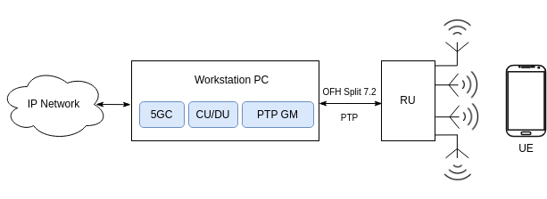

.. _hw_kit:

E2E O-RAN Tesbed with srsRAN
############################

*This information is correct as of December 2024.*

.. note::

  To purchase preconfigured testbed kits (srsKIT), please contact SRS at `info@srs.io <mailto:info@srs.io>`_.

Introduction
************

This tutorial provides a detailed guide on setting up an end-to-end O-RAN network for testing, research and development based on the srsRAN CU+DU solution.
A complete set of commercial-of-the-shelf (COTS) hardware equipment is proposed, alongside the related software configurations. The proposed solution
targets the following configuration:

  - Single cell split 7.2 deployment.
  - Up to 100 MHz bandwidth.
  - Up to 4T4R with MIMO support.
  - Band N77 (3.3-4.2GHz), N78 (3.3-3.8GHz) or N79 (4.4-5GHz).

This set-up includes hardware components we recommend for a broad range of use cases. However, it is important to note that this configuration may not be the
optimal solution for every scenario. Before investing in any equipment, carefully evaluate the specific needs and requirements of your use case. The srsRAN
project is compatible with x86, ARM, and AMD architectures and has been successfully tested with a wide variety of O-RUs. The equipment outlined here represents
just one of many possible configurations and is provided as a general guide to help users get started with a systems capable of E2E testing in a split 7.2 configuration.

Testbed setup
*************

The proposed test setup implements an end-to-end O-RAN network in a 7.2 split configuration, with the following components:

  - A single compact workstation PC that hosts:

     - CU + DU (srsRAN).
     - 5G core network (e.g., Open5gs).
     - Built-in PTP GM (with optional GPS support).

  - COTS 7.2 O-RU (use of OFH interface and LLS-C1 PTP configuration).

  - COTS 5G UE.

Hardware components
===================

There are many possible hardware options to implement the proposed O-RAN test setup. The sections below outline a complete hardware package that will
enable users to easily deploy a performant end-to-end O-RAN network, with the srsRAN CU+DU at its core.

Workstation PC
--------------

The table below lists the components to build a performant yet compact workstation PC, that can be easily transported.

.. list-table::
   :width: 70%
   :widths: 25 25 50
   :header-rows: 1

   * - Component
     - Part
     - Specifications
   * - Motherboard
     - `Gigabyte B650M DS3H <https://www.gigabyte.com/uk/Motherboard/B650M-DS3H-rev-13#kf>`_
     - AM5 Micro-ATX, support for DDR5 and PCIe 4.0
   * - CPU
     - `AMD Ryzen 9 7900 <https://www.amd.com/en/products/processors/desktops/ryzen/7000-series/amd-ryzen-9-7900.html>`_
     - 12 cores, 3.7GHz, includes AMD Wraith Prism cooler
   * - RAM
     - `Kingston Fury Beast 32GB <https://www.kingston.com/en/memory/gaming/kingston-fury-beast-ddr5-rgb-memory>`_
     - 2x 16GB, DDR5 6GHz, CL36
   * - SSD
     - `Samsung 980 1TB <https://www.samsung.com/uk/memory-storage/nvme-ssd/980-1tb-nvme-pcie-gen-3-mz-v8v1t0bw/>`_
     - PCIe 3.0, 3500 MB/s read, 3000 MB/s write
   * - PC case
     - `NOX Hummer Vault <https://www.nox-xtreme.com/en/chassis/hummer-vault>`_
     - 185 x 303 x 391mm, Micro-ATX, 5.02Kg
   * - PC case fans
     - 3x `Noctua NF-A12x15 <https://noctua.at/en/nf-a12x15-flx>`_
     - 120 x 120 x 15mm, 1850rpm, 23.9dB(A)
   * - PSU
     - `NZXT C750 Gold <https://nzxt.com/en-GB/product/c750>`_
     - 750W, 150 x 150 x 86mm
   * - High-speed NIC
     - `Intel E810XXVDA4TGG1 99ADGH <https://www.intel.com/content/www/us/en/content-details/641626/intel-ethernet-network-adapter-e810-xxvda4t-product-brief.html>`_
     - 4x SFP28 (25/10GE), PTP/SyncE (high-precision XO), optional GNSS

.. note::

 The proposed NIC has been especifically chosen given its proven capacity to reliably act as PTP Grandmaster. We strongly recommend users to study
 its `user guide <https://www.intel.com/content/www/us/en/content-details/646265/intel-ethernet-network-adapter-e810-xxvda4t-user-guide.html>`_.

O-RU
----

While a wide range of O-RUs are supported by srsRAN, two different options are proposed by taking into account both ease of purchase (low volume)
and the target deployment scenario.

.. list-table:: Indoor deployment
   :width: 70%
   :widths: 10 10 80
   :header-rows: 1

   * - Component
     - Part
     - Specifications
   * - Indoor RU
     - `Benetel RAN550 <https://benetel.com/ran550/>`_
     - 4T4R with integrated antennas and PSU, up to +24 dBm/port, 100 MHz bandwidth, several band options

.. list-table:: Outdoor deployment
   :width: 70%
   :widths: 25 25 50
   :header-rows: 1

   * - Component
     - Part
     - Specifications
   * - Outdoor RU
     - `Benetel RAN650 <https://benetel.com/ran650/>`_
     - 4T4R, up to +35 dBm/port, 100 MHz bandwidth, several band options
   * - 4x4 RF antenna
     - `Panorama DWMM4-6-60-5 SP <https://panorama-antennas.com/product/dwmm4g-6-60-4x4-mimo-4g-5g-antenna/>`_
     - 4G/5G, SMA, 6dB @ 3400-4200 MHz, 221 x 371 x 40 mm
   * - Outdoor PSU
     - `MeanWell GST220A48-R7B <https://www.meanwell-web.com/en-gb/ac-dc-industrial-desktop-adaptor-with-pfc-output-gst220a48--r7b/>`_
     - 221W, 48V, 4.6A, -30ºC to +70C

5G UE
-----

As in the RU case, the srsRAN CU+DU has been tested with many different COTS UEs. For the sake of completeness of this example, we are
proposing one of the tested models given its wide availability and pricing.

.. list-table::
   :width: 40%
   :widths: 50 50
   :header-rows: 1

   * - UE model
     - Supported 5G Bands
   * - `Samsung A25 <https://www.samsung.com/uk/smartphones/galaxy-a/galaxy-a25-5g-blue-black-128gb-sm-a256bzkdeub/>`_
     - 1, 3, 5, 7, 8, 26, 28, 40, 41, 66, 77, 78

A larger list of tested UEs can be found :ref:`here <cots_ues>`.

Auxiliary elements
------------------

A few other auxiliary components are required to complete the end-to-end setup. Whereas most of them will already be found in laboratory
environments, we list them here for the sake of completeness.

.. list-table::
   :width: 70%
   :widths: 25 25 50
   :header-rows: 1

   * - Component
     - Part
     - Specifications
   * - Optic fiber cables (PC-RU interconnection)
     - `Elfcam LC/UPC to LC/UPC OM4 Fiber Optic Cable <https://elfcams.com/en/product/1410>`_
     - 2.0 mm, LSZH, SFP+/QSFP+, different lengths
   * - SFP Adapters
     - 2x `10Gtek Multimode Transciever 10GBase-SR LC <https://www.10gtek.com/10g-sfp+>`_
     - 850nm, MMF, <300m
   * - Programmable SIM cards
     - `sysmoISIM-SJA2 USIM Card <https://sysmocom.de/products/sim/sysmousim/index.html>`_
     - up-to-date with 3GPP Rel. 16, 10x pack

Software
========

The following software components are utilized in the proposed end-to-end O-RAN test setup:

.. list-table::
   :width: 40%
   :widths: 50 50
   :header-rows: 1

   * - Component
     - Version
   * - `srsRAN Project <https://github.com/srsran/srsRAN_Project>`_
     - 24.10
   * - `Open5gs <https://github.com/open5gs>`_
     - 2.7.2
   * - `LinuxPTP <https://github.com/richardcochran/linuxptp>`_
     - 4.1
   * - `ethernet-linux-ice <https://github.com/intel/ethernet-linux-ice>`_
     - 1.12.7 (firmware v2.40)
   * - `ethernet-linux-iavf <https://github.com/intel/ethernet-linux-iavf>`_
     - 4.9.1

Configuration
*************

This section offers a variety of configuration files tailored to different end-to-end O-RAN
networking scenarios. These files are designed to streamline the deployment process, enabling
you to set up a fully functional and high-performance system more quickly while minimizing
the risk of human error.

PTP Grandmaster
===============

A reliable PTP Grandmaster configuration for LLS-C1 mode, validated with various RU makes, can be downloaded here:

  * :download:`LLS-C1 PTP <.config/srs-ptp-gm.cfg>`

To launch the PTP-related services use the following commands:

.. code-block:: bash

   /usr/local/ptp4l -i nic_interface -m -f /config_files/path/srskit-ptp-gm.cfg
   /usr/local/phc2sys -s nic_interface -w -m -f /config_files/path/srskit-ptp-gm.cfg

Demanding DL requirements
=========================

This configuration targets the following specifications:

- Single cell deployment for a system with high DL requirements.
- 100 MHz bandwidth.
- 4T2R with MIMO support.
- TDD pattern 7D1S2U.
- Benetel RAN550 (FW v1.2.2), band N78.

The srsRAN CU+DU and O-RU configuration files can be downloaded here:

  * :download:`srsRAN CU+DU <.config/gnb_config_100MHz_4T2R_7D1S2U.yml>`
  * :download:`RAN550 RU <.config/ru_config_ran550_100MHz_4T2R_7D1S2U.cfg>`

Demanding UL requirements
=========================

This configuration targets the following specifications:

  - Single cell deployment for a system with high UL requirements.
  - 100 MHz bandwidth.
  - 4T2R with MIMO support.
  - TDD pattern 3D1S6U.
  - Benetel RAN550 (FW v1.2.2), band N78.

The srsRAN CU+DU and O-RU configuration files can be downloaded here:

  * :download:`srsRAN CU+DU <.config/gnb_config_100MHz_4T2R_3D1S6U.yml>`
  * :download:`RAN550 RU <.config/ru_config_ran550_100MHz_4T2R_3D1S6U.cfg>`

Low-latency with demanding UL requirements
==========================================

This configuration targets the following specifications:

- Single cell deployment for a system with low-latency, yet high UL requirements.
- 100 MHz bandwidth.
- 4T2R with MIMO support.
- TDD pattern 1D1S3U.
- Benetel RAN550 (FW v1.2.2), band N78.

The srsRAN CU+DU and O-RU configuration files can be downloaded here:

  * :download:`srsRAN CU+DU <.config/gnb_config_100MHz_4T2R_1D1S3U.yml>`
  * :download:`RAN550 RU <.config/ru_config_ran550_100MHz_4T2R_1D1S3U.cfg>`
