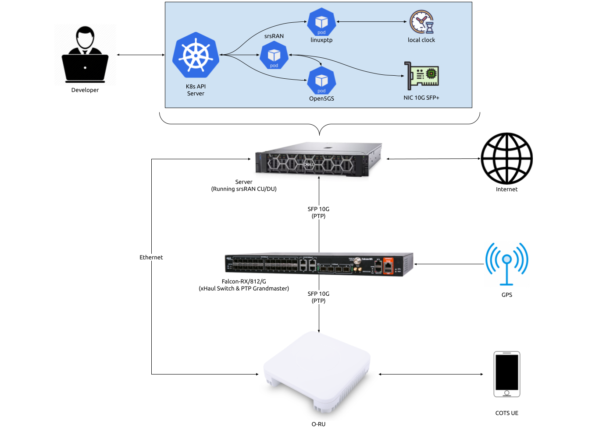

.. _k8s: 

srsRAN gNB on Kubernetes
########################

Introduction
************

This tutorial outlines the steps required to launch the srsRAN CU/DU with `Kubernetes <https://kubernetes.io/>`_. This is a useful tool for use-cases that require users to deploy and manage networks over a prolonged period, 
with high levels of guaranteed service ability and enhanced fault tolerance. 

In short, Kubernetes can be described as the following: 

   *When it comes to managing test networks, the adoption of Kubernetes
   is pivotal for streamlined and efficient operations. Kubernetes provides
   a unified platform for orchestrating diverse functions within the network,
   optimizing resource utilization, and automating scaling based on demand. Its
   inherent capability to enhance fault tolerance ensures consistent service availability,
   while the ease of continuous deployment supports rapid innovation. Kubernetes also excels
   in simplifying the deployment process across various environments, fostering adaptability.
   In essence, Kubernetes emerges as a practical solution, offering a cohesive and scalable 
   framework for effective network function management.*

Such deployments may not be suited to more research and development focused use-cases that require fine-tuning of configuration files and development of source-code. Iterative development and testing is more suited to 
"bare metal" deployments. 

Further Reading
================

We recommend unexperienced users read the following two articles before starting with this tutorial:

   - `Getting started with Kubernetes <https://kubernetes.io/docs/concepts/overview/what-is-kubernetes/>`_
   - `Getting started with Helm <https://helm.sh/docs/intro/>`_

-----

Setup Considerations
********************

This tutorial uses the following hardware:

   - Server (Running srsRAN Project CU/DU)
      
      - CPU: AMD Ryzen 7 5700G
      - MEM: 64GB
      - NIC: Intel Corporation 82599ES 10-Gigabit
      - OS: Ubuntu 22.04 (5.15.0-1037-realtime)
   
   - Falcon-RX/812/G xHaul Switch (w/ PTP grandmaster)
   - Foxconn RPQN-7800E (v3.1.13q.551p1) 
   - COTS UE

This tutorial requires a functional Kubernetes cluster v1.24 or newer. We are
using Ubuntu 22.04 on the worker node. If you chose to use another operating 
system, please refer to the operating system specific documentation for the 
installation of Kubernetes and configuration of the system. As previously stated, this 
tutorial requires a basic understanding of Kubernetes and Helm.

CU/DU
=====

The CU/DU is provided by the srsRAN Project gNB. The Open Fronthaul
(OFH) Library provides the necessary interface between the DU and the
RU. The DU is connected to the Falcon switch via SFP+ fiber cable.

RU
==

The Foxconn RPQN-7800E RU is used as the RU in this setup. This is a
Split 7.2x indoor O-RU. The RU is connected to the Falcon-RX via SFP+
fiber cable through the main fronthaul interface.

5G Core
=======

For this tutorial we use the Open5GS 5G Core.

Open5GS is a C-language open-source implementation for 5G Core and EPC.
The following links will provide you with the information needed to
download and setup Open5GS so that it is ready to use with srsRAN:

   - `Open5GS GitHub <https://github.com/open5gs/open5gs>`_
   - `Open5GS Quickstart Guide <https://open5gs.org/open5gs/docs/guide/01-quickstart/>`_

Clocking & Synchronization
==========================

The split 7.2 interface requires tight timing synchronization between
the DU and RU. O-RAN WG 4 has defined various synchronization methods
for use with Open Fronthaul. These are outlined in
O-RAN.WG4.CUS.0-R003-v11.00 Section 11.

In this setup we use LLS-C3. The LLS-C3 configuration enables the
distribution of network timing between central sites and remote sites
from PRTC/T-GM to RU. In simpler terms, it allows the synchronization of
one or more PRTC/T-GM devices (serving as PTP masters) in the
fronthaul network to transmit network timing signals to DU and RU
components as seen in the figure above. In our setup the Falcon switch
is acting as the PTP grandmaster (which is synchronized via GPS),
providing timing to the RU and the DU. These are connected to the SFP+
10G ports on the switch via Ethernet.

Switch
------

The Falcon-RX/812/G switch is a 5G xHaul timing-aware O-RAN switch & PTP
grandmaster. This is used to provide timing synchronization to both the
DU and RU.

----------

Configuration
*************

.. _cudu-1:

Kubernetes Worker Node
======================

In this section we will cover the configuration of the Kubernetes worker
node. 

.. nic_configuration: 

NIC Configuration
-----------------

The NIC used for OFH traffic needs to support jumbo frames. In our
example the NIC port has the name ``eth0``. To configure the ``MTU`` to ``9600``, use
the following command:

.. code-block:: bash 

   ifconfig eth0 mtu 9600 up

Depending on the network configuration you we advice to use DPDK. For 2x2
MIMO DPDK is not required, while for 4x4 MIMO DPDK is recommended. This
tutorial will cover configuration for a 2x2 MIMO set up.

A tutorial outlining the use of DPDK with srsRAN will be available soon. 

PTP Grandmaster
=================

In this tutorial we will be using the Falcon-RX/812/G switch as the PTP
grandmaster in a LLS-C3 configuration. The switch is synchronized via GPS. 
The switch is connected to the DU and RU via SFP+ fiber cable.

For more information on configuring the Falcon xHaul switch, 
see :ref:`this section <falcon_switch>` of the RU tutorial.

Helm Charts
===========

Install the srsRAN Helm repositories with the following command:

.. code-block:: bash

   helm repo add srsran https://srsran.github.io/srsRAN_Project_helm/

To deploy Open5GS on Kubernetes we use the Helm charts from the `Openverso Project <https://github.com/Gradiant/openverso-charts>`_.
Install the Openverso Helm repository with the following command:

.. code-block:: bash

   helm repo add openverso https://gradiant.github.io/openverso-charts/

LinuxPTP Helm Chart
-------------------

Download and adjust the LinuxPTP ``values.yaml`` file to configure the deployment based on your cluster. For more information 
on the explicit configuration of the LinuxPTP container, have look at the `LinuxPTP Documentation <https://linuxptp.nwtime.org/documentation/default/>`_.

.. code-block:: bash

   wget https://raw.githubusercontent.com/srsran/srsRAN_Project_helm/main/charts/linuxptp/values.yaml

In this tutorial we will be using the ``G.8275.1`` profile with the default configuration of LinuxPTP. Therefore, we adjust the
config section of the ``values.yaml`` file as follows:

.. code-block:: yaml

   config:
      dataset_comparison: "G.8275.x"
      G.8275.defaultDS.localPriority: "128"
      maxStepsRemoved: "255"
      logAnnounceInterval: "-3"
      logSyncInterval: "-4"
      logMinDelayReqInterval: "-4"
      serverOnly: "0"
      G.8275.portDS.localPriority: "128"
      ptp_dst_mac: "01:80:C2:00:00:0E"
      network_transport: "L2"
      domainNumber: "24"

Apart from that, we need to set the ``interface_name`` parameter to the interface name of the NIC used for the PTP traffic.

For more information on the parameters of the ``values.yaml`` file refer to ``charts/linuxptp/README.md`` in `this repository <https://github.com/srsran/srsRAN_Project_helm/tree/main/charts/linuxptp>`_.

Docker images are available on `Docker Hub <https://hub.docker.com/u/softwareradiosystems>`_. The Dockerfile for the LinuxPTP 
container can be found in ``images/linuxptp`` in `this repository <https://github.com/srsran/srsRAN_Project_helm/tree/main/images>`_.

srsRAN Project Helm Chart
-------------------------

Download and adjust the srsRAN Project ``values.yaml`` file to configure the deployment based on your cluster. For 
more information on the explicit configuration of the srsRAN CU/DU for various RUs, see :ref:`this tutorial <oran_ru_tutorial>`.

.. code-block:: bash

   wget https://raw.githubusercontent.com/srsran/srsRAN_Project_helm/main/charts/srsran-project/values.yaml

One of the necessary parameters to configure are ``bind_addr`` and ``amf_addr``. ``bind_addr`` is the IP address of the Kubernetes worker node.
The ``amf_addr`` is the IP address of the Open5GS AMF. Obtain the IP address of the Kubernetes worker node with the following command:

.. code-block:: bash

   kubectl get nodes -o wide

You should see an output similar to the following:

.. code-block:: bash

   $ kubectl get nodes -o wide
   NAME        STATUS   ROLES           AGE   VERSION   INTERNAL-IP   EXTERNAL-IP   OS-IMAGE             KERNEL-VERSION         CONTAINER-RUNTIME
   preskit-1   Ready    control-plane   52d   v1.26.5   10.12.1.223   <none>        Ubuntu 22.04.3 LTS   5.15.0-1032-realtime   containerd://1.7.1

Set ``bind_addr`` to the ``INTERNAL-IP`` value of the Kubernetes worker node where you want to deploy the srsRAN Project CU/DU. Obtain the IP 
address of the Open5GS AMF with the following command:

.. code-block:: bash

   kubectl get pods -A -o wide

You should see an output similar to the following:

.. code-block:: bash

   $ kubectl get pods -A -o wide 
   NAME                                         READY   STATUS    RESTARTS      AGE   IP              NODE        NOMINATED NODE   READINESS GATES
   open5gs-amf-9d5788cdc-qhzkb                  1/1     Running   0             18m   10.233.124.24   preskit-1   <none>           <none>
   open5gs-ausf-66547fc8bd-4p4r5                1/1     Running   0             18m   10.233.124.51   preskit-1   <none>           <none>
   open5gs-bsf-59966bf9cb-rz262                 1/1     Running   0             18m   10.233.124.59   preskit-1   <none>           <none>
   open5gs-mongodb-749b78fd9f-v96gg             1/1     Running   0             18m   10.233.124.4    preskit-1   <none>           <none>
   open5gs-nrf-7995d7c5bf-rxh7s                 1/1     Running   0             18m   10.233.124.15   preskit-1   <none>           <none>
   open5gs-nssf-86c9f9d5cd-97lr6                1/1     Running   0             18m   10.233.124.17   preskit-1   <none>           <none>
   open5gs-pcf-74c8468bcc-jwn7s                 1/1     Running   2 (18m ago)   18m   10.233.124.26   preskit-1   <none>           <none>
   open5gs-populate-6444478f56-kb8cd            1/1     Running   0             18m   10.233.124.55   preskit-1   <none>           <none>
   open5gs-smf-779bc766ff-gcps9                 1/1     Running   0             18m   10.233.124.11   preskit-1   <none>           <none>
   open5gs-udm-5ffc6fc456-9g9n2                 1/1     Running   0             18m   10.233.124.30   preskit-1   <none>           <none>
   open5gs-udr-7b5499cd89-2kb8l                 1/1     Running   2 (18m ago)   18m   10.233.124.58   preskit-1   <none>           <none>
   open5gs-upf-796655fbcc-5sd6s                 1/1     Running   0             18m   10.233.124.19   preskit-1   <none>           <none>
   open5gs-webui-c6c949568-fp2r9                1/1     Running   0             18m   10.233.124.1    preskit-1   <none>           <none>

Search for a Pod called ``open5gs-amf-*`` and set ``amf_addr`` to the ``IP`` value of the Pod.

For more information on the configuration of the CU/DU please refer to the `srsRAN gNB with COTS UEs Tutorial <https://docs.srsran.com/projects/project/en/latest/tutorials/source/cotsUE/source/index.html#setup-considerations>`_.
For more information on the parameters of the ``values.yaml`` file refer to ``charts/srsran-project/README.md`` in `this repository <https://github.com/srsran/srsRAN_Project_helm/tree/main/charts/srsran-project>`_.

Docker images are available on `Docker Hub <https://hub.docker.com/u/softwareradiosystems>`_. Dockerfiles for the 
srsRAN Project container can be found in ``images/srsran-project`` in `this repository <https://github.com/srsran/srsRAN_Project_helm/tree/main/images>`_.

A detailed breakdown on connecting the CU/DU to open5GS can be found in :ref:`this tutorial <open5gs>`. 

Core
----

Download and adjust the following Open5GS ``values.yaml`` file to configure the deployment based on your needs.

.. code-block:: bash

   wget https://gradiant.github.io/openverso-charts/docs/open5gs-ueransim-gnb/5gSA-values.yaml

For information on the initCommands section to insert subscribers please refer to `this file <https://github.com/open5gs/open5gs/blob/main/misc/db/open5gs-dbctl>`_. 
For the Open5GS configuration, please refer to the `Open5GS Documentation <https://open5gs.org/open5gs/docs/>`_.

-----

Initializing the Network
************************

.. _ru-1: 

RU
==

Bring up the RU and ensure it is running correctly before attempting to connect the DU. 

.. _core-1:

Core
=====

By default the MongoDB helm chart involved in this deployment uses persistent volumes through
a `persistent volume claim <https://kubernetes.io/docs/concepts/storage/persistent-volumes/>`_.
In this example we will deploy Open5GS without persistent storage for the sake of simplicity. That
means that the user database will be reset when you restart the MongoDB container. If you want
to have persistent storage for MongoDB you need to configure a PV provisioner like `OpenEBS <https://openebs.io>`_.

Obtain and configure the ``values.yaml`` file like described above. After that, deploy Open5GS with the following command:

.. code-block:: bash

   helm install open5gs openverso/open5gs --version 2.0.8 --values=5gSA-values.yaml -n open5gs --create-namespace --set mongodb.persistence.enabled=false

You should see the following output: 

.. code-block:: bash

   NAME: open5gs
   LAST DEPLOYED: Tue Nov 21 16:55:12 2023
   NAMESPACE: open5gs
   STATUS: deployed
   REVISION: 1
   TEST SUITE: None

Wait until all Pods are running. You can check the status with the following command:

.. code-block:: bash

   kubectl get pods -n open5gs

Once all components are started you can edit the subscribers via the webui. For that, you need
to forward port ``3000`` of the ``open5gs-webui`` service to your local machine:

.. code-block:: bash

   kubectl port-forward svc/open5gs-webui 3000:3000 -n open5gs

You should see the following output:

.. code-block:: bash

   Forwarding from 127.0.0.1:3000 -> 3000
   Forwarding from [::1]:3000 -> 3000

Don't close the shell and open your browser at `http://localhost:3000 <http://localhost:3000>`_. ``Username: admin,  Password: 1423``
Once you are logged in you can edit the subscribers.

DU
==

PTP
---

Obtain and configure the ``values.yaml`` file like described above. After that, deploy LinuxPTP container with the following command:

.. code-block:: bash

   helm install linuxptp srsran/linuxptp --values=values.yaml -n ptp --create-namespace
   
You should see the following output: 

.. code-block:: bash

   NAME: linuxptp
   LAST DEPLOYED: Tue Nov 21 16:53:36 2023
   NAMESPACE: ptp
   STATUS: deployed
   REVISION: 1
   TEST SUITE: None

To verify that the deployment is working properly we need to get the name of
our LinuxPTP Pod. Therefore, use ``kubectl get pods -A`` to list all Pods
in the cluster. You should see an output similar to the following:

.. code-block:: bash
   
   NAMESPACE     NAME                                        READY   STATUS    RESTARTS       AGE
   ptp           linuxptp-854f797f64-vnmdt                   1/1     Running   0              23d
   kube-system   calico-kube-controllers-6dfcdfb99-xmdmx     1/1     Running   0              22d
   kube-system   calico-node-292sr                           1/1     Running   0              23d
   kube-system   coredns-645b46f4b6-lggfs                    1/1     Running   0              22d
   kube-system   dns-autoscaler-756ff885f8-7d6hr             1/1     Running   0              22d
   kube-system   kube-apiserver-preskit-1                    1/1     Running   0              22d
   kube-system   kube-controller-manager-preskit-1           1/1     Running   0              22d
   kube-system   kube-proxy-5mbbm                            1/1     Running   0              23d
   kube-system   kube-scheduler-preskit-1                    1/1     Running   0              22d
   kube-system   nodelocaldns-bfx77                          1/1     Running   0              23d

The name of the Pod in our example is ``linuxptp-854f797f64-vnmdt``. Now we
can get logs from that Pod with this command:

.. code-block:: bash

   kubectl logs linuxptp-854f797f64-vnmdt -n srsran

You should see an output similar to the following:

.. code-block:: bash

   ptp4l[1328454.803]: rms   15 max   24 freq  -3622 +/-  19 delay   135 +/-   1
   phc2sys[1328454.902]: CLOCK_REALTIME phc offset        -4 s2 freq   +2045 delay    431
   phc2sys[1328455.027]: CLOCK_REALTIME phc offset        -7 s2 freq   +2040 delay    429
   phc2sys[1328455.152]: CLOCK_REALTIME phc offset        11 s2 freq   +2056 delay    437
   phc2sys[1328455.278]: CLOCK_REALTIME phc offset        -1 s2 freq   +2048 delay    431
   phc2sys[1328455.403]: CLOCK_REALTIME phc offset        -1 s2 freq   +2047 delay    431
   phc2sys[1328455.528]: CLOCK_REALTIME phc offset         6 s2 freq   +2054 delay    429
   phc2sys[1328455.653]: CLOCK_REALTIME phc offset       -11 s2 freq   +2039 delay    430
   phc2sys[1328455.778]: CLOCK_REALTIME phc offset        -9 s2 freq   +2037 delay    422
   ptp4l[1328455.803]: rms   17 max   32 freq  -3622 +/-  21 delay   135 +/-   2
   phc2sys[1328455.903]: CLOCK_REALTIME phc offset        -7 s2 freq   +2037 delay    430
   phc2sys[1328456.028]: CLOCK_REALTIME phc offset         7 s2 freq   +2049 delay    430
   phc2sys[1328456.154]: CLOCK_REALTIME phc offset        -6 s2 freq   +2038 delay    431
   phc2sys[1328456.279]: CLOCK_REALTIME phc offset        11 s2 freq   +2053 delay    430
   phc2sys[1328456.404]: CLOCK_REALTIME phc offset        -1 s2 freq   +2044 delay    431
   phc2sys[1328456.529]: CLOCK_REALTIME phc offset         1 s2 freq   +2046 delay    430
   phc2sys[1328456.654]: CLOCK_REALTIME phc offset         1 s2 freq   +2046 delay    430
   phc2sys[1328456.779]: CLOCK_REALTIME phc offset         2 s2 freq   +2048 delay    430

CU/DU
-----

Obtain and configure the ``values.yaml`` file like described above. PTP sync needs to be established 
on RU and DU, and the Kubernetes worker node needs to be configured before the deployment. 
Furthermore, the 5G core must be up and running.

Deploy the srsRAN Project with the following commands:

.. code-block:: bash

   helm install srsran-project srsran/srsran-cu-du --values=values.yaml -n srsran --create-namespace

You should see the following output: 

.. code-block:: bash

   NAME: srsran-project
   LAST DEPLOYED: Tue Nov 21 16:54:12 2023
   NAMESPACE: default
   STATUS: deployed
   REVISION: 1
   TEST SUITE: None

To verify that the srsRAN Project Pod is working properly you can extract logs using the following steps: 

   1. First get the name of the Pod

      .. code-block:: bash
      
         kubectl get pods -A

      You should see an output similar to the following:

      .. code-block:: bash
   
         NAMESPACE     NAME                                        READY   STATUS    RESTARTS       AGE
         default       srsran-project-l647c                        1/1     Running   0              23d
         kube-system   calico-kube-controllers-6dfcdfb99-xmdmx     1/1     Running   0              22d
         kube-system   calico-node-292sr                           1/1     Running   0              23d
         kube-system   coredns-645b46f4b6-lggfs                    1/1     Running   0              22d
         kube-system   dns-autoscaler-756ff885f8-7d6hr             1/1     Running   0              22d
         kube-system   kube-apiserver-preskit-1                    1/1     Running   0              22d
         kube-system   kube-controller-manager-preskit-1           1/1     Running   0              22d
         kube-system   kube-proxy-5mbbm                            1/1     Running   0              23d
         kube-system   kube-scheduler-preskit-1                    1/1     Running   0              22d
         kube-system   nodelocaldns-bfx77                          1/1     Running   0              23d

   2. Find the Pod, in this example it is ``srsran-project-l647c``. The logs can now be extracted with: 

      .. code-block:: bash
      
         kubectl logs srsran-project-l647c -n srsran

      You should see an output similar to the following:

      .. code-block:: bash

         EAL: Detected CPU lcores: 16
         EAL: Detected NUMA nodes: 1
         EAL: Detected shared linkage of DPDK
         EAL: Multi-process socket /var/run/dpdk/rte/mp_socket
         EAL: Selected IOVA mode 'PA'
         EAL: VFIO support initialized
         EAL: Probe PCI driver: net_ice (8086:159b) device: 0000:01:00.1 (socket 0)
         ice_load_pkg(): failed to search file path

         ice_dev_init(): Failed to load the DDP package,Entering Safe Mode
         TELEMETRY: No legacy callbacks, legacy socket not created

         --== srsRAN gNB (commit 374200dee) ==--

         Connecting to AMF on 10.44.50.221:38412
         Initializing Open Fronthaul Interface sector=0: ul_comp=[BFP,9], dl_comp=[BFP,9], prach_comp=[BFP,9] prach_cp_enabled=true, downlink_broadcast=false.
         ice_init_rss(): RSS is not supported in safe mode

         ice_set_rx_function(): Using AVX512 Vector Scattered Rx (port 0).
         ice_set_tx_function(): Using AVX512 Vector Tx (port 0).
         ice_vsi_config_outer_vlan_stripping(): Single VLAN mode (SVM) does not support qinq
         Cell pci=1, bw=40 MHz, dl_arfcn=649980 (n78), dl_freq=3749.7 MHz, dl_ssb_arfcn=649248, ul_freq=3749.7 MHz

         ==== gNodeB started ===
         Type <t> to view trace

-----

Connecting to the Network
*************************

Once the network has been configured and is running, connecting the UE to the network is the same as in a bare-metal set-up. 

The UE does not require any further modification or configuration outside of the normally required steps. You can follow the 
`COTS UE tutorial <COTS_UE_tutorial>`_ to learn how to connect a COTS UE to the network. From the UEs perspective, it does not matter if an RU or 
USRP is being used as the frontend or if the CU/DU and 5GC are running on bare-metal or in Kubernetes containers.

-----

Supported O-RUs
************************

For more information on supported O-RUs, see :ref:`this section <supported_rus>` of the RU tutorial.
