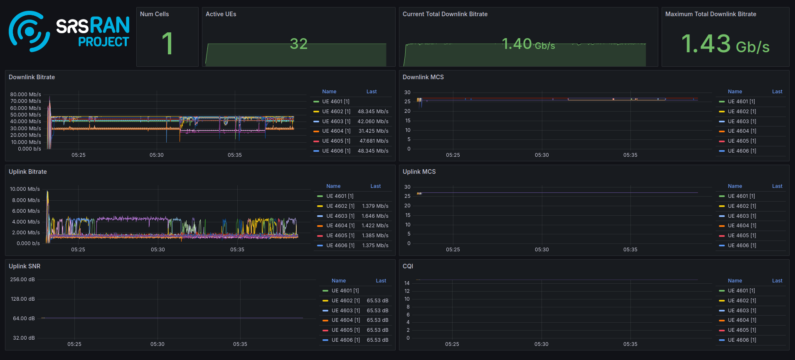

.. _k8s:

srsRAN gNB on Kubernetes
########################

Introduction
************

This tutorial outlines the steps required to deploy the srsRAN gNB for a split 7.2 architecture using
`Kubernetes <https://kubernetes.io/>`_. This approach is well-suited for scenarios that require network
deployment and management over extended periods, with high service availability and enhanced fault tolerance.

In short, Kubernetes can be described as follows:

   *When managing test networks, Kubernetes plays a pivotal role in streamlining and simplifying operations.
   It provides a unified platform for orchestrating network functions, optimizing resource usage,
   and automating scaling based on demand. Its built-in fault tolerance ensures consistent service
   availability, while its support for continuous deployment accelerates innovation.
   Kubernetes also simplifies deployment across varied environments, promoting adaptability.
   In essence, it offers a cohesive and scalable framework for efficient network function management.*

Note, however, that such deployments may not be ideal for research and development-focused use cases
that require fine-tuning of configuration files or source code modification. For iterative development
and testing, "bare metal" setups are often more appropriate.

Further Reading
===============

We recommend that users unfamiliar with Kubernetes or Helm begin by reviewing the following resources:

- `Getting started with Kubernetes <https://kubernetes.io/docs/concepts/overview/what-is-kubernetes/>`_
- `Getting started with Helm <https://helm.sh/docs/intro/>`_

-----

Setup Considerations
********************

This tutorial will cover the following topics:

- Set up Kubernetes/K3s nodes

    - Install a real-time kernel
    - Optimize system performance using TuneD
    - Install DPDK

- Set up PTP synchronization

    - LLS-C1 and LLS-C3

- Deploy the core network (Open5GS)

- Deploy the gNB

    - Connect to internal core networks and SMOs within the cluster
    - Assign DPDK devices without using the SR-IOV plugin

- Run load testing

    - cyclictest
    - srsRAN RU Emulator

- Visualize KPIs using Grafana

This tutorial uses a single-node cluster running Ubuntu 24.04. Kubernetes version 1.24 or newer is required.
A basic understanding of Kubernetes and Helm is assumed.

CU/DU
=====

The CU/DU is provided by the |project_name| gNB. The Open Fronthaul (OFH) Library offers
the required interface between the DU and the RU.

RU
==

For this tutorial, you can use any of the RUs supported by srsRAN. For more information on
supported O-RUs, see :ref:`this section <hw_integration>` of the RU tutorial.

5G Core
=======

This tutorial uses the Open5GS 5G Core.

Open5GS is an open-source implementation of the 5G Core and EPC, written in C.
The following links provide guidance on downloading and setting up Open5GS
to work with srsRAN:

- `Open5GS GitHub <https://github.com/open5gs/open5gs>`_
- `Open5GS Quickstart Guide <https://open5gs.org/open5gs/docs/guide/01-quickstart/>`_

Clocking & Synchronization
==========================

The split 7.2 interface requires tight synchronization between the DU and RU.
O-RAN WG4 has defined various synchronization mechanisms for use with Open Fronthaul,
outlined in *O-RAN.WG4.CUS.0-R003-v11.00*, Section 11.

This tutorial explains how to configure LLS-C1 and LLS-C3 setups.

- **LLS-C1**: The DU acts as the PTP grandmaster, and the RU is a PTP client.
- **LLS-C3**: Both the DU and RU are PTP clients, synchronized to a common grandmaster.

The PTP grandmaster is typically a GPS or Rubidium clock, while the PTP client
is usually a network interface card (NIC) with PTP support.

----------

Set up a K8s/K3s Bare Metal Cluster
***********************************

1. Deploy a Kubernetes Cluster
==============================

The installation of Kubernetes varies across distributions and the tools used for deployment. Depending
on your requirements and environment, you can choose the tool that best suits your needs. In this
tutorial, we deploy a single-node K3s cluster on Ubuntu 24.04 Server. K3s is a lightweight Kubernetes
distribution that is easy to install and manage. It is designed for resource-constrained environments
and edge computing, making it a great choice for bare metal Kubernetes deployments.

Popular tools for deploying Kubernetes include:

- `Kubespray <https://kubespray.io/>`_
- `kubeadm <https://kubernetes.io/docs/setup/production-environment/tools/kubeadm/create-cluster-kubeadm/>`_
- `K3s <https://k3s.io/>`_
- `Rancher <https://rancher.com/>`_

The installation of K3s is very straightforward and can be completed with a single command. The following command installs
K3s on your server:

.. code-block:: bash

    curl -sfL https://get.k3s.io | sh -

For more information, refer to the `official K3s documentation <https://k3s.io/>`_.

2. Install Realtime Kernel
==========================

The real-time kernel in Ubuntu 24.04 LTS, built on the PREEMPT_RT patch, ensures low-latency and deterministic
performance for time-sensitive operations. By prioritizing critical processes and ensuring predictable response
times, it is ideal for telco applications. This release also improves support for Raspberry Pi hardware,
enabling optimized real-time computing across diverse applications.

To install the real-time kernel on Ubuntu 24.04, you must obtain a free Canonical Pro subscription.
Register on the `Canonical website <https://ubuntu.com/pro>`_ and create an account. After that, use your
Pro token and the following commands to install the kernel:

.. code-block:: bash

    sudo pro attach <your-token>
    sudo pro enable realtime-kernel

Reboot the system after the installation is complete. For more information, refer to the
`Ubuntu documentation <https://documentation.ubuntu.com/pro-client/en/docs/howtoguides/enable_realtime_kernel/>`_.

3. Install TuneD
================

For performance tuning using TuneD, refer to the :ref:`srsRAN Performance Tuning Guide <tuning>` in our documentation.

4. Install DPDK
===============

For DPDK installation instructions, refer to the :ref:`DPDK guide <dpdk_tutorial>`.

----------

Set Up PTP Synchronization
**************************

PTP synchronization can be established using tools like `ptp4l`, `ts2phc`, and `phc2sys`. These tools can be deployed
using the |project_name| `linuxptp` Helm chart. As a first step, install the |project_name| Helm repository:

.. code-block:: bash

    helm repo add srsran https://srsran.github.io/srsRAN_Project_helm/

Depending on your setup, PTP components can be deployed in different configurations. The most common ones are
**LLS-C1** and **LLS-C3**, which can use either unicast or multicast transmission.

- In the **LLS-C1** configuration, the DU server drives PTP synchronization, and the RU acts as a client. The RU
  receives PTP messages from the DU.
- In the **LLS-C3** configuration, both the DU and RU are clients receiving PTP messages from a common PTP grandmaster.

In this tutorial, we demonstrate how to deploy both LLS-C1 and LLS-C3 configurations using the G.8275.1 multicast profile
of `linuxptp`. For more information, refer to the
`official linuxptp documentation <https://linuxptp.nwtime.org/documentation/>`_.

The configuration is set in the `values.yaml` file of the Helm chart.

**LLS-C1 example configuration:**

.. code-block:: yaml

    config:
        dataset_comparison: "G.8275.x"
        G.8275.defaultDS.localPriority: "128"
        maxStepsRemoved: "255"
        logAnnounceInterval: "-3"
        logSyncInterval: "-4"
        logMinDelayReqInterval: "-4"
        serverOnly: "1"
        clientOnly: "0"
        G.8275.portDS.localPriority: "128"
        ptp_dst_mac: "01:80:C2:00:00:0E"
        network_transport: "L2"
        domainNumber: "24"

**LLS-C3 example configuration:**

.. code-block:: yaml

    config:
        dataset_comparison: "G.8275.x"
        G.8275.defaultDS.localPriority: "128"
        maxStepsRemoved: "255"
        logAnnounceInterval: "-3"
        logSyncInterval: "-4"
        logMinDelayReqInterval: "-4"
        serverOnly: "0"
        clientOnly: "1"
        G.8275.portDS.localPriority: "128"
        ptp_dst_mac: "01:80:C2:00:00:0E"
        network_transport: "L2"
        domainNumber: "24"

For additional configuration options, refer to the `linuxptp Helm chart README <https://github.com/srsran/srsRAN_Project_helm/tree/main/charts/linuxptp/>`_.
An example `values.yaml` can be found
`here <https://raw.githubusercontent.com/srsran/srsRAN_Project_helm/main/charts/linuxptp/values.yaml>`_.

To deploy the PTP components, use the following command:

.. code-block:: bash

    helm install ptp4l srsran/linuxptp -f values.yaml

If the server is under heavy load and PTP performance degrades, you can assign the `linuxptp` Pod an exclusive CPU
core by editing the `resources` section of the `values.yaml` file. This ensures the `linuxptp` Pod is isolated
from other workloads:

.. code-block:: yaml

    resources:
        requests:
            cpu: "1"
            memory: "512Mi"
        limits:
            cpu: "1"
            memory: "512Mi"

----------

Set Up Core Network: Open5GS
*****************************

Open5GS is an open-source implementation of the 5G Core and EPC, written in C. The following links provide the
necessary information to download and set up Open5GS for use with srsRAN:

- `Open5GS GitHub <https://github.com/open5gs/open5gs>`_
- `Open5GS Quickstart Guide <https://open5gs.org/open5gs/docs/guide/01-quickstart/>`_

First, install a PersistentVolume (PV) and a PersistentVolumeClaim (PVC) for MongoDB.

- `Example PV and PVC for Open5GS <https://raw.githubusercontent.com/srsran/srsRAN_Project_helm/refs/heads/main/charts/open5gs/open5gs-pv-pvc.yaml>`_

Apply the PV and PVC manifest:

.. code-block:: bash

    kubectl apply -f open5gs-pv-pvc.yaml

The PV is configured using `hostPath`. Ensure that the path exists and has the proper file access rights on the host
system. The default path is ``/mnt/data/vol``. If needed, create it and set the file access rights using:

.. code-block:: bash

    mkdir -p /mnt/data/vol
    chown -R 1001:1001 /mnt/data/vol

Next, prepare the `values.yaml` file and set the required RAN parameters. You can use the following as a starting point:

- `Example values.yaml for Open5GS <https://raw.githubusercontent.com/srsran/srsRAN_Project_helm/refs/heads/main/charts/open5gs/5gSA-values.yaml>`_

Deploy Open5GS using Helm. This example assumes your `values.yaml` references the previously created PVC:

.. code-block:: bash

    helm install open5gs oci://registry-1.docker.io/gradiant/open5gs --version 2.2.5 -f 5gSA-values.yaml -n open5gs --create-namespace

You should see the following output:

.. code-block:: bash

    Pulled: registry-1.docker.io/gradiant/open5gs:2.2.0
    Digest: sha256:99d49ab6bb2d4a5c78be31dd2c3a99a0780de79bd22d0bfa9df734ca2705940a
    NAME: open5gs
    LAST DEPLOYED: Mon Dec  9 11:09:17 2024
    NAMESPACE: open5gs
    STATUS: deployed
    REVISION: 1
    TEST SUITE: None

Wait for all Pods to be in the `Running` state. Check with:

.. code-block:: bash

    kubectl get pods -n open5gs

Once the components are running, you can edit subscribers via the Open5GS WebUI. To do this, forward port `9999`
of the `open5gs-webui` service to your local machine:

.. code-block:: bash

    kubectl port-forward svc/open5gs-webui 9999:9999 -n open5gs

Expected output:

.. code-block:: bash

    Forwarding from 127.0.0.1:9999 -> 9999
    Forwarding from [::1]:9999 -> 9999

Leave the shell open and access the WebUI by visiting `http://localhost:9999` in your browser.
(Default credentials: **admin** / **1423**). Once you're done editing subscribers, you can close the shell.

Set Up gNB
**********

To deploy the gNB, edit the `values.yaml` file and set the desired RAN parameters. An example `values.yaml` for the |project_name| 
Helm Chart can be found `here <https://raw.githubusercontent.com/srsran/srsRAN_Project_helm/main/charts/srsran-project/values.yaml>`_.

If you haven't already added the |project_name| Helm repository, add it using:

.. code-block:: bash

    helm repo add srsran https://srsran.github.io/srsRAN_Project_helm/

In the following, we explain how to set up different scenarios using the srsRAN Helm Chart.

1. Connecting to Internal Core Networks Within the Cluster
==========================================================

When all components run within the same Kubernetes cluster, you can use DNS hostnames instead of a LoadBalancer.
For example, if the Open5GS core network is deployed in the same cluster, use the AMF service's hostname to connect to it.

To determine the cluster domain, run:

.. code-block:: bash

    kubectl run -it --image=ubuntu --restart=Never shell -- sh -c 'apt-get update > /dev/null && apt-get install -y dnsutils > /dev/null && nslookup kubernetes.default | grep Name | sed "s/Name:\skubernetes.default//"'

Example output:

.. code-block:: bash

    If you dont see a command prompt, try pressing enter.
    debconf: delaying package configuration, since apt-utils is not installed

    .svc.kubernetes.local

In this case, the cluster domain is `svc.kubernetes.local`. To construct a service hostname:

.. code-block:: bash

    <service-name>.<namespace>.svc.<cluster-domain>

To list all available services:

.. code-block:: bash

    kubectl get services -A

Example output:

.. code-block:: bash

    NAMESPACE     NAME               TYPE        CLUSTER-IP       EXTERNAL-IP   PORT(S)                  AGE
    default       kubernetes         ClusterIP   10.96.0.1        <none>        443/TCP                  10d
    default       open5gs-amf-ngap   ClusterIP   10.111.110.41    <none>        38412/SCTP               16h
    [...]

Here, the AMF service name is `open5gs-amf-ngap` and the namespace is `default`. Therefore, the hostname is:

``open5gs-amf-ngap.default.svc.kubernetes.local``

Use this hostname in the `amf` section of the gNB configuration in `values.yaml`.

For more information, refer to the official
`Kubernetes DNS documentation <https://kubernetes.io/docs/concepts/services-networking/dns-pod-service/>`_.

2. Assign DPDK Devices Without the SR-IOV Plugin
================================================

To assign PFs or VFs directly to the container without using the SR-IOV plugin, you must grant the Pod full
access to the host system. In `values.yaml`, set the following:

Enable access to the host network:

.. code-block:: yaml

    network:
        hostNetwork: true

Enable privileged mode and set required capabilities:

.. code-block:: yaml

    securityContext:
        capabilities:
            add: ["SYS_NICE", "NET_ADMIN"]
        privileged: true

With this setup, the gNB Pod has full access to the hosts network stack. This enables the Pod to access both
external and internal Kubernetes network resources.

Load Testing
************

In the following, we present two methods to test the maximum load on the system.

1. srsRAN RU Emulator
=====================

The srsRAN RU Emulator is a tool that emulates a Radio Unit (RU). It prints KPIs such as early and late packets,
which are useful for debugging network issues and evaluating how much load a deployment can handle. You can
quickly deploy the RU Emulator using the dedicated Helm chart.

Before deploying the RU Emulator, you must obtain the RU and DU MAC addresses, along with the bandwidth, VLAN tag,
and compression method. These parameters are **mandatory**:

- `ru_mac_addr`: MAC address of the interface used for Open Fronthaul (OFH) traffic.
- `du_mac_addr`: MAC address of the DU interface used for OFH traffic.

Example configuration:

.. code-block:: yaml

    ru_emu:
        cells:
        - bandwidth: 100
          network_interface: enp4s0f0
          ru_mac_addr: 50:7c:6f:45:44:33
          du_mac_addr: 00:11:22:33:44:00
          vlan_tag: 6
          ul_port_id: [0]
          compr_method_ul: "bfp"
          compr_bitwidth_ul: 9

Use the following configuration inside the `values.yaml` file to enable the RU Emulator:

.. code-block:: yaml

    securityContext:
        capabilities:
            add: ["SYS_NICE", "NET_ADMIN"]
        privileged: true 

Also make sure to explicitly disable SR-IOV by setting:

.. code-block:: yaml

    sriovConfig:
        enabled: false

Ensure that the `network_interface` and `du_mac_addr` values are set correctly for your deployment.

2. Assess Maximum Latency Using cyclictest
==========================================

`cyclictest` is a tool used to measure application latency on real-time systems. To assess the maximum latency
on your system, you can deploy `cyclictest` using the |project_name| `rt-test` Helm chart.

The rt-test Helm chart is designed to run two real-time test tools: `cyclictest` and `stress-ng`. While `cyclictest`
measures system latency and jitter, `stress-ng` generates high CPU and memory load to simulate system stress. Running
both together allows you to evaluate how well the system maintains real-time performance under load.

To configure your test scenario, update the `config` section of the `values.yaml` file. For example:

.. code-block:: yaml

    config:
        rt_tests.yml: |-
            stress-ng: "--matrix 0 -t 12h"
            cyclictest: "-m -p95 -d0 -a 1-15 -t 16 -h400 -D 12h"

This configuration runs `stress-ng` for 12 hours using the `--matrix` workload, and launches `cyclictest` pinned to
CPU cores 1–15 across 16 threads with high priority, running for 12 hours. For more information on `cyclictest` and
`stress-ng`, refer to the `cyclictest <https://wiki.linuxfoundation.org/realtime/documentation/howto/tools/cyclictest/start>`_
and `stress-ng <https://wiki.ubuntu.com/Kernel/Reference/stress-ng>`_ documentation.

To deploy `rt-test`, use the following Helm command:

.. code-block:: bash

    helm install rt-tests srsran/rt-tests -n srsran --create-namespace

----------

Visualizing KPIs via Grafana
****************************

To visualize gNB KPIs, we provide a Grafana dashboard designed to work with the metrics server included in the
|project_name| Helm repository. The metrics server collects and parses gNB metrics, stores them in an InfluxDB
database, and the Grafana dashboard then displays them.

If you haven't already added the srsRAN Helm repository, add it now:

.. code-block:: bash

    helm repo add srsran https://srsran.github.io/srsRAN_Project_helm/

The Grafana dashboard comes with a pre-configured `values.yaml` file. The only field that must be adjusted is the
**cluster domain**, which is required to resolve service hostnames.

To determine your cluster domain, run:

.. code-block:: bash

    kubectl run -it --image=ubuntu --restart=Never shell -- sh -c 'apt-get update > /dev/null && apt-get install -y dnsutils > /dev/null && nslookup kubernetes.default | grep Name | sed "s/Name:\skubernetes.default//"'

This command launches a temporary container and runs a DNS query against the `kubernetes.default` service.
Expected output:

.. code-block:: bash

    If you dont see a command prompt, try pressing enter.
    debconf: delaying package configuration, since apt-utils is not installed

    .svc.kubernetes.local

In this case, the cluster domain is `svc.kubernetes.local`. Adjust the `values.yaml` file by replacing the default
domain (`.svc.cluster.local`) with the string returned by the above command.

Download the default `values.yaml` file using:

.. code-block:: bash

    wget https://raw.githubusercontent.com/srsran/srsRAN_Project_helm/refs/heads/main/charts/grafana-srsran/values.yaml

After editing the file, the `metrics-server` section should look like this:

.. code-block:: yaml

    metrics-server:
        config:
        port: 55555
        bucket: srsran
        testbed: default
        url: http://grafana-influxdb.srsran.svc.kubernetes.local
        org: srs
        token: "605bc59413b7d5457d181ccf20f9fda15693f81b068d70396cc183081b264f3b"
        serviceType: "ClusterIP"

Once updated, delete the temporary container:

.. code-block:: bash

    kubectl delete pod shell

Now deploy the Grafana dashboard:

.. code-block:: bash

    helm install srsran-grafana srsran/grafana-deployment -f values.yaml -n srsran --create-namespace

After all components are running, the gNB application can start sending metrics to the metrics server.

To access the Grafana dashboard, forward the service port to your local machine:

.. code-block:: bash

    export POD_NAME=$(kubectl get pods --namespace srsran -l "app.kubernetes.io/name=grafana,app.kubernetes.io/instance=srsran-grafana" -o jsonpath="{.items[0].metadata.name}")
    kubectl --namespace srsran port-forward $POD_NAME 3000

Open your browser and go to: http://localhost:3000

An example of the Grafana dashboard is shown below:

----------

Clean Up Deployments
*********************

To clean up all deployments, use the following commands:

To delete the |project_name| deployment:

.. code-block:: bash

    helm uninstall srsran-project -n srsran

To delete the `linuxptp` deployment:

.. code-block:: bash

    helm uninstall linuxptp -n srsran

To delete the Open5GS deployment:

.. code-block:: bash

    helm uninstall open5gs -n open5gs

To delete the Grafana deployment:

.. code-block:: bash

    helm uninstall srsran-grafana -n srsran
