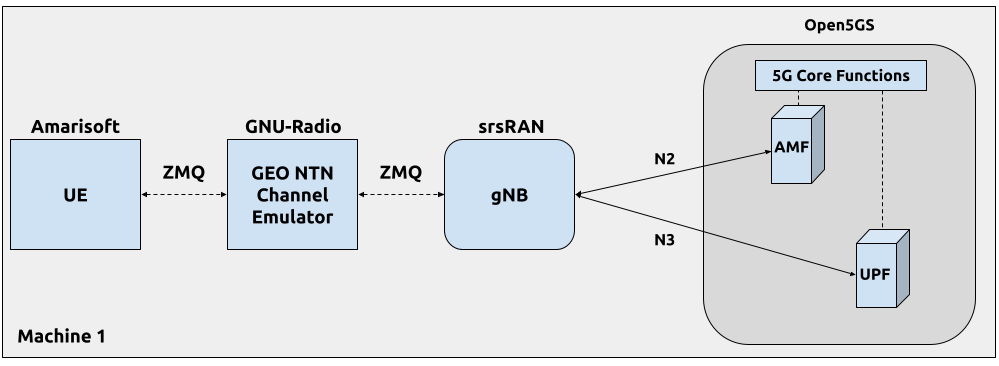
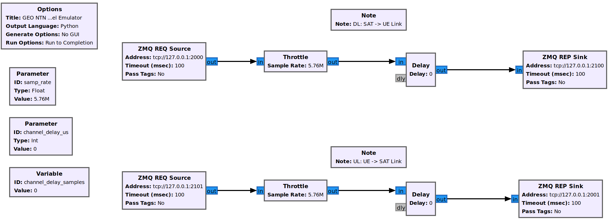

.. 5G SA NTN

.. _ntn_appnote:

srsRAN gNB for 5G NTN
#####################

Overview
********

This tutorial demonstrates how to configure and run a 5G NR SA Non-Terrestrial Network (NTN) using |project_name| and Amarisoft UE with NTN extensions. 
NTN is a network deployment where communication between the gNB and UE is relayed via non-terrestrial components, such as satellites.

Deploying NTN introduces unique challenges due to the different link dynamics and characteristics compared to traditional terrestrial networks. To address these challenges, 3GPP introduced several enhancements and features in the 5G NR specifications (Release 17). Key features and enhancements include:

- **Frequency Bands and Spectrum Allocation:** new frequency bands suitable for satellite communication have been standardized to ensure high-capacity links.
- **Timing Adjustments and Delay Management:** mechanisms have been introduced to handle the long and variable propagation delays associated with satellite communication.
- **Doppler Shift Compensation:** the relative movement of satellites, which can reach speeds up to 27,000 km/h, introduces non-negligible Doppler shifts that must be compensated for to maintain reliable communication links.

In 3GPP NTN, the UE is responsible for managing long propagation delays and compensating for Doppler frequency shifts. To facilitate this, the gNB broadcasts a new SIB19 block containing NTN-related information, including the current position of the satellite. The UE uses this information to compute the current delay and Doppler frequency and adjust its transmission accordingly.

For more information, you can read the the following documents: 

 - `3GPP TS 38.331 version 17.1.0 Release 17 <https://www.etsi.org/deliver/etsi_ts/138300_138399/138331/17.01.00_60/ts_138331v170100p.pdf>`_
 - `3GPP TS 38.300 version 17.1.0 Release 17 <https://www.etsi.org/deliver/etsi_ts/138300_138399/138300/17.01.00_60/ts_138300v170100p.pdf>`_

Our NTN implementation supports a comprehensive range of NTN scenarios, including GEO, MEO, and LEO. 
However, MEO and LEO scenarios require advanced NTN channel emulators capable of simulating variable link delays and Doppler frequency shifts. 

In this tutorial, we will focus on the GEO scenario, where the NTN link can be simplified to a constant delay between the gNB and UE. This approach is sufficient to demonstrate the key NTN features for the srsRAN-Project gNB.
We have implemented a basic GEO NTN channel emulator using GNU Radio, where signal samples are transmitted via ZMQ-based virtual RF devices between all components (gNB, channel emulator, and UE).

The following diagram presents the setup used in this application note:

Limitations
============

Since we are using a very simple NTN Channel Emulator, the tutorial has the following limitations:

  - **ZeroMQ-based Setup Only:** the NTN Channel Emulator is implemented in GNU Radio using ZMQ sockets to transfer signal samples. Running the setup over-the-air would require a real RF NTN Channel Emulator.
  - **GEO NTN Scenario Only:** the current NTN Channel Emulator only introduces a fixed delay between the gNB and UE. Implementing an LEO scenario would require an NTN Channel Emulator that simulates both delay and Doppler frequency.

Additionally, the current srsRAN-Project gNB implementation has the following limitations:

  - **Satellite-based gNB Placement:** The tutorial only covers scenarios where the gNB is located on the satellite, meaning there is no feeder link.
  - **Disabled HARQ Retransmissions:** HARQ retransmissions are currently disabled. Note that this is a valid option as specified in NTN standards.

------

Hardware and Software Overview
******************************

For this application note, the following hardware and software are used:

    - PC with Ubuntu 22.04.1 LTS
    - `srsRAN Project <https://github.com/srsran/srsRAN_project>`_ (24.04 or later)
    - `Amarisoft UE with NTN support <https://www.amarisoft.com/technology/ue-simulator/>`_  (2023-12-15 or later)
    - `Open5GS 5G Core <https://open5gs.org/>`_
    - `ZeroMQ <https://zeromq.org/>`_
    - `GNU-Radio Companion <https://www.gnuradio.org/>`_ (used for a NTN channel emulator)

Amarisoft UE
============

The Amarisoft UE simulator (AmariUE) is a commercial software solution designed for functional and performance testing of 5G networks. 
As a compliant LTE, NB-IOT, and NR UE (User Equipment), it can simulate multiple UEs concurrently within the same spectrum. 
Additionally, the Amarisoft UE can be augmented with an NTN (Non-Terrestrial Network) features. 
For further details, please refer to the `Amarisoft website <https://www.amarisoft.com/>`_.

Open5GS
=======

For this example, we are using Open5GS as the 5G Core. 

Open5GS is a C-language Open Source implementation for 5G Core and EPC. The following links will provide you 
with the information needed to download and set-up Open5GS so that it is ready to use with srsRAN: 

    - `GitHub <https://github.com/open5gs/open5gs>`_ 
    - `Quickstart Guide <https://open5gs.org/open5gs/docs/guide/01-quickstart/>`_

For this application note, we will use a dockerized Open5GS version provided in |project_name| at ``srsgnb/docker``.

GNU-Radio Companion
===================

GNU-Radio Companion is a free and open-source software development toolkit that provides signal processing blocks, which can be connected to form a signal flow graph. 
By default, GNU-Radio Companion includes ZeroMQ (ZMQ) compatible blocks, that facilitate connections to external processes via TCP sockets. 
These blocks enable transfering signal samples from/to external processes acting as signal sources/sinks (here gNB and AmarisoftUE). 

In this tutorial, we use GNU-Radio Companion to implement a **simple GEO NTN Channel Emulator**, which delays signal samples between a gNB and UE. 
It's important to note that the altitude of GEO satellites fluctuates, resulting in variations in signal propagation delay and non-zero Doppler Frequency. 
However, due to the relatively slow movement of these satellites, the Doppler Frequency can often be disregarded, while the fluctuating delays are managed by the gNB through ``MAC TA_CMDs``.

-----

Installation
************

ZeroMQ
======

First thing is to install ZeroMQ and build srsRAN. On Ubuntu, ZeroMQ development libraries can be installed
with:

.. code-block:: bash

  sudo apt-get install libzmq3-dev

|project_name|
==============

Then, you need to compile |project_name| (assuming you have already installed all the required dependencies). 
Note that ZeroMQ is initially deactivated, and activation occurs during the execution of the ``cmake`` command, with the inclusion of the flags ``-DENABLE_EXPORT=ON -DENABLE_ZEROMQ=ON``.
Speficially, the following commands can be used to download and build |project_name| from source: 

.. code::

  git clone https://github.com/srsran/srsRAN_Project.git
  cd srsRAN_Project
  mkdir build
  cd build
  cmake ../ -DENABLE_EXPORT=ON -DENABLE_ZEROMQ=ON
  make -j`nproc`

Pay extra attention to the cmake console output. Make sure you read the following line:

.. code::

  ...
  -- FINDING ZEROMQ.
  -- Checking for module 'ZeroMQ'
  --   No package 'ZeroMQ' found
  -- Found libZEROMQ: /usr/local/include, /usr/local/lib/libzmq.so
  ...

Note, if you have already built and installed |project_name| prior to installing ZMQ and other dependencies you will have to re-build both to ensure the ZMQ drivers have been recognized correctly. 

Amarisoft UE
============

Download the appropriate version of Amarisoft UE and install as per steps provided in its install guide.

This tutorial uses version 2023-12-15 of Amarisoft UE, but it can be any version above 2023-12-15.

ZeroMQ driver for Amarisoft UE
==============================

.. note::
  These steps should only be completed **after** compiling |project_name| as mentioned above, as they require the build files of |project_name| and Amarisoft UHD RF frontend driver.

Interfacing the Amarisoft UE with |project_name| requires a custom TRX driver implemented by SRS, which can be found in |project_name| source files in ``srsRAN_Project/utils/trx_srsran``. 

The Amarisoft UE release folder, ``amarisoft.2023-12-15.tar.gz``, should contain a file called ``trx_uhd-linux-2023-12-15.tar.gz``. The release folder and the sub-file in question should be uncompressed before proceeding.

First, the driver needs to be compiled, do this by running the following commands from ``srsRAN_Project/build`` : 

.. code-block:: bash

  cmake ../ -DENABLE_EXPORT=TRUE -DENABLE_ZEROMQ=TRUE -DENABLE_TRX_DRIVER=TRUE -DTRX_DRIVER_DIR=<PATH TO trx_uhd-linux-2023-12-15> 
  make trx_srsran_test
  ctest -R trx_srsran_test

Make sure CMake finds the file ``trx_driver.h`` in the specified folder. CMake should print the following:

.. code-block:: bash

  -- Found trx_driver.h in TRX_DRIVER_DIR=/home/user/amarisoft/2021-03-15/trx_uhd-linux-2021-03-15/trx_driver.h

A symbolic link must be done for the UE application to load the driver. From the Amarisoft UE build folder run the following command:

.. code-block:: bash

  ln -s srsRAN_Project/build/utils/trx_srsran/libtrx_srsran.so trx_srsran.so

GNU-Radio Companion
===================

On Ubuntu, it can be installed with the following command:: 

  sudo apt-get install gnuradio

------

Configuration
*************

The following config files are prepared for this tutorial:

  * :download:`gNB config <.config/gnb_zmq.yml>`
  * :download:`gNB NTN config <.config/geo_ntn.yml>`
  * :download:`AmarisoftUE config <.config/ue-nr-ntn-geo.cfg>`
  * :download:`AmarisoftUE ue-ifup script <.config/ue-ifup>`

Important details of the modifications made are outlined in the following sections. The description of the remaining config parameters is available in :ref:`Configuration Reference<manual_config_ref>`.
Moreover, details of the ZMQ-based setup are explained in the :ref:`srsRAN gNB with Amarisoft UE<amariue_tutorial>` application note.

It is recommended you use these files to avoid errors while changing configs manually. Any configuration files not included here do not require modification from the default settings.

gNB
===
When using the ZMQ-based RF driver in the srsRAN-Project gNB, the **ru_sdr** sections of the config file has to be as follows::

  ru_sdr:
    device_driver: zmq
    device_args: tx_port=tcp://127.0.0.1:2000,rx_port=tcp://127.0.0.1:2001
    srate: 5.76

Enabling NTN features in the gNB requires the following:

* using one of the available bands (here ``band: 256``) and ARFCN (DL and SSB)
* disabling HARQ retransmissions
* using Preamble Format 1 to improve the timing robustness (here ``prach_config_index: 31``)
* adapting periods and timers accordingly to match the NTN link RTT
* enabling transmission of SIB19 in SIB
* adding ``ntn`` config section with parameters used to configure gNB in NTN mode and to fill SIB19 

Finally, the ``cell_cfg`` config section for NTN GEO scenario is as follows::

  cell_cfg:
    dl_arfcn: 437000                  # ARFCN of the downlink carrier (center frequency).
    band: 256                         # Use NTN band.
    channel_bandwidth_MHz: 5          # Bandwith in MHz. Number of PRBs will be automatically derived.
    common_scs: 15                    # Subcarrier spacing in kHz used for data.
    plmn: "00101"                     # PLMN broadcasted by the gNB.
    tac: 7                            # Tracking area code (needs to match the core configuration).
    pdsch:
      nof_harqs: 16                   # Sets the number of Downlink HARQ processes.
      max_nof_harq_retxs: 0           # Disable HARQ retransmissions.
    prach:
      prach_config_index: 31          # Use Preamble Format 1 to improve the timing robustness.
      max_msg3_harq_retx: 0           # Disable Msg3 HARQ retransmissions.
    sib:
      si_window_length: 40            # Set SI Window Length.
      si_sched_info:
        - si_period: 16               # Set SIB19 period.
          sib_mapping: 19             # Enable SIB19.
    pucch:
      sr_period_ms: 320               # Set Scheduling Request period.
    csi:
      csi_rs_period: 80               # Set CSI-RS report period.

The ``ntn`` section is as follows::

  ntn:
    cell_specific_koffset:  239       # Cell-specific k-offset.
    ta_common:  0                     # TA common offset.
    ephemeris_info_ecef:              # Satellite ephemeris in position and velocity state vector format.
      pos_x:  -28105880
      pos_y:  31509747
      pos_z:  -1691895
      vel_x:  34
      vel_y:  9
      vel_z:  -385

Note that :download:`gnb_zmq.yml <.config/gnb_zmq.yml>` file contains the basic (i.e., generic) gNB config, while the NTN-related parameters are defined in a separate :download:`geo_ntn.yml<.config/geo_ntn.yml>` file.

AmarisoftUE
===========
When using the ZMQ-based RF driver in the AmarisoftUE, the **rf_driver** section in the AmarisoftUE config file has to be changed as follows:: 

  rf_driver: {
      /* srsRAN-Project zmq RF device */
      name: "srsran",
      log_level: "info",
      tx_port0:  "tcp://*:2101",
      rx_port0:  "tcp://localhost:2100",
  },

Enabling NTN features in the UE requires the following:

* using one of the available bands (here ``band: 256``) and ARFCN (DL and SSB)
* setting the ``ntn: true`` option
* defining UE ground position in the ``ntn_ground_position`` section (this information is used to compute the relative distance and speed of the NTN satellite, which are then used to calculate the delay and Doppler frequency of the NTN link)

Finally, the ``cell_groups`` section in the AmarisoftUE config is as follows::

  cell_groups: [{
    group_type: "nr",
    multi_ue: false,
    cells: [{
      rf_port: 0,
      bandwidth: 5,
      sample_rate: 5.76,
      band: 256,
      dl_nr_arfcn: 437000,
      ssb_nr_arfcn: 437090,
      ssb_subcarrier_spacing: 15,
      subcarrier_spacing: 15,
      n_antenna_dl: 1,
      n_antenna_ul: 1,
      ntn: true,
      ntn_ground_position: {
          latitude: -2.2970186,
          longitude: 131.7327201,
          altitude: 1
        },
    }],

NTN Channel Emulator
====================

The simple GEO NTN Channel Emulator can be downloaded here:

  * :download:`GNU-Radio Flow-graph <.config/geo_ntn_channel_emulator.grc>`
  * :download:`Python script <.config/geo_ntn_channel_emulator.py>`

The following figure shows the GNU-Radio flowgraph of the GEO NTN Channel Emulator: 

The upper graph is responsible for handling Downlink signal samples, while the lower graph for Uplink signal samples.

The emulator work as follows:

  * the DL (UL) signal is received from gNB (UE) over ZMQ socket
  * the signal delayed by the duration of the NTN link delay 
  * the signal is transmitted to the UE (gNB) over ZMQ socket

Please note that we provide a simple GEO NTN Channel Emulator that introduces only the link delay between the gNB and UE, which is sufficient to demonstrate the NTN operation of our gNB.

Other channel effects, such as Doppler frequency shift, delay variation, and path loss (including atmospheric attenuation), are not implemented. In the GEO scenario, the Doppler frequency shift is minimal and can be neglected as it does not significantly affect the signal SNR. The delay variation due to GEO satellite altitude fluctuations is slow and can be managed by the gNB using TA_CMDs. Lastly, the link path loss does not impact the NTN protocol operation.

-----

Running the Network
*******************

The following order should be used when running the network: 

  1. Open5gs
  2. GEO NTN Channel Emulator
  3. gNB
  4. AmarisoftUE

Open5GS Core
============

|project_name| provides a dockerized version of the Open5GS. It is a convenient and quick way to start the core network. You can run it as follows:

.. code-block:: bash

  cd ./srsRAN_Project/docker
  docker compose up --build 5gc

Note that we have already configured Open5GS to operate correctly with |project_name|. Moreover, the UE database is populated with the credentials used by the AmarisoftUE.

GEO NTN Channel Emulator
========================

The GEO NTN Channel Emulator can be executed using GNU-Radio Companion, or simply using the pre-generated python3 script:

.. code-block:: bash

  python3 ./geo_ntn_channel_emulator.py --channel-delay-us=119720

Note that the delay value of 119720us matches the link delay between the GEO satellite (3D position defined with ``ephemeris_info_ecef`` section of the gNB NTN config) and UE (coordinates defined in ``ntn_ground_position`` section of the AmarisoftUE config). 

gNB
===

We run gNB directly from the build folder (the config files are also located here) with the following command::
  
  sudo ./gnb -c ./gnb_zmq.yml -c geo_ntn.yml
  
The console output should be similar to:: 

  The PRACH detector will not meet the performance requirements with the configuration {Format 1, ZCZ 0, SCS 1.25kHz, Rx ports 1}.
  Lower PHY in executor blocking mode.
  
  --== srsRAN gNB (commit 5a9e9f1ffb) ==--
  
  Connecting to AMF on 10.53.1.2:38412
  Available radio types: zmq.
  Cell pci=1, bw=5 MHz, 1T1R, dl_arfcn=437000 (n256), dl_freq=2185.0 MHz, dl_ssb_arfcn=437090, ul_freq=1995.0 MHz
  
  ==== gNodeB started ===
  Type <t> to view trace
  
The ``Connecting to AMF on 10.53.1.2:38412`` message indicates that gNB initiated a connection to the core. 
If the connection attempt is successful, the following (or similar) will be displayed on the Open5GS console::

  open5gs_5gc  | 05/15 10:02:24.193: [amf] INFO: gNB-N2 accepted[10.53.1.1]:60555 in ng-path module (../src/amf/ngap-sctp.c:113)
  open5gs_5gc  | 05/15 10:02:24.193: [amf] INFO: gNB-N2 accepted[10.53.1.1] in master_sm module (../src/amf/amf-sm.c:741)
  open5gs_5gc  | 05/15 10:02:24.197: [amf] INFO: [Added] Number of gNBs is now 1 (../src/amf/context.c:1231)
  open5gs_5gc  | 05/15 10:02:24.197: [amf] INFO: gNB-N2[10.53.1.1] max_num_of_ostreams : 30 (../src/amf/amf-sm.c:780)

AmarisoftUE
===========

To start AmarisoftUE run::

  sudo ./lteue ./ue-nr-ntn-geo.cfg

Note that the :download:`if-up script <.config/ue-ifup>` should be located in the same directory, so the simulator can create a network namespace for the UE. Also, verify that the script is executable by running:::

  chmod +x ./ue-ifup

The UE console output should be similar to:: 
  
  UE version 2023-12-15, Copyright (C) 2012-2023 Amarisoft
  This software is licensed to ***
  License server: x.x.x.x
  Support and software update available until 2024-10-28.

  RF0: sample_rate=5.760 MHz dl_freq=2185.000 MHz ul_freq=1995.000 MHz (band n256) dl_ant=1 ul_ant=1
  2024-05-15T10:03:20.509325 [ALL     ] [I] Task worker "async_thread" started...
  2024-05-15T10:03:20.526217 [zmq:tx:0:0] [I] Binding to address tcp://*:2101.
  2024-05-15T10:03:20.544409 [zmq:rx:0:0] [I] Connecting to address tcp://localhost:2100.
  2024-05-15T10:03:21.544939 [zmq:rx:0:0] [I] Waiting for reading samples. Completed 0 of 768 samples.
  2024-05-15T10:03:21.583579 [zmq:rx:0:0] [I] Waiting for data.
  2024-05-15T10:03:21.583590 [zmq:tx:0:0] [I] Waiting for request.
  2024-05-15T10:03:22.544942 [zmq:rx:0:0] [I] Waiting for reading samples. Completed 0 of 768 samples.

The ``zmq`` messages will be displayed before the NTN Channel Emulator is started.

If everything is connected correctly and the signal samples flow between gNB and UE, the UE should detect the cell, which is indicated with the following message in the Amarisoft UE console::

  (ue) Cell 0: SIB found

Then, the UE starts the attach procedure to connect with the network. During this procedure, the Open5gs console should log the following (or similar) messages::

  open5gs_5gc  | 05/15 10:12:37.405: [amf] INFO: InitialUEMessage (../src/amf/ngap-handler.c:401)
  open5gs_5gc  | 05/15 10:12:37.405: [amf] INFO: [Added] Number of gNB-UEs is now 1 (../src/amf/context.c:2550)
  open5gs_5gc  | 05/15 10:12:37.405: [amf] INFO:     RAN_UE_NGAP_ID[0] AMF_UE_NGAP_ID[2] TAC[7] CellID[0x66c000] (../src/amf/ngap-handler.c:562)
  open5gs_5gc  | 05/15 10:12:37.405: [amf] INFO: [suci-0-001-01-0-0-0-0123456780] known UE by SUCI (../src/amf/context.c:1833)
  open5gs_5gc  | 05/15 10:12:37.405: [gmm] INFO: Registration request (../src/amf/gmm-sm.c:1165)
  open5gs_5gc  | 05/15 10:12:37.405: [gmm] INFO: [suci-0-001-01-0-0-0-0123456780]    SUCI (../src/amf/gmm-handler.c:166)
  open5gs_5gc  | 05/15 10:12:37.409: [upf] INFO: [Removed] Number of UPF-sessions is now 0 (../src/upf/context.c:252)
  open5gs_5gc  | 05/15 10:12:37.410: [smf] INFO: Removed Session: UE IMSI:[imsi-001010123456780] DNN:[srsapn:1] IPv4:[10.45.1.2] IPv6:[] (../src/smf/context.c:1672)
  open5gs_5gc  | 05/15 10:12:37.410: [smf] INFO: [Removed] Number of SMF-Sessions is now 0 (../src/smf/context.c:3076)
  open5gs_5gc  | 05/15 10:12:37.410: [smf] INFO: [Removed] Number of SMF-UEs is now 0 (../src/smf/context.c:1080)
  open5gs_5gc  | 05/15 10:12:37.411: [amf] INFO: [imsi-001010123456780:1] Release SM context [204] (../src/amf/amf-sm.c:491)
  open5gs_5gc  | 05/15 10:12:37.411: [amf] INFO: [imsi-001010123456780:1] Release SM Context [state:31] (../src/amf/nsmf-handler.c:1027)
  open5gs_5gc  | 05/15 10:12:37.411: [amf] INFO: [Removed] Number of AMF-Sessions is now 0 (../src/amf/context.c:2578)
  open5gs_5gc  | 05/15 10:12:41.433: [pcf] WARNING: NF EndPoint(addr) updated [127.0.0.5:7777] (../src/pcf/npcf-handler.c:113)
  open5gs_5gc  | 05/15 10:12:45.461: [gmm] INFO: [imsi-001010123456780] Registration complete (../src/amf/gmm-sm.c:2146)
  open5gs_5gc  | 05/15 10:12:45.461: [amf] INFO: [imsi-001010123456780] Configuration update command (../src/amf/nas-path.c:612)
  open5gs_5gc  | 05/15 10:12:45.461: [gmm] INFO:     UTC [2024-05-15T10:12:45] Timezone[0]/DST[0] (../src/amf/gmm-build.c:559)
  open5gs_5gc  | 05/15 10:12:45.461: [gmm] INFO:     LOCAL [2024-05-15T10:12:45] Timezone[0]/DST[0] (../src/amf/gmm-build.c:564)
  open5gs_5gc  | 05/15 10:12:45.461: [amf] INFO: [Added] Number of AMF-Sessions is now 1 (../src/amf/context.c:2571)
  open5gs_5gc  | 05/15 10:12:45.461: [gmm] INFO: UE SUPI[imsi-001010123456780] DNN[srsapn] S_NSSAI[SST:1 SD:0xffffff] smContextRef [NULL] (../src/amf/gmm-handler.c:1241)
  open5gs_5gc  | 05/15 10:12:45.462: [gmm] INFO: SMF Instance [325bd420-12a2-41ef-b2ef-491119677a7a] (../src/amf/gmm-handler.c:1280)
  open5gs_5gc  | 05/15 10:12:45.462: [smf] INFO: [Added] Number of SMF-UEs is now 1 (../src/smf/context.c:1019)
  open5gs_5gc  | 05/15 10:12:45.462: [smf] INFO: [Added] Number of SMF-Sessions is now 1 (../src/smf/context.c:3068)
  open5gs_5gc  | 05/15 10:12:45.467: [smf] INFO: UE SUPI[imsi-001010123456780] DNN[srsapn] IPv4[10.45.1.2] IPv6[] (../src/smf/npcf-handler.c:539)
  open5gs_5gc  | 05/15 10:12:45.468: [upf] INFO: [Added] Number of UPF-Sessions is now 1 (../src/upf/context.c:208)
  open5gs_5gc  | 05/15 10:12:45.468: [upf] INFO: UE F-SEID[UP:0x687 CP:0xffa] APN[srsapn] PDN-Type[1] IPv4[10.45.1.2] IPv6[] (../src/upf/context.c:485)
  open5gs_5gc  | 05/15 10:12:45.468: [upf] INFO: UE F-SEID[UP:0x687 CP:0xffa] APN[srsapn] PDN-Type[1] IPv4[10.45.1.2] IPv6[] (../src/upf/context.c:485)
  open5gs_5gc  | 05/15 10:12:49.491: [amf] INFO: [imsi-001010123456780:1:11][0:0:NULL] /nsmf-pdusession/v1/sm-contexts/{smContextRef}/modify (../src/amf/nsmf-handler.c:837)

To verify, whether the UE successfully connected to the network, execute ``ue`` command in AmarisoftUE console::

  (ue) ue
          # UE_ID CL RNTI    RRC_STATE               EMM_STATE #ERAB IP_ADDR
    NR    0     1  0 4601      running              registered     1 10.45.1.2

It is clear that the connection has been made successfully once the UE has been assigned an IP (here: ``10.45.1.2``).

Testing the Network
*******************

Routing Configuration
=====================
Before being able to ping UE, you need to add a route to the UE on the **host machine** (i.e. the one running the Open5GS docker container): 

.. code-block:: bash

    sudo ip ro add 10.45.0.0/16 via 10.53.1.2

Check the host routing table:

.. code-block:: bash

    route -n

It should contain the following entries (note that ``Iface`` names might be different):

.. code-block:: bash

    Kernel IP routing table
    Destination     Gateway         Genmask         Flags Metric Ref    Use Iface
    0.0.0.0         192.168.0.1     0.0.0.0         UG    100    0        0 eno1
    10.45.0.0       10.53.1.2       255.255.0.0     UG    0      0        0 br-dfa5521eb807
    10.53.1.0       0.0.0.0         255.255.255.0   U     0      0        0 br-dfa5521eb807
    ...

Next, check the routing table of ``ue1``:

.. code-block:: bash

   sudo ip netns exec ue1 route -n

The output should be as follows:

.. code-block:: bash

    Kernel IP routing table
    Destination     Gateway         Genmask         Flags Metric Ref    Use Iface
    0.0.0.0         10.45.1.2       0.0.0.0         UG    0      0        0 pdn0
    10.45.1.0       0.0.0.0         255.255.255.0   U     0      0        0 pdn0

Ping
====

**Uplink**

To test the connection in the uplink direction, use the following:: 

    sudo ip netns exec ue1 ping 10.45.1.1

**Downlink**

To run ping in the downlink direction, use:: 

    ping 10.45.1.2

The IP for the UE can be taken from the UE console output. This might change each time a UE reconnects to the network, so it is best practice to always double-check the latest IP assigned by reading it from the console before running the downlink traffic.

**Ping Output**

Example **ping** output:: 

  # sudo ip netns exec ue1 ping 10.45.1.1 -c4
  PING 10.45.1.1 (10.45.1.1) 56(84) bytes of data.
  64 bytes from 10.45.1.1: icmp_seq=1 ttl=64 time=762 ms
  64 bytes from 10.45.1.1: icmp_seq=2 ttl=64 time=723 ms
  64 bytes from 10.45.1.1: icmp_seq=3 ttl=64 time=682 ms
  64 bytes from 10.45.1.1: icmp_seq=4 ttl=64 time=641 ms

  --- 10.45.1.1 ping statistics ---
  4 packets transmitted, 4 received, 0% packet loss, time 3002ms
  rtt min/avg/max/mdev = 641.317/702.106/762.413/45.207 ms

-----

Troubleshooting
***************

Running gNB and AmarisoftUE on separate machines
================================================

When running gNB and AmarisoftUE on two separate host machines (i.e., using Amarisoft CallBox), one needs to adapt the IP addresses used as TX and RX endpoints in the ZMQ-based RF drivers as well as IP addresses used in ZMQ-blocks in the GNU-Radio channel emulator.

Specifically, if the NTN channel emulator runs on the same PC as gNB, the following configuration has to be applied:

1. The ``ru_sdr`` section in the gNB config remains unchanged::

    ru_sdr:
      device_driver: zmq
      device_args: tx_port=tcp://127.0.0.1:2000,rx_port=tcp://127.0.0.1:2001

2. IP addresses in GNU-Radio channel emulator have to be updated as follows:

.. list-table::
   :widths: 25 25 25
   :header-rows: 1
   :align: left

   * - Description
     - Old value
     - New value
   * - Tx DL to UE
     - `tcp://127.0.0.1:2100`
     - `tcp://0.0.0.0:2100`
   * - Rx UL from UE
     - `tcp://127.0.0.1:2101`
     - `tcp://<UE_IP>:2101`

3. The ``rf_driver`` section in the AmarisoftUE config file has to be changed as follows::

    rf_driver: {
        /* srsRAN-Project zmq RF device */
        name: "srsran",
        log_level: "info",
        tx_port0:  "tcp://*:2101",
        rx_port0:  "tcp://<GNB_IP>:2100",
    },
