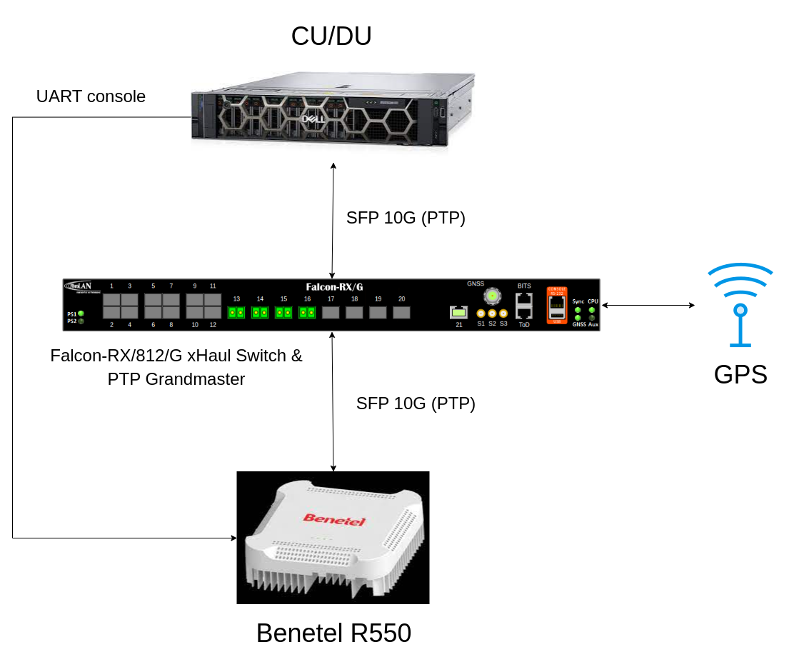

.. _oran_ru_tutorial: 

ORAN 7.2 RU Guide
#################

Overview
********

The srsRAN Project supports both split 7.2 and split 8 fronthaul interfaces to Radio Units (RUs).

:ref:`Split 7.2 <7_2_split>` is an open specification published by the O-RAN Alliance aiming to  ensure interoperability between different DU and RU solutions. 
This tutorial outlines the use of the srsRAN Project gNB (including both CU and DU) with an O-RAN RU using split 7.2 interface. For this example, we use the `RAN550 <https://benetel.com/ran550/>`_ RU from Benetel. A `Falcon-RX/812/G <https://www.fibrolan.com/Falcon-RX>`_ switch is used to provide timing synchronization to both the DU and RU.

The split 7.2 interface is supported in srsRAN through the Open Fronthaul (OFH) Library. Developed by the SRS team, OFH is an open-source, portable library with minimal 3rd-party dependencies. It has been designed to minimize the integration and configuration burden associated with using srsRAN with 3rd-party O-RUs. 

.. note::
   This example features an O-RU device from `Benetel <https://www.benetel.com/>`_. Please refer to the Benetel User Guide Documentation for up-to-date configuration and usage guidelines, along with disclaimer and warranty information. Contact Benetel (sales@benetel.com) for more information.

----

Setup Considerations
********************

This tutorial uses the following hardware: 

    - Server (Running srsRAN Project CU/DU)

      - CPU: AMD Ryzen 7 5700G
      - MEM: 64GB
      - NIC: Intel Corporation 82599ES 10-Gigabit
      - OS: Ubuntu 22.04 (5.15.0-1037-realtime)

    - `Benetel RAN550 RU <https://benetel.com/ran550/>`_ (Firmware version RAN550-1-0.8.1)
    - `Falcon-RX/812/G xHaul Switch (w/ PTP grandmaster) <https://www.fibrolan.com/Falcon-RX>`_
    
    
and the following software:

    - `srsRAN Project <https://github.com/srsran/srsRAN_project>`_
    - `Open5GS 5G Core <https://open5gs.org/>`_
    - `Amarisoft UE <https://www.amarisoft.com/technology/ue-simulator/>`_  (2021-09-18 or later)

CU/DU 
=====

The CU/DU is provided by the srsRAN Project gNB. The Open Fronthaul (OFH) Library provides the necessary interface between the DU and the RU. The DU is connected to the Falcon switch via SFP+ fiber cable. 

RU 
=====

The Benetel RAN550 RU is used as the RU in this setup. This is a Split 7.2x indoor O-RU. 
The RU is connected to the Falcon-RX via SFP+ fiber cable through the main fronthaul interface. 

5G Core
=======

For this example we use the Open5GS 5G Core.

Open5GS is a C-language open-source implementation for 5G Core and EPC. The following links will provide you
with the information needed to download and setup Open5GS so that it is ready to use with srsRAN:

    - `GitHub <https://github.com/open5gs/open5gs>`_
    - `Quickstart Guide <https://open5gs.org/open5gs/docs/guide/01-quickstart/>`_

Switch
======

The Falcon-RX/812/G switch is a 5G xHaul timing-aware O-RAN switch & PTP grandmaster. This is used to provide timing synchronization to both the DU and RU. 

Clocking & Synchronization
--------------------------

The split 7.2 interface requires tight timing synchronization between the DU and RU. O-RAN WG 4 has defined various synchronization methods for use with Open Fronthaul. These are outlined in O-RAN.WG4.CUS.0-R003-v11.00 Section 11.

In this setup we use LLS-C3. The LLS-C3 configuration enables the distribution of network timing between central sites and remote sites from PRTC/T-GM to RU. In simpler terms, it allows the synchronization of one or more PRTC/T-GM devices (serving as SYNCE+PTP masters) in the fronthaul network to transmit network timing signals to DU and RU components as seen in the figure above. 
In our setup the Falcon switch is acting as the PTP grandmaster (which is synchronized via GPS), providing timing to the RU and the DU. These are connected to the SFP+ 10G ports on the switch via Ethernet. 

.. note::
   The OFH library supports all of the defined clock model and synchronization topologies defined by O-RAN WG4. The use of LLS-C3 is specific to this hardware setup.

----

Configuration
*************

CU/DU
===== 

NIC configuration
-----------------

The DU machine should have jumbo frames enabled in the NIC and the PTP process should be checked to make sure it is synchronized correctly. 

To set the jumbo frames in the NIC use the following command for a temporary configuration: 

.. code-block:: bash

   ifconfig <eth0> mtu 9600 up 

Where ``eth0`` is the ethernet port for the SFP+ fiber cable that connects the DU to the Falcon-RX.

PTP configuration
-----------------

To start the PTP process in the DU, use the command below. The configuration file can be downloaded :download:`here <.configs/default.cfg>`

.. code-block:: bash

   ./ptp4l -2 -i enp1s0f0 -f ./configs/default.cfg -m

You should then see the following output: 

.. code-block:: bash

    ptp4l[4321.966]: rms    6 max   14 freq -25784 +/-   9 delay   172 +/-   1
    ptp4l[4323.091]: rms    5 max   10 freq -25778 +/-   8 delay   170 +/-   1
    ptp4l[4324.216]: rms    6 max   11 freq -25781 +/-   9 delay   169 +/-   1
    ptp4l[4325.341]: rms    5 max   10 freq -25783 +/-   8 delay   170 +/-   1

In the above output, the ``rms`` value can be used to determine if the PTP sync is correct, for this we look for a value < 10. 

Next, run: 

.. code-block:: bash

    ./phc2sys -s enp1s0f0 -w -m -R 8 -f ./configs/default.cfg

You should then see the following output: 

.. code-block:: bash

    phc2sys[4348.303]: CLOCK_REALTIME phc offset       -25 s2 freq   +8026 delay   1467
    phc2sys[4348.428]: CLOCK_REALTIME phc offset       -11 s2 freq   +8033 delay   1466
    phc2sys[4348.553]: CLOCK_REALTIME phc offset       -25 s2 freq   +8016 delay   1396
    phc2sys[4348.678]: CLOCK_REALTIME phc offset        -5 s2 freq   +8028 delay   1397

The first value here is used to determine if the PTP sync is correct, for this we look for a value < 100. 

In both of the above commands ``enp1s0f0`` is the network interface on our DU that gets the PTP sync. 

srsRAN configuration
--------------------

A sample configuration file for the DU can be downloaded from :download:`here <.configs/du_R550_rf.yml>`.

The following excerpt shows how the DU is configured to communicate with the RU: 

.. code-block:: yaml

  ru_ofh:
    ru_bandwidth_MHz: 100                                           # RU instantaneous bandwidth.
    t1a_max_cp_dl: 500                                              # Maximum T1a on Control-Plane for Downlink in microseconds.
    t1a_min_cp_dl: 250                                              # Minimum T1a on Control-Plane for Downlink in microseconds.
    t1a_max_cp_ul: 465                                              # Maximum T1a on Control-Plane for Uplink in microseconds.
    t1a_min_cp_ul: 250                                              # Minimum T1a on Control-Plane for Uplink in microseconds.
    t1a_max_up: 250                                                 # Maximum T1a on User-Plane in microseconds.
    t1a_min_up: 80                                                  # Minimum T1a on User-Plane in microseconds.
    is_prach_cp_enabled: false                                      # Configures if Control-Plane messages should be used to receive PRACH messages.
    is_dl_broadcast_enabled: true                                   # Set to true for a workaround over a firmware bug in the RAN550 when operating in SISO mode.
    compr_method_ul: bfp                                            # Uplink compression method.
    compr_bitwidth_ul: 9                                            # Uplink IQ samples bitwidth after compression.
    compr_method_dl: bfp                                            # Downlink compression method.
    compr_bitwidth_dl: 9                                            # Downlink IQ samples bitwidth after compression.
    iq_scaling: 0.27                                                # IQ samples scaling factor applied before compression, should be a positive value smaller than 1.
    cells:
      - network_interface: enp1s0f0                                 # Ethernet interface name used to communicate with the RU.
        ru_mac_addr: 70:b3:d5:e1:5b:06                              # RU MAC address.
        du_mac_addr: 80:61:5f:0d:df:aa                              # DU MAC address.
        vlan_tag: 1                                                 # VLAN tag value.
        prach_port_id: 4                                            # PRACH eAxC port value.
        dl_port_id: [0,1]                                           # Downlink eAxC port values.
        ul_port_id: 0                                               # Uplink eAxC port values.

To expand on this, the following parameters are set in the ``cells`` field:

    - ``network_interface`` : Network interface used to send the OFH packets.
    - ``ru_mac_addr`` : MAC address of the RAN550.
    - ``du_mac_addr`` : MAC address of the interface used by the gNB (it should be connected directly to the RU or using a smart switch).
    - ``vlan_tag`` : V-LAN identifier, should be set to the value configured in the switch settings
    
----

Falcon-RX Switch
================

SyncCenter
-----------

The switch must be connected to an external clock source to ensure the PTP grandmaster is synchronized correctly. Once connected it is important to check that the GPS has been locked correctly and an accurate clock source is being provided. In this example a GPS reference is used.

.. image:: .imgs/sync_center.png
    :align: center  

To do this, navigate to the FalconRX configuration GUI and go to *Configuration > Timing > SyncCenter* and select ``GPS`` as the ``Sync Source Type``. Once this is done, wait for the GPS to lock and synchronize correctly. The SyncCenter will display green once it has successfully locked to the GPS signal. This is shown in the above image.

PTP Clocks
----------

Once the PTP grandmaster is successfully synchronized it must be configured correctly for use with the DU and RU. 

.. image:: .imgs/ptp_config_1.png
   :align: center

First, go to *Configuration > Timing > PTP* and add a new PTP Clock. Select ``Device Type: Master Only`` and ``Profile: G8275.1``. This is shown in the above image. After adding the ``PTP clock``, click on the Clock Instance that you want to edit.

.. image:: .imgs/ptp_config_2.png
   :align: center

Once you have selected the ``Clock Instance`` you want to edit, set the ``VLAN ID`` to ``1588`` and activate all ports that you want to serve with PTP. From now on the PTP is sent with VLAN ID 1588. 

You should now save your configuration. 

VLAN
-----

Next, the VLANs must be configured correctly so as to allow the DU and RU to receive the PTP sync from the grandmaster. 

.. image:: .imgs/ptp_vlan.png
   :align: center

Go to *Configuration > VLANs > Configuration* to correctly configure the VLAN settings. First, set ``Allowed Access VLANs:`` as  ``1,2``. Next, configure the ports you want to use as ``Trunk`` ports, set the ``Port VLAN`` as  ``1588``, and 
set ``Egress Tagging`` as ``Untag Port VLAN``. In the ``Allowed VLANs`` field you can set a range or specify specific VLANs. For example, here we are specifying ``1,2,1588``. You **must** include ``1588`` otherwise the DU and RU will not correctly 
receive the PTP sync. 

RU 
=====

Refer to the Benetel User Guide documentation to apply the following configuration changes. Ensure the RU is running before trying to make any configuration changes.

*MAC Address* : The MAC address of the DU must be configured in the RU for Control-Plane and User-Plane traffic. In our configuration we use the same MAC address for both planes. 

*VLAN tag* : In our setup the same VLAN ID is used for all network traffic, as only one MAC address is used.

*Compression* : Currently only static compression headers are supported for this setup. We use BFP9 compression for all uplink and downlink channels. Refer to the Benetel User Guide for details on how to configure compression in the RU. 

*Transmission Power* : Depending on your setup, you may need to alter the transmission power of the RU. For example, in a lab setting with the UE in close proximity to the RU, the default power settings may result in UE saturation.
   
*TDD pattern* : The TDD pattern should be changed to 6-3 format (DDDDDDSUU).

Core
=====

For this setup Open5GS is used as the core, it is running in a docker. 

The Open5GS `5G Core Quickstart Guide <https://open5gs.org/open5gs/docs/guide/01-quickstart/#:~:text=restart%20open5gs%2Dsgwud-,Setup%20a%205G%20Core,-You%20will%20need>`_ provides a comprehensive overview of how to configure Open5GS to run as a 5G Core. 

To configure the core correctly the following steps need to be taken: 

    - Configure the core to connect to the gNB, ensuring the correct AMF address for both.
    - Configure the PLMN and TAC values so that they are the same as those present in the gNB configuration.
    - Register the ISIM credentials of the UE to the list of subscribers through the Open5GS WebUI.

Initializing the Network
************************

RU 
=====

To bring up the RU simply boot it and ensure it is running correctly before attempting to connect the DU. 

Check for RU synchronization and that the PTP process is running correctly.   

CU/DU
=====

Before running the CU/DU, make sure you have used the commands outlined in the configuration section above to confirm the PTP sync between the DU and the Falcon switch. 

We can now run the CU/DU. First, navigate to *srsRAN_Project/build/apps/gnb*, and then run the gNB with the following command: 

.. code-block:: bash

   sudo ./gnb -c du_R550_rf.yml

If the DU connects to the RU successfully, you will see the following output: 

.. code-block:: bash

    --== srsRAN gNB (commit ) ==--

    Connecting to AMF on 10.53.1.2:38412
    Initializing Open Fronthaul Interface with ul_comp=[BFP,9], dl_comp=[BFP,9], prach_cp_enabled=false, downlink_broadcast=true.
    Operating a 20MHz cell over a RU with instantaneous bandwidth of 100MHz.
    Warning: Configured PRACH occasion collides with PUCCH RBs ([0..1) intersects [0..3)). Some interference between PUCCH and PRACH is expected.
    Warning: Configured PRACH occasion collides with PUCCH RBs ([0..1) intersects [0..3)). Some interference between PUCCH and PRACH is expected.
    Cell pci=1, bw=20 MHz, dl_arfcn=634548 (n78), dl_freq=3518.22 MHz, dl_ssb_arfcn=634464, ul_freq=3518.22 MHz

    ==== gNodeB started ===
    Type <t> to view trace

---- 

Connecting to the Network
*************************

The following sections will outline two different approaches for connecting to the network. The first will show how to connect to the network using the AmariUE UE emulator from Amarisoft, the second will show how to connect using a 5G COTS UE. 

AmariUE 
========

For full details on configuring and connecting AmariUE to the srsRAN Project gNB see :ref:`this tutorial <amariUE_radios>`. 

Connecting to the Network
-------------------------

You can download the specific configuration used for this tutorial :download:`here <.configs/amariUE_R550_20mhz.cfg>`.

Launch the UE with root permissions to create the TUN device using the following command:

.. code-block:: bash

  ./lteue amariUE_R550_20mhz.cfg

The above command should start the UE emulator and attach it to the network.
If UE connects successfully to the network, the following (or similar) should be displayed at the end of the console output:

.. code-block:: bash

    Cell 0: SIB found
    UE PDN TUN iface requested: ue_id: ue1, pdn_id: 0, ifname: ue1-pdn0, ipv4_addr: 10.45.1.2, ipv4_dns: 8.8.4.4, ipv6_local_addr: , ipv6_dns: 
    Created iface ue1-pdn0 with 10.45.1.2

Sending Traffic
---------------

Instructions for sending iPerf and ping traffic and example outputs can be found :ref:`here <amariUE_radios_test>`. 

COTS UE
=======

For full details on configuring and connecting a COTS UE to the srsRAN Project gNB see :ref:`this tutorial <COTS_UE_tutorial>`.

For this setup a OnePlus 9 5G UE was used to connect to the network. The set-up and configuration of the device is the same as in the above tutorial. 

Sending Traffic
---------------

Once connected to the network you can use iPerf to generate traffic. The following console trace was taken from the gNB during bi-directional testing: 

.. code-block:: bash

           -------------DL----------------|------------------UL--------------------
     pci rnti  cqi  mcs  brate   ok  nok  (%) | pusch  mcs  brate   ok  nok  (%)    bsr
       1 4601   15   28    38M 1200    0   0% |  17.8   26    15M  493  107  17%   300k
       1 4601   15   28    38M 1186   14   1% |  17.7   26    14M  488  112  18%   300k
       1 4601   15   28    38M 1196    4   0% |  17.8   26    15M  506   94  15%   300k
       1 4601   15   28    38M 1200    0   0% |  17.8   26    15M  501   99  16%   300k
       1 4601   15   28    38M 1200    0   0% |  17.9   26    15M  498  102  17%   300k
       1 4601   15   28    38M 1200    0   0% |  17.9   26    15M  497  103  17%   300k
       1 4601   15   28    38M 1198    2   0% |  17.8   26    15M  497  103  17%   300k
       1 4601   15   28    38M 1194    6   0% |  17.8   26    15M  495  105  17%   300k
       1 4601   15   28    38M 1195    5   0% |  17.8   26    15M  510   89  14%   300k
       1 4601   15   28    38M 1200    0   0% |  17.8   26    15M  503   98  16%   300k
       1 4601   15   28    38M 1200    0   0% |  17.8   26    15M  495  105  17%   300k

-----

Supported O-RUs
***************

The following is a list of other O-RUs that have been tested with the srsRAN Project CU/DU and OFH library: 

    - Foxconn RPQN
    - Picocom PC802 SCB

Example configuration files for the srsRAN Project gNB for use with these O-RUs can be found `here <https://github.com/srsran/srsRAN_Project/tree/main/configs>`_.  