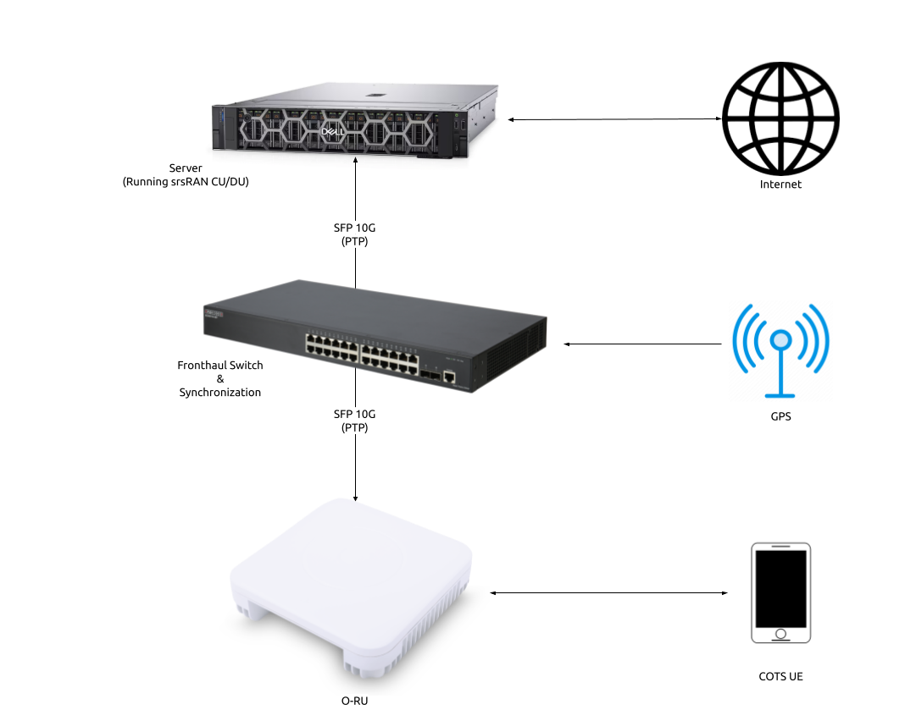

.. _oran_ru_tutorial: 

O-RAN 7.2 RU Guide
##################

Overview
********

The srsRAN Project supports both split 7.2 and split 8 fronthaul interfaces to Radio Units (RUs). This tutorial outlines the general steps required to interface an RU with the srsRAN CU/DU via split 7.2. For more detailed instructions 
on specific O-RUs select an RU from :ref:`this list <hw_integration>`. 

:ref:`Split 7.2 <7_2_split>` is an open specification published by the O-RAN Alliance aiming to  ensure interoperability between different DU and RU solutions.  

The split 7.2 interface is supported in srsRAN through the Open Fronthaul (OFH) Library. Developed by the SRS team, OFH is an open-source, portable library with minimal 3rd-party dependencies. It has been designed to minimize the integration 
and configuration burden associated with using srsRAN with 3rd-party O-RUs. 

----

Setup Considerations
********************

This tutorial uses the following hardware: 

    - Server (Running srsRAN Project CU/DU)

      - CPU: AMD Ryzen 7 5700G
      - MEM: 64GB
      - NIC: Intel Corporation 82599ES 10-Gigabit
      - OS: Ubuntu 22.04 (5.15.0-1037-realtime)

    - Fronthaul switch & synchronization
    - RU
    - COTS UE (OnePlus 9)
    
With the following software:

    - `srsRAN Project <https://github.com/srsran/srsRAN_project>`_
    - `Open5GS 5G Core <https://open5gs.org/>`_

CU/DU 
=====

The CU/DU is provided by the srsRAN Project gNB. The Open Fronthaul (OFH) Library provides the necessary interface between the DU and the RU. The DU is connected to the fronthaul switch via SFP+ fiber cable. 

RU 
=====

Users should chose the RU that best suits their usecase and specific requirements. There are various O-RUs available with specific implementations for indoor and outdoor use, various price points, and various hardware capabilities. A list of tested O-RUs 
can be found :ref:`here <hw_integration>`, along with details on using them with the srsRAN Project gNB. 

For all set-ups the RU should be connected to the fronthaul switch via SFP+ fiber cable through the main fronthaul interface. 

5G Core
=======

For this example we use the Open5GS 5G Core.

Open5GS is a C-language open-source implementation for 5G Core and EPC. The following links will provide you
with the information needed to download and setup Open5GS so that it is ready to use with srsRAN:

    - `GitHub <https://github.com/open5gs/open5gs>`_
    - `Quickstart Guide <https://open5gs.org/open5gs/docs/guide/01-quickstart/>`_

Synchronization
===============

The split 7.2 interface requires tight timing synchronization between the DU and RU. O-RAN WG 4 has defined various synchronization methods for use with Open Fronthaul. These are outlined in O-RAN.WG4.CUS.0-R003-v11.00 Section 11.

In this setup we use LLS-C3. The LLS-C3 configuration enables the distribution of network timing between central sites and remote sites from PRTC/T-GM to RU. In simpler terms, it allows the synchronization of one or more PRTC/T-GM devices (serving as PTP master) in the fronthaul network to transmit network timing signals to DU and RU components as seen in the figure above. 
In our setup the fronthaul switch is acting as the PTP grandmaster (which is synchronized via GPS), providing timing to the RU and the DU. These are connected to the SFP+ 10G ports on the switch via Ethernet. 

.. note::
   The OFH library supports all of the defined clock model and synchronization topologies defined by O-RAN WG4. The use of LLS-C3 is specific to this example.

Switch
------

The chosen switch should be a timing-aware O-RAN switch & PTP grandmaster. This is used to provide both clocking and timing synchronization to both the DU and RU. 

----

Configuration
*************

Switch
======

Refer to the specific Switch documentation to correctly configure it. Specifically any timing and routing options that may need to be configured. 

We recommend using the manufacturers documentation as well as the specific switch guide from SRS if it is available in the :ref:`Integration Guide <hw_integration>`.

CU/DU
=====

.. _nic_configuration: 

NIC configuration
-----------------

The DU machine should have jumbo frames enabled in the NIC and the PTP process should be checked to make sure it is synchronized correctly. 

To set the jumbo frames in the NIC use the following command for a temporary configuration: 

.. code-block:: bash

   ifconfig <eth0> mtu 9600 up 

Where ``eth0`` is the ethernet port for the SFP+ fiber cable that connects the DU to the fronthaul switch.

.. _ptp_gnb_config: 

PTP configuration
-----------------

To start the PTP process in the DU, use the command below. The configuration file can be downloaded :download:`here <.configs/default.cfg>`

.. code-block:: bash

   ./ptp4l -2 -i enp1s0f0 -f ./configs/default.cfg -m

You should then see the following output: 

.. code-block:: bash

    ptp4l[4321.966]: rms    6 max   14 freq -25784 +/-   9 delay   172 +/-   1
    ptp4l[4323.091]: rms    5 max   10 freq -25778 +/-   8 delay   170 +/-   1
    ptp4l[4324.216]: rms    6 max   11 freq -25781 +/-   9 delay   169 +/-   1
    ptp4l[4325.341]: rms    5 max   10 freq -25783 +/-   8 delay   170 +/-   1

In the above output, the ``rms`` value can be used to determine if the PTP sync is correct, for this we look for a value < 10. 

Next, run: 

.. code-block:: bash

    ./phc2sys -s enp1s0f0 -w -m -R 8 -f ./configs/default.cfg

You should then see the following output: 

.. code-block:: bash

    phc2sys[4348.303]: CLOCK_REALTIME phc offset       -25 s2 freq   +8026 delay   1467
    phc2sys[4348.428]: CLOCK_REALTIME phc offset       -11 s2 freq   +8033 delay   1466
    phc2sys[4348.553]: CLOCK_REALTIME phc offset       -25 s2 freq   +8016 delay   1396
    phc2sys[4348.678]: CLOCK_REALTIME phc offset        -5 s2 freq   +8028 delay   1397

The first value here is used to determine if the PTP sync is correct, for this we look for a value < 100. 

In both of the above commands ``enp1s0f0`` is the network interface on our DU that gets the PTP sync. 

srsRAN configuration
--------------------

Sample configuration files for the CU/DU can be downloaded from `here <https://github.com/srsran/srsRAN_Project/blob/main/configs/>`_. There is an associated configuration file for each of the tested RUs. 

The main configuration steps for the CU/DU occur in the ``ru_ofh`` field. Here the CU/DU is configured to match the capabilities of the RU being used. All parameters should be configured specifically for each RU. 

See the specific RU guides in the :ref:`Integration Guide <hw_integration>` for more information on configuring the CU/DU.

RU 
=====

Refer to the specific RU documentation to correctly configure the RU. Ensure the RU is running before trying to make any configuration changes.

We recommend using the manufacturers documentation as well as the specific RU guide from SRS if it is available in the :ref:`Integration Guide <hw_integration>`.

Core
=====

For this setup Open5GS is used as the core, it is running in a docker. 

The Open5GS `5G Core Quickstart Guide <https://open5gs.org/open5gs/docs/guide/01-quickstart/#:~:text=restart%20open5gs%2Dsgwud-,Setup%20a%205G%20Core,-You%20will%20need>`_ provides a comprehensive overview of how to configure Open5GS to run as a 5G Core. 

To configure the core correctly the following steps need to be taken: 

    - Configure the core to connect to the gNB, ensuring the correct AMF address for both.
    - Configure the PLMN and TAC values so that they are the same as those present in the gNB configuration.
    - Register the ISIM credentials of the UE to the list of subscribers through the Open5GS WebUI.

-----

Initializing the Network
************************

RU 
=====

To bring up the RU simply boot it and ensure it is running correctly before attempting to connect the DU. Check for RU synchronization and that the PTP process is running correctly. 

These exact steps will vary depend on the RU being used. 

CU/DU
=====

Before running the CU/DU, make sure you have used the commands outlined in the configuration section above to confirm the PTP sync between the DU and the fronthaul switch. 

We can now run the CU/DU. First, navigate to *srsRAN_Project/build/apps/gnb*, and then run the gNB with the following command: 

.. code-block:: bash

   sudo ./gnb -c <RU_CONFIG>

Where ``<RU_CONFIG>`` is the configuration file associated with the RU being used. 

If the DU connects to the RU successfully, you will see the following output or similar: 

.. code-block:: bash

    --== srsRAN gNB (commit ) ==--

    Connecting to AMF on 10.53.1.2:38412
    Initializing Open Fronthaul Interface with ul_comp=[BFP,9], dl_comp=[BFP,9], prach_cp_enabled=false, downlink_broadcast=true.
    Operating a 20MHz cell over a RU with instantaneous bandwidth of 100MHz.
    Warning: Configured PRACH occasion collides with PUCCH RBs ([0..1) intersects [0..3)). Some interference between PUCCH and PRACH is expected.
    Warning: Configured PRACH occasion collides with PUCCH RBs ([0..1) intersects [0..3)). Some interference between PUCCH and PRACH is expected.
    Cell pci=1, bw=20 MHz, dl_arfcn=634548 (n78), dl_freq=3518.22 MHz, dl_ssb_arfcn=634464, ul_freq=3518.22 MHz

    ==== gNodeB started ===
    Type <t> to view trace

---- 

.. _conn_network: 

Connecting to the Network
*************************

The following sections will outline two different approaches for connecting to the network. The first will show how to connect to the network using a COTS UE, the second will show how to connect using the AmariUE UE emulator from Amarisoft. 

COTS UE
=======

For full details on configuring and connecting a COTS UE to the srsRAN Project gNB see :ref:`this tutorial <COTS_UE_tutorial>`.

For this setup a OnePlus 9 5G UE was used to connect to the network. The set-up and configuration of the device is the same as in the above tutorial. 

AmariUE 
========

Additionally, third party UEs, such as AmariUE can be used to connect to the network. 

For full details on configuring and connecting AmariUE to the srsRAN Project gNB see :ref:`this tutorial <amariUE_radios>`. 

Sending Traffic
---------------

Once connected to the network you can use iPerf to generate traffic. The following console trace was taken from the gNB during bi-directional testing: 

.. code-block:: bash

               -------------DL----------------|------------------UL--------------------
     pci rnti  cqi  mcs  brate   ok  nok  (%) | pusch  mcs  brate   ok  nok  (%)    bsr
       1 4601   15   28    38M 1200    0   0% |  17.8   26    15M  493  107  17%   300k
       1 4601   15   28    38M 1186   14   1% |  17.7   26    14M  488  112  18%   300k
       1 4601   15   28    38M 1196    4   0% |  17.8   26    15M  506   94  15%   300k
       1 4601   15   28    38M 1200    0   0% |  17.8   26    15M  501   99  16%   300k
       1 4601   15   28    38M 1200    0   0% |  17.9   26    15M  498  102  17%   300k
       1 4601   15   28    38M 1200    0   0% |  17.9   26    15M  497  103  17%   300k
       1 4601   15   28    38M 1198    2   0% |  17.8   26    15M  497  103  17%   300k
       1 4601   15   28    38M 1194    6   0% |  17.8   26    15M  495  105  17%   300k
       1 4601   15   28    38M 1195    5   0% |  17.8   26    15M  510   89  14%   300k
       1 4601   15   28    38M 1200    0   0% |  17.8   26    15M  503   98  16%   300k
       1 4601   15   28    38M 1200    0   0% |  17.8   26    15M  495  105  17%   300k

-----

Integration Guide
*****************

The :ref:`Integration Guide <hw_integration>` aims to show the specific steps needed to successfully integrate COTS O-RUs and switches with the srsRAN CU/DU for use in an O-RAN split 7.2 compliant network. All of the hardware items listed here have been tested in-house. 

.. toctree:: 
    :maxdepth: 2

    hw_integration.rst

