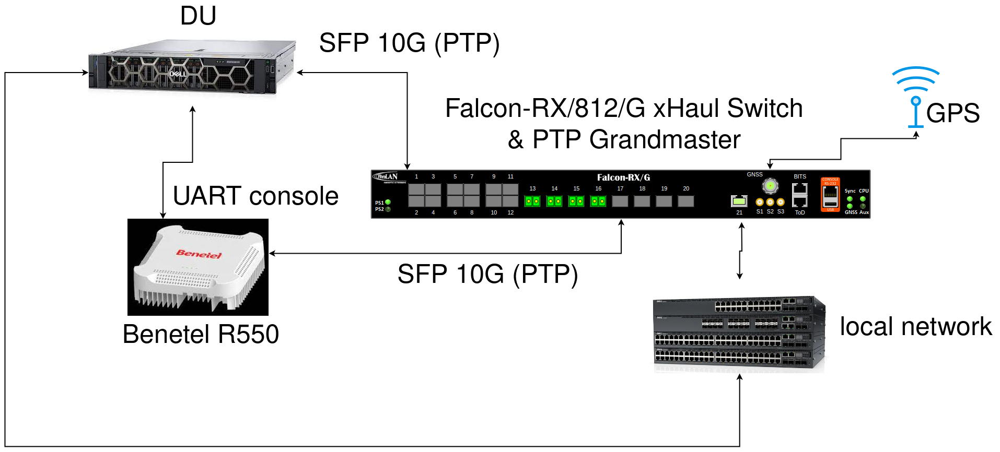
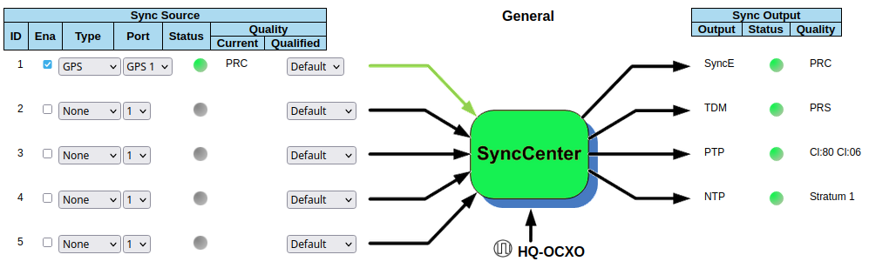
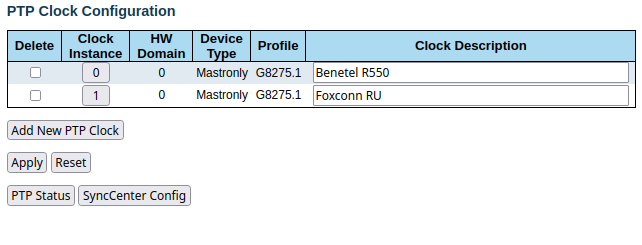

.. _oran_ru_tutorial: 

srsRAN gNB with ORAN RU
#######################

Overview
********

srsRAN Project supports :ref:`O-RAN Split 7.2 <7_2_split>` and Split 8. Split 7.2 supports the uncoupling of radio hardware and baseband processing through the Fronthaul interface. In this turorial 
we will demonstrate how to connect the srsRAN Project gNB to an O-RAN RU using Split 7.2. For this example we will demonstrate the `Benetel RAN550 RU <https://benetel.com/ran550/>`_. Benetel are one of Software Radio Systems' RU partners.  

Split 7.2 is supported through the Open Fronthaul Library (OFH Lib), which is a new library written by the team at Software Radio Systems to enable easy integration with RUs over the Fronthaul interface. OFH Lib is a fully open-source library that 
has been designed and completely implemented by SRS with zero dependencies on 3rd party software. It has been designed to minimize the integration and configuration burden associated with integrating O-RAN CU/DU solutions with 3rd-party RUs. 

----

Setup Considerations
********************

For this tutorial the following hardware and software is used: 

    - Server (Running srsRAN Project CU/DU)

      - CPU: AMD Ryzen 7 5700G
      - MEM: 64GB
      - NIC: Intel Corporation 82599ES 10-Gigabit
      - OS: Ubuntu 22.04 (5.15.0-1037-realtime)

    - `srsRAN Project <https://github.com/srsran/srsRAN_project>`_  (23.05 or later)
    - `Benetel RAN550 RU <https://benetel.com/ran550/>`_ (Firmware version RAN550-1-0.8.1)
    - `Falcon-RX/812/G xHaul Switch (w/ PTP Grandmaster) <https://www.fibrolan.com/Falcon-RX>`_
    - `Open5GS 5G Core <https://open5gs.org/>`_
    - `Amarisoft UE <https://www.amarisoft.com/technology/ue-simulator/>`_  (2021-09-18 or later)

DU 
=====

The DU is provided by the srsRAN Project gNB. As mentioned the Open Fronthaul Library (OFH Lib) provides the necessary interface between the DU and the RU. The DU is connected to the Falcon-rx via SFP+ fiber cable. 

RU 
=====

The Benetel RAN550 RU is used as the RU in this setup. This is a Split 7.2x indoor O-RU. 

The RU is connected to the Falcon-RX via SFP+ fiber cable through the main fronthaul interface. 

5G Core
=======

For this example we are using Open5GS as the 5G Core.

Open5GS is a C-language Open Source implementation for 5G Core and EPC. The following links will provide you
with the information needed to download and setup Open5GS so that it is ready to use with srsRAN 4G:

    - `GitHub <https://github.com/open5gs/open5gs>`_
    - `Quickstart Guide <https://open5gs.org/open5gs/docs/guide/01-quickstart/>`_

Switch
======

The Falcon-RX switch is a 5G xHaul Timing Aware O-RAN Switch & PTP Grandmaster. This is used to sync both the DU and RU. 

Clocking & Synchronization
--------------------------

O-RAN WG 4 has defined various synchronization methods for use with Open Fronthaul. These are outlined in O-RAN.WG4.CUS.0-R003-v11.00 Section 11. The latest version of the specifications can be downloaded `here <https://orandownloadsweb.azurewebsites.net/specifications>`_.

In this setup we use LLS-C3, this is defined as the following: 

    *Configuration LLS-C3: With this topology, the O-DU is not part of the synchronization chain towards the ORU. Network timing is distributed from PRTC/T-GM to O-RU typically between central sites (or aggregation
    sites) and O-RU sites. One or more Ethernet switches are allowed in the fronthaul network. Interconnection
    among switches and fabric topology (for example mesh, ring, tree, spur etc.) are deployment decisions which
    are out of the scope of the present document.*

In the described setup the Falcon xHaul Switch is providing the PTP Grandmaster (which is synchronized via GPS) to the RU and the DU. These are connected to the SFP 10G ports on the switch via ethernet. 

.. note::
   The OFH Lib will work with any of the defined clock model and synchronization topologies defined by O-RAN WG4. The use of LLS-C3 is specific to this setup. The use of OFH Lib is agnostic to the clock model and synchronization topology being used. 

----

Configuration
*************

Falcon-RX
=========

SyncCenter
-----------

The switch must be connected to an external clock source to ensure the PTP Grandmaster is synchronized correctly. Once connected it is important to check that the GPS has been locked correctly and an accurate clock source is being provided. In this example a GPS reference is used.

To do this, navigate to the FalconRX configuration GUI and go to *Configuration > Timing > SyncCenter* and select ``GPS`` as the ``Sync Source Type``. Once this is done, wait for the GPS to lock and synchronize correctly. The SyncCenter will
display as green once it has successfully locked to the GPS signal. This is shown in the above image.

PTP Clocks
----------

Once the PTP Grandmaster is successfully synchronized it must be configured correctly for use with the DU and RU. 

First, go to *Configuration > Timing > PTP* and add a new PTP Clock. Select ``Device Type: Master Only`` and ``Profile: G8275.1``. This is shown in the above image. After adding the PTP clock, click on the Clock Instance that you want to edit.

.. image:: .imgs/ptp_config_2.png
   :align: center

Once you have selected the Clock Instance you want to edit, set the ``VLAN ID`` to ``1588`` and activate all ports that you want to serve with PTP. From now on the PTP is sent with VLAN ID 1588. 

You should now save your configuration. 

VLAN
-----

Next, the VLANs must be configured correctly so as to allow the DU and RU to receive the PTP sync from the Grandmaster. 

.. image:: .imgs/ptp_vlan.png
   :align: center

Go to *Configuration > VLANs > Configuration* to correctly configure the VLAN settings. First, set ``Allowed Access VLANs:`` as  ``1,2``. Next, configure the ports you want to use as ``Trunk`` ports, set the ``Port VLAN`` as  ``1588``, and 
set ``Egress Tagging`` as ``Untag Port VLAN``. In the ``Allowed VLANs`` field you can set a range or specify specific VLANs. For example, here we are specifying ``1,2,1588``. You **must** include ``1588`` otherwise the DU and RU will not correctly 
receive the PTP sync. 

RU 
=====

In this setup the RU is connected to via SSH and monitored remotely. It is also possible to connect the DU and RU via UART to enable viewing of the console outputs, as shown in the setup diagram. 

Ensure the RU is running before trying to make any configuration changes. 

Edit the init script configuration file found in */usr/sbin/*. The R550 has different scripts based on the configuration you are using 4x2 and 2x2. In 4x2 4 antennas send and 2 antennas receive. In 2x2 2 antennas send and 2 antennas receive. In 2x2 
there are 2 configurations: one uses antennas 1 and 3, the other uses antenna 2 and 4. We have tested the mode 4x2, but only using a single antenna to transmit and once for receiving (SISO). The configuration for this mode can be found in  
*/usr/sbin/radio_setup_ran550_1_a_4x2.sh*

Inside this file, these parameters should be modified:

**MAC Address**

The MAC address of the DU for Control-Plane and user Plane traffic. In our configuration we use the same MAC address for both planes. 

**VLAN tag**

In this setup the same VLAN is used for all the network traffic, as only one MAC address is used. In this setup, these values are set to ``1``.

**Compression Parameters**

Currently only static compression headers are supported for this setup. In static compression, the compression header is not sent in the Open Fronthaul message for User-Plane messages. The compression header must 
be disabled by configuring the registers ``c0350`` and ``c0351`` to ``0``. 

There is also no differentiation made between PRACH and Slot traffic in the uplink so, the static compression algorithm method should be selected for PRACH data by configuring the register ``c0352`` to ``0``.
The compression header for downlink User-Plane, uplink User-Plane and uplink PRACH data is also disabled. 

As the uplink data and PRACH data share the same compression method, the compression is enabled for PRACH by setting the register ``C0353`` to ``1``.

Once this file is saved, a reboot is needed in the RU to apply these parameters using the reboot command.

**Transmission Attenuation Parameters**

By default, the RU initializes the attenuation for all antennas to around ~7dB. If the RU is too close to the UE, these attenuation values are small and should be increased to avoid saturating the UE.

To modify the attenuation parameters use the following command: 

.. code-block:: bash

   radiocontrol -o A <attenuation> <antenna id>

Where *<attenuation>* is the attenuation in milli dBs (20000=20dB), valid range:[3000-40000], and *<antenna id>* is the antenna id [1,2,4,8] (antenna 1=1, antenna 2=2, antenna 3=4, antenna 4=8).

In this setup the following attenuation values give the best results: 

    - TX1 -> 17000 mdB
    - TX2 -> 40000 mdB
    - TX3 -> 40000 mdB
    - TX4 -> 40000 mdB

These values will be dependent on your local setup. 

To verify the correct configuration of the parameters use the following command: 

.. code-block:: bash

   radiocontrol -o G a
   
**TDD pattern**

The tdd pattern should be changed to 6-3 format (DDDDDDSUU) by editing the file `/etc/tdd.xml` so that it becomes: 

.. code-block:: xml

    <xml>                                                                                                                                                                                                      
        <tdd-config version="1.0">
            <description>DDDDDDDSUU</description>
            <pattern index="1">
                <slots>DDDD</slots>
                <numerology>1</numerology>
                <periodicity>2</periodicity>
                <special-slot-symbols></special-slot-symbols>
            </pattern>
                <pattern index="2">
                <slots>DDSUUU</slots>
                <numerology>1</numerology>
                <periodicity>3</periodicity>
                <special-slot-symbols>DDDDDDGGGGUUUU</special-slot-symbols>
            </pattern>
        </tdd-config>
    </xml> 

the change is in the 2nd pattern, originally it's DDDSUU, we need to change to DDSUUU. 

The RU needs to be rebooted after this change

Core
=====

For this setup Open5GS is used as the core, it is running in a docker. 

The Open5GS `5G Core Quickstart Guide <https://open5gs.org/open5gs/docs/guide/01-quickstart/#:~:text=restart%20open5gs%2Dsgwud-,Setup%20a%205G%20Core,-You%20will%20need>`_ provides a comprehensive overview of how to configure Open5GS to run as a 5G Core. 

To configure the core correctly the following steps need to be taken: 

    - Configure the core to connect to the gNB, ensuring the correct AMF address for both.
    - Configure the PLMN and TAC values so that they are the same as those present in the gNB configuration.
    - Register the ISIM credentials of the UE to the list of subscribers through the Open5GS WebUI.

DU
=====

There are two steps to configuring the DU correctly, first the machine running the DU must be configured, then the srsRAN Project gNB. 

DU Machine
----------

The DU machine should have jumbo frames enabled in the NIC and the PTP process should be checked to make sure it is synchronized correctly. 

To set the jumbo frames in the NIC use the following command for a temporal configuration: 

.. code-block:: bash

   ifconfig <eth0> mtu 9600 up 

Where ``eth0`` is the ethernet port for the SFP+ fiber cable that connects the DU to the Falcon-RX.

To start the PTP process in the DU, use the following commands:

You can download the configuration file used in these commands :download:`here <.configs/default.cfg>`  

.. code-block:: bash

   ./ptp4l -2 -i enp1s0f0 -f ./configs/default.cfg -m

You should then see the following output: 

.. code-block:: bash

    ptp4l[4321.966]: rms    6 max   14 freq -25784 +/-   9 delay   172 +/-   1
    ptp4l[4323.091]: rms    5 max   10 freq -25778 +/-   8 delay   170 +/-   1
    ptp4l[4324.216]: rms    6 max   11 freq -25781 +/-   9 delay   169 +/-   1
    ptp4l[4325.341]: rms    5 max   10 freq -25783 +/-   8 delay   170 +/-   1
    ptp4l[4326.466]: rms    5 max   10 freq -25780 +/-   8 delay   171 +/-   0
    ptp4l[4327.591]: rms    4 max   11 freq -25782 +/-   7 delay   170 +/-   0
    ptp4l[4328.716]: rms    5 max   14 freq -25783 +/-   8 delay   170 +/-   1
    ptp4l[4329.841]: rms    5 max    9 freq -25781 +/-   8 delay   170 +/-   1
    ptp4l[4330.966]: rms    6 max   13 freq -25783 +/-   9 delay   170 +/-   1
    ptp4l[4332.091]: rms    6 max   11 freq -25779 +/-   9 delay   171 +/-   1
    ptp4l[4333.215]: rms    3 max    5 freq -25778 +/-   5 delay   171 +/-   0
    ptp4l[4334.340]: rms    5 max    8 freq -25778 +/-   8 delay   171 +/-   1
    ptp4l[4335.465]: rms    3 max    6 freq -25778 +/-   5 delay   171 +/-   1
    ptp4l[4336.590]: rms    4 max    8 freq -25778 +/-   6 delay   170 +/-   1
    ptp4l[4337.715]: rms    3 max    6 freq -25781 +/-   5 delay   170 +/-   1
    ptp4l[4338.840]: rms    4 max    8 freq -25780 +/-   6 delay   171 +/-   0
    ptp4l[4339.965]: rms    4 max   10 freq -25783 +/-   7 delay   170 +/-   0

In the above output, the ``rms`` value can be used to determine if the PTP sync is correct, for this we look for a value < 100. 

Next, run: 

.. code-block:: bash

    ./phc2sys -s enp1s0f0 -w -m -R 8 -f ./configs/default.cfg

You should then see the following output: 

.. code-block:: bash

    phc2sys[4345.674]: CLOCK_REALTIME phc offset       -58 s2 freq   +7741 delay   1397
    phc2sys[4345.799]: CLOCK_REALTIME phc offset      -289 s2 freq   +7493 delay    838
    phc2sys[4345.924]: CLOCK_REALTIME phc offset        88 s2 freq   +7783 delay   1397
    phc2sys[4346.049]: CLOCK_REALTIME phc offset        -3 s2 freq   +7718 delay   1397
    phc2sys[4346.174]: CLOCK_REALTIME phc offset        60 s2 freq   +7780 delay   1397
    phc2sys[4346.300]: CLOCK_REALTIME phc offset       134 s2 freq   +7872 delay   1397
    phc2sys[4346.425]: CLOCK_REALTIME phc offset       238 s2 freq   +8017 delay   1396
    phc2sys[4346.550]: CLOCK_REALTIME phc offset        18 s2 freq   +7868 delay   1397
    phc2sys[4346.675]: CLOCK_REALTIME phc offset       100 s2 freq   +7955 delay   1397
    phc2sys[4346.800]: CLOCK_REALTIME phc offset        70 s2 freq   +7955 delay   1396
    phc2sys[4346.925]: CLOCK_REALTIME phc offset      -411 s2 freq   +7495 delay   1397
    phc2sys[4347.051]: CLOCK_REALTIME phc offset        59 s2 freq   +7842 delay   1396
    phc2sys[4347.176]: CLOCK_REALTIME phc offset       115 s2 freq   +7916 delay   1396
    phc2sys[4347.301]: CLOCK_REALTIME phc offset       113 s2 freq   +7948 delay   1327
    phc2sys[4347.426]: CLOCK_REALTIME phc offset       178 s2 freq   +8047 delay   1397
    phc2sys[4347.551]: CLOCK_REALTIME phc offset       144 s2 freq   +8067 delay   1397
    phc2sys[4347.677]: CLOCK_REALTIME phc offset       103 s2 freq   +8069 delay   1397
    phc2sys[4347.802]: CLOCK_REALTIME phc offset         3 s2 freq   +8000 delay   1467
    phc2sys[4347.927]: CLOCK_REALTIME phc offset        65 s2 freq   +8063 delay   1397
    phc2sys[4348.052]: CLOCK_REALTIME phc offset        41 s2 freq   +8058 delay   1396
    phc2sys[4348.178]: CLOCK_REALTIME phc offset        73 s2 freq   +8102 delay   1397
    phc2sys[4348.303]: CLOCK_REALTIME phc offset       -25 s2 freq   +8026 delay   1467
    phc2sys[4348.428]: CLOCK_REALTIME phc offset       -11 s2 freq   +8033 delay   1466
    phc2sys[4348.553]: CLOCK_REALTIME phc offset       -25 s2 freq   +8016 delay   1396
    phc2sys[4348.678]: CLOCK_REALTIME phc offset        -5 s2 freq   +8028 delay   1397
    phc2sys[4348.803]: CLOCK_REALTIME phc offset      -201 s2 freq   +7831 delay   1397

The first value here is used to determine if the PTP sync is correct, for this we look for a value < 1000. 

In both of the above commands ``enp1s0f0`` is the network interface that gets the ptp sync, this may vary in user's local setups. 

srsRAN Project gNB
------------------

A sample configuration file for the DU can be downloaded from :download:`here <.configs/du_R550_rf.yml>`.

The following excerpt shows how the DU is configured to communicate with the RU: 

.. code-block:: yaml

  ru_ofh:
    ru_bandwidth_MHz: 100                                           # RU instantaneous bandwidth.
    t1a_max_cp_dl: 500                                              # Maximum T1a on Control-Plane for Downlink in microseconds.
    t1a_min_cp_dl: 250                                              # Minimum T1a on Control-Plane for Downlink in microseconds.
    t1a_max_cp_ul: 465                                              # Maximum T1a on Control-Plane for Uplink in microseconds.
    t1a_min_cp_ul: 250                                              # Minimum T1a on Control-Plane for Uplink in microseconds.
    t1a_max_up: 250                                                 # Maximum T1a on User-Plane in microseconds.
    t1a_min_up: 80                                                  # Minimum T1a on User-Plane in microseconds.
    is_prach_cp_enabled: false                                      # Configures if Control-Plane messages should be used to receive PRACH messages.
    is_dl_broadcast_enabled: true                                   # Set to true for a workaround over a firmware bug in the RAN550 when operating in SISO mode.
    compr_method_ul: bfp                                            # Uplink compression method.
    compr_bitwidth_ul: 9                                            # Uplink IQ samples bitwidth after compression.
    compr_method_dl: bfp                                            # Downlink compression method.
    compr_bitwidth_dl: 9                                            # Downlink IQ samples bitwidth after compression.
    iq_scaling: 0.27                                                # IQ samples scaling factor applied before compression, should be a positive value smaller than 1.
    cells:
      - network_interface: enp1s0f0                                 # Ethernet interface name used to communicate with the RU.
        ru_mac_addr: 70:b3:d5:e1:5b:06                              # RU MAC address.
        du_mac_addr: 80:61:5f:0d:df:aa                              # DU MAC address.
        vlan_tag: 1                                                 # VLAN tag value.
        prach_port_id: 4                                            # PRACH eAxC port value.
        dl_port_id: [0,1]                                           # Downlink eAxC port values.
        ul_port_id: 0                                               # Uplink eAxC port values.

To expand on this, the following parameters are set in the ``cells`` field:

    - ``network_interface`` : Network interface used to send the OFH packets.
    - ``ru_mac_addr`` : MAC address of the R550.
    - ``du_mac_addr`` : MAC address of the interface used by the gNB (it should be connected directly to the RU or using a smart switch).
    - ``vlan_tag`` : V-LAN identifier, should be set to the value configured in the switch settings
----

Initializing the Network
************************

RU 
=====

To bring up the RU simply boot it and ensure it is running correctly before attempting to connect the DU. 

To ensure the RU had booted correctly, you can view the output of */tmp/logs/radio_status*. If successful you should see the following output: 

.. code-block:: bash
    :emphasize-lines: 6, 38

    [INFO] Platform: RAN550_A_4x2_FlexRAN
    [INFO] Frequency: 3558.18
    [INFO] Radio bringup begin, 82.40 seconds since boot
    [INFO] Initlialize TDD Pattern
    [INFO] Waiting for Sync
    [INFO] Sync completed
    [INFO] Set expected DU MAC Address for C-Plane Traffic (C0319/C031A)
    [INFO] Set expected DU MAC Address for U-Plane Traffic (C0315/C0316)
    [INFO] Set required DU VLAN Tag Control Information for uplink U-Plane Traffic (C0318)
    [INFO] Set expected DU VLAN Tag Control Information for downlink U-Plane Traffic (C0330)
    [INFO] Set expected DU VLAN Tag Control Information for downlink C-Plane Traffic (C0331)
    [INFO] Aligning TDD switching relative to downlink and uplink data and with respect to PPS (C0366)
    [INFO] Aligning FPGA uplink timing to arrival of uplink frame(C0303)
    [INFO] Set the Number of Tx's to 4 (C0300)
    [INFO] Enable  udCompHdr option for DL (C0352)
    [INFO] Enable  udCompHdr option for UL (C0352)
    [INFO] Enable  udCompHdr option for PRACH (C0352)
    [INFO] Set PRACH compression disable for FlexRAN (C0353)
    [INFO] Set Downlink scaling 6 dB for FlexRAN (C0358)
    [INFO] Configure eAxC ID via /etc/eaxc.xml settings, as M-Plane is disabled.
    [INFO] Set expected RU PRACH Configuration Index (C0322)
    [INFO] Start Radio Configuration
    [INFO] Initialize RF SoC
    [INFO]  Configure CFR for Antenna 1 (0.54)
    [INFO] Configure CFR for Antenna 2 (0.54)
    [INFO] Configure CFR for Antenna 3 (0.54)
    [INFO] Configure CFR for Antenna 4 (0.54)
    [INFO] Move platform to TDD mode
    [INFO] Set CP60 as TDD control master
    [INFO] DPD Tx1 configuration
    [INFO] DPD Tx2 configuration
    [INFO] DPD Tx3 configuration
    [INFO] DPD Tx4 configuration
    [INFO] Enable PA Protection on Transmitters
    [INFO] End Radio Configuration - Start U-Plane Data
    [INFO]  
    [INFO] Set the attenuation for TX1/2/3/4
    [INFO] Radio bringup complete
     17:51:50 up 5 min,  load average: 0.19, 0.29, 0.15

Pay close attention to the line highlighted above to make sure that the RU is synchronized correctly.

You should also verify that the PTP process is running correctly, to do this check the output of the processes in */var/log/pcm4l*. It should look like the following: 

.. code-block:: bash

    RE::SyncAnalysis: 2023-05-26 10:35:45 549015038 ns [3, Tracker#0] (3240) offset: 0.5 ns    delay: 69.5 ns  
    RE::SyncAnalysis: 2023-05-26 10:35:59 401045478 ns [3, Tracker#0] (3240) offset: 0.0 ns    delay: 69.0 ns  
    RE::SyncAnalysis: 2023-05-26 10:36:13 109073756 ns [3, Tracker#0] (3240) offset: 0.0 ns    delay: 69.0 ns  
    RE::SyncAnalysis: 2023-05-26 10:36:27 313113802 ns [3, Tracker#0] (3240) offset: 0.5 ns    delay: 69.5 ns  
    RE::SyncWarning: 2023-05-26 10:36:37 085001763 ns [3, Tracker#0] (2093) Outlier detected: -831.5 (ns), variance 6.883508e-13 >= 4.518154e-14 threshold  
    RE::SyncAnalysis: 2023-05-26 10:36:41 797023749 ns [3, Tracker#0] (3240) offset: -0.5 ns    delay: 69.5 ns  
    RE::SyncWarning: 2023-05-26 10:36:51 709001537 ns [3, Tracker#0] (2093) Outlier detected: -832.0 (ns), variance 6.874613e-13 >= 6.661078e-14 threshold  
    RE::SyncAnalysis: 2023-05-26 10:36:55 013023628 ns [3, Tracker#0] (3240) offset: 0.5 ns    delay: 69.5 ns  
    RE::SyncAnalysis: 2023-05-26 10:36:55 645081078 ns [3, Tracker#0] (3203) 	numberOfCorrection: 692722, mean: -2.6 ns, std: 49.3 ns.  
    RE::SyncAnalysis: 2023-05-26 10:37:09 005011045 ns [3, Tracker#0] (3240) offset: 0.5 ns    delay: 69.5 ns  
    RE::SyncAnalysis: 2023-05-26 10:37:22 713080466 ns [3, Tracker#0] (3240) offset: 0.0 ns    delay: 69.0 ns  
    RE::SyncAnalysis: 2023-05-26 10:37:37 057062769 ns [3, Tracker#0] (3240) offset: 0.0 ns    delay: 70.0 ns  

The ``offset`` parameter in the above example output can be used to tell if the PTP synchronization is good or not. If the value is less than ``1.0 ns``, then the PTP synchronization is good.    

DU
=====

Before running the DU, make sure you have used the commands outlined in the configuration section above to confirm the PTP sync between the DU and the Falcon-RX. 

The DU can now be run. First, navigate to *srsRAN_Project/build/apps/gnb*, and then run the gNB with the following command: 

.. code-block:: bash

   sudo ./gnb -c du_R550_rf.yml

If the DU connects to the RU successfully, you will see the following output: 

.. code-block:: bash

    --== srsRAN gNB (commit ) ==--

    Connecting to AMF on 10.53.1.2:38412
    Initializing Open Fronthaul Interface with ul_comp=[BFP,9], dl_comp=[BFP,9], prach_cp_enabled=false, downlink_broadcast=true.
    Operating a 20MHz cell over a RU with instantaneous bandwidth of 100MHz.
    Warning: Configured PRACH occasion collides with PUCCH RBs ([0..1) intersects [0..3)). Some interference between PUCCH and PRACH is expected.
    Warning: Configured PRACH occasion collides with PUCCH RBs ([0..1) intersects [0..3)). Some interference between PUCCH and PRACH is expected.
    Cell pci=1, bw=20 MHz, dl_arfcn=634548 (n78), dl_freq=3518.22 MHz, dl_ssb_arfcn=634464, ul_freq=3518.22 MHz

    ==== gNodeB started ===
    Type <t> to view trace

---- 

Connecting to the Network
*************************

The following sections will outline two different approaches for connecting to the network. The first will show how to connect to the network using AmariUE from Amarisoft, the second will show how 
to connect using a 5G COTS UE. 

AmariUE 
========

For full details on configuring and connecting AmariUE to the srsRAN Project gNB see :ref:`this tutorial <amariUE_radios>`. 

Connecting to the Network
-------------------------

You can download the specific config used for this tutorial :download:`here <.configs/amariUE_R550_20mhz.cfg>`.

Launch the UE with root permissions to create the TUN device using the following command:

.. code-block:: bash

  /root/ue/lteue /root/ue/config/amariUE_R550_20mhz.cfg

The above command should start the UE and attach it to the network.
If UE connects successfully to the network, the following should be displayed at the end of the console output:

.. code-block:: bash

    Cell 0: SIB found
    UE PDN TUN iface requested: ue_id: ue1, pdn_id: 0, ifname: ue1-pdn0, ipv4_addr: 10.45.1.2, ipv4_dns: 8.8.4.4, ipv6_local_addr: , ipv6_dns: 
    Created iface ue1-pdn0 with 10.45.1.2

Sending Traffic
---------------

Instructions for sending iPerf and ping traffic and example outputs can be found :ref:`here <amariUE_radios_test>`. 

COTS UE
=======

For full details on configuring and connecting a COTS UE to the srsRAN Project gNB see :ref:`this tutorial <COTS_UE_tutorial>`.

For this setup a OnePlus 9 5G UE was used to connect to the network. The set-up and configuration of the device is the same as in the above tutorial. 

Sending Traffic
---------------

Once connected to the network you can use send traffic and connect to the internal as normal. The following console trace was taken from the gNB during bi-directional testing: 

.. code-block:: bash

           -------------DL----------------|------------------UL--------------------
     pci rnti  cqi  mcs  brate   ok  nok  (%) | pusch  mcs  brate   ok  nok  (%)    bsr
       1 4601   15   28    38M 1200    0   0% |  17.8   26    15M  493  107  17%   300k
       1 4601   15   28    38M 1186   14   1% |  17.7   26    14M  488  112  18%   300k
       1 4601   15   28    38M 1196    4   0% |  17.8   26    15M  506   94  15%   300k
       1 4601   15   28    38M 1200    0   0% |  17.8   26    15M  501   99  16%   300k
       1 4601   15   28    38M 1200    0   0% |  17.9   26    15M  498  102  17%   300k
       1 4601   15   28    38M 1200    0   0% |  17.9   26    15M  497  103  17%   300k
       1 4601   15   28    38M 1198    2   0% |  17.8   26    15M  497  103  17%   300k
       1 4601   15   28    38M 1194    6   0% |  17.8   26    15M  495  105  17%   300k
       1 4601   15   28    38M 1195    5   0% |  17.8   26    15M  510   89  14%   300k
       1 4601   15   28    38M 1200    0   0% |  17.8   26    15M  503   98  16%   300k
       1 4601   15   28    38M 1200    0   0% |  17.8   26    15M  495  105  17%   300k
   

----

Troubleshooting
***************

----

Tested Devices
**************

