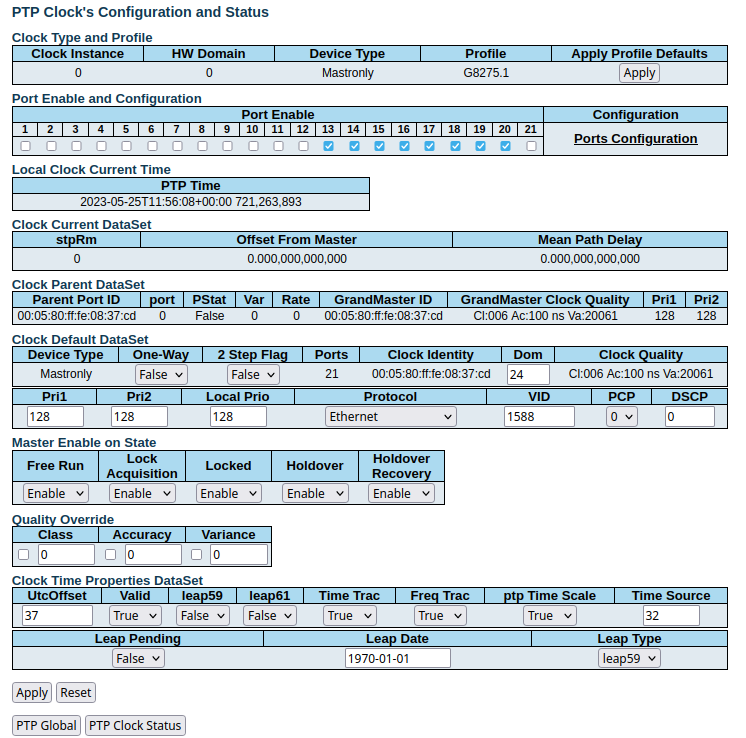
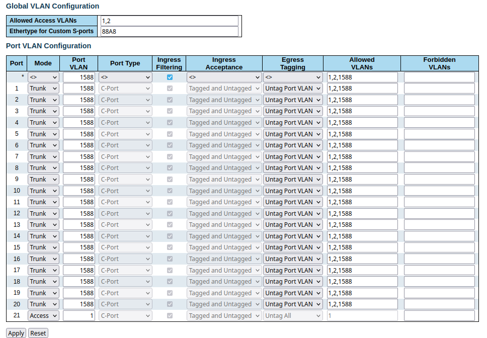

.. _falcon_switch: 

Falcon-RX Switch
################

The `Falcon-RX/812/G Switch <https://www.fibrolan.com/Falcon-RX>`_ is a 5G xHaul timing-aware O-RAN switch & PTP grandmaster. This is used to provide both clocking and timing synchronization to both the DU and RU. 

SyncCenter
**********

The switch must be connected to an external clock source to ensure the PTP grandmaster is synchronized correctly. Once connected it is important to check that the GPS has been locked correctly and an accurate clock source is being provided. In this example a GPS reference is used.

.. image:: .imgs/sync_center.png
    :align: center  

To do this, navigate to the FalconRX configuration GUI and go to *Configuration > Timing > SyncCenter* and select ``GPS`` as the ``Sync Source Type``. Once this is done, wait for the GPS to lock and synchronize correctly. The SyncCenter will display green once it has successfully locked to the GPS signal. This is shown in the above image.

PTP Clocks
**********

Once the PTP grandmaster is successfully synchronized it must be configured correctly for use with the DU and RU. 

.. image:: .imgs/ptp_config_1.png
   :align: center

First, go to *Configuration > Timing > PTP* and add a new PTP Clock. Select ``Device Type: Master Only`` and ``Profile: G8275.1``. This is shown in the above image. After adding the ``PTP clock``, click on the Clock Instance that you want to edit.

Once you have selected the ``Clock Instance`` you want to edit, set the ``VLAN ID`` to ``1588`` and activate all ports that you want to serve with PTP. From now on the PTP is sent with VLAN ID 1588. 

You should now save your configuration. 

VLAN
****

Next, the VLANs must be configured correctly so as to allow the DU and RU to receive the PTP sync from the grandmaster. 

Go to *Configuration > VLANs > Configuration* to correctly configure the VLAN settings. First, set ``Allowed Access VLANs:`` as  ``1,2``. Next, configure the ports you want to use as ``Trunk`` ports, set the ``Port VLAN`` as  ``1588``, and 
set ``Egress Tagging`` as ``Untag Port VLAN``. In the ``Allowed VLANs`` field you can set a range or specify specific VLANs. For example, here we are specifying ``1,2,1588``. You **must** include ``1588`` otherwise the DU and RU will not correctly 
receive the PTP sync. 