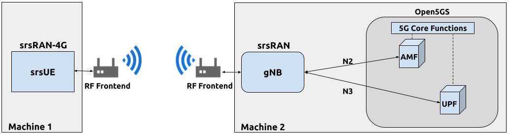
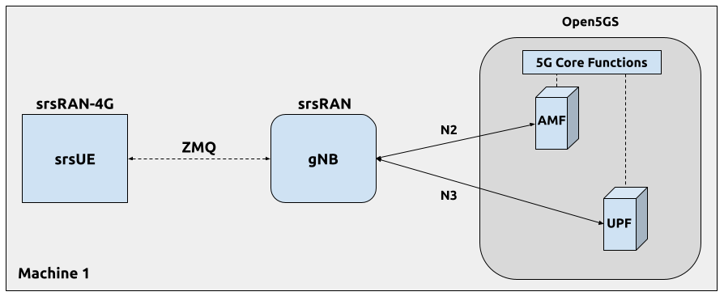
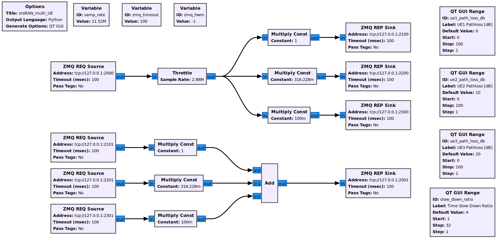
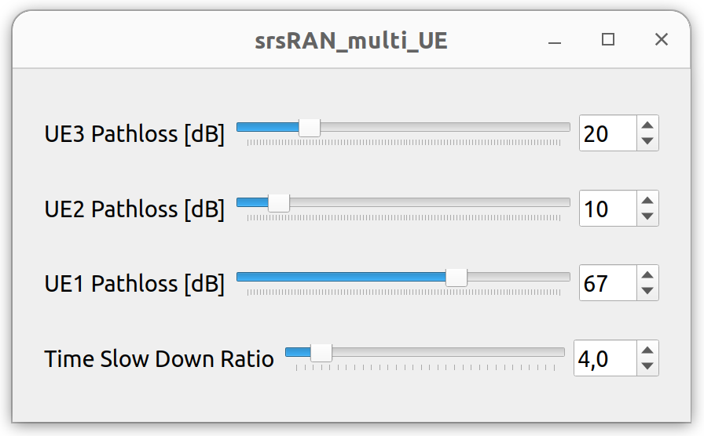

.. srsRAN gNB with srsUE

.. _srsue_appnote:

srsRAN gNB with srsUE
#####################

Overview
********

srsRAN Project is a 5G CU/DU solution and does not include a UE application. However, `srsRAN 4G <https://github.com/srsran/srsRAN_4G>`_ does include a prototype 5G UE (srsUE) which can be used for testing.
This application note shows how to create an end-to-end fully open-source 5G network with srsUE, the srsRAN Project gNodeB and Open5GS 5G core network. 

First, we show how to connect srsUE to the gNodeB over-the-air using USRPs. In the second part, we outline how to use virtual radios based on ZeroMQ instead of SDR hardware.
Virtual radios allow the UE to be connected to the gNodeB over sockets. This approach can be very useful for development, testing, debugging, CI/CD or for teaching and demonstrating.

----- 

Hardware and Software Overview
******************************

For this application note, the following hardware and software are used:

    - PC with Ubuntu 22.04.1 LTS
    - `srsRAN Project <https://github.com/srsran/srsRAN_project>`_
    - `srsRAN 4G <https://github.com/srsran/srsRAN_4G>`_ (23.11 or later)
    - `Two Ettus Research USRP B210s <https://www.ettus.com/all-products/ub210-kit/>`_ (connected over USB3)
    - `Open5GS 5G Core <https://open5gs.org/>`_
    - `ZeroMQ <https://zeromq.org/>`_

Ideally the USRPs would be connected to a 10 MHz external reference clock or GPSDO, although this is not a strict requirment. We recommend the `Leo Bodnar GPSDO <http://www.leobodnar.com/shop/index.php?main_page=product_info&cPath=107&products_id=234&zenid=5194baec39dbc91212ec4ac755a142b6>`_.

srsRAN 4G
=========

If you have not already done so, install the latest version of srsRAN 4G and all of its dependencies. This is outlined in the `installation guide <https://docs.srsran.com/projects/4g/en/latest/general/source/1_installation.html>`_. 

Please check our srsRAN 4G `ZeroMQ Application Note <https://docs.srsran.com/projects/4g/en/latest/app_notes/source/zeromq/source/index.html>`_ for information on installing ZMQ and using it with srsRAN 4G.

Limitations
-----------

The current srsUE implementation has a few feature limitations when running in 5G SA mode. The key feature limitations are as follows:

  - Limited to 15 kHz Sub-Carrier Spacing (SCS), which means only FDD bands can be used. 
  - Limited to 5, 10, 15 or 20 MHz Bandwidth (BW)

Open5GS
=======

For this example, we are using Open5GS as the 5G Core. 

Open5GS is a C-language Open Source implementation for 5G Core and EPC. The following links will provide you 
with the information needed to download and set-up Open5GS so that it is ready to use with srsRAN: 

    - `GitHub <https://github.com/open5gs/open5gs>`_ 
    - `Quickstart Guide <https://open5gs.org/open5gs/docs/guide/01-quickstart/>`_

For the purpose of this application note, we will use a dockerized Open5GS version provided in srsRAN Project at ``srsgnb/docker``.

ZeroMQ
======

On Ubuntu, ZeroMQ development libraries can be installed with:

.. code::

  sudo apt-get install libzmq3-dev
  
Alternatively, ZeroMQ can also be built from source. 

First, one needs to install libzmq:

.. code::

  git clone https://github.com/zeromq/libzmq.git
  cd libzmq
  ./autogen.sh
  ./configure
  make
  sudo make install
  sudo ldconfig

Second, install czmq:

.. code::

  git clone https://github.com/zeromq/czmq.git
  cd czmq
  ./autogen.sh
  ./configure
  make
  sudo make install
  sudo ldconfig

Finally, you need to compile srsRAN Project and srsRAN 4G (assuming you have already installed all the required dependencies). 
Note, if you have already built and installed srsRAN 4G and srsRAN Project prior to installing ZMQ and other dependencies you 
will have to re-build both to ensure the ZMQ drivers have been recognized correctly. 

For srsRAN Project, the following commands can be used to download and build from source: 

.. code::

  git clone https://github.com/srsran/srsRAN_Project.git
  cd srsRAN_Project
  mkdir build
  cd build
  cmake ../ -DENABLE_EXPORT=ON -DENABLE_ZEROMQ=ON
  make -j`nproc`

ZeroMQ is disbaled by default, this is enabled when running ``cmake`` by including ``-DENABLE_EXPORT=ON -DENABLE_ZEROMQ=ON``. 

Pay extra attention to the cmake console output. Make sure you read the following line:

.. code::

  ...
  -- FINDING ZEROMQ.
  -- Checking for module 'ZeroMQ'
  --   No package 'ZeroMQ' found
  -- Found libZEROMQ: /usr/local/include, /usr/local/lib/libzmq.so
  ...

----- 

Over-the-air Setup
******************

The following diagram presents the setup architecture:

Configuration
=============

You can find the srsRAN Project gNB configuration file for this example in the ``configs`` folder of the srsRAN Project source files. You can also find it `here <https://github.com/srsran/srsRAN_Project/tree/main/configs>`_: 

 
  * `gNB FDD srsUE config <https://github.com/srsran/srsRAN_Project/blob/main/configs/gnb_rf_b210_fdd_srsUE.yml>`_

You can download the srsUE config here: 

  * :download:`srsUE <.config/ue_rf.conf>`

It is recommended you use these files to avoid errors while changing configs manually. Any configuration files not included here do not require modification from the default settings.
Details of the modifications made are outlined in following sections.

gNB
---
The following changes need to be made to the gNB configuration file.

The gNB has to connect to AMF in the 5G core network, therefore we need to provide two IP addresses::

  amf:
    addr: 10.53.1.2                  # The address of the AMF. Check Open5GS config -> amf -> ngap -> addr
    bind_addr: 10.53.1.1             # A local IP that the gNB binds to for traffic from the AMF.

Next, we have to configure the RF front-end device::

  ru_sdr:
    device_driver: uhd                # The RF driver name.
    device_args: type=b200            # Optionally pass arguments to the selected RF driver.
    clock: external                   # Specify the clock source used by the RF.
    sync: external                    # Specify the sync source used by the RF.
    srate: 23.04                      # RF sample rate might need to be adjusted according to selected bandwidth.
    tx_gain: 75                       # Transmit gain of the RF might need to adjusted to the given situation.
    rx_gain: 75                       # Receive gain of the RF might need to adjusted to the given situation.

Finally, we configure the 5G cell parameters::

  cell_cfg:
    dl_arfcn: 368500                  # ARFCN of the downlink carrier (center frequency).
    band: 3                           # The NR band.
    channel_bandwidth_MHz: 20         # Bandwith in MHz. Number of PRBs will be automatically derived.
    common_scs: 15                    # Subcarrier spacing in kHz used for data.
    plmn: "00101"                     # PLMN broadcasted by the gNB.
    tac: 7                            # Tracking area code (needs to match the core configuration).
    pdcch:
      common:
        ss0_index: 0                  # Set search space zero index to match srsUE capabilities
        coreset0_index: 12            # Set search CORESET Zero index to match srsUE capabilities
      dedicated:
        ss2_type: common              # Search Space type, has to be set to common
        dci_format_0_1_and_1_1: false # Set correct DCI format (fallback)
    prach:
      prach_config_index: 1           # Sets PRACH config to match what is expected by srsUE

srsUE
-----

The following changes need to be made to the UE configuration file to allow it to connect to the gNB in SA mode. 

First, the following parameters need to be changed under the **[rf]** options so that the B210 is configured optimally:: 

  [rf]
  freq_offset = 0
  tx_gain = 50
  rx_gain = 40
  srate = 23.04e6
  nof_antennas = 1

  device_name = uhd
  device_args = clock=external
  time_adv_nsamples = 300

The next set of changes need to be made to the **[rat.eutra]** options. The LTE carrier is disabled, to force the UE to use a 5G NR carrier:: 

  [rat.eutra]
  dl_earfcn = 2850
  nof_carriers = 0

Then, the **[rat.nr]** options need to be configured for 5G SA mode operation:: 

  [rat.nr]
  bands = 3
  nof_carriers = 1
  max_nof_prb = 106
  nof_prb = 106

The `max_nof_prb` and `nof_prb` parameters have to be adapted for the used bandwidth according to the following table:

=====  ======
 BW     PRBs 
=====  ======
  5      25
 10      52
 15      79
 20     106 
=====  ======

Lastly, set the release and ue_category:: 

  [rrc]
  release = 15
  ue_category = 4

Note that the following (default) USIM Credentials are used:: 

  [usim]
  mode = soft
  algo = milenage
  opc  = 63BFA50EE6523365FF14C1F45F88737D
  k    = 00112233445566778899aabbccddeeff
  imsi = 001010123456780
  imei = 353490069873319

The APN is enabled with the following configuration:: 

  [nas]
  apn = srsapn
  apn_protocol = ipv4 

Running the Network
===================

The following order should be used when running the network: 

	1. 5GC
	2. gNB
	3. UE

Open5GS Core
------------

srsRAN Project provides a dockerized version of the Open5GS. It is a convenient and quick way to start the core network. You can run it as follows:

.. code-block:: bash

  cd ./srsRAN_Project/docker
  docker compose up --build 5gc

Note that we have already configured Open5GS to operate correctly with srsRAN Project gNB. Moreover, the UE database is populated with the credentials used by our srsUE.
	
gNB
---

We run gNB directly from the build folder (the config file is also located there) with the following command::
	
	sudo ./gnb -c ./gnb.yaml
	
The console output should be similar to:: 

  --== srsRAN gNB (commit 374200dee) ==--

  Connecting to AMF on 10.53.1.2:38412
  [INFO] [UHD] linux; GNU C++ version 9.2.1 20200304; Boost_107100; UHD_3.15.0.0-2build5
  [INFO] [LOGGING] Fastpath logging disabled at runtime.
  Making USRP object with args 'type=b200'
  [INFO] [B200] Detected Device: B210
  [INFO] [B200] Operating over USB 3.
  [INFO] [B200] Initialize CODEC control...
  [INFO] [B200] Initialize Radio control...
  [INFO] [B200] Performing register loopback test... 
  [INFO] [B200] Register loopback test passed
  [INFO] [B200] Performing register loopback test... 
  [INFO] [B200] Register loopback test passed
  [INFO] [B200] Setting master clock rate selection to 'automatic'.
  [INFO] [B200] Asking for clock rate 16.000000 MHz... 
  [INFO] [B200] Actually got clock rate 16.000000 MHz.
  [INFO] [MULTI_USRP] Setting master clock rate selection to 'manual'.
  [INFO] [B200] Asking for clock rate 23.040000 MHz... 
  [INFO] [B200] Actually got clock rate 23.040000 MHz.
  Cell pci=1, bw=20 MHz, dl_arfcn=368500 (n3), dl_freq=1842.5 MHz, dl_ssb_arfcn=368410, ul_freq=1747.5 MHz

The ``Connecting to AMF on 10.53.1.2:38412`` message indicates that gNB initiated a connection to the core. 
If the connection attempt is successful, the following (or similar) will be displayed on the Open5GS console::

  Open5GS    | 04/17 10:00:43.567: [amf] INFO: gNB-N2 accepted[10.53.1.1]:41578 in ng-path module (../src/amf/ngap-sctp.c:113)
  Open5GS    | 04/17 10:00:43.567: [amf] INFO: gNB-N2 accepted[10.53.1.1] in master_sm module (../src/amf/amf-sm.c:706)
  Open5GS    | 04/17 10:00:43.567: [amf] INFO: [Added] Number of gNBs is now 1 (../src/amf/context.c:1034)
  Open5GS    | 04/17 10:00:43.567: [amf] INFO: gNB-N2[10.53.1.1] max_num_of_ostreams : 30 (../src/amf/amf-sm.c:745)

srsUE
-----

Finally, we start srsUE. This is also done directly from within the build folder, with the config file in the same location::

	sudo ./srsue ue_rf.conf

If srsUE connects successfully to the network, the following (or similar) should be displayed on the console:: 
  
  Reading configuration file ./ue_rf.conf...

  Built in Release mode using commit eea87b1d8 on branch master.

  Opening 1 channels in RF device=default with args=clock=external
  Supported RF device list: UHD zmq file
  Trying to open RF device 'UHD'
  [INFO] [UHD] linux; GNU C++ version 9.2.1 20200304; Boost_107100; UHD_3.15.0.0-2build5
  [INFO] [LOGGING] Fastpath logging disabled at runtime.
  [INFO] [MPMD FIND] Found MPM devices, but none are reachable for a UHD session. Specify find_all to find all devices.
  Opening USRP channels=1, args: type=b200,master_clock_rate=23.04e6
  [INFO] [UHD RF] RF UHD Generic instance constructed
  [INFO] [B200] Detected Device: B210
  [INFO] [B200] Operating over USB 3.
  [INFO] [B200] Initialize CODEC control...
  [INFO] [B200] Initialize Radio control...
  [INFO] [B200] Performing register loopback test... 
  [INFO] [B200] Register loopback test passed
  [INFO] [B200] Performing register loopback test... 
  [INFO] [B200] Register loopback test passed
  [INFO] [B200] Asking for clock rate 23.040000 MHz... 
  [INFO] [B200] Actually got clock rate 23.040000 MHz.
  RF device 'UHD' successfully opened
  Setting manual TX/RX offset to 300 samples
  Waiting PHY to initialize ... done!
  Attaching UE...
  Random Access Transmission: prach_occasion=0, preamble_index=0, ra-rnti=0x39, tti=2094
  Random Access Complete.     c-rnti=0x4602, ta=0
  RRC Connected
  PDU Session Establishment successful. IP: 10.45.1.2
  RRC NR reconfiguration successful.

It is clear that the connection has been made successfully once the UE has been assigned an IP, this is seen in ``PDU Session Establishment successful. IP: 10.45.1.2``. 
The NR connection is then confirmed with the ``RRC NR reconfiguration successful.`` message. 

Testing the Network
===================

Here, we demonstrate how to use ping and iPerf3 tools to test the connectivity and throughput in the network.

.. _ota_routing:

Routing Configuration
---------------------
Before being able to ping UE, you need to add a route to the UE on the **host machine** (i.e. the one running the Open5GS docker container): 

.. code-block:: bash

    sudo ip ro add 10.45.0.0/16 via 10.53.1.2

Check the host routing table:

.. code-block:: bash

    route -n

It should contain the following entries (note that Iface names might be different):

.. code-block:: bash

    Kernel IP routing table
    Destination     Gateway         Genmask         Flags Metric Ref    Use Iface
    0.0.0.0         192.168.0.1     0.0.0.0         UG    100    0        0 eno1
    10.45.0.0       10.53.1.2       255.255.0.0     UG    0      0        0 br-dfa5521eb807
    10.53.1.0       0.0.0.0         255.255.255.0   U     0      0        0 br-dfa5521eb807
    ...

Next, add a default route for the UE as follows:

.. code-block:: bash

   sudo ip route add default via 10.45.1.1 dev tun_srsue

Ping
----

Ping is the simplest tool to test the end-to-end connectivity in the network, i.e., it tests whether the UE and core can communicate. 

* **Uplink**
To test the connection in the uplink direction, run the following command from the UE machine:: 

    ping 10.45.1.1

* **Downlink**
To test the connection in the downlink direction, run the following command from the machine running the core network (i.e., Open5GS docker container):: 

    ping 10.45.1.2

The IP for the UE can be taken from the UE console output. This might change each time a UE reconnects to the network, so it is best practice to always double-check the latest IP assigned by reading it 
from the console before running the downlink traffic.

* **Ping Output**

Example **ping** output:: 

  # ping 10.45.1.1 -c 4
  PING 10.45.1.1 (10.45.1.1) 56(84) bytes of data.
  64 bytes from 10.45.1.1: icmp_seq=1 ttl=64 time=39.9 ms
  64 bytes from 10.45.1.1: icmp_seq=2 ttl=64 time=38.9 ms
  64 bytes from 10.45.1.1: icmp_seq=3 ttl=64 time=37.0 ms
  64 bytes from 10.45.1.1: icmp_seq=4 ttl=64 time=36.1 ms

  --- 10.45.1.1 ping statistics ---
  4 packets transmitted, 4 received, 0% packet loss, time 3004ms
  rtt min/avg/max/mdev = 36.085/37.952/39.859/1.493 ms

iPerf3 
------

iPerf3 is a tool that generates (TCP and UDP) traffic and measures parameters (e.g., throughput and packet loss) of the traffic flow.

In this example, we generate traffic in the uplink direction. To this end, we run an iPerf3 client on the UE side and a server on the network side. UDP traffic will be generated at 10Mbps for 60 seconds. It is important to start the server first, and then the client.

* **Network-side**

Start the iPerf3 server the machine running the core network (i.e., Open5GS docker container):: 

  iperf3 -s -i 1 

The server listens for traffic coming from the UE. After the client connects, the server prints flow measurements every second.

* **UE-side**

With the network and the iPerf3 server up and running, the client can be run from the UE's machine with the following command:: 

  # TCP
  iperf3 -c 10.53.1.1 -i 1 -t 60
  # or UDP
  iperf3 -c 10.53.1.1 -i 1 -t 60 -u -b 10M

Traffic will now be sent from the UE to the network. This will be shown in both the server and client consoles. Additionaly, we will observe console traces of the UE and the gNB. 

**Note:** All routes have to be configured as presented in  :ref:`Routing Configuration for USRP-based setup <ota_routing>` section.

* **Iperf3 Output**

Example **server** iPerf3 output:: 

  # iperf3 -s -i 1 
  -----------------------------------------------------------
  Server listening on 5201
  -----------------------------------------------------------
  Accepted connection from 10.45.1.2, port 40544
  [  5] local 10.45.1.1 port 5201 connected to 10.45.1.2 port 40546
  [ ID] Interval           Transfer     Bitrate
  [  5]   0.00-1.00   sec  1.20 MBytes  10.1 Mbits/sec                  
  [  5]   1.00-2.00   sec  1.22 MBytes  10.2 Mbits/sec                  
  [  5]   2.00-3.00   sec  1.16 MBytes  9.71 Mbits/sec                  
  [  5]   3.00-4.00   sec  1.12 MBytes  9.44 Mbits/sec                  
  [  5]   4.00-5.00   sec  1.25 MBytes  10.5 Mbits/sec                  
  [  5]   5.00-6.00   sec  1.25 MBytes  10.5 Mbits/sec                  

Example **client** iPerf3 output:: 

  # iperf3 -c 10.53.1.1 -i 1 -t 60 -u -b 10M
  Connecting to host 10.45.1.1, port 5201
  [  5] local 10.45.1.2 port 40546 connected to 10.45.1.1 port 5201
  [ ID] Interval           Transfer     Bitrate         Retr  Cwnd
  [  5]   0.00-1.00   sec  1.20 MBytes  10.1 Mbits/sec    0    117 KBytes       
  [  5]   1.00-2.00   sec  1.25 MBytes  10.5 Mbits/sec    0    130 KBytes       
  [  5]   2.00-3.00   sec  1.25 MBytes  10.5 Mbits/sec    0    130 KBytes       
  [  5]   3.00-4.00   sec  1.12 MBytes  9.44 Mbits/sec    0    130 KBytes       
  [  5]   4.00-5.00   sec  1.25 MBytes  10.5 Mbits/sec    0    130 KBytes       
  [  5]   5.00-6.00   sec  1.12 MBytes  9.44 Mbits/sec    0    130 KBytes 

* **Console Traces**

The following example trace was taken from the **srsUE console** while running the above iPerf3 test:: 

  ---------Signal-----------|-----------------DL-----------------|-----------UL-----------
  rat  pci  rsrp   pl   cfo | mcs  snr  iter  brate  bler  ta_us | mcs   buff  brate  bler
   nr    1     0    0 -457m |  27   43   1.3   274k    0%    0.0 |  27   136k    13M    0%
   nr    1     0    0 -122m |  27   43   1.4   285k    0%    0.0 |  27    0.0    13M    0%
   nr    1     0    0 -282m |  27   43   1.3   267k    0%    0.0 |  27    47k    13M    0%
   nr    1     0    0  -14m |  27   43   1.4   274k    0%    0.0 |  27    3.0    13M    0%
   nr    1     0    0 -373m |  27   43   1.4   268k    0%    0.0 |  27    47k    13M    0%
   nr    1     0    0  244m |  27   43   1.3   274k    0%    0.0 |  27    0.0    13M    0%

To read more about the UE console trace metrics, see the `UE User Manual <https://docs.srsran.com/projects/4g/en/latest/usermanuals/source/srsue/source/6_ue_commandref.html#ue-commandref>`_.

The following example trace was taken from the **gNB console** at the same time period as the srsUE trace shown above:: 

           -------------DL----------------|------------------UL--------------------
 pci rnti  cqi  mcs  brate   ok  nok  (%) | pusch  mcs  brate   ok  nok  (%)    bsr
   1 4601   15   27   275k  328    0   0% |  23.2   28    13M  398    0   0%  55.5k
   1 4601   15   27   266k  336    0   0% |  23.1   28    13M  387    0   0%    0.0
   1 4601   15   27   284k  349    0   0% |  23.1   28    13M  410    1   0%    0.0
   1 4601   15   27   258k  315    0   0% |  23.1   28    12M  371    0   0%    0.0
   1 4601   15   27   275k  330    0   0% |  23.2   28    13M  394    0   0%  55.5k
   1 4601   15   27   265k  332    0   0% |  23.2   28    13M  386    1   0%    0.0

-----

ZeroMQ-based Setup
******************

In this section, we describe the steps required to configure the ZMQ-based RF driver in both gNB and srsUE.
The following diagram presents the setup architecture:

Configuration
=============

The following config files were modified to use ZMQ-based RF driver:

  * :download:`gNB config <.config/gnb_zmq.yaml>`
  * :download:`UE config <.config/ue_zmq.conf>`

Details of the modifications made are outlined in following sections.

gNB
---
Replacing the UHD driver with the ZMQ-based RF driver requires changing only **ru_sdr** sections of the gNB file::

  ru_sdr:
    device_driver: zmq
    device_args: tx_port=tcp://127.0.0.1:2000,rx_port=tcp://127.0.0.1:2001,base_srate=23.04e6
    srate: 23.04
    tx_gain: 75
    rx_gain: 75

srsUE
-----
When using the ZMQ-based RF driver in the srsUE, it is important to create an appropriate network namespace in the host machine. 
This is achieved with the following command::

    sudo ip netns add ue1

To verify the new "ue1" network namespace exists, run::   

    sudo ip netns list

Then, the **[rf]** section in the srsUE config file has to be changed as follows:: 

  [rf]
  freq_offset = 0
  tx_gain = 50
  rx_gain = 40
  srate = 23.04e6
  nof_antennas = 1

  device_name = zmq
  device_args = tx_port=tcp://127.0.0.1:2001,rx_port=tcp://127.0.0.1:2000,base_srate=23.04e6

In addition, the srsUE must be configured to use the created network namespace. This is achieved by updating the **[gw]** section of the config file:: 

  [gw]
  netns = ue1
  ip_devname = tun_srsue
  ip_netmask = 255.255.255.0

Running the Network
===================

Once the config files are updated, the network can be set up on a single host machine, using the same commands as in the case of the over-the-air setup.

.. _zmq_testing:

Testing the Network
===================

.. _zmq_routing:

Routing Configuration
---------------------
Before being able to ping UE, you need to add a route to the UE on the **host machine** (i.e. the one running the Open5GS docker container): 

.. code-block:: bash

    sudo ip ro add 10.45.0.0/16 via 10.53.1.2

Check the host routing table:

.. code-block:: bash

    route -n

It should contain the following entries (note that Iface names might be different):

.. code-block:: bash

    Kernel IP routing table
    Destination     Gateway         Genmask         Flags Metric Ref    Use Iface
    0.0.0.0         192.168.0.1     0.0.0.0         UG    100    0        0 eno1
    10.45.0.0       10.53.1.2       255.255.0.0     UG    0      0        0 br-dfa5521eb807
    10.53.1.0       0.0.0.0         255.255.255.0   U     0      0        0 br-dfa5521eb807
    ...

Next, add a default route for the UE as follows:

.. code-block:: bash

   sudo ip netns exec ue1 ip route add default via 10.45.1.1 dev tun_srsue

Check the routing table of ue1:

.. code-block:: bash

   sudo ip netns exec ue1 route -n

The output should be as follows:

.. code-block:: bash

    Kernel IP routing table
    Destination     Gateway         Genmask         Flags Metric Ref    Use Iface
    0.0.0.0         10.45.1.1       0.0.0.0         UG    0      0        0 tun_srsue
    10.45.1.0       0.0.0.0         255.255.255.0   U     0      0        0 tun_srsue

Ping
----

* **Uplink**
To test the connection in the uplink direction, use the following:: 

    sudo ip netns exec ue1 ping 10.45.1.1

* **Downlink**
To run ping in the downlink direction, use:: 

    ping 10.45.1.2

The IP for the UE can be taken from the UE console output. This might change each time a UE reconnects to the network, so it is best practice to always double-check the latest IP assigned by reading it from the console before running the downlink traffic.

* **Ping Output**

Example **ping** output:: 

  # sudo ip netns exec ue1 ping 10.45.1.1 -c4
  PING 10.45.1.1 (10.45.1.1) 56(84) bytes of data.
  64 bytes from 10.45.1.1: icmp_seq=1 ttl=64 time=26.6 ms
  64 bytes from 10.45.1.1: icmp_seq=2 ttl=64 time=56.9 ms
  64 bytes from 10.45.1.1: icmp_seq=3 ttl=64 time=45.2 ms
  64 bytes from 10.45.1.1: icmp_seq=4 ttl=64 time=34.9 ms

  --- 10.45.1.1 ping statistics ---
  4 packets transmitted, 4 received, 0% packet loss, time 3002ms
  rtt min/avg/max/mdev = 26.568/40.907/56.878/11.347 ms

iPerf3 
------

In this example, we generate traffic in the uplink direction. To this end, we run an iPerf3 client on the UE side and a server on the network side. UDP traffic will be generated at 10Mbps for 60 seconds. It is important to start the server first, and then the client.

* **Network-side**

Start the iPerf3 server the machine running the core network (i.e., Open5GS docker container):: 

  iperf3 -s -i 1

The server listens for traffic coming from the UE. After the client connects, the server prints flow measurements every second.

* **UE-side**

With the network and the iPerf3 server up and running, the client can be run from the UE's machine with the following command:: 
  
  # TCP
  sudo ip netns exec ue1 iperf3 -c 10.53.1.1 -i 1 -t 60
  # or UDP
  sudo ip netns exec ue1 iperf3 -c 10.53.1.1 -i 1 -t 60 -u -b 10M

Traffic will now be sent from the UE to the network. This will be shown in both the server and client consoles. Additionaly, we will observe console traces of the UE and the gNB. 

**Note:** All routes have to be configured as presented in  :ref:`Routing Configuration for ZMQ-based setup <zmq_routing>` section.

* **Iperf3 Output**

Example **server** iPerf3 output:: 

  # iperf3 -s -i 1
  -----------------------------------------------------------
  Server listening on 5201
  -----------------------------------------------------------
  Accepted connection from 10.45.1.2, port 39176
  [  5] local 10.45.1.1 port 5201 connected to 10.45.1.2 port 39184
  [ ID] Interval           Transfer     Bitrate
  [  5]   0.00-1.00   sec  1.18 MBytes  9.91 Mbits/sec                  
  [  5]   1.00-2.00   sec  1.25 MBytes  10.5 Mbits/sec                  
  [  5]   2.00-3.00   sec  1.12 MBytes  9.44 Mbits/sec                  
  [  5]   3.00-4.00   sec  1.17 MBytes  9.85 Mbits/sec                  
  [  5]   4.00-5.00   sec  1.20 MBytes  10.1 Mbits/sec                  
  [  5]   5.00-6.00   sec  1.25 MBytes  10.5 Mbits/sec  

Example **client** iPerf3 output:: 

  #sudo ip netns exec ue1 iperf3 -c 10.53.1.1 -i 1 -t 60 -u -b 10M
  Connecting to host 10.45.1.1, port 5201
  [  5] local 10.45.1.2 port 39184 connected to 10.45.1.1 port 5201
  [ ID] Interval           Transfer     Bitrate         Retr  Cwnd
  [  5]   0.00-1.00   sec  1.31 MBytes  11.0 Mbits/sec    0    119 KBytes       
  [  5]   1.00-2.00   sec  1.12 MBytes  9.44 Mbits/sec    0    132 KBytes       
  [  5]   2.00-3.00   sec  1.25 MBytes  10.5 Mbits/sec    0    132 KBytes       
  [  5]   3.00-4.00   sec  1.12 MBytes  9.44 Mbits/sec    0    132 KBytes       
  [  5]   4.00-5.00   sec  1.25 MBytes  10.5 Mbits/sec    0    132 KBytes       
  [  5]   5.00-6.00   sec  1.12 MBytes  9.44 Mbits/sec    0    132 KBytes      

* **Console Traces**

The following example trace was taken from the **srsUE console** while running the above iPerf3 test:: 

  ---------Signal-----------|-----------------DL-----------------|-----------UL-----------
  rat  pci  rsrp   pl   cfo | mcs  snr  iter  brate  bler  ta_us | mcs   buff  brate  bler
   nr    1     9    0 -1.8u |  27   69   1.3   282k    0%    0.0 |  27   136k    13M    0%
   nr    1     8    0  505n |  27   73   1.3   299k    0%    0.0 |  27    0.0    14M    0%
   nr    1     9    0  499n |  27  n/a   1.2   276k    0%    0.0 |  27   110k    13M    0%
   nr    1     9    0  1.8u |  27   66   1.3   295k    0%    0.0 |  27    3.0    14M    0%
   nr    1     9    0  759n |  27   69   1.3   277k    0%    0.0 |  27    68k    13M    0%
   nr    1     9    0  188n |  27   71   1.3   290k    0%    0.0 |  27    0.0    13M    0%

To read more about the UE console trace metrics, see the `UE User Manual <https://docs.srsran.com/projects/4g/en/latest/usermanuals/source/srsue/source/6_ue_commandref.html#ue-commandref>`_.

The following example trace was taken from the **gNB console** at the same time period as the srsUE trace shown above:: 

           -------------DL----------------|------------------UL--------------------
 pci rnti  cqi  mcs  brate   ok  nok  (%) | pusch  mcs  brate   ok  nok  (%)    bsr
   1 4601   15   27   281k  335    0   0% |  65.5   28    13M  396    0   0%  39.8k
   1 4601   15   27   288k  353    0   0% |  65.5   28    14M  412    0   0%  39.8k
   1 4601   15   27   293k  346    0   0% |  65.5   28    13M  410    0   0%  39.8k
   1 4601   15   27   273k  332    0   0% |  65.5   28    13M  384    0   0%    0.0
   1 4601   15   27   286k  345    0   0% |  65.5   28    14M  414    0   0%    0.0
   1 4601   15   27   288k  349    0   0% |  65.5   28    14M  410    0   0%    0.0

Multi-UE Emulation
******************

To connect multiple UEs to a single gNB using ZMQ-based RF devices, we need a **broker** that:

  * receives DL signal from the gNB and sends its copy to each connected UE,
  * receives UL signal from each connected UE, aggregates them, and sends the aggregated signal to the gNB.

In this tutorial, we use **GNU-Radio Companion** to implement such a broker, as it allows easy integration with our ZMQ-based RF devices. Specifically, GNU-Radio Companion is a free and open-source software development toolkit that provides signal processing blocks, which can be simply connected to form a signal **flow graph**. By default, it also provides ZMQ-compatible blocks that allow connecting to external processes (acting as signal sources or sinks) over TCP sockets. We exploit the ZMQ blocks to connect with gNB and srsUE processes and transfer signal samples between them. 

The following figure shows the signal flow graph of our broker: 

The upper graph is responsible for handling Downlink signal samples, while the lower graph for Uplink signal samples.

Note that here we only provide a simple broker that allows changing path loss separately for each connected UE. But thanks to the rich signal processing block library available in the GNU-Radio Companion, the provided flow graph can be easily extended with any signal processing, manipulation, and/or visualization. 

As already mentioned, the GNU-Radio Companion connects over ZMQ sockets with the gNB and srsUE processes (i.e., their ZMQ-based RF devices).
The following table lists port numbers are used in the example flow graph: 

.. _grc_ports_table:

.. list-table:: Ports Used in the GNU-Radio flow graph
   :widths: 25 25 25 25 25
   :header-rows: 1
   :align: center

   * - Port Direction
     - gNB
     - srsUE1
     - srsUE2
     - srsUE3
   * - TX
     - 2000
     - 2101
     - 2201
     - 2301
   * - Rx
     - 2001
     - 2100
     - 2200
     - 2300

Configuration
=============

GNU-Radio Companion
--------------------

Please install GNU-Radio Companion following the instructions available `here <https://wiki.gnuradio.org/index.php/InstallingGR>`_. On Ubuntu it can be installed with the following command:: 

  sudo apt-get install gnuradio

GNU-Radio flow graph can be downloaded here:

  * :download:`GNU-Radio flow graph <.config/multi_ue/multi_ue_scenario.grc>`

Note that the flow graph allows connecting **three UEs**, but it can be easily adapted to support any (but reasonable) UE number.

Open5GS Core
------------

By default, the subscriber database of the dockerized Open5GS Core is populated with only one UE. A file with a list of all UEs used in this example can be downloaded here:

  * :download:`subscriber_db.csv <.config/multi_ue/subscriber_db.csv>`

The file needs to be saved at: ``srsRAN_Project/docker/open5gs/``

Then, edit the ``srsRAN_Project/docker/open5gs/open5gs.env`` file as follow:

.. code-block:: diff

    MONGODB_IP=127.0.0.1
    OPEN5GS_IP=10.53.1.2
    UE_IP_BASE=10.45.0
    DEBUG=false
   -SUBSCRIBER_DB=001010123456780,00112233445566778899aabbccddeeff,opc,63bfa50ee6523365ff14c1f45f88737d,8000,9,10.45.1.2
   +SUBSCRIBER_DB="subscriber_db.csv"

Alternatively, you can download already edited ``open5gs.env`` file :download:`here <.config/multi_ue/open5gs.env>`.

gNB
---
The following gNB config files was modified to operate with a channel bandwidth of 10 MHz and use the ZMQ-based RF driver. 

  * :download:`gNB config <.config/multi_ue/gnb_zmq.yaml>`

In addition, the total number of available PRACH preambles was set to 63 to mitigate contention among UEs:

.. code-block:: diff

    prach:
      prach_config_index: 1           # Sets PRACH config to match what is expected by srsUE
  +   total_nof_ra_preambles: 63      # Sets number of available PRACH preambles 

srsUE
-----

The following srsUE config files were modified to operate with a channel bandwidth of 10 MHz and use the ZMQ-based RF driver. In addition, the config files were modified to allow the execution of multiple srsUE processes on the same host PC. Specifically, each config file has different: 

  * ports for the ZMQ connections, that match the those listed in :ref:`grc_ports_table`.
  * pcap and log filenames,
  * USIM data (IMSI, etc),
  * network namespace name.

You can download the srsUE configs here: 

  * :download:`UE1 config <.config/multi_ue/ue1_zmq.conf>`
  * :download:`UE2 config <.config/multi_ue/ue2_zmq.conf>`
  * :download:`UE3 config <.config/multi_ue/ue3_zmq.conf>`

--------

Running the Network
===================

The following order must be used when running the network with multiple UEs:

  1. Open5GS
  2. gNB
  3. **All** UEs
  4. GNU-Radio flow graph.

Open5GS Core
------------

Run Open5GS as follows:

.. code-block:: bash

  cd ./srsRAN_Project/docker
  docker compose up --build 5gc

gNB
---

Run gNB directly from the build folder (the config file is also located there) with the following command:

.. code-block:: bash

  cd ./srsRAN_Project/build/apps/gnb
  sudo ./gnb -c gnb_zmq.yaml

srsUE
-----

First, a correct network namespace must be created for each UE:

.. code-block:: bash

   sudo ip netns add ue1
   sudo ip netns add ue2
   sudo ip netns add ue3

Next, start three srsUE instances, each in a separate terminal window. This is also done directly from within the build folder, with the config files in the same location:

.. code-block:: bash

  cd ./srsRAN_4G/build/srsue/src
  sudo ./srsue ./ue1_zmq.conf
  sudo ./srsue ./ue2_zmq.conf
  sudo ./srsue ./ue3_zmq.conf

Note, UEs will not connect to the gNB until the GNU-Radio flow graph has been started, as the UL and DL channels are not directly connected between the UE and gNB.

GNU-Radio Companion
--------------------

Run the GRC Flowgraph associated with the broker.

.. code-block:: bash

  sudo gnuradio-companion ./multi_ue_scenario.grc

When gnuradio-companion is started, click on the play button (i.e., ``Execute the flow graph``). Now, the signal samples are transferred between gNB and UEs. 
After a few seconds, all UE should attach and get an IP address. 
If a srsUE connects successfully to the network, the following (or similar) should be displayed on the console:: 

  ...
  Random Access Transmission: prach_occasion=0, preamble_index=45, ra-rnti=0x39, tti=174
  Random Access Complete.     c-rnti=0x4602, ta=0
  RRC Connected
  PDU Session Establishment successful. IP: 10.45.1.2
  RRC NR reconfiguration successful.

It is clear that the connection has been made successfully once the UE has been assigned an IP, this is seen in ``PDU Session Establishment successful. IP: 10.45.1.2``. 
The NR connection is then confirmed with the ``RRC NR reconfiguration successful.`` message. 

Now, you can start traffic (e.g., ping/iperf) to/from each UE using the commands described in the previous section.

Notes:

  * The gNB and **all** UEs have to be started before executing the GNU-Radio flow graph.
  * You will also need to restart the GNU-Radio flow graph each time the network is restarted (i.e., click ``Kill the flow graph``, and then ``Execute the flow graph``)

Path-loss Control
-----------------

The path loss can be controlled for each UE separately via sliders in the flow graph control panel (note, that the control panel pops up after starting the flow graph). 
The following figure shows the path loss control panel:

You can check the impact of the path loss on the RSRP in each UE. To this end, please activate trace logging in the **srsUE console** by typing ``t``.
The following example trace shows the changing RSRP that was measured by the UE when setting diverse values of the path loss in the flow graph control panel:: 

  t
  Enter t to stop trace.
  ---------Signal-----------|-----------------DL-----------------|-----------UL-----------
  rat  pci  rsrp   pl   cfo | mcs  snr  iter  brate  bler  ta_us | mcs   buff  brate  bler
   nr    1    43    0 -4.5u |   0   65   0.0    0.0    0%    0.0 |   0    0.0    0.0    0%
   nr    1    42    0 -1.4u |   0   65   0.0    0.0    0%    0.0 |   0    0.0    0.0    0%
   nr    1    36    0  -2.3 |   0  n/a   0.0    0.0    0%    0.0 |   0    0.0    0.0    0%
   nr    1     8    0  -12u |   0  n/a   0.0    0.0    0%    0.0 |   0    0.0    0.0    0%
   nr    1     8    0  -16u |   0   84   0.0    0.0    0%    0.0 |   0    0.0    0.0    0%
   nr    1    25    0  -20u |   0   82   0.0    0.0    0%    0.0 |   0    0.0    0.0    0%
   nr    1    42    0  -11u |   0   65   0.0    0.0    0%    0.0 |   0    0.0    0.0    0%

In addition, the control panel allows setting the ``Time Slow Down Ratio`` parameter, which controls how fast the samples are transferred between gNB and UEs (i.e., the higher the parameter value, the slower the samples are transferred). 
Specifically, GNU-Radio allows to throttle how fast samples are passed between entities (using the **Throttle** object). By default, the Sample Rate of the Throttle object is set to ``samp_rate/slow_down_ratio``, where ``samp_rate = 11.52 MHz`` and ``slow_down_ratio=4``. Therefore, if a connected ZMQ-based RF device generates (and consumes) samples with a sampling rate of 11.52 MHz, it takes 4 seconds to pass them through the GNU-Radio flow graph. 

Note that when samples are delivered at slower speeds, gNB and UE have more time to process them (hence lower average CPU load). Therefore, controlling the ``Time Slow Down Ratio`` parameter might be helpful when running the emulation on a slower host machine and/or with a high number of UEs. 
You can check the impact of the ``Time Slow Down Ratio`` parameter on CPU load and network traffic volume on the loopback interface using ``htop`` and ``nload lo``, respectively. Also, a ping round-trip time (RTT) between the core network and UEs is impacted when changing this parameter.

Testing the Network
===================
Once the setup is ready, you can start data traffic by following :ref:`Testing the Network <zmq_testing>` section for the ZMQ-based setup. Note that here we have three UEs (hence, three network namespaces, namely ue1,ue2,ue3), and the default route has to be configured for each of them. 

-----

Troubleshooting
***************

Performance Issues
==================
If you experience some performance-related issues (e.g., RF underflows/lates), please run the `srsran_performance  <https://github.com/srsran/srsRAN_Project/blob/main/scripts/srsran_performance>`_ script on all PCs used in your setup. The script configures the host machine (CPU, etc.) to run with the best possible performance.

Reference clock
===============

If you encounter issues with the srsUE not finding the cell and/or not being able to stay connected it might be due to inaccurate clocks at the RF frontends. Try to use an external 10 MHz reference or use a GPSDO oscillator.

5G QoS Identifier
=================

By default, Open5GS uses 5QI = 9. If the **qos** section is not provided in the gNB config file, the default one with 5QI = 9 will be generated and the UE should connect to the network. If one needs to change the 5QI, please harmonize these settings between gNB and Open5GS config files, as otherwise, a UE will not be able to connect.

UE does not get IP address
==========================

If the UE successfully performs RACH procedure, gets into `RRC Connected` state, but finally disconnects with `RRC Release`, this might indicate that the UE database in the core network is not filled properly.
Specifically, in such case, the srsUE console output will look similar to this:

.. code-block:: bash

    Attaching UE...
    Random Access Transmission: prach_occasion=0, preamble_index=8, ra-rnti=0x39, tti=174
    Random Access Complete.     c-rnti=0x4601, ta=0
    RRC Connected
    Received RRC Release

You can also check core network logs, for more information on the cause of this event. For example, Open5gs might show the following information in its log output:

.. code-block:: bash

  open5gs_5gc  | 02/02 09:06:13.742: [amf] INFO: InitialUEMessage (../src/amf/ngap-handler.c:372)
  open5gs_5gc  | 02/02 09:06:13.742: [amf] INFO: [Added] Number of gNB-UEs is now 2 (../src/amf/context.c:2327)
  open5gs_5gc  | 02/02 09:06:13.742: [amf] INFO:     RAN_UE_NGAP_ID[2] AMF_UE_NGAP_ID[3] TAC[7] CellID[0x19b0] (../src/amf/ngap-handler.c:533)
  open5gs_5gc  | 02/02 09:06:13.742: [amf] INFO: [suci-0-001-01-0000-0-0-0123456791] Unknown UE by SUCI (../src/amf/context.c:1634)
  open5gs_5gc  | 02/02 09:06:13.742: [amf] INFO: [Added] Number of AMF-UEs is now 2 (../src/amf/context.c:1419)
  open5gs_5gc  | 02/02 09:06:13.742: [gmm] INFO: Registration request (../src/amf/gmm-sm.c:985)
  open5gs_5gc  | 02/02 09:06:13.742: [gmm] INFO: [suci-0-001-01-0000-0-0-0123456791]    SUCI (../src/amf/gmm-handler.c:149)
  open5gs_5gc  | 02/02 09:06:13.743: [dbi] INFO: [imsi-001010123456791] Cannot find IMSI in DB (../lib/dbi/subscription.c:56)

From the above, it is clear that UE data is not present in the subscriber database.

Please check and populate the UE database if needed.

In case you are using Open5gs, you can open `http://localhost:3000/ <http://localhost:3000/>`_  in your browser and log in to its WebUI (user: admin, passwd: 1423). You should see an entry for each IMSI present in a UE database. If the required IMSI is not present, you can add it manually by clicking on the **+** button in the lower right corner. **Note:** the WebUI is available when running Open5gs using the docker image we provide. If installed manually, one needs to install the WebUI separately.

In the case of the ZMQ-based setup, please check if you have properly added network namespace for each emulated UE, i.e.::

    sudo ip netns add ue1

To verify the new "ue1" network namespace exists, run::   

    sudo ip netns list

UE IP Forwarding
================

To ensure that the UE traffic is sent correctly to the internet the correct IP forwarding must be enabled. IP Forwarding should be enabled on the **host machine**, i.e. the one running the Open5GS docker container. 
This can be done with the following command: 

.. code-block:: bash

   sudo sysctl -w net.ipv4.ip_forward=1
   sudo iptables -t nat -A POSTROUTING -o <IFNAME> -j MASQUERADE

Where ``<IFNAME>`` is the name of the interface connected to the internet. 

To check that this has been configured correctly run the following command:

.. code-block:: bash

   sudo ip netns exec ue1 ping -i 1 8.8.8.8

If the UE can ping the Google DNS, then the internet can be successfully accessed.  

2nd Open5GS instance (installed manually)
=========================================
The routing entries on the host PC for IPs: `10.45.0.0` and `10.53.1.0` should use the same interface, e.g.:

.. code-block:: bash

    route -n

    Kernel IP routing table
    Destination     Gateway         Genmask         Flags Metric Ref    Use Iface
    0.0.0.0         192.168.0.1     0.0.0.0         UG    100    0        0 eno1
    10.45.0.0       10.53.1.2       255.255.0.0     UG    0      0        0 br-dfa5521eb807
    10.53.1.0       0.0.0.0         255.255.255.0   U     0      0        0 br-dfa5521eb807
    ...

However, if a second instance of Open5GS (that was installed manually) is running on the host PC, the route to `10.45.0.0` goes to `ogstun` interface. For this reason, a UE cannot access the Internet, as the host will send packets to the manually installed Open5GS version. 
To solve this routing issue, you can disable (or even remove) the manually installed Open5GS -- please check sections 6 and/or 7 of the `Open5GS tutorial  <https://open5gs.org/open5gs/docs/guide/01-quickstart/>`_.
In addition, you might need to disable the `ogstun` interface with the following command:

.. code-block:: bash

    sudo ifconfig ogstun 0.0.0.0 down

USRP X300/X310
==============
The following config files changes are required to run the above setup with USRP X300/X310.

In the gnb config file, the following parameters in `ru_sdr` section have to changed:

.. code-block:: bash

  ru_sdr:
    ...
    device_args: type=x300,addr=X.X.X.X,master_clock_rate=184.32e6,send_frame_size=8000,recv_frame_size=8000   
    ...                                               
    srate: 30.72

In the srsUE config file, the following parameters have to changed:

.. code-block:: bash
  
  [rf]
  ...
  srate = 30.72e6
  ...
  device_args = type=x300,addr=X.X.X.X,master_clock_rate=184.32e6,send_frame_size=8000,recv_frame_size=8000,clock=external,sync=external
  ...
  [expert]
  lte_sample_rates = true

-----

Limitations
***********

srsUE
=====

**Multiple TACs**

  - srsUE does not support the use of multiple TACs. Using multple TACs will result in errors parsing NAS messages from the core, resulting in the UE not connecting correctly. 