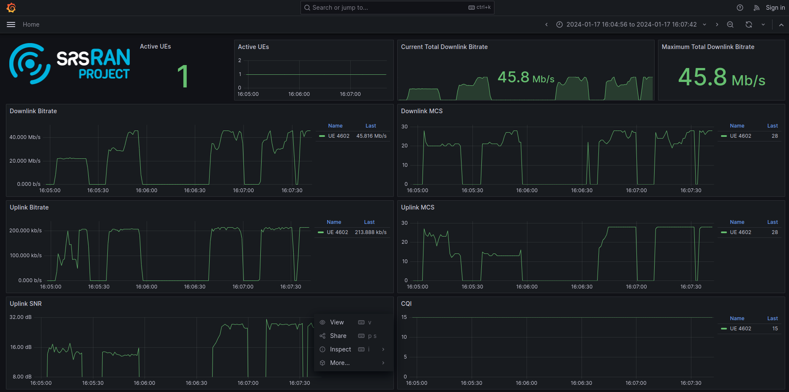

.. _grafana_gui:

Grafana Metrics GUI
###################

.. note:: 

    The GrafanaGUI works with both the monolithic gNB and srsDU applications. The configuration changes required are the same for both applications. 

|project_name| allows the reporting and visualization of the CU/DU metrics to a `Grafana <https://grafana.com/oss/grafana/>`_ WebUI. This is done through the use 
of a `Docker <https://www.docker.com/>`_ container that comes as standard with the srsRAN code base, located in the ``docker/`` folder. This container allows users 
to bring up the Grafana dashboard in a single command. 

**Further Reading:**

- `Grafana Docs <https://grafana.com/docs/grafana/latest/?pg=oss-graf&plcmt=hero-btn-2>`_

-----

Configuration
*************

To use the Grafana webUI, you will first need to have Docker installed on your system, you will also need to modify the gNB or DU configuration file to allow the 
reporting of the metrics to the necessary JSON format for use in the webUI. 

Docker
======

Using the Docker Containers included with srsRAN requires ``docker compose`` to be installed on your system. You can read about ``docker compose`` `here <https://docs.docker.com/compose/>`_.  There 
are multiple ways to install this, but the most basic way to do so is to install Docker Desktop. For installing Docker Desktop on linux, take a look at 
the `Docker documentation <https://docs.docker.com/desktop/install/linux-install/>`_. 

.. note::

    We recommend using a Docker Compose V2 or later. 

|project_name|
==============

To enable the correct reporting of metrics to the Grafana UI, the gNB or DU configuration files needs to be updated to allow the metrics to be output in the correct JSON format and then sent through a udp-socket to the metrics-server,
where it can be parsed and displayed correctly by the GUI.

.. code-block:: yaml
    metrics:
        autostart_stdout_metrics: true        # Sets whether or not to autostart stdout metrics reporting.
        enable_json: true                     # Enables reporting metrics in JSON format
        enable_log: false                     # Disables log metrics reporting.
        enable_verbose: false                 # Disables extended detail metrics reporting.
        layers: 
            enable_app_usage: true            # Enable application usage metrics.
            enable_ngap: true                 # Enable NGAP usage metricx.
            enable_e1ap: true                 # Enable E1AP metrics.
            enable_pdcp: true                 # Enable PDCP metrics.
            enable_rrc: true                  # Enable RRC metrics.
            skip_cu_up_executor: false        # Enable CU-UP executor metrics.
            enable_sched: true                # Enable DU scheduler metrics.
            enable_rlc: true                  # Enable RLC metrics.
            enable_mac: true                  # Enable MAC metrics.
            enable_executor: true             # Enable DU-high executor metrics.
            enable_du_low: true               # Enable DU low metrics (upper physical layer).
            enable_ru: true                   # Enable Radio Unit metrics.

        periodicity: 
            app_usage_report_period: 1000       # Application resource usage metrics report period in milliseconds.
            cu_cp_report_period: 1000           # CU-CP metrics report period in milliseconds.
            cu_up_report_period: 1000           # CU-UP metrics report period in milliseconds.
            du_report_period: 1000              # DU statistics report period in milliseconds.
            executors_report_period: 1000       # Executors metrics report period in milliseconds.

    remote_control:
        enabled: true            # Enables the Remote Control Server.
        bind_addr: 127.0.0.1     # Remote Control Server bind address.
        port: 8001               # Port where the remote control server listens for incoming connections.

The ``addr`` and ``port`` values defined above mirror those set in the ``docker-compose.yml`` file found in the ``/docker`` folder. Any changes in these values must be kept consistent across both files. 

-----

Launching GUI
*************

To launch the docker image for the Grafana UI, run the following command from the main folder containing srsRAN:  

.. code-block:: bash

    sudo docker compose -f docker/docker-compose.yml up grafana

The following output should be observed:

.. code-block:: bash

    Creating network "docker_ran" with the default driver
    Starting metrics_server ... 
    Starting metrics_server ... done
    Creating grafana        ... done
    Attaching to grafana

Navigating to http://localhost:3300/ in your preferred web browser will allow you to view the UI. 

You can then run |project_name| as normal. As the UE(s) connect to the network you will begin to see an output for each. These figures and graphics will update automatically during runtime, showing plots for each 
UE on the network. 

-----

GUI Output
**********

A sample of the UI output can be seen here: 

The above figure shows a single COTS UE connected to the network, with different traffic bursts of varying bandwidth being generated using iPerf. The cell bandwidth is 20 MHz.