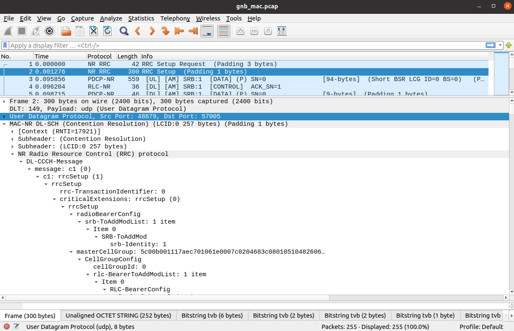
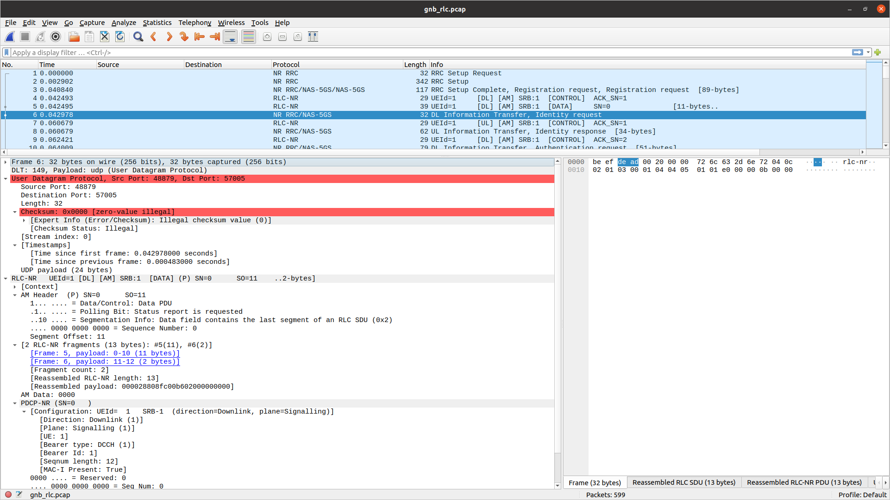
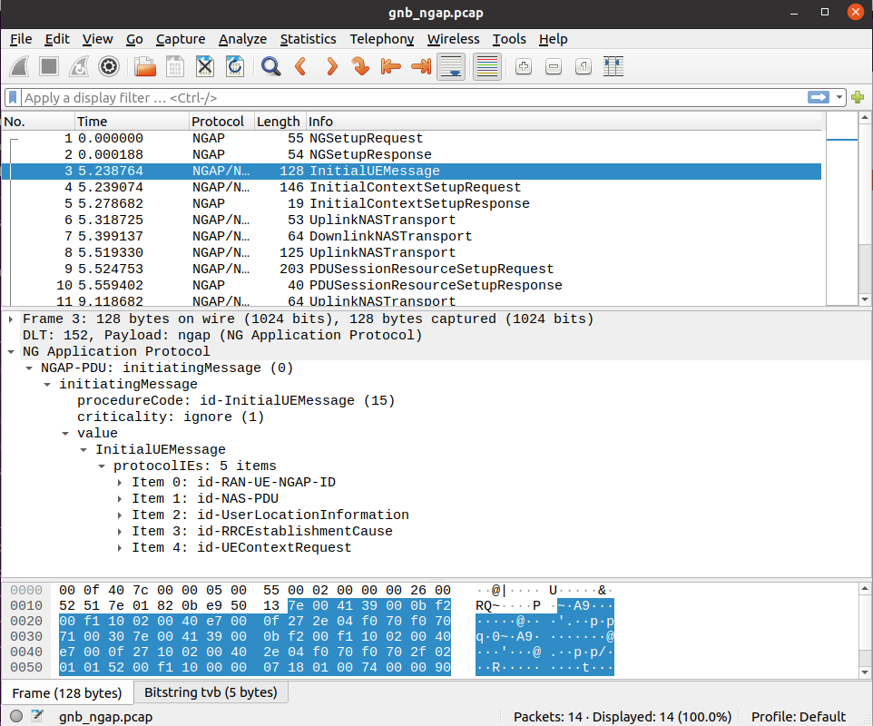
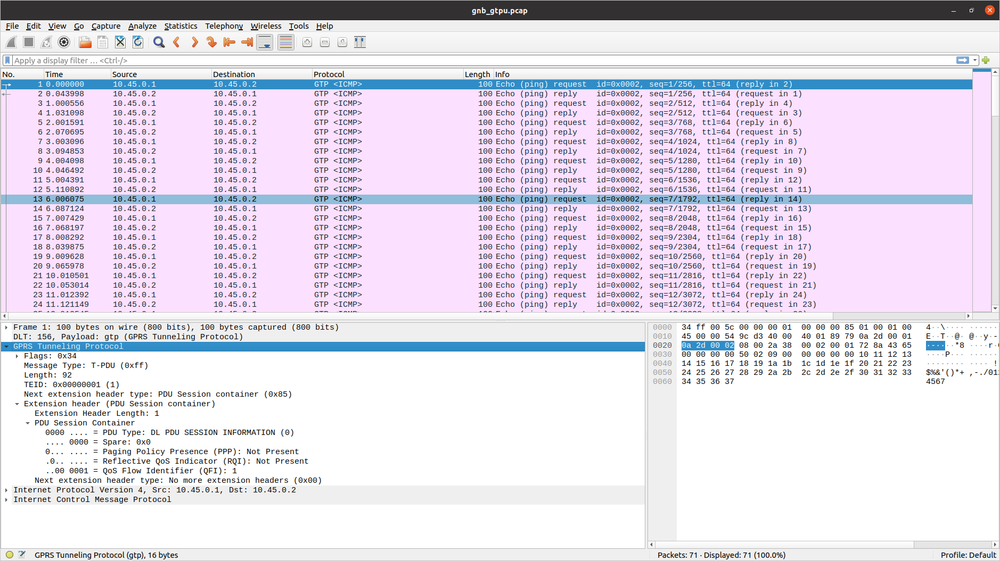
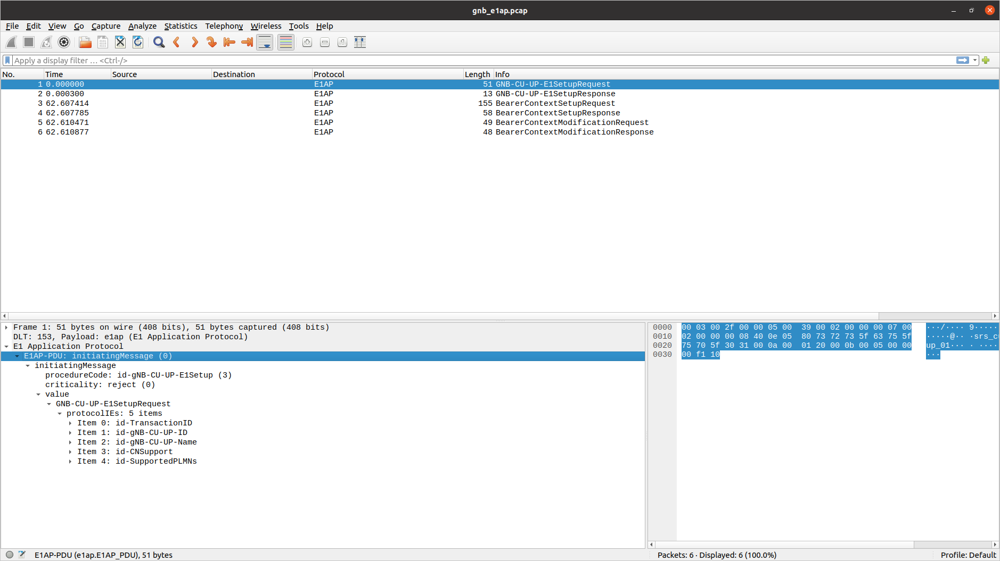
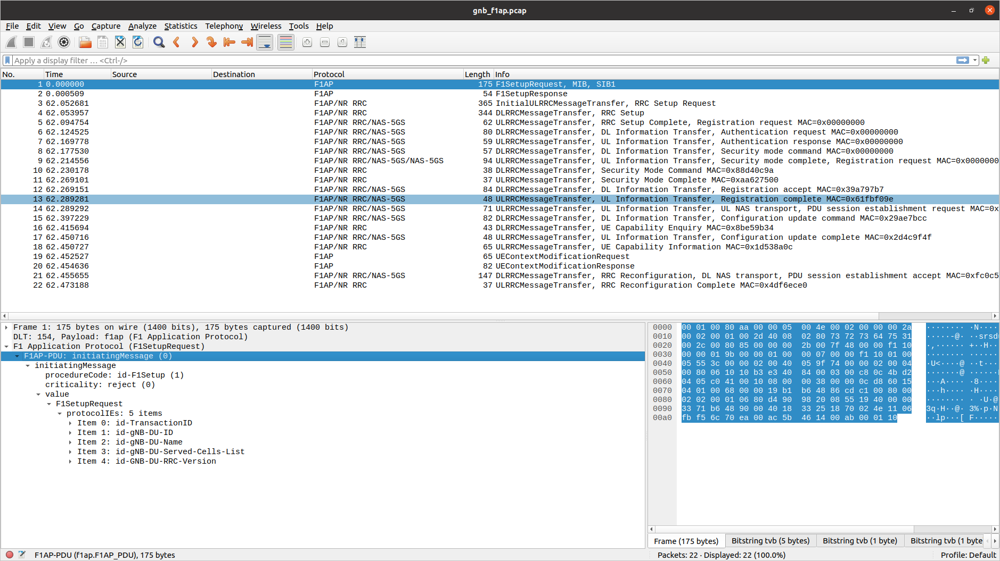

.. _manual_outputs:

Outputs
#######

Logs
****

| The srsRAN Project gNB application provides a highly configurable logging mechanism, with per-layer and per-component log levels.
| Set the log file path and log levels in the gNB config file. See the :ref:`Configuration Reference<manual_config_ref>` for more details.

The format used for all log messages is as follows:

    *Timestamp [Layer] [Level] [TTI] message*

Where the fields are:

    * Timestamp in *YYYY-MM-DDTHH:MM:SS.UUUUUU* format at which log message was generated
    * Layer can be one of *MAC/RLC/PDCP/RRC/SDAP/NGAP/GTPU/RADIO/FAPI/F1U/DU/CU/LIB*. PHY layers are specified as downlink or uplink and with executor number e.g. *DL-PHY1*.
    * Level can be one of *E/W/I/D* for error, warning, info and debug respectively.
    * TTI is only shown for PHY or MAC messages and is in the format *SFN.sn* where SFN is System Frame Number and sn is slot number.

An example log file excerpt can be seen below:

.. code-block::

    2023-03-15T18:29:25.142200 [MAC     ] [I] [  276.14] UL PDU rnti=0x4601 ue=0 subPDUs: [lcid=1: len=96, SBSR: lcg=0 bs=0, SE_PHR: total_len=3, PAD: len=424]
    2023-03-15T18:29:25.142204 [RLC     ] [I] ue=0 SRB1 UL: RX PDU. pdu_len=96 dc=data p=1 si=full sn=0 so=0
    2023-03-15T18:29:25.142226 [PDCP    ] [I] ue=0 SRB1 UL: RX PDU. type=data pdu_len=94 sn=0 count=0
    2023-03-15T18:29:25.142228 [PDCP    ] [I] ue=0 SRB1 UL: RX SDU. count=0
    2023-03-15T18:29:25.142245 [RRC     ] [D] ue=0 SRB1 - Rx DCCH UL rrcSetupComplete (88 B)
    2023-03-15T18:29:25.142249 [RRC     ] [D] Content: [
      {
        "UL-DCCH-Message": {
          "message": {
            "c1": {
              "rrcSetupComplete": {
                "rrc-TransactionIdentifier": 0,
                "criticalExtensions": {
                  "rrcSetupComplete": {
                    "selectedPLMN-Identity": 1,
                    "registeredAMF": {
                      "amf-Identifier": "000000100000000001000000"
                    },
                    "guami-Type": "native",
                    "dedicatedNAS-Message": "7e01820be950137e004139000bf200f110020040e7000f272e04f070f0707100307e004139000bf200f110020040e7000f27100200402e04f070f0702f0201015200f11000000718010074000090530101"
                  }
                }
              }
            }
          }
        }
      }
    ]
    2023-03-15T18:29:25.142253 [RRC     ] [D] ue=0 "RRC Setup Procedure" finished successfully
    2023-03-15T18:29:25.142263 [NGAP    ] [I] ue=0 Sending InitialUeMessage (ran_ue_id=0)

----

.. _pcaps:

PCAPs
*****

The srsRAN Project gNB can output PCAPs at the following layers: 

  - MAC
  - NGAP
  - GTP-U
  - E1AP
  - F1AP
  - E2AP

To output these PCAPs, they must first be enabled on a per-layer basis in the gNB configuration file. See the :ref:`Configuration Reference<manual_config_ref>` for more details.

MAC
===

To analyze a MAC-layer PCAP using Wireshark, you will need to configure User DLT 149 for UDP and enable the mac_nr_udp protocol:

  #. Go to Edit->Preferences->Protocols->DLT_USER->Edit and add an entry with DLT=149 and Payload protocol=udp.
  #. Go to Analyze->Enabled Protocols->MAC-NR and enable mac_nr_udp
  #. Go to Edit->Preferences->Protocols->MAC-NR: Enable both checkboxes "Attempt to..."; Set LCID->DRB mapping to "From configuration protocol".

RLC
===

.. note:: 

  To correctly view the RLC PCAPs you will need Wireshark v4.3.x or later. 

To analyze a RLC-layer PCAP using Wireshark, you will need to configure User DLT 149 for UDP and enable the rlc_nr_udp protocol:

  #. Go to Edit->Preferences->Protocols->DLT_USER->Edit and add an entry with DLT=149 and Payload protocol=udp.
  #. Go to Analyze->Enabled Protocols->RLC-NR and enable rlc_nr_udp
  #. Go to Edit->Preferences->Protocols->RLC-NR and configure according to your needs.

NGAP
====

To analyze an NGAP-layer PCAP using Wireshark, you will need to configure User DLT 152 for NGAP and enable detection and decoding 5G-EA0 ciphered messages:

  #. Go to Edit->Preferences->Protocols->DLT_USER->Edit and add an entry with DLT=152 and Payload protocol=ngap.
  #. Go to Edit->Preferences->Protocols->NAS-5GS and enable "Try to detect and decode 5G-EA0 ciphered messages".

GTP-U
=====

To analyze a GTP-U PCAP using Wireshark, you will need to configure User DLT 156 for GTP:

  #. Go to Edit->Preferences->Protocols->DLT_USER->Edit and add an entry with DLT=156 and Payload Protocol=gtp.

E1AP
=====

To analyze an E1AP PCAP using Wireshark, you will need to configure User DLT 153 for E1AP:

  #. Go to Edit->Preferences->Protocols->DLT_USER->Edit and add an entry with DLT=153 and Payload Protocol=e1ap.

F1AP
=====

To analyze an F1AP PCAP using Wireshark, you will need to configure User DLT 154 for F1AP:

  #. Go to Edit->Preferences->Protocols->DLT_USER->Edit and add an entry with DLT=154 and Payload Protocol=f1ap.

.. _e2ap_pcap:

E2AP
====

To analyze an E2AP PCAP using Wireshark, you will need to configure User DLT 155 for E2AP:

  #. Go to Edit->Preferences->Protocols->DLT_USER->Edit and add an entry with DLT=155 and Payload Protocol=e2ap.

.. figure:: .imgs/e2ap_pcap.png
  :scale: 40%
  :align: center
